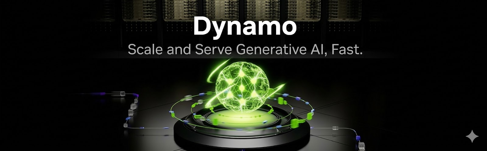
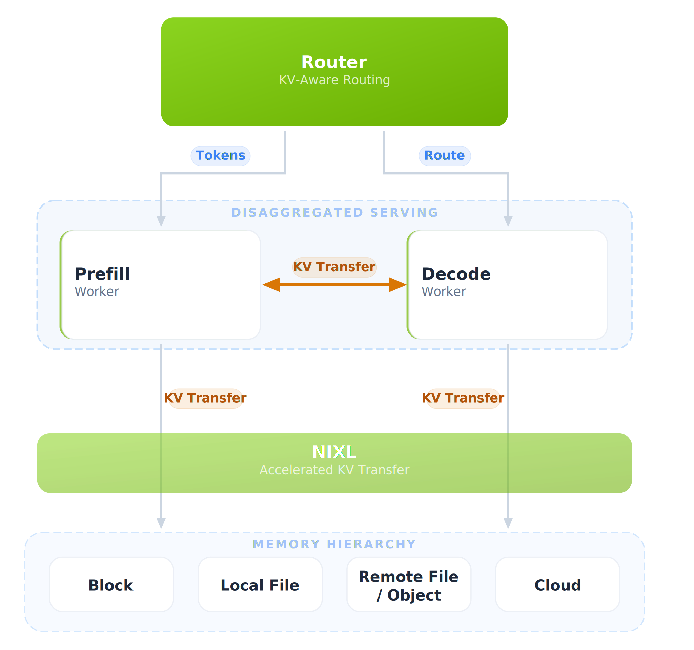

<!--
SPDX-FileCopyrightText: Copyright (c) 2024-2026 NVIDIA CORPORATION & AFFILIATES. All rights reserved.
SPDX-License-Identifier: Apache-2.0

Licensed under the Apache License, Version 2.0 (the "License");
you may not use this file except in compliance with the License.
You may obtain a copy of the License at

http://www.apache.org/licenses/LICENSE-2.0

Unless required by applicable law or agreed to in writing, software
distributed under the License is distributed on an "AS IS" BASIS,
WITHOUT WARRANTIES OR CONDITIONS OF ANY KIND, either express or implied.
See the License for the specific language governing permissions and
limitations under the License.
-->



[](https://opensource.org/licenses/Apache-2.0)
[](https://github.com/ai-dynamo/dynamo/releases/latest)
[](https://pypi.org/project/ai-dynamo/)
[](https://deepwiki.com/ai-dynamo/dynamo)
[](https://discord.gg/D92uqZRjCZ)


| **[文档](https://docs.nvidia.com/dynamo/)** | **[路线图](https://github.com/ai-dynamo/dynamo/issues/5506)** | **[配方](https://github.com/ai-dynamo/dynamo/tree/main/recipes)** | **[示例](https://github.com/ai-dynamo/dynamo/tree/main/examples)** | **[预构建容器](https://catalog.ngc.nvidia.com/orgs/nvidia/teams/ai-dynamo/collections/ai-dynamo)** | **[摘要](docs/digest/index.mdx)** | **[设计提案](https://github.com/ai-dynamo/enhancements)** | **[如何贡献](#社区与贡献)** |

<!-- GitHub does not support browser-language negotiation for repository README rendering; keep explicit alternate-language links in sync. -->
<p align="right">
  <a href="./README.md" hreflang="en">English</a> | <strong>简体中文</strong>
</p>

# Dynamo

<!-- TEMPORARY BANNER: remove once V4 recipes mature. -->
> [!NOTE]
> **DeepSeek-V4 首日配方已可用。** [DeepSeek-V4-Pro](recipes/deepseek-v4/deepseek-v4-pro/) 和 [DeepSeek-V4-Flash](recipes/deepseek-v4/deepseek-v4-flash/) 的 Kubernetes 部署路径已经过测试，并已在 **vLLM** 与 **SGLang** 两个后端合并到 main；预构建的 SGLang 容器镜像也已发布到 NGC。

**开源的数据中心级推理栈。** Dynamo 是位于推理引擎之上的编排层。它不会取代 SGLang、TensorRT-LLM 或 vLLM，而是把它们组织成一个协同工作的多节点推理系统。分离式服务、智能路由、多层 KV 缓存和自动扩缩容协同工作，为 LLM、推理、多模态和视频生成工作负载最大化吞吐并最小化延迟。

使用 Rust 构建以获得性能，使用 Python 扩展以获得灵活性。

## 何时使用 Dynamo

- 你正在跨 **多个 GPU 或节点** 提供 LLM 服务，并且需要协调它们
- 你希望使用 **KV 感知路由** 来避免重复的预填充计算
- 你需要 **独立扩缩容预填充和解码**（分离式服务）
- 你希望通过 **自动扩缩容** 在最低总体拥有成本（TCO）下满足延迟 SLA
- 你需要在启动新副本时获得 **快速冷启动**

如果你只是在单个 GPU 上运行单个模型，那么单独使用推理引擎通常已经足够。

**功能支持概览：**

| | [SGLang](https://docs.nvidia.com/dynamo/backends/sg-lang) | [TensorRT-LLM](https://docs.nvidia.com/dynamo/backends/tensor-rt-llm) | [vLLM](https://docs.nvidia.com/dynamo/backends/v-llm) |
|---|:----:|:----------:|:--:|
| [**分离式服务**](docs/design-docs/disagg-serving.zh-CN.md) | ✅ | ✅ | ✅ |
| [**KV 感知路由**](docs/components/router/README.zh-CN.md) | ✅ | ✅ | ✅ |
| [**基于 SLA 的 Planner**](docs/components/planner/planner-guide.zh-CN.md) | ✅ | ✅ | ✅ |
| [**KVBM**](docs/components/kvbm/README.zh-CN.md) | 🚧 | ✅ | ✅ |
| [**多模态**](https://docs.nvidia.com/dynamo/user-guides/multimodal) | ✅ | ✅ | ✅ |
| [**工具调用**](docs/tool-calling/README.zh-CN.md) | ✅ | ✅ | ✅ |

> **[完整功能矩阵 →](https://docs.nvidia.com/dynamo/resources/feature-matrix)** — LoRA、请求迁移、推测解码以及功能之间的交互。

## 关键结果

| 结果 | 背景 |
|--------|------|
| 单 GPU 吞吐提升 **7x** | 在 GB200 NVL72 上使用 Dynamo 运行 DeepSeek R1，相比未使用 Dynamo 的 B200（[InferenceX](https://inferencex.semianalysis.com/)） |
| 模型启动速度提升 **7x** | ModelExpress 权重流式加载（H200 上的 DeepSeek-V3） |
| 首 token 时间快 **2x** | KV 感知路由，Qwen3-Coder 480B（[Baseten 基准](https://www.baseten.co/blog/how-baseten-achieved-2x-faster-inference-with-nvidia-dynamo/)） |
| SLA 违约减少 **80%** | Planner 自动扩缩容，同时 TCO 降低 5%（[Alibaba APSARA 2025 @ 2:50:00](https://yunqi.aliyun.com/2025/session?agendaId=6062)） |
| 吞吐提升 **750x** | GB300 NVL72 上的 DeepSeek-R1（[InferenceXv2](https://inferencex.semianalysis.com/)） |


## Dynamo 的作用

大多数推理引擎优化的是单个 GPU 或单个节点。Dynamo 是 **位于这些引擎之上的编排层**，它把一组 GPU 转化为协同工作的推理系统。

<p align="center">
  
</p>

**[架构深入解析 →](docs/design-docs/architecture.zh-CN.md)**

### 核心能力

| 能力 | 作用 | 价值 |
|------|------|------|
| [**分离式预填充/解码**](docs/design-docs/disagg-serving.zh-CN.md) | 将预填充和解码拆分为可独立扩缩容的 GPU 池 | 最大化 GPU 利用率；每个阶段都运行在针对其工作负载调优的硬件上 |
| [**KV 感知路由**](docs/components/router/README.zh-CN.md) | 根据 worker 负载和 KV 缓存重叠度路由请求 | 消除冗余预填充计算，TTFT 快 2x |
| [**KV Block Manager (KVBM)**](docs/components/kvbm/README.zh-CN.md) | 在 GPU → CPU → SSD → 远程存储之间卸载 KV 缓存 | 将有效上下文长度扩展到 GPU 显存之外 |
| [**ModelExpress**](https://github.com/ai-dynamo/modelexpress) | 通过 NIXL/NVLink 在 GPU 之间流式传输模型权重 | 新副本冷启动快 7x |
| [**Planner**](docs/components/planner/planner-guide.zh-CN.md) | 由 SLA 驱动的自动扩缩容器，可分析工作负载并调整资源池规模 | 以最低总体拥有成本（TCO）满足延迟目标 |
| [**Grove**](https://github.com/ai-dynamo/grove) | 面向拓扑感知 gang scheduling 的 K8s operator（NVL72） | 在机架、主机和 NUMA 节点之间优化放置工作负载 |
| [**AIConfigurator**](https://github.com/ai-dynamo/aiconfigurator) | 在数秒内模拟 10K+ 部署配置 | 无需消耗 GPU 小时即可找到最优服务配置 |
| [**容错**](docs/fault-tolerance/request-migration.zh-CN.md) | 金丝雀健康检查 + 运行中请求迁移 | worker 可以失败，但用户请求不应失败 |

### 1.0 新功能

- **零配置部署（[DGDR](https://docs.nvidia.com/dynamo/kubernetes-deployment/deploy-models/dgdr-reference)）** *(beta)：* 在一个 YAML 中指定模型、硬件和 SLA；AIConfigurator 自动分析工作负载，Planner 优化拓扑，然后由 Dynamo 完成部署
- **Agentic inference：** 按请求提供延迟优先级、预期输出长度和缓存固定 TTL 等提示。集成 [LangChain](https://docs.langchain.com/oss/python/integrations/chat/nvidia_ai_endpoints#use-with-nvidia-dynamo) + [NeMo Agent Toolkit](https://github.com/NVIDIA/NeMo-Agent-Toolkit)
- **多模态 E/P/D：** 带 embedding cache 的分离式 encode/prefill/decode；图像工作负载 TTFT 快 30%
- **视频生成：** 原生支持 [FastVideo](https://github.com/hao-ai-lab/FastVideo) + [SGLang Diffusion](https://lmsys.org/blog/2026-02-16-sglang-diffusion-advanced-optimizations/)；单张 B200 上实现实时 1080p
- **K8s Inference Gateway 插件：** 在标准 Kubernetes gateway 内提供 KV 感知路由
- **存储层 KV 卸载：** 支持 S3/Azure blob，并通过全局 KV 事件提供集群级缓存可见性

## 快速开始

### 选项 A：容器（最快）

```bash
# 拉取预构建容器（SGLang 示例）
docker run --gpus all --network host --rm -it nvcr.io/nvidia/ai-dynamo/sglang-runtime:1.2.0

# 在容器内启动 frontend 和 worker
python3 -m dynamo.frontend --http-port 8000 --discovery-backend file > /dev/null 2>&1 &
python3 -m dynamo.sglang --model-path Qwen/Qwen3-0.6B --discovery-backend file &

# 发送请求
curl -s localhost:8000/v1/chat/completions -H "Content-Type: application/json" -d '{
  "model": "Qwen/Qwen3-0.6B",
  "messages": [{"role": "user", "content": "Hello!"}],
  "max_tokens": 100
}' | jq
```

另有 [`tensorrtllm-runtime:1.2.0`](https://docs.nvidia.com/dynamo/resources/release-artifacts) 和 [`vllm-runtime:1.2.0`](https://docs.nvidia.com/dynamo/resources/release-artifacts) 可用。

### 选项 B：从 PyPI 安装

安装 [uv](https://github.com/astral-sh/uv)（`curl -LsSf https://astral.sh/uv/install.sh | sh`），然后运行：

```bash
uv pip install --prerelease=allow "ai-dynamo[sglang]"   # 或 [vllm]
```

> **注意：** TensorRT-LLM 需要配合 `--extra-index-url https://pypi.nvidia.com` 使用 `pip`。TRT-LLM 专用说明请参阅[安装指南](docs/getting-started/local-installation.zh-CN.md)。

然后按上面的方式启动 frontend 和一个 worker。系统依赖和后端专用说明请参阅[完整安装指南](docs/getting-started/local-installation.zh-CN.md)。

### 选项 C：Kubernetes（推荐）

对于生产级多节点集群，安装 [Dynamo Platform](https://docs.nvidia.com/dynamo/kubernetes-deployment/start-here/installation-guide)，并使用单个 manifest 部署：

```yaml
# 零配置部署：指定模型 + SLA，剩余工作由 Dynamo 处理
apiVersion: nvidia.com/v1beta1
kind: DynamoGraphDeploymentRequest
metadata:
  name: my-model
spec:
  model: Qwen/Qwen3-0.6B
  backend: vllm
  sla:
    ttft: 200.0   # ms
    itl: 20.0     # ms
  autoApply: true
```

常见模型的预构建配方：

| 模型 | 框架 | 模式 | 配方 |
|------|------|------|------|
| Llama-3-70B | vLLM | 聚合式 | [查看](recipes/llama-3-70b/vllm/) |
| DeepSeek-R1 | SGLang | 分离式 | [查看](recipes/deepseek-r1/sglang/) |
| Qwen3-32B-FP8 | TensorRT-LLM | 聚合式 | [查看](recipes/qwen3-32b-fp8/trtllm/) |

完整列表见 [recipes/](recipes/README.md)。云平台专用指南：[AWS EKS](docs/kubernetes/cloud-providers/eks/eks.md) · [Google GKE](docs/kubernetes/cloud-providers/gke/gke.md) · [Azure AKS](docs/kubernetes/cloud-providers/aks/aks.md) · [Amazon ECS](docs/kubernetes/cloud-providers/ecs/ecs.md)

## 从源码构建

适用于希望在本地构建和开发的贡献者。详情请参阅[完整构建指南](docs/getting-started/building-from-source.zh-CN.md)。

```bash
# 安装系统依赖（Ubuntu 24.04）
sudo apt install -y build-essential libhwloc-dev libudev-dev pkg-config libclang-dev protobuf-compiler python3-dev cmake

# 安装 Rust
curl --proto '=https' --tlsv1.2 -sSf https://sh.rustup.rs | sh && source $HOME/.cargo/env

# 创建虚拟环境并构建
uv venv dynamo && source dynamo/bin/activate
uv pip install pip maturin
cd lib/bindings/python && maturin develop --uv && cd $PROJECT_ROOT
uv pip install -e lib/gpu_memory_service
uv pip install -e .
```

> VSCode/Cursor 用户：预配置开发环境请参阅 [`.devcontainer`](.devcontainer/README.md)。

## 社区与贡献

Dynamo 采用 OSS 优先的开放开发模式。我们欢迎各种形式的贡献。

- **[贡献指南](docs/contribution-guide.zh-CN.md)** — 如何贡献代码、文档和配方
- **[设计提案](https://github.com/ai-dynamo/enhancements)** — 重大功能的 RFC
- **[Office Hours](https://www.youtube.com/playlist?list=PL5B692fm6--tgryKu94h2Zb7jTFM3Go4X)** — 双周会议
- **[社区会议](https://docs.google.com/document/d/1uR8xD_hlYGwV6QspvSc36k1H-wo1BUcVmFbHH9xlXd8/view)** ([Youtube](https://www.youtube.com/@ai-dynamo-community)) – 每周（Wed 10:30 AM PT）开发者社区会议
- **[Discord](https://discord.gg/D92uqZRjCZ)** — 与团队和社区交流
- **[Dynamo Day 录像](https://nvevents.nvidia.com/dynamoday)** — 来自生产用户的深入分享

## 最新动态

- [03/15] [Dynamo 1.0 发布：生产就绪，并获得强劲社区采用](https://developer.nvidia.com/blog/introducing-nvidia-dynamo-a-low-latency-distributed-inference-framework-for-scaling-reasoning-ai-models/)
- [03/15] [NVIDIA Blackwell Ultra 在 MLPerf 中创下新的推理纪录](https://developer.nvidia.com/blog/nvidia-blackwell-ultra-sets-new-inference-records-in-mlperf-debut/)
- [03/15] [NVIDIA Blackwell 在 SemiAnalysis InferenceMax 基准中领先](https://developer.nvidia.com/blog/nvidia-blackwell-leads-on-new-semianalysis-inferencemax-benchmarks/)
- [12/05] [Moonshot AI 的 Kimi K2 在 GB200 上借助 Dynamo 实现 10x 推理加速](https://quantumzeitgeist.com/kimi-k2-nvidia-ai-ai-breakthrough/)
- [12/02] [Mistral AI 使用 Dynamo 让 Mistral Large 3 推理速度提升 10x](https://www.marktechpost.com/2025/12/02/nvidia-and-mistral-ai-bring-10x-faster-inference-for-the-mistral-3-family-on-gb200-nvl72-gpu-systems/)
- [11/20] [Dell 将 PowerScale 与 NIXL 集成，使 TTFT 快 19x](https://www.dell.com/en-us/dt/corporate/newsroom/announcements/detailpage.press-releases~usa~2025~11~dell-technologies-and-nvidia-advance-enterprise-ai-innovation.htm)

<details>
<summary>较早动态</summary>

Dynamo 提供完整的基准测试工具：

- **[基准测试指南](docs/benchmarks/benchmarking.md)** – 使用 AIPerf 比较部署拓扑
- **[SLA 驱动部署](docs/components/planner/planner-guide.zh-CN.md)** – 优化部署以满足 SLA 要求

## Frontend OpenAPI 规范

兼容 OpenAI 的 frontend 会在 `/openapi.json` 暴露 OpenAPI 3 规范。无需运行服务器即可生成：

```bash
cargo run -p dynamo-llm --bin generate-frontend-openapi
```

该命令会写入 `docs/reference/api/openapi.json`。

## 服务发现与消息传递

Dynamo 使用 TCP 进行组件间通信。在 Kubernetes 上，原生资源（[CRDs + EndpointSlices](docs/kubernetes/service-discovery.md)）负责服务发现。对大多数部署来说，外部服务是可选的：

| 部署 | etcd | NATS | 说明 |
|------|------|------|------|
| **本地开发** | ❌ 不需要 | ❌ 不需要 | 传入 `--discovery-backend file`；vLLM 还需要 `--kv-events-config '{"enable_kv_cache_events": false}'` |
| **Kubernetes** | ❌ 不需要 | ❌ 不需要 | K8s 原生服务发现；TCP 请求平面 |

> **注意：** KV 感知路由不需要 NATS。需要基于事件的 cache 状态跟踪时可以启用 KV event；如果不需要外部事件基础设施，可以使用 `--no-router-kv-events` 进行基于预测的路由。

对于选择使用 etcd 或 NATS JetStream 模式的 Slurm 或其他分布式部署：

- [etcd](https://etcd.io/) 可以直接以 `./etcd` 运行。
- [nats](https://nats.io/) 需要启用 JetStream：`nats-server -js`。

快速启动二者：`docker compose -f dev/docker-compose.yml up -d`

## 更多动态

- [11/20] [Dell 将 PowerScale 与 Dynamo 的 NIXL 集成，使 TTFT 快 19x](https://www.dell.com/en-us/dt/corporate/newsroom/announcements/detailpage.press-releases~usa~2025~11~dell-technologies-and-nvidia-advance-enterprise-ai-innovation.htm)
- [11/20] [WEKA 与 NVIDIA 合作，为 Dynamo 提供 KV 缓存存储方案](https://siliconangle.com/2025/11/20/nvidia-weka-kv-cache-solution-ai-inferencing-sc25/)
- [11/13] [Dynamo Office Hours 播放列表](https://www.youtube.com/playlist?list=PL5B692fm6--tgryKu94h2Zb7jTFM3Go4X)
- [10/16] [Baseten 如何借助 NVIDIA Dynamo 实现 2x 推理加速](https://www.baseten.co/blog/how-baseten-achieved-2x-faster-inference-with-nvidia-dynamo/)
- [12/01] [InfoQ：NVIDIA Dynamo 简化 LLM 推理的 Kubernetes 部署](https://www.infoq.com/news/2025/12/nvidia-dynamo-kubernetes/)

</details>

## 参考资料

- **[支持矩阵](https://docs.nvidia.com/dynamo/resources/support-matrix)** — 硬件、操作系统、CUDA 和后端版本
- **[功能矩阵](https://docs.nvidia.com/dynamo/resources/feature-matrix)** — 详细后端兼容性
- **[发布产物](https://docs.nvidia.com/dynamo/resources/release-artifacts)** — 容器、wheel、Helm chart
- **[服务发现](https://docs.nvidia.com/dynamo/kubernetes-deployment/advanced-platform/service-discovery)** — K8s 原生、etcd 与基于文件的服务发现对比
- **[基准测试指南](https://docs.nvidia.com/dynamo/user-guides/benchmarking)** — 使用 AIPerf 比较部署拓扑

<!-- Reference links for Feature Compatibility Matrix -->
[disagg]: docs/design-docs/disagg-serving.zh-CN.md
[kv-routing]: docs/components/router/README.zh-CN.md
[planner]: docs/components/planner/planner-guide.zh-CN.md
[kvbm]: docs/components/kvbm/README.zh-CN.md
[migration]: docs/fault-tolerance/request-migration.zh-CN.md
[lora]: examples/backends/vllm/deploy/lora/README.md
[tools]: docs/tool-calling/README.zh-CN.md
