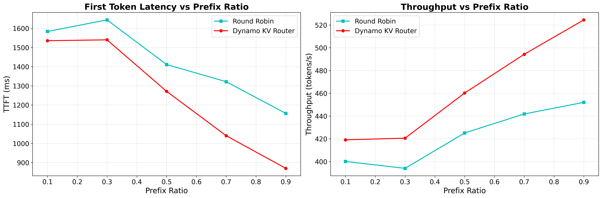

<!-- # SPDX-FileCopyrightText: Copyright (c) 2025-2026 NVIDIA CORPORATION & AFFILIATES. All rights reserved.
# SPDX-License-Identifier: Apache-2.0 -->

# Router Benchmarking Guide

This directory contains scripts for benchmarking the Dynamo router with prefix caching. The benchmarks measure performance improvements from prefix sharing across requests.

## Prerequisites

- NVIDIA GPUs (8 GPUs for default configuration)
- (optional) H100 GPUs or later for gpt-oss-120b examples
- CUDA environment properly configured
- etcd and NATS running (required for Dynamo coordination)
- Required Python packages:
  - `dynamo` package (with vllm and frontend modules)
  - `aiperf` for benchmarking
  - `matplotlib` for plotting results
  - `data-generator` package (install with `uv pip install -e ./benchmarks` from repo root)

> [!Note]
> If running outside a container, set `DYNAMO_HOME` to the root path of your Dynamo repository:
> ```bash
> export DYNAMO_HOME=/path/to/dynamo
> ```
> When running in a container, this defaults to `/workspace`.

### Setting up etcd and NATS

This benchmark requires etcd and NATS. To quickly set them up, run:

```bash
# From the repository root:
docker compose -f dev/docker-compose.yml up -d
```

This will start both etcd and NATS with the required configurations in the background.

## Scripts Overview

- **`run_engines.sh`** - Launches multiple vLLM worker instances
- **`ping.sh`** - Simple test script to verify the setup is working
- **`prefix_ratio_benchmark.py`** - Main benchmarking script that sweeps prefix ratios
- **`real_data_benchmark.py`** - Benchmarking script that uses real mooncake-style trace data
- **`agent_benchmark.py`** - Concurrency-based benchmarking for multi-turn conversation traces

## Usage Instructions

### Step 1: Launch Workers

Make sure you have 8 GPUs for these examples, unless you are using mockers (see below). First, start the worker engines in a terminal.

The script supports three modes:
- **`agg` (default)**: Aggregated/monolithic workers that handle both prefill and decode
- **`decode`**: Workers dedicated to decode (token generation) phase
- **`prefill`**: Workers dedicated to prefill (prompt processing) phase

```bash
# Default: 8 aggregated workers with DeepSeek model (handles both prefill and decode)
./run_engines.sh \
    --num-workers 8 \
    --model-path deepseek-ai/DeepSeek-R1-Distill-Llama-8B

# Example: 4 workers with larger model using tensor parallelism (2 GPUs per worker)
# NOTE: this requires having Hopper or later GPU SKUs to support MXFP4 precision.
./run_engines.sh \
    --num-workers 4 \
    --model-path openai/gpt-oss-120b \
    --tensor-parallel-size 2
```

#### Disaggregated Serving (Decode + Prefill Workers)

You can launch separate decode and prefill workers for disaggregated serving. This allows you to dedicate specific GPUs to prefill (prompt processing) and decode (token generation) tasks:

```bash
# Launch 4 decode workers (GPUs 0-3)
./run_engines.sh \
    --decode \
    --num-workers 4 \
    --model-path deepseek-ai/DeepSeek-R1-Distill-Llama-8B

# Launch 4 prefill workers (GPUs 4-7)
./run_engines.sh \
    --prefill \
    --num-workers 4 \
    --base-gpu-offset 4 \
    --model-path deepseek-ai/DeepSeek-R1-Distill-Llama-8B
```

#### Alternative: Launch vLLM Mock Workers

We also support running lightweight mock engines that simulate vLLM behavior without performing actual model inference. Mocker engines are useful for testing router logic and performance without GPU requirements. Use the `--mockers` flag to run mocker engines instead of real vLLM workers.

```bash
# Example: Running mocker engines for testing (no GPU required)
./run_engines.sh --mockers \
    --num-workers 8 \
    --model-path deepseek-ai/DeepSeek-R1-Distill-Llama-8B \
    --block-size 64 \
    --speedup-ratio 2.0
```

**Note**: The `--speedup-ratio` parameter controls the inference speed of mocker engines. A higher value (e.g., 2.0) makes the mocker engines simulate faster inference, allowing benchmarks to complete more quickly. This is particularly useful for testing router performance without waiting for realistic inference times.

#### Disaggregated Serving with Mockers (No GPU Required)

You can test disaggregated serving entirely with mockers by launching separate prefill and decode mocker groups that share a namespace. This is useful for validating routing logic, metrics, and the prefill-decode handoff without any GPUs.

```bash
NAMESPACE="test-disagg"
MODEL="Qwen/Qwen3-0.6B"

# Terminal 1: Decode mockers (2 workers)
python -m dynamo.mocker --model-path "$MODEL" \
    --endpoint "dyn://${NAMESPACE}.backend.generate" \
    --disaggregation-mode decode --num-workers 2 \
    --speedup-ratio 10 --block-size 16

# Terminal 2: Prefill mockers (2 workers)
python -m dynamo.mocker --model-path "$MODEL" \
    --endpoint "dyn://${NAMESPACE}.prefill.generate" \
    --disaggregation-mode prefill --num-workers 2 \
    --speedup-ratio 10 --block-size 16

# Terminal 3: Frontend with KV router
# --model-path must be the on-disk snapshot directory
MODEL_PATH=$(find ~/.cache/huggingface/hub/models--Qwen--Qwen3-0.6B/snapshots -mindepth 1 -maxdepth 1 -type d | head -1)
python -m dynamo.frontend --namespace "$NAMESPACE" \
    --model-name "$MODEL" --model-path "$MODEL_PATH" \
    --router-mode kv --http-port 8000 --kv-cache-block-size 16
```

Verify it works:
```bash
# Send a request (should show prefill_worker_id and decode_worker_id in nvext)
curl -s localhost:8000/v1/chat/completions -H "Content-Type: application/json" \
    -d '{"model":"Qwen/Qwen3-0.6B","messages":[{"role":"user","content":"Hello"}],"max_tokens":10}' | python3 -m json.tool

# Check router metrics
curl -s localhost:8000/metrics | grep "^# HELP dynamo_component_router"
```

### Step 2: Start the Router

In a **new terminal**, launch the Dynamo router using the Python CLI:

```bash
# Explicitly set NATS server for KV event publishing
export NATS_SERVER="${NATS_SERVER:-nats://localhost:4222}"

python -m dynamo.frontend \
    --router-mode kv \
    --http-port 8000
```

This starts the router with:
- KV cache routing mode
- HTTP port 8000

To see all available router arguments, run:
```bash
python -m dynamo.frontend --help
```

For detailed explanations of router arguments (especially KV cache routing parameters), see the [Router Guide](../../docs/components/router/router-guide.md).

> [!Note]
> If you're unsure whether your backend engines correctly emit KV events for certain models (e.g., hybrid models like gpt-oss or nemotron nano 2), use the `--no-router-kv-events` flag to disable KV event tracking and use approximate KV indexing instead:
>
> ```bash
> python -m dynamo.frontend \
>     --router-mode kv \
>     --http-port 8000 \
>     --no-router-kv-events
> ```

#### Disaggregated Serving with Automatic Prefill Routing

When you launch prefill workers using `run_engines.sh --prefill`, the frontend automatically detects them and activates an internal prefill router. This prefill router:
- Automatically routes initial token processing to dedicated prefill workers
- Uses the same routing mode as the frontend's `--router-mode` setting
- Seamlessly integrates with your decode workers for token generation

No additional configuration is needed - simply launch both decode and prefill workers, and the system handles the rest. See the [Router Guide](../../docs/components/router/router-guide.md#disaggregated-serving) for more details.

> [!Note]
> The unified frontend with automatic prefill routing is currently enabled for vLLM and TensorRT-LLM backends. For SGLang (work in progress), you need to launch a separate standalone router as the prefill router targeting the prefill endpoints. See example script: [`examples/backends/sglang/launch/disagg_router.sh`](../../examples/backends/sglang/launch/disagg_router.sh)

### Step 3: Verify Setup

In another terminal, test that everything is working:

```bash
./ping.sh
# Or specify a different port:
./ping.sh 8000
```

This sends a simple test request to the router. You should see a streamed response if everything is configured correctly.

### Step 4: Run Benchmarks

Once the setup is verified, run the prefix ratio benchmark:

```bash
python prefix_ratio_benchmark.py
```

Default configuration:
- Tests prefix ratios: 0.1, 0.3, 0.5, 0.7, 0.9
- Input sequence length: 14000 tokens
- Output sequence length: 200 tokens
- Requests: 200
- Concurrency: 20

You can customize the benchmark:

```bash
# Test multiple prefix ratios
python prefix_ratio_benchmark.py --prefix-ratios 0.1 0.3 0.5 0.7 0.9

# Adjust input/output lengths
python prefix_ratio_benchmark.py --isl 10000 --osl 500

# Change request count and concurrency
python prefix_ratio_benchmark.py --requests 500 --concurrency 50

# Use a non-default router endpoint
python prefix_ratio_benchmark.py --url http://localhost:8001

# Specify output directory
python prefix_ratio_benchmark.py --output-dir results/experiment1
```

### Step 5 (Alternative): Run Benchmarks with Real Trace Data

Instead of synthetic benchmarks with controlled prefix ratios, you can benchmark using real trace data. This approach uses actual request patterns from production traces, potentially modified with synthesis parameters.

First, download the mooncake trace dataset:

```bash
wget https://raw.githubusercontent.com/kvcache-ai/Mooncake/d21da178bae8db9651cf18a76824c084145fc725/mooncake_trace.jsonl
```

Then run the benchmark:

```bash
python real_data_benchmark.py --input-dataset mooncake_trace.jsonl
```

The script can apply various modifications on top of the original trace dataset to simulate different scenarios and workload conditions. This script accepts the same synthesis parameters as the [prefix data generator](../prefix_data_generator/README.md):

**Key parameters:**
- `--num-requests`: Number of requests to synthesize from the trace (default: use all)
- `--speedup-ratio`: Speed up request arrival times (e.g., 2.0 makes requests arrive 2x faster)
- `--prefix-len-multiplier`: Scale the length of shared prefixes (e.g., 2.0 doubles prefix lengths)
- `--prefix-root-multiplier`: Replicate the prefix tree structure N times with different roots
- `--prompt-len-multiplier`: Scale the length of unique user prompts (e.g., 0.5 for shorter prompts)
- `--max-isl`: Filter out requests exceeding this input sequence length

Examples:

```bash
# Use original trace dataset as-is (no synthesis parameters specified)
python real_data_benchmark.py --input-dataset trace.jsonl

# Speed up request rate by 2x and use only first 1000 requests
python real_data_benchmark.py --input-dataset trace.jsonl --num-requests 1000 --speedup-ratio 2.0

# Double prefix lengths to test cache efficiency with longer shared contexts
python real_data_benchmark.py --input-dataset trace.jsonl --prefix-len-multiplier 2.0

# Create more diverse workload by replicating prefix tree 3 times
python real_data_benchmark.py --input-dataset trace.jsonl --prefix-root-multiplier 3
```

### Step 6 (Alternative): Priority Queue Benchmark

`real_data_priority_benchmark.py` measures whether the router's priority queue correctly differentiates high-, medium-, and low-priority requests. It splits a trace into three tiers, runs a **baseline** (no priority tagging) and a **priority-tagged** run using the same split, then produces a bar chart comparing TTFT across tiers.

#### How it works

1. The trace is synthesized (same parameters as `real_data_benchmark.py`) and split into low / medium / high tiers according to `--priority-distribution`.
2. Each tier is sent to aiperf as a concurrent stream. In the priority-tagged run, every trace row carries an OpenAI-compatible extension field:
   ```json
   {"nvext": {"agent_hints": {"priority": <value>}}}
   ```
   The `priority` value raises the request's router queue priority -- a higher value shifts the request's effective arrival time earlier, giving it priority over lower-valued requests.
3. The baseline and priority runs use the same aiperf seed and split so prompt content matches. The priority run offsets `hash_ids` to keep its KV cache cold relative to the baseline and prevent mocker KV cache cross-contamination.

#### Prerequisites: tune the priority queue

The router queue is disabled by default. To make priority effects visible under benchmark load, set `--router-queue-threshold`; `0.0` is the most sensitive value and queues once all eligible workers have active prefill tokens.

```bash
# Launch the router with a sensitive priority queue threshold.
python -m dynamo.frontend \
    --router-mode kv \
    --router-queue-threshold 0.0
```

#### Running the benchmark

Because the mocker default speedup ratio is 1.0 (real-time), you need a sufficiently high `--speedup-ratio` to generate enough concurrent load for requests to actually queue up. A ratio of 8 or higher is recommended:

```bash
python real_data_priority_benchmark.py \
    --input-dataset mooncake_trace.jsonl \
    --num-requests 5000 \
    --speedup-ratio 8 \
    --prefix-len-multiplier 4 \
    --prefix-root-multiplier 4
```

**Priority-specific parameters:**

| Parameter | Default | Description |
|-----------|---------|-------------|
| `--priority-distribution` | `0.5,0.3,0.2` | Fraction of requests assigned to low/medium/high tiers (must sum to 1.0) |
| `--priority-values` | `0,1,2` | `priority` values for low/medium/high tiers |

Examples:

```bash
# Equal tier sizes with aggressive priority differentiation.
# --priority-values sets the request priority per tier (low, medium, high).
# Higher values move the request further ahead in the router queue.
# Here low gets no boost, medium gets priority 2, and high gets priority 5.
python real_data_priority_benchmark.py \
    --input-dataset mooncake_trace.jsonl \
    --num-requests 5000 \
    --speedup-ratio 8 \
    --priority-distribution 0.33,0.34,0.33 \
    --priority-values 0,2,5
```

The benchmark outputs a `ttft_comparison.png` bar chart in the results directory showing TTFT (p50 with p25-p75 error bars) for each tier, comparing baseline vs. priority-tagged runs. If the priority queue is working correctly, high-priority requests should show lower TTFT in the priority run compared to baseline, while low-priority requests may show slightly higher TTFT.

### Step 7 (Alternative): Agent Benchmark (Concurrency-Based Multi-Turn)

For benchmarking with multi-turn conversation traces using concurrency-based load generation (instead of timestamp-based replay), use `agent_benchmark.py`. This is useful for testing how the system handles multiple concurrent agent sessions.

```bash
python agent_benchmark.py --input-dataset trace.jsonl --concurrency 10
```

**Key parameters:**
- `--concurrency`: Number of concurrent sessions to maintain (default: 10)
- `--delay`: Override delay (ms) between turns within a session. Set to 0 to remove all delays.

Examples:

```bash
# Run with 20 concurrent sessions using delays from trace file
python agent_benchmark.py --input-dataset trace.jsonl --concurrency 20

# Run with no delays between turns (stress test)
python agent_benchmark.py --input-dataset trace.jsonl --concurrency 10 --delay 0

# Run with fixed 1-second delay between turns
python agent_benchmark.py --input-dataset trace.jsonl --concurrency 10 --delay 1000
```

### Trace Dataset Format (JSONL)

Both `real_data_benchmark.py` and `agent_benchmark.py` accept trace datasets in JSONL format (one JSON object per line). The format is compatible with [Mooncake trace format](https://github.com/kvcache-ai/Mooncake).

#### Fields

| Field | Type | Description |
|-------|------|-------------|
| `input_length` | int | Number of input tokens for this request |
| `output_length` | int | Number of output tokens to generate |
| `session_id` | string | Groups turns into multi-turn conversations. Requests with the same `session_id` are processed sequentially. |
| `hash_ids` | list[int] | List of hash IDs representing prefix blocks for KV cache routing. Shared hash IDs indicate shared prefixes. |
| `delay` | int | Delay in milliseconds to wait before sending this turn (applied after the previous turn in the same session completes). Not applied to first turns. |

#### Example Trace File

```jsonl
{"session_id": "conv_0", "input_length": 9176, "output_length": 152, "hash_ids": [0, 1, 2, 3, 4, 5]}
{"session_id": "conv_0", "input_length": 9368, "output_length": 104, "hash_ids": [0, 1, 2, 3, 4, 5, 6, 7], "delay": 500}
{"session_id": "conv_0", "input_length": 9516, "output_length": 164, "hash_ids": [0, 1, 2, 3, 4, 5, 6, 7, 8, 9], "delay": 500}
{"session_id": "conv_1", "input_length": 9445, "output_length": 143, "hash_ids": [0, 1, 2, 10, 11, 12, 13]}
{"session_id": "conv_1", "input_length": 9628, "output_length": 123, "hash_ids": [0, 1, 2, 10, 11, 12, 13, 14, 15], "delay": 500}
```

In this example:
- `conv_0` and `conv_1` are two separate conversations that can run concurrently
- Within each conversation, turns are processed sequentially
- Subsequent turns have a 500ms delay after the previous turn completes
- `hash_ids` show prefix sharing: both conversations share prefix blocks `[0, 1, 2]`

## Benchmarking Results

We benchmarked the Dynamo KV Router against a baseline round-robin routing strategy to evaluate the performance benefits of cache-aware routing. The experiments were conducted using deepseek-ai/DeepSeek-R1-Distill-Llama-8B on 8 L40S GPUs under aggregated serving, with the following configuration:

- **ISL/OSL**: 14000/200
- **Prefix Ratios**: 0.1, 0.3, 0.5, 0.7, 0.9
- **Workload**: 200 requests organized into 20 prefix groups
- **Concurrency**: 20 concurrent requests



The results demonstrate that the Dynamo KV Router consistently outperforms round-robin routing across all prefix ratio settings, with performance gains increasing as the prefix ratio grows. This highlights the importance of cache-aware routing for workloads with significant prefix sharing such as multi-turn conversations, document Q&A, and prompt engineering iterations.

## Troubleshooting

1. **Workers fail to start**: Check CUDA_VISIBLE_DEVICES and GPU availability
2. **Router connection refused**: Ensure router is running and port is correct
3. **Benchmark timeout**: Decrease concurrency or reduce request count
4. **OOM errors**: Reduce max-num-batched-tokens or max-model-len in run_engines.sh
