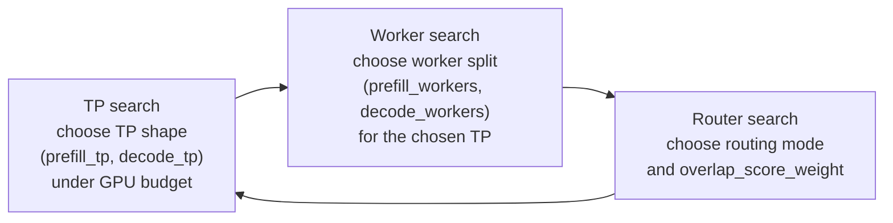

<!--
SPDX-FileCopyrightText: Copyright (c) 2026 NVIDIA CORPORATION & AFFILIATES.
All rights reserved.
SPDX-License-Identifier: Apache-2.0
-->

# Replay Optimize

## Experiment Goal

This experiment searches over disaggregated replay states to answer a concrete question:

- given a fixed GPU budget
- for a workload with real prefix overlap
- and latency SLAs that still permit meaningful throughput

which `(prefill_tp, decode_tp, prefill_workers, decode_workers, overlap_score_weight)` combination
produces the best offline replay result?

This is a heuristic search over replay states, not an exact optimizer over all feasible
configurations.

## Spec Shape (DGDR-aligned)

The public API takes a single [`ReplayOptimizeSpec`](specs.py) composed of:

- `EngineSpec` — model, backend, engine args (prefill + decode for disagg; single `baseEngineArgs`
  for agg)
- `HardwareSpec` — GPU SKU + total GPU budget
- `WorkloadSpec` — synthetic workload knobs (isl/osl/concurrency/...) **or** a trace source
  (`traceFile`/`arrivalSpeedupRatio`), discriminated by whether `traceFile` is set
- `SLASpec` — latency bounds (`ttft`, `itl`, `e2eLatency`, plus p95 variants); each is independent
  and optional
- `RouterSpec` — router mode, overlap-score-weight sweep, KV-router base config
- `objective` — `ReplayObjective.THROUGHPUT` (default), `MEAN_TTFT`, or `MEAN_E2E_LATENCY`
- `maxParallelEvals` — how many replay evaluations to run concurrently

Field names use lowerCamelCase throughout to match the operator's auto-generated
[`dgdr_v1beta1_types.py`](../dgdr_v1beta1_types.py) so the eventual upstream merge into the Go
`DynamoGraphDeploymentRequestSpec` is mechanical. Method names (`.violation_penalty()`,
`.summarize()`, `.aic_task_kwargs()`) stay snake_case to match Pydantic convention.

## Prerequisites

Run from the repository root.

Use the project virtual environment:

```bash
.venv/bin/python --version
```

If the Python bindings are not importable yet, build them first:

```bash
.venv/bin/maturin develop --uv -m lib/bindings/python/Cargo.toml
```

This example uses AIC-backed replay optimization by default:

- AIC is used to enumerate dense TP candidates
- AIC-backed engine timing is used for the replay candidate configs

Install `aiconfigurator` into the project environment:

```bash
uv pip install --python .venv/bin/python aiconfigurator
```

If a regular install fails to load usable perf data, reinstall from a source checkout that has real
systems data materialized:

```bash
uv pip install --python .venv/bin/python --force-reinstall /path/to/aiconfigurator
```

If replay optimization fails with AIC errors about missing perf databases or parse failures such as
`KeyError: 'gemm_dtype'`, inspect the installed files under:

```text
.venv/lib/python*/site-packages/aiconfigurator/systems/data/...
```

If those files begin with `version https://git-lfs.github.com/spec/v1`, you have Git LFS pointer
stubs instead of real perf tables. In that case, install `aiconfigurator` from a checkout or wheel
that includes the real LFS materialized payloads in `systems/`.

When running directly from a source checkout, expose the in-repo Python packages:

```bash
export PYTHONPATH=lib/bindings/python/src:components/src
```

If the replay search uses multiple worker processes, prefer a real script file over a heredoc. This
matters on macOS because `ProcessPoolExecutor` child workers need a stable module path, and the
driver module must guard its entry behind `if __name__ == "__main__":`.

For KV-router replay logs, this filter keeps the run readable without hiding useful `info` output:

```bash
export DYN_LOG='info,dynamo_kv_router::scheduling::selector=warn'
```

## Experiment Setup

This sweep uses:

- `EngineSpec.model`: `Qwen/Qwen3-32B`
- `EngineSpec.backend`: `vllm`
- `HardwareSpec.gpuSku`: `h200_sxm`
- `HardwareSpec.totalGpus`: `16`
- `RouterSpec.mode`: `kv_router`
- Synthetic `WorkloadSpec`

The GPU budget here is a simulated search constraint used by offline replay when it enumerates
candidate TP and worker configurations. You do not need 16 real GPUs locally to run this search.

The synthetic workload is intentionally large enough to make worker allocation and router settings
matter:

- `isl=32768`
- `osl=256`
- `requestCount=5000`
- `concurrency=200`
- `sharedPrefixRatio=0.5`
- `numPrefixGroups=50`

The base engine args stay conservative:

- `block_size=512`
- `num_gpu_blocks=20000`
- `enable_prefix_caching=True`
- explicit `worker_type` for prefill vs decode

This setup does not force scheduler-specific bottlenecks such as:

- `enable_chunked_prefill`
- a small `max_num_seqs`
- a pinned `max_num_batched_tokens`

Only add those when the experiment is specifically about scheduler limits.

## Search Strategy

`replay_optimize` runs a coordinate descent over three dimensions per round, iterating until the incumbent stops moving or `DEFAULT_SEARCH_ROUNDS` is reached:



Each step calls [`evaluate._evaluate_states`](evaluate.py), which replays the candidate state through `run_synthetic_trace_replay` or `run_trace_replay` (see [Mocker Trace Replay](../../../../../../docs/benchmarks/mocker-trace-replay.md) for the underlying harness) and ranks the resulting records with `scoring._pick_best_record`. The ranking key is `spec.objective` (throughput, mean_ttft, or mean_e2e_latency) subject to `spec.sla` bounds and `spec.hardware.totalGpus` as a feasibility gate.

The descent is budget-focused: each step prunes to near-budget-edge states so the sweep ends up at a TP/worker shape that actually consumes the available GPU budget, rather than at a throughput-per-GPU pareto point. Aggregated replay (`optimize_dense_agg_with_replay`) collapses dimensions 1 and 2 into `(tp, workers)` but is otherwise identical; see [`search.py`](search.py) for both entrypoints.

## Driver Script

The canonical starting point lives in [example.py](example.py). Keeping it as a real module is
better than carrying a large inline snippet in the README, and it also satisfies the macOS
`ProcessPoolExecutor` requirement for a stable module path.

Treat [example.py](example.py) as a starting point, not a frozen harness. Modify it as needed for
your search:

- change the `WorkloadSpec` shape (or switch to a trace source with `traceFile=...`)
- add SLA bounds on `SLASpec` (`ttft`, `itl`, `e2eLatency`, or their p95 variants)
- change `RouterSpec.overlapWeights`
- print different columns from `result.evaluated_df` or `result.feasible_df`
- persist the tables to CSV or parquet if you want downstream analysis

If you need to understand which knobs are available, see [specs.py](specs.py), [search.py](search.py),
and [evaluate.py](evaluate.py).

The default path in [example.py](example.py) is the synthetic disaggregated sweep documented in
this README. It also accepts `--trace-file` and `--arrival-speedup-ratio` so the same driver can be
used for the Mooncake-style replay path below without rewriting the harness from scratch.

## Expected Outputs

The returned object is a `DenseReplayOptimizationResult` with:

- `best_feasible`: best visited state that satisfies all SLAs and the GPU budget
- `best_infeasible`: best visited state that misses at least one SLA bound or the budget
- `evaluated_df`: all visited states
- `feasible_df`: only the feasible visited states

Useful columns to inspect:

- topology: `prefill_tp`, `decode_tp`, `prefill_workers`, `decode_workers`
- routing: `router_mode`, `overlap_score_weight`
- budget: `total_gpus_used`
  This is the simulated GPU footprint of the candidate replay state, not a count of GPUs actually
  allocated on the machine running the search.
- throughput: `output_throughput_tok_s`
- cache behavior: `prefix_cache_reused_ratio`
- latency: `mean_ttft_ms`, `mean_tpot_ms`, `mean_e2e_latency_ms`

Note that the report DataFrame still uses the Rust replay runner's key names
(`mean_ttft_ms`, `mean_tpot_ms`, `mean_e2e_latency_ms`) even though the input `SLASpec` uses DGDR's
camelCase names (`ttft`, `itl`, `e2eLatency`). `SLASpec` carries an internal translation map;
renaming the Rust output keys is a follow-up in the Rust replay runner.

In local testing, this setup produced a non-trivial mean-E2E winner around:

- `prefill_tp=4`, `decode_tp=1`, `prefill_workers=3`, `decode_workers=4`, `overlap_score_weight=0.5`
- `output_throughput_tok_s ~= 970`, `prefix_cache_reused_ratio ~= 0.5`,
  `mean_ttft_ms ~= 42800`, `mean_tpot_ms ~= 35`, `mean_e2e_latency_ms ~= 51900`

Treat those as sanity-check ranges, not fixed assertions. See the regression anchor table in the
`run-replay-bench` skill for the current reference frontier.

## Tuning This Sweep

To broaden or shift the search, vary one axis at a time:

- `HardwareSpec.totalGpus`
- `RouterSpec.overlapWeights`
- `WorkloadSpec.sharedPrefixRatio`
- `WorkloadSpec.numPrefixGroups`
- base prefill/decode engine args

If you want to compare routing strategies directly, use `RouterSpec(mode="both")` instead of the
default KV-router-only search.

## Real Traffic Replay

`replay_optimize` is wired up for trace-driven replay. `WorkloadSpec` takes a `traceFile` (plus
optional `arrivalSpeedupRatio`) discriminator; when set, [evaluate.py](evaluate.py) routes through
`run_trace_replay(...)` instead of `run_synthetic_trace_replay(...)`.

Use a separate trace-driven experiment when you want to evaluate the same search structure against
a real Mooncake-style workload instead of the synthetic shared-prefix workload above.

### Download a Mooncake Trace

For a public starting point, use the FAST'25 toolagent trace:

```bash
curl -sL \
  https://raw.githubusercontent.com/kvcache-ai/Mooncake/refs/heads/main/FAST25-release/traces/toolagent_trace.jsonl \
  -o /tmp/toolagent_trace.jsonl
```

```bash
wget -O /tmp/toolagent_trace.jsonl \
  https://raw.githubusercontent.com/kvcache-ai/Mooncake/refs/heads/main/FAST25-release/traces/toolagent_trace.jsonl
```

### Replace the Synthetic Workload

If you use [example.py](example.py), pass `--trace-file /tmp/toolagent_trace.jsonl` and optionally
`--arrival-speedup-ratio 0.8`.

If you want to edit the driver directly, replace the synthetic `WorkloadSpec`:

```python
workload=WorkloadSpec(
    isl=32768,
    osl=256,
    requestCount=5000,
    concurrency=200,
    sharedPrefixRatio=0.5,
    numPrefixGroups=50,
),
```

with:

```python
workload=WorkloadSpec(
    traceFile="/tmp/toolagent_trace.jsonl",
    arrivalSpeedupRatio=1.0,
),
```

If you want to replay the same trace at `0.80x` of its original arrival rate, keep the same file
and set `arrivalSpeedupRatio=0.8`.

The main behavioral change is that the workload stops generating requests in memory and instead
replays request arrivals from the JSONL trace. In this path:

- `traceFile` points at the Mooncake-style JSONL input
- `arrivalSpeedupRatio` compresses or stretches the trace arrival process
- synthetic-only knobs such as `isl`, `osl`, `requestCount`, `concurrency`,
  `sharedPrefixRatio`, `numPrefixGroups` are ignored by the trace replay path

Important notes for the public toolagent trace:

- the dataset uses Mooncake-style `hash_ids` with `512` tokens per block
- the underlying `run_trace_replay(...)` API defaults `trace_block_size` to `512`
- `WorkloadSpec` does not yet expose a separate `traceBlockSize` field
- the prefix-data-generator tools in
  [Prefix Data Generator](../../../../../../benchmarks/prefix_data_generator/README.md)
  are useful if you want to inspect the trace first or synthesize a larger derivative trace before
  running this search
