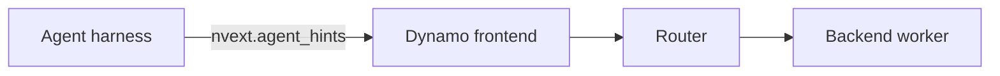

Agent hints are optional per-request metadata that a harness sends under
`nvext.agent_hints`. Dynamo parses these hints in the frontend and passes them
to the router and, where supported, backend runtimes.

Use hints only for serving-relevant intent. Use
[`nvext.agent_context`](agent-tracing.md#request-schema) for passive trace
identity.

## Request Schema

```json
{
    "model": "my-model",
    "messages": [
        { "role": "user", "content": "Continue the report." }
    ],
    "nvext": {
        "agent_hints": {
            "priority": 5,
            "osl": 1024,
            "speculative_prefill": true
        }
    }
}
```

| Hint | Description |
|------|-------------|
| `priority` | Unified request priority. Higher values mean higher priority at the Dynamo API layer; see [Priority Scheduling](priority-scheduling.md) for router and backend requirements. |
| `osl` | Expected output sequence length in tokens. Used by the router for output block tracking and load-balancing accuracy when `--router-track-output-blocks` is enabled. |
| `speculative_prefill` | When true, Dynamo can prefill the predicted next-turn prefix after the current turn completes to warm the KV cache for the next request. |

## Request Flow



The frontend parses `nvext.agent_hints`, the router uses hints for queueing and
worker selection, and supported backends use forwarded hints for engine-level
scheduling and cache policy. For priority-specific semantics, see
[Priority Scheduling](priority-scheduling.md).

## Backend Support

Backend support is runtime-specific. For SGLang flags and behavior, see
[SGLang for Agentic Workloads](../backends/sglang/agents.md).

| Feature | vLLM | SGLang | TensorRT-LLM |
|---------|:----:|:------:|:-------------:|
| Priority-aware routing | Yes | Yes | Yes |
| Priority-based cache eviction | Planned | Yes | Planned |
| Speculative prefill | Yes | Yes | Yes |
| Subagent KV isolation with session control | No | Experimental | No |

## Related Request Extensions

`agent_hints` is separate from `agent_context`:

- `agent_context` is passive identity for traces and joins.
- `agent_hints` is active serving intent for routing, scheduling, and cache
  behavior.

Session-control metadata for SGLang subagent KV isolation lives under
`nvext.session_control`; see [NVIDIA Request Extensions](../components/frontend/nvext.md#session-control).
