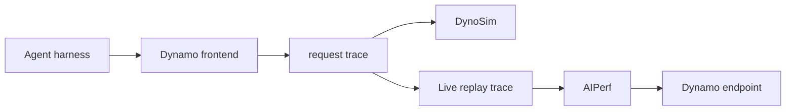

Agent trace replay records the workload that an agent sends to Dynamo and turns it into a reusable benchmark. Capture one real run, then use the same request graph to validate a live endpoint or explore configurations offline. It replays the serving workload rather than the agent itself, so the model does not repeat its decisions and tools are not executed again.

## What This Captures

A Dynamo request trace preserves the parts of an agent run that affect serving:

- when each model request arrived
- its input and output token lengths
- which prompt blocks were shared with earlier requests
- which requests belonged to the same agent session
- parent-child relationships between agent sessions

Prompts, responses, and tool arguments are not stored. Enable [audit payloads](agent-tracing.md#audit-payloads) alongside tracing if you need them. Optional tool spans record where time was spent, but replay uses the captured request schedule rather than calling those tools again.

## Why Replay an Agent Trace

Use trace replay to:

- reproduce realistic multi-turn and multi-agent load without rerunning the agent, tools, or external APIs
- compare routing, cache, worker, or model-server changes against the same workload
- investigate latency or cache regressions with a repeatable request schedule
- screen deployment choices offline before spending GPU time on live validation

## Choose Live Replay or Offline Simulation

One capture supports both paths:

| Path | What runs | Use it for |
|---|---|---|
| **Live replay with AIPerf** | Synthetic requests against a real Dynamo endpoint, model, and GPUs | Final latency, throughput, cache, and regression measurements |
| **Offline simulation with DynoSim** | The request graph against Dynamo's simulated scheduler, router, and KV cache | Compare worker counts, serving topologies, routing policies, and KV-cache capacity |

Live replay measures the real serving stack. Offline simulation predicts how a configuration behaves and should be followed by live validation for final numbers. See the official [AIPerf trace replay](https://github.com/ai-dynamo/aiperf/blob/main/docs/benchmark-modes/trace-replay.md) and [fixed schedule](https://github.com/ai-dynamo/aiperf/blob/main/docs/tutorials/fixed-schedule.md) guides for live benchmarking. See [DynoSim](../dynosim/README.md) and [DynoSim Runs](../dynosim/runs.md) for offline simulation.

The complete flow is:



## Step 1: Capture a Real Agent Run

Enable request tracing on the frontend that receives the agent traffic:

```bash
export DYN_REQUEST_TRACE=1
export DYN_REQUEST_TRACE_OUTPUT_PATH=/tmp/agent-run/request-trace

# Optional: bind the ingress used by a harness that publishes explicit tool spans.
export DYN_REQUEST_TRACE_TOOL_EVENTS_ZMQ_ENDPOINT=tcp://127.0.0.1:20390
```

Run the agent workload normally against this frontend. Use the real tools if you want the captured schedule to include their actual latency. For example, a coding agent can solve SWE-bench tasks in its normal sandbox while every model request is recorded at the Dynamo frontend.

Each agent chain should send `X-Dynamo-Session-ID`. A child agent should also send `X-Dynamo-Parent-Session-ID`. These headers describe the request graph; they do not enable session affinity or change routing.

Dynamo writes rotating `request-trace.NNNNNN.jsonl.gz` files. Stop the frontend, or otherwise allow tracing to flush, before using the files. See [Agent Tracing](agent-tracing.md) for configuration, the record schema, Perfetto conversion, and optional tool-event ingestion.

## Step 2: Check the Capture

Before replaying, confirm that the trace contains the workload you intended:

- `request_end` count matches the number of completed model requests
- session and per-session turn counts look reasonable
- every request has input length, output length, and sequence hashes
- the final trace file was flushed cleanly

These are manual sanity checks. The replay tools validate required fields and consistent block sizes, but they cannot know the request or session counts you intended to capture. Checking both catches a wrong frontend, missing session headers, and an incomplete shutdown before those errors become misleading replay results.

## Step 3: Prepare the Request Graph

Both replay paths build a graph from the same trace fields:

- `session_id` orders requests into one linear agent chain
- `parent_session_id` adds a child branch to its direct parent session
- `request_received_ms` determines the recorded arrival schedule
- `replay.input_length`, `output_tokens`, and `input_sequence_hashes` reproduce the request shape and complete-block prompt-prefix relationships

DynoSim reads the original request trace directly. Live AIPerf replay requires one conversion step.

### Convert for live replay

This path currently requires [a branch of AIPerf](https://github.com/ajcasagrande/aiperf/pull/3). AIPerf's converter reads uncompressed JSONL:

```bash
gzip -cd /tmp/agent-run/request-trace.*.jsonl.gz > /tmp/agent-run/request-trace.jsonl

aiperf synthesize dynamo-trace /tmp/agent-run/request-trace.jsonl \
  --output /tmp/agent-run/aiperf-trace
```

The output contains one replay graph per root session. Requests in a session remain ordered, while independent roots and child branches can overlap. Dynamo sequence hashes become global synthetic block IDs, preserving complete-block prefix sharing across sessions without exposing the original tokens. Each file also declares the capture block size, which AIPerf uses automatically.

The current live graph supports one direct child-session level. The converter rejects deeper trees instead of silently flattening them.

## Step 4: Run the Replay

### Live replay with AIPerf

Replay against a Dynamo endpoint serving the target model:

```bash
AIPERF_DATASET_WEKA_SPLIT_FLATTENED_AGENTS=false \
AIPERF_DYNAMO_SESSION_TRANSPORT=headers \
aiperf profile \
  --url http://localhost:8000 \
  --model my-model \
  --tokenizer /path/to/my-model \
  --endpoint-type chat \
  --input-file /tmp/agent-run/aiperf-trace \
  --custom-dataset-type weka_trace \
  --fixed-schedule \
  --fixed-schedule-auto-offset \
  --use-dynamo-session-control \
  --use-server-token-count \
  --extra-inputs ignore_eos:true \
  --output-artifact-dir /tmp/agent-run/aiperf
```

Do not add a concurrency or request-rate cap when reproducing the capture. The recorded timestamps and graph already supply concurrency. A turn starts no earlier than both its target timestamp and its predecessor's completion, so a slower target accumulates schedule drift instead of overlapping dependent turns.

Fixed-schedule behavior is required to preserve recorded arrival times, although AIPerf enables it automatically for trace datasets. It is explicit above for clarity. `--fixed-schedule-auto-offset` shifts the schedule to start at zero without changing relative timing.

`ignore_eos:true` asks the backend to generate the captured output length rather than stop early on newly sampled content. The split override prevents AIPerf from reconstructing a second conversation graph on top of the one Dynamo already built. `--use-dynamo-session-control` sends the session and parent-session headers so the replayed trace preserves agent session identity.

### Offline simulation with DynoSim

Pass the captured shards directly to simulated workers:

```bash
python -m dynamo.replay /tmp/agent-run/request-trace.*.jsonl.gz \
  --trace-format dynamo \
  --replay-mode offline \
  --router-mode kv_router \
  --num-workers 4 \
  --report-json /tmp/agent-run/dynosim-report.json
```

DynoSim derives and validates the block size across all shards. When every request carries session identity, it also reconstructs the agent DAG and tool-wait timing. `kv_router` requires at least two simulated workers. Change worker count, routing, or engine settings to compare configurations without running the model.

## Step 5: Validate Fidelity

For a successful live replay, check that:

- captured, converted, dispatched, and completed request counts match
- session counts and per-session turn counts match
- AIPerf reports no request errors
- replayed output lengths match the capture
- arrival-time, request-duration, and cache-reuse deltas are reported

Keep the model, tokenizer, block size, worker topology, and initial cache state the same when measuring replay fidelity. For a DynoSim run, first verify request and token totals, then compare configurations using the generated report rather than treating simulation output as hardware measurements.

## Fidelity Boundaries

Replay is intentionally content-free:

- Synthetic prompts preserve block-sharing topology, not the original text
- Wire input length can differ slightly because the target tokenizer and chat template reconstruct the request
- Service time can differ even against the same model
- AIPerf does not dispatch tool rows; their elapsed time remains in the gap between model requests, and DynoSim retains it as tool-wait time
- If a changed model response would select another tool or branch, capture another live agent run instead of using static replay
