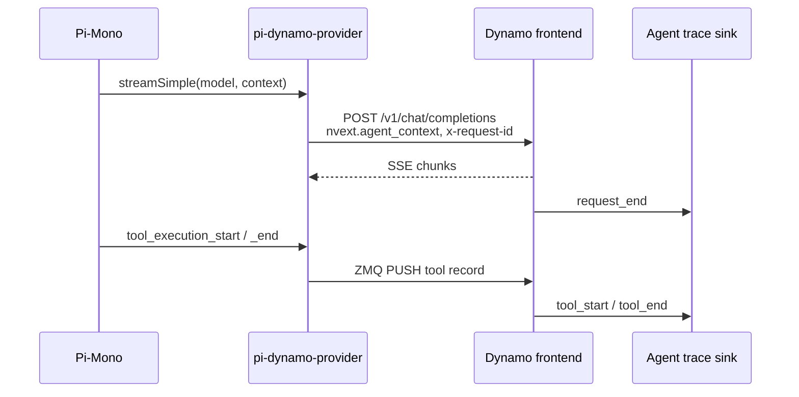

[Pi-Mono](https://github.com/badlogic/pi-mono) is an open-source coding-agent harness whose clean plugin architecture has made it a popular substrate for patterns like subagents and planner/implementer loops. The [`pi-dynamo-provider`](https://github.com/ai-dynamo/pi-dynamo-provider) extension uses that plugin surface to register Dynamo as a Pi model provider. It runs in-process, adds Dynamo's [`agent_context`](agent-tracing.md) and [`agent_hints`](agent-hints.md) to each request, and emits Pi's tool lifecycle events to Dynamo over ZMQ.

This page is one worked example of how to wire a harness up to Dynamo's tracing and hint APIs — use it as a reference, not a prescription.

## Why run Pi through Dynamo

You can already point Pi at any OpenAI-compatible endpoint — Ollama, vLLM, a hosted API, or Dynamo out of the box. Routing through Dynamo *with this extension* gives you two things you don't get from plain hosting:

- **Harness-aware observability.** Pi's session and trajectory IDs flow into Dynamo's `request_end` traces, and Pi's tool spans land on the same timeline. One Perfetto view shows LLM requests, prefill/decode stages, and tool calls together.
- **Harness-aware orchestration.** Once Dynamo knows which trajectory a request belongs to, it can act on agent hints (priority, expected output length, speculative prefill) for smarter scheduling and KV-aware routing. That same trajectory awareness is what lets backends like [SGLang](../backends/sglang/agents.md) apply priority-based radix eviction and session-scoped KV isolation.

The integration works against any Dynamo backend — vLLM, SGLang, or TRT-LLM — without backend-specific glue.

## What the extension does

- Registers a `dynamo` provider in Pi: `pi --model dynamo/<model-id>`.
- Discovers models from Dynamo's `/v1/models`.
- Injects `nvext.agent_context` (session/trajectory IDs) into every chat-completion request.
- Adds `x-request-id` when one is not already set.
- Relays Pi's `tool_start` / `tool_end` / `tool_error` events to Dynamo over ZMQ so LLM and tool spans share one trace.



## Quickstart

### 1. Install the provider

Build from source and install it into Pi:

```bash
git clone git@github.com:ai-dynamo/pi-dynamo-provider.git
cd pi-dynamo-provider
npm install && npm run build
pi install /absolute/path/to/pi-dynamo-provider
```

### 2. Launch Dynamo with tracing enabled

Use the in-repo SGLang launcher (`examples/backends/sglang/launch/agg_agent.sh`), which starts a frontend with KV routing plus one SGLang worker with streaming sessions, KV events, and reasoning/tool parsers wired up. Export the agent-trace env vars first so the worker records traces to a JSONL file and binds the ZMQ socket Pi will connect to:

```bash
export DYN_AGENT_TRACE_SINKS=jsonl
export DYN_AGENT_TRACE_OUTPUT_PATH=/tmp/dynamo-agent-trace.jsonl
export DYN_AGENT_TRACE_TOOL_EVENTS_ZMQ_ENDPOINT=tcp://127.0.0.1:20390

./examples/backends/sglang/launch/agg_agent.sh
```

By default this serves `zai-org/GLM-4.7-Flash` on TP 2. Override with `--model-path` / `--tp` if needed. See [Agent Tracing → Enable output](agent-tracing.md#enable-output) for the full env-var reference. The provider works equally well against any Dynamo backend (vLLM, SGLang, TRT-LLM); the SGLang launcher is just the most batteries-included starting point.

### 3. Point Pi at Dynamo

```bash
export DYNAMO_BASE_URL=http://127.0.0.1:8000/v1
export DYNAMO_API_KEY=dummy

export DYN_AGENT_SESSION_TYPE_ID=pi_coding_agent
export DYN_AGENT_SESSION_ID=pi-demo-001
export DYN_AGENT_TOOL_EVENTS_ZMQ_ENDPOINT=tcp://127.0.0.1:20390

pi --model dynamo/zai-org/GLM-4.7-Flash \
   -p "Run the tests in this folder, fix the smallest bug, and rerun the tests."
```

`DYN_AGENT_SESSION_ID` becomes the trace's `session_id`; if `DYN_AGENT_TRAJECTORY_ID` is unset, Pi's session id is used as the trajectory id.

### 4. View the trace in Perfetto

```bash
python benchmarks/agent_trace/convert_to_perfetto.py \
  /tmp/dynamo-agent-trace.jsonl \
  --include-markers \
  --separate-stage-tracks \
  --output /tmp/dynamo-agent-trace.perfetto.json
```

Open the result at [ui.perfetto.dev](https://ui.perfetto.dev). You'll see:

- `dynamo.llm` spans for each LLM request.
- `dynamo.llm.stage` spans for prefill/decode when Dynamo records them.
- `dynamo.agent.tool` spans for every Pi tool invocation.

<details>
<summary>Pi environment variables</summary>

| Variable                             | Default                    | Purpose                                                              |
| ------------------------------------ | -------------------------- | -------------------------------------------------------------------- |
| `DYNAMO_BASE_URL`                    | `http://127.0.0.1:8000/v1` | Dynamo OpenAI-compatible endpoint root.                              |
| `DYNAMO_API_KEY`                     | `dynamo-local`             | Bearer token. Local Dynamo usually accepts any value.                |
| `DYN_AGENT_SESSION_TYPE_ID`          | `pi_coding_agent`          | Stable workload class for the trace.                                 |
| `DYN_AGENT_SESSION_ID`               | unset                      | Session/run id. Falls back to Pi's session id for tool events.       |
| `DYN_AGENT_TRAJECTORY_ID`            | unset                      | Trajectory id override; defaults to Pi's session id per request.     |
| `DYN_AGENT_PARENT_TRAJECTORY_ID`     | unset                      | Parent trajectory id for nested or subagent workflows.               |
| `DYN_AGENT_TOOL_EVENTS_ZMQ_ENDPOINT` | unset                      | Dynamo-bound ZMQ PULL endpoint Pi connects to for tool events.       |
| `DYN_AGENT_TOOL_EVENTS_ZMQ_TOPIC`    | `agent-tool-events`        | First ZMQ frame; must match `DYN_AGENT_TRACE_TOOL_EVENTS_ZMQ_TOPIC`. |

See the [provider README](https://github.com/ai-dynamo/pi-dynamo-provider) for the full variable list, aliases, and ZMQ wire format.

</details>

## Troubleshooting

| Symptom                                   | Likely cause                                            | Fix                                                                                       |
| ----------------------------------------- | ------------------------------------------------------- | ----------------------------------------------------------------------------------------- |
| `pi` reports the model is unknown         | `/v1/models` returned empty during Pi startup           | `curl -s "$DYNAMO_BASE_URL/models"` to confirm; restart Pi after Dynamo is ready.         |
| LLM spans appear, tool spans do not       | Tool-event endpoint not configured on both sides        | Set `DYN_AGENT_TRACE_TOOL_EVENTS_ZMQ_ENDPOINT` on Dynamo and `DYN_AGENT_TOOL_EVENTS_ZMQ_ENDPOINT` on Pi to the same value. |
| Tool spans appear, request spans do not   | Dynamo trace sinks not enabled                          | Set `DYN_AGENT_TRACE_SINKS=jsonl` and `DYN_AGENT_TRACE_OUTPUT_PATH` on Dynamo.             |
| Authentication fails                      | Dynamo expects a specific token                         | Set `DYNAMO_API_KEY` to match your deployment. Local Dynamo usually accepts `dummy`.      |

## Further reading

- [pi-dynamo-provider repo](https://github.com/ai-dynamo/pi-dynamo-provider) — install, scripts, and source.
- [Agent Tracing](agent-tracing.md) — the underlying trace protocol and `request_end` schema.
- [Agent Hints](agent-hints.md) — per-request hints (`priority`, `osl`, `speculative_prefill`) Pi-Mono can forward via `nvext.agent_hints`.
