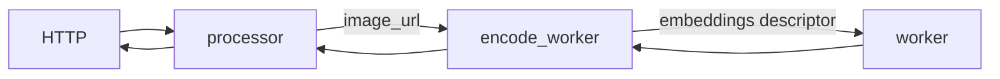
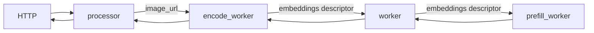

<!--
SPDX-FileCopyrightText: Copyright (c) 2025 NVIDIA CORPORATION & AFFILIATES. All rights reserved.
SPDX-License-Identifier: Apache-2.0
-->

# Encode-Prefill-Decode (EPD) Flow with NIXL

For high-performance multimodal inference with large embeddings, Dynamo supports a specialized **Encode-Prefill-Decode (EPD)** flow using **NIXL (RDMA)** for zero-copy tensor transfer.

## Use the Latest Release

We recommend using the latest stable release of dynamo to avoid breaking changes:

[](https://github.com/ai-dynamo/dynamo/releases/latest)

You can find the latest release [here](https://github.com/ai-dynamo/dynamo/releases/latest) and check out the corresponding branch with:

```bash
git checkout $(git describe --tags $(git rev-list --tags --max-count=1))
```

## Multimodal Aggregated Serving

### Components

- workers: For aggregated serving, we have two workers, [MultimodalEncodeWorkerHandler](../../../components/src/dynamo/sglang/request_handlers/multimodal/encode_worker_handler.py) for encoding and [MultimodalWorkerHandler](../../../components/src/dynamo/sglang/request_handlers/multimodal/worker_handler.py) for prefilling and decoding.
- processor: Tokenizes the prompt and passes it to the MultimodalEncodeWorker.

### Workflow


The MultimodalEncodeWorker is responsible for encoding the image and passing the embeddings to the MultimodalWorker via a combination of NATS and RDMA.
The work complete event is sent via NATS, while the embeddings tensor is transferred via RDMA through the NIXL interface.
Its MultimodalWorker then prefills and decodes the prompt, just like the [LLM aggregated serving](README.md) example.
By separating the encode from the prefill and decode stages, we can have a more flexible deployment and scale the
MultimodalEncodeWorker independently from the prefill and decode workers if needed.

This figure illustrates the workflow:


```bash
cd $DYNAMO_HOME/components/backends/sglang
./launch/multimodal_agg.sh
```

### Client

In another terminal:
```bash
curl http://localhost:8000/v1/chat/completions   -H "Content-Type: application/json"   -d '{
    "model": "Qwen/Qwen2.5-VL-7B-Instruct",
    "messages": [
      {
        "role": "user",
        "content": [
          {
            "type": "text",
            "text": "Describe the image."
          },
          {
            "type": "image_url",
            "image_url": {
              "url": "http://images.cocodataset.org/test2017/000000155781.jpg"
            }
          }
        ]
      }
    ],
    "max_tokens": 50,
    "stream": false
  }' | jq
```

You should see a response similar to this:
```json
{
  "id": "chatcmpl-2546f44756884a14916ce13ebaa09da8",
  "choices": [
    {
      "index": 0,
      "message": {
        "content": "This image shows a public transit bus on a dimly lit, street-level track in what appears to be a quiet urban neighborhood or suburban area. The bus displays \"OUT OF SERVICE\" in red on its illuminated sign. It is positioned",
        "role": "assistant",
        "reasoning_content": null
      },
      "finish_reason": "length"
    }
  ],
  "created": 1758824222,
  "model": "Qwen/Qwen2.5-VL-7B-Instruct",
  "object": "chat.completion",
  "usage": {
    "prompt_tokens": 0,
    "completion_tokens": 40,
    "total_tokens": 40
  }
}
```

## Multimodal Disaggregated Serving

### Components

- workers: For disaggregated serving, we have three workers, [MultimodalEncodeWorkerHandler](../../../components/src/dynamo/sglang/request_handlers/multimodal/encode_worker_handler.py) for encoding, [MultimodalWorkerHandler](../../../components/src/dynamo/sglang/request_handlers/multimodal/worker_handler.py) for decoding, and [MultimodalPrefillWorkerHandler](../../../components/src/dynamo/sglang/request_handlers/multimodal/worker_handler.py) for prefilling.
- processor: Tokenizes the prompt and passes it to the MultimodalEncodeWorker.

### Workflow

For the Qwen2.5-VL model, embeddings are only required during the prefill stage. As such, the image embeddings are transferred using a NIXL descriptor from the encode worker to the worker and then passed to the prefill worker for processing.
The prefill worker performs the prefilling step and forwards the KV cache to the worker for decoding.
For more details on the roles of the prefill and decode workers, refer to the [LLM disaggregated serving](README.md) example.

This figure illustrates the workflow:



```bash
cd $DYNAMO_HOME/components/backends/sglang
./launch/multimodal_disagg.sh
```

### Client

In another terminal:
```bash
curl http://localhost:8000/v1/chat/completions   -H "Content-Type: application/json"   -d '{
    "model": "Qwen/Qwen2.5-VL-7B-Instruct",
    "messages": [
      {
        "role": "user",
        "content": [
          {
            "type": "text",
            "text": "Describe the image."
          },
          {
            "type": "image_url",
            "image_url": {
              "url": "http://images.cocodataset.org/test2017/000000155781.jpg"
            }
          }
        ]
      }
    ],
    "max_tokens": 50,
    "stream": false
  }' | jq
```

You should see a response similar to this:
```json
{
  "id": "chatcmpl-2546f44756884a14916ce13ebaa09da8",
  "choices": [
    {
      "index": 0,
      "message": {
        "content": "This image shows a public transit bus on a dimly lit, street-level track in what appears to be a quiet urban neighborhood or suburban area. The bus displays \"OUT OF SERVICE\" in red on its illuminated sign. It is positioned",
        "role": "assistant",
        "reasoning_content": null
      },
      "finish_reason": "length"
    }
  ],
  "created": 1758824222,
  "model": "Qwen/Qwen2.5-VL-7B-Instruct",
  "object": "chat.completion",
  "usage": {
    "prompt_tokens": 0,
    "completion_tokens": 40,
    "total_tokens": 40
  }
}
```
