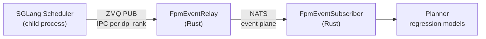

This guide covers metrics, tracing, and visualization for SGLang deployments running through Dynamo.

## Prometheus Metrics

When running SGLang through Dynamo, SGLang engine metrics are automatically passed through and exposed on Dynamo's `/metrics` endpoint (default port 8081). This allows you to access both SGLang engine metrics (prefixed with `sglang:`) and Dynamo runtime metrics (prefixed with `dynamo_*`) from a single worker backend endpoint.

**For the complete and authoritative list of all SGLang metrics**, always refer to the [official SGLang Production Metrics documentation](https://docs.sglang.io/references/production_metrics.html).

**For Dynamo runtime metrics**, see the [Dynamo Metrics Guide](../../observability/metrics.md).

**For visualization setup instructions**, see the [Prometheus and Grafana Setup Guide](../../observability/prometheus-grafana.md).

### Environment Variables

| Variable | Description | Default | Example |
|----------|-------------|---------|---------|
| `DYN_SYSTEM_PORT` | System metrics/health port | `-1` (disabled) | `8081` |

### Getting Started Quickly

This is a single machine example.

#### Start Observability Stack

For visualizing metrics with Prometheus and Grafana, start the observability stack. See [Observability Getting Started](../../observability/README.md#getting-started-quickly) for instructions.

#### Launch Dynamo Components

Launch a frontend and SGLang backend to test metrics:

```bash
# Start frontend (default port 8000, override with --http-port or DYN_HTTP_PORT env var)
$ python -m dynamo.frontend

# Enable system metrics server on port 8081
$ DYN_SYSTEM_PORT=8081 python -m dynamo.sglang --model <model_name> --enable-metrics
```

Wait for the SGLang worker to start, then send requests and check metrics:

```bash
# Send a request
curl -H 'Content-Type: application/json' \
-d '{
  "model": "<model_name>",
  "max_completion_tokens": 100,
  "messages": [{"role": "user", "content": "Explain why Roger Federer is considered one of the greatest tennis players of all time"}]
}' \
http://localhost:8000/v1/chat/completions

# Check metrics from the worker
curl -s localhost:8081/metrics | grep "^sglang:"
```

### Exposed Metrics

SGLang exposes metrics in Prometheus Exposition Format text at the `/metrics` HTTP endpoint. All SGLang engine metrics use the `sglang:` prefix and include labels (e.g., `model_name`, `engine_type`, `tp_rank`, `pp_rank`) to identify the source.

**Example Prometheus Exposition Format text:**

```
# HELP sglang:prompt_tokens_total Number of prefill tokens processed.
# TYPE sglang:prompt_tokens_total counter
sglang:prompt_tokens_total{model_name="meta-llama/Llama-3.1-8B-Instruct"} 8128902.0

# HELP sglang:generation_tokens_total Number of generation tokens processed.
# TYPE sglang:generation_tokens_total counter
sglang:generation_tokens_total{model_name="meta-llama/Llama-3.1-8B-Instruct"} 7557572.0

# HELP sglang:cache_hit_rate The cache hit rate
# TYPE sglang:cache_hit_rate gauge
sglang:cache_hit_rate{model_name="meta-llama/Llama-3.1-8B-Instruct"} 0.0075
```

**Note:** The specific metrics shown above are examples and may vary depending on your SGLang version. Always inspect your actual `/metrics` endpoint or refer to the [official documentation](https://docs.sglang.io/references/production_metrics.html) for the current list.

### Metric Categories

SGLang provides metrics in the following categories (all prefixed with `sglang:`):

- **Throughput metrics** - Token processing rates
- **Resource usage** - System resource consumption
- **Latency metrics** - Request and token latency measurements
- **Disaggregation metrics** - Metrics specific to disaggregated deployments (when enabled)

**Note:** Specific metrics are subject to change between SGLang versions. Always refer to the [official documentation](https://docs.sglang.io/references/production_metrics.html) or inspect the `/metrics` endpoint for your SGLang version.

### Available Metrics

The official SGLang documentation includes complete metric definitions with:
- HELP and TYPE descriptions
- Counter, Gauge, and Histogram metric types
- Metric labels (e.g., `model_name`, `engine_type`, `tp_rank`, `pp_rank`)
- Setup guide for Prometheus + Grafana monitoring
- Troubleshooting tips and configuration examples

For the complete and authoritative list of all SGLang metrics, see the [official SGLang Production Metrics documentation](https://docs.sglang.io/references/production_metrics.html).

### Implementation Details

- SGLang uses multiprocess metrics collection via `prometheus_client.multiprocess.MultiProcessCollector`
- Metrics are filtered by the `sglang:` prefix before being exposed
- The integration uses Dynamo's `register_engine_metrics_callback()` function
- Metrics appear after SGLang engine initialization completes

---

## Forward Pass Metrics (FPM)

Forward Pass Metrics provide **per-iteration scheduler telemetry** pushed over ZMQ, giving the [Planner](../../components/planner/README.md) real-time visibility into batch composition, queue depth, and GPU forward pass duration. Unlike Prometheus metrics (which are scraped asynchronously and reflect only the latest gauge value), FPM emits a structured message after every scheduler iteration with the exact batch state.

### Pipeline



The transport is backend-agnostic: the same `FpmEventRelay` and `FpmEventSubscriber` are used by both SGLang and vLLM backends.

### Enabling FPM

FPM requires the Dynamo adapter (`dynamo.sglang`) to inject the worker identity and IPC path before engine initialization. This happens automatically when the Dynamo runtime creates the SGLang worker.

The Planner subscribes to FPM via the NATS event plane. See the [Planner Guide](../../components/planner/planner-guide.md) for configuration (`load_adjustment_interval`, `max_num_fpm_samples`, `fpm_sample_bucket_size`).

### Schema

**ForwardPassMetrics** (top-level, one per iteration):

| Field | Type | Description |
|-------|------|-------------|
| `version` | `int` | Schema version (currently 1) |
| `worker_id` | `str` | Dynamo endpoint `connection_id` |
| `dp_rank` | `int` | Data-parallel rank |
| `counter_id` | `int` | Monotonic sequence number per (worker, dp_rank) |
| `wall_time` | `float` | GPU forward pass duration in seconds (via DeviceTimer) |
| `scheduled_requests` | `ScheduledRequestMetrics` | Batch composition this iteration |
| `queued_requests` | `QueuedRequestMetrics` | Waiting requests snapshot |

**ScheduledRequestMetrics** (requests in this batch):

| Field | Type | Description |
|-------|------|-------------|
| `num_prefill_requests` | `int` | Prefill requests (new + chunked continuations) |
| `sum_prefill_tokens` | `int` | Tokens freshly computed (chunk size, not full prompt) |
| `var_prefill_length` | `float` | Variance of full prompt lengths |
| `sum_prefill_kv_tokens` | `int` | KV tokens read but not computed (prefix cache + prior chunks) |
| `num_decode_requests` | `int` | Decode requests generating output tokens |
| `sum_decode_kv_tokens` | `int` | Total KV context length across decode requests |
| `var_decode_kv_tokens` | `float` | Variance of decode KV context lengths |

**QueuedRequestMetrics** (requests waiting to be scheduled):

| Field | Type | Description |
|-------|------|-------------|
| `num_prefill_requests` | `int` | Queued prefill requests |
| `sum_prefill_tokens` | `int` | Total tokens across queued prefill |
| `var_prefill_length` | `float` | Variance of queued prefill lengths |
| `num_decode_requests` | `int` | Queued decode requests |
| `sum_decode_kv_tokens` | `int` | Total KV tokens across queued decode |
| `var_decode_kv_tokens` | `float` | Variance of queued decode KV lengths |

### GPU-Accurate Timing

FPM uses SGLang's `DeviceTimer` infrastructure (CUDA event pairs around `model_runner.forward()` and `cuda_graph.replay()`) for GPU-accurate `wall_time`. This avoids the CPU scheduling overhead that would be included by timing at the scheduler level.

When DeviceTimer events are not yet ready (overlap scheduler mode where GPU work from iteration N is still in flight), FPM skips emission for that iteration rather than reporting an inaccurate monotonic clock fallback.

### Disaggregated Mode

In disaggregated serving, queued request metrics read from the correct engine-specific queues:

| Engine | Queue Source |
|--------|-------------|
| Unified (non-disagg) | `waiting_queue` |
| Prefill | `disagg_prefill_bootstrap_queue` |
| Decode | `disagg_decode_prealloc_queue` + `disagg_decode_transfer_queue` |

### Cross-Repo Contract Test

SGLang defines its own `ForwardPassMetrics` struct that must field-for-field match Dynamo's shared schema. A cross-repo contract test (`dynamo/sglang/tests/test_fpm_contract.py`) guards against schema drift by encoding with SGLang's struct and decoding with Dynamo's.

### Design Reference

For the full motivation and design rationale, see the [Forward Pass Metrics RFC](../../proposals/vllm-rfc-forward-pass-metrics.md).

---

## Distributed Tracing

Dynamo propagates [W3C Trace Context](https://www.w3.org/TR/trace-context/) headers through the SGLang request pipeline, allowing you to correlate traces across the frontend, router, and individual SGLang workers in a disaggregated deployment.

### Prerequisites

SGLang's engine-internal tracing requires the `opentelemetry` packages. These are declared as SGLang's `[tracing]` extra. Install them into your Dynamo environment:

```bash
uv pip install opentelemetry-api opentelemetry-sdk opentelemetry-exporter-otlp opentelemetry-exporter-otlp-proto-grpc
```

Without these packages, Dynamo-side spans (frontend, handler) will still work, but SGLang's internal engine spans will not be emitted and you will see a warning: `"Tracing is disabled because the packages cannot be imported."`

### How Trace Propagation Works

```
Frontend (Rust)
  creates span, embeds trace_id + span_id in Context
    |
    v
Dynamo RPC (NATS transport)
  Context serialized with trace_id, span_id
    |
    v
SGLang Handler (Python)
  dynamo.common.utils.otel_tracing.build_trace_headers(context)
  builds W3C traceparent: "00-{trace_id}-{span_id}-01"
    |
    v
sgl.Engine.async_generate(
    ...,
    rid=trace_id,                        # request ID = trace ID
    external_trace_header=traceparent    # W3C header for SGLang internal spans
)
    |
    v
SGLang Engine (internal spans attached to same trace)
```

Key implementation files:
- `components/src/dynamo/common/utils/otel_tracing.py` - W3C `traceparent` header builder
- `components/src/dynamo/sglang/request_handlers/handler_base.py:71-84` - Extracts trace context from Dynamo `Context` object
- `components/src/dynamo/sglang/request_handlers/llm/decode_handler.py` - Passes `external_trace_header` and `rid=trace_id` to `engine.async_generate()`

### Environment Variables

| Variable | Description | Default | Example |
|----------|-------------|---------|---------|
| `DYN_LOGGING_JSONL` | Enable JSONL logging (required for tracing) | `false` | `true` |
| `OTEL_EXPORT_ENABLED` | Enable OTLP trace export | `false` | `true` |
| `OTEL_EXPORTER_OTLP_TRACES_ENDPOINT` | OTLP gRPC endpoint for Tempo | `http://localhost:4317` | `http://tempo:4317` |
| `OTEL_SERVICE_NAME` | Service name shown in Grafana Tempo | `dynamo` | `dynamo-worker-decode` |

### SGLang-Specific Flags

| Flag | Description |
|------|-------------|
| `--enable-trace` | Enable W3C trace header propagation into SGLang engine |
| `--otlp-traces-endpoint` | OTLP gRPC endpoint for SGLang's internal trace export (bare `host:port` format, e.g. `localhost:4317`) |

Both flags are required for end-to-end tracing through the SGLang engine. Without `--enable-trace`, the Dynamo handler still creates spans, but SGLang's internal engine spans will not be linked.

### Controlling SGLang Trace Verbosity

When `--enable-trace` is set, SGLang emits spans at four verbosity levels. Dynamo defaults to level 2, which keeps all useful per-request spans while suppressing high-volume scheduler noise:

| Level | Spans included | Volume |
|-------|---------------|--------|
| 1 | `tokenize`, `prefill_forward`, `decode_forward` | Low |
| 2 | Level 1 + `request_process`, `api_server_dispatch` | Low |
| 3 (SGLang default) | Level 2 + `decode_loop`, `chunked_prefill`, `fake_output` | Very high (~1.6M spans/hr per model) |
| 4 | Level 3 + `run_batch_cpu` | Extremely high |

Use the `SGLANG_TRACE_LEVEL` environment variable to override the default:

| Variable | Description | Default | Example |
|----------|-------------|---------|---------|
| `SGLANG_TRACE_LEVEL` | SGLang internal span verbosity level (1–4); only active when `--enable-trace` is set | `2` | `1` |

```bash
# Keep only the most essential per-request spans
SGLANG_TRACE_LEVEL=1 python -m dynamo.sglang --model Qwen/Qwen3-0.6B --enable-trace --otlp-traces-endpoint localhost:4317

# Restore SGLang's default level (includes decode_loop — high volume)
SGLANG_TRACE_LEVEL=3 python -m dynamo.sglang --model Qwen/Qwen3-0.6B --enable-trace --otlp-traces-endpoint localhost:4317
```

### Launch with Tracing

The disaggregated launch script supports `--enable-otel` to enable tracing across all components:

```bash
# Start observability stack first
docker compose -f dev/docker-compose.yml up -d
docker compose -f dev/docker-observability.yml up -d

# Launch SGLang disaggregated with tracing
cd examples/backends/sglang/launch
./disagg.sh --enable-otel
```

Or manually for an aggregated deployment:

```bash
export DYN_LOGGING_JSONL=true
export OTEL_EXPORT_ENABLED=true
export OTEL_EXPORTER_OTLP_TRACES_ENDPOINT=http://localhost:4317

# Frontend
OTEL_SERVICE_NAME=dynamo-frontend python -m dynamo.frontend &

# SGLang worker with tracing
OTEL_SERVICE_NAME=dynamo-worker-sglang \
DYN_SYSTEM_PORT=8081 \
python -m dynamo.sglang \
  --model Qwen/Qwen3-0.6B \
  --enable-metrics \
  --enable-trace \
  --otlp-traces-endpoint localhost:4317
```

### What You'll See in Traces

With tracing enabled, each inference request produces a single end-to-end trace spanning the full request lifecycle:

- **Frontend `http-request` span** - Root span from the HTTP service, includes method/uri/trace_id
- **KV Router spans** - `kv_router.route_request`, `kv_router.select_worker`, `kv_router.compute_block_hashes`, `kv_router.find_matches`, `kv_router.compute_seq_hashes`, `kv_router.schedule`
- **Worker `handle_payload` span** - The Dynamo RPC handler on the worker side, with component/endpoint/namespace labels
- **SGLang engine spans** - `Req <id>`, `Scheduler`, `Tokenizer`, `request_process`, `prefill_forward`, `decode_loop`, `Bootstrap Room` (for disagg)
- **Semantic conventions** - `gen_ai.usage.prompt_tokens`, `gen_ai.usage.completion_tokens`, `gen_ai.latency.time_to_first_token`, etc.

Example trace tree for a KV-routed request:

```
dynamo-frontend: http-request (root)
  dynamo-frontend: kv_router.route_request
    dynamo-frontend: kv_router.select_worker
      kv_router.compute_block_hashes
      kv_router.find_matches
      kv_router.compute_seq_hashes
      kv_router.schedule
    dynamo-worker-1: handle_payload
      sglang: Bootstrap Room 0x0
        sglang: Req <trace-id-prefix>
          sglang: Scheduler [TP 0]
            request_process
            prefill_forward
            decode_loop (repeated per token)
          sglang: Tokenizer
            tokenize
            dispatch
```


### Viewing Traces

1. Open Grafana at `http://localhost:3000` (username: `dynamo`, password: `dynamo`)
2. Navigate to **Explore** (compass icon)
3. Select **Tempo** as the data source
4. Use the **Search** tab:
   - Filter by **Service Name** (e.g., `dynamo-frontend`, `dynamo-worker-1`, `sglang`)
   - Filter by **Span Name** (e.g., `http-request`, `handle_payload`, `Req *`, `decode_loop`)
   - Filter by **Tags** (e.g., `rid=<trace-id>`, `gen_ai.response.model=Qwen/Qwen3-0.6B`)
5. Click a trace to view the flame graph spanning frontend -> router -> worker -> engine

Send a request with `x-request-id` for easy lookup:

```bash
curl -H 'Content-Type: application/json' \
  -H 'x-request-id: my-trace-001' \
  -d '{"model": "Qwen/Qwen3-0.6B", "max_completion_tokens": 50,
       "messages": [{"role": "user", "content": "Explain why Roger Federer is considered one of the greatest tennis players of all time"}]}' \
  http://localhost:8000/v1/chat/completions
```

For more details on the Tempo/Grafana tracing infrastructure, see the [Dynamo Tracing Guide](../../observability/tracing.md).

---

## SGLang Grafana Dashboard

Dynamo ships a pre-provisioned Grafana dashboard for SGLang at `dev/observability/grafana_dashboards/sglang.json`. It is automatically loaded when the observability stack starts.

### Dashboard Panels

The dashboard is organized into five sections:

| Section | Panels | What to Watch |
|---------|--------|---------------|
| **Request Latency** | E2E Request Latency, Time-To-First-Token, Inter-Token Latency | Tail latency regressions, TTFT spikes during prefill pressure |
| **Throughput & Queue** | Token Generation Throughput (tok/s), Running & Queued Requests, Request Rate | Throughput saturation, queue depth growth |
| **Cache & PIN** | Cache Hit Rate, Active PIN Count, Retractions | KV cache reuse efficiency, PIN pressure from disagg routing |
| **Memory Pressure** | GPU KV Cache Usage %, Host (CPU) KV Cache Usage %, Eviction & Load-back Rate | OOM risk, HiCache offload activity |
| **HiCache Latency** | Eviction P99 Latency, Load-back P99 Latency | PCIe/NVLink bottlenecks in KV offload path |

### Accessing the Dashboard

1. Open Grafana at `http://localhost:3000`
2. Login with `dynamo` / `dynamo`
3. Click **Dashboards** in the left sidebar
4. Select **SGLang Engine**

Other available dashboards:
- **Dynamo Dashboard** (`dynamo.json`) - Frontend and component metrics
- **DCGM Metrics** (`dcgm-metrics.json`) - GPU utilization, memory, power
- **KVBM** (`kvbm.json`) - KV block manager metrics
- **Disagg Dashboard** (`disagg-dashboard.json`) - Disaggregated serving metrics

---

## Exposing on a Remote VM

When developing on a remote VM (cloud instance, bare metal, etc.), the observability ports are only bound to `localhost` inside the VM. You have two options to access them.

### Option 1: SSH Port Forwarding (Recommended)

Forward the relevant ports through your SSH connection. No firewall changes needed, traffic is encrypted.

```bash
# Forward Grafana (3000), Prometheus (9090), and Tempo (3200)
ssh -L 3000:localhost:3000 \
    -L 9090:localhost:9090 \
    -L 3200:localhost:3200 \
    user@your-vm-ip
```

Then open `http://localhost:3000` in your local browser.

For a long-running tunnel in the background:

```bash
ssh -fN \
    -L 3000:localhost:3000 \
    -L 9090:localhost:9090 \
    -L 3200:localhost:3200 \
    user@your-vm-ip
```

### Option 2: Firewall Rules

Open the ports directly. Only use this on trusted networks.

```bash
# Ubuntu/Debian
sudo ufw allow 3000/tcp   # Grafana
sudo ufw allow 9090/tcp   # Prometheus

# Or for cloud VMs, add inbound rules in your security group for ports 3000, 9090
```

Then access `http://<vm-ip>:3000` directly.

### Headless / Agent Access

For CI pipelines, AI coding agents, or headless workflows where no browser is available, you can query Grafana and Prometheus directly via their APIs:

```bash
# Query Prometheus for SGLang token throughput
curl -s 'http://localhost:9090/api/v1/query?query=rate(sglang:generation_tokens_total[1m])' | python3 -m json.tool

# Query Prometheus for GPU KV cache usage
curl -s 'http://localhost:9090/api/v1/query?query=dynamo_component_gpu_cache_usage_percent' | python3 -m json.tool

# List available Grafana dashboards
curl -s -u dynamo:dynamo http://localhost:3000/api/search | python3 -m json.tool

# Get the SGLang dashboard by title
curl -s -u dynamo:dynamo 'http://localhost:3000/api/search?query=SGLang' | python3 -m json.tool

# Fetch a specific dashboard by UID
curl -s -u dynamo:dynamo http://localhost:3000/api/dashboards/uid/<dashboard-uid> | python3 -m json.tool

# Snapshot current metrics via Prometheus range query (last hour)
START=$(date -u -d '1 hour ago' +%Y-%m-%dT%H:%M:%SZ)
END=$(date -u +%Y-%m-%dT%H:%M:%SZ)
curl -s "http://localhost:9090/api/v1/query_range?query=sglang:cache_hit_rate&start=${START}&end=${END}&step=15s"
```

This is useful for automated benchmarking pipelines where you want to capture metrics programmatically alongside performance results.

---

## Related Documentation

### SGLang Metrics
- [Official SGLang Production Metrics](https://docs.sglang.io/references/production_metrics.html)
- [SGLang GitHub - Metrics Collector](https://github.com/sgl-project/sglang/blob/v0.5.9/python/sglang/srt/metrics/collector.py)

### Dynamo Observability
- [Dynamo Metrics Guide](../../observability/metrics.md) - Complete documentation on Dynamo runtime metrics
- [Dynamo Tracing Guide](../../observability/tracing.md) - Distributed tracing with OpenTelemetry and Tempo
- [Prometheus and Grafana Setup](../../observability/prometheus-grafana.md) - Visualization setup instructions
- Dynamo runtime metrics (prefixed with `dynamo_*`) are available at the same `/metrics` endpoint alongside SGLang metrics
  - Implementation: `lib/runtime/src/metrics.rs` (Rust runtime metrics)
  - Metric names: `lib/runtime/src/metrics/prometheus_names.rs` (metric name constants)
  - Integration code: `components/src/dynamo/common/utils/prometheus.py` - Prometheus utilities and callback registration
