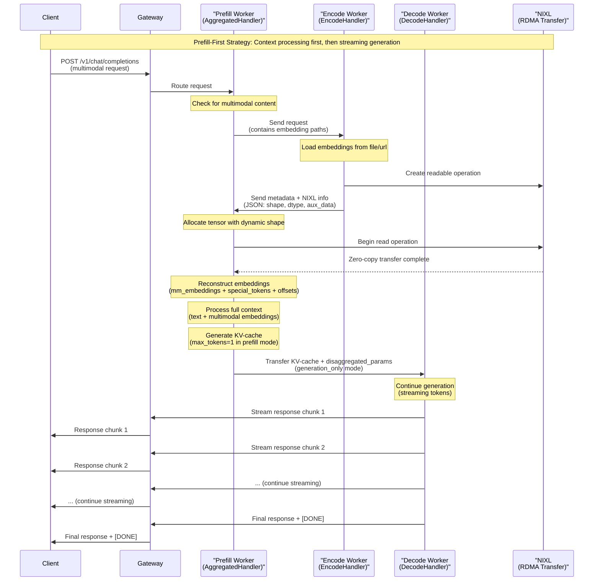
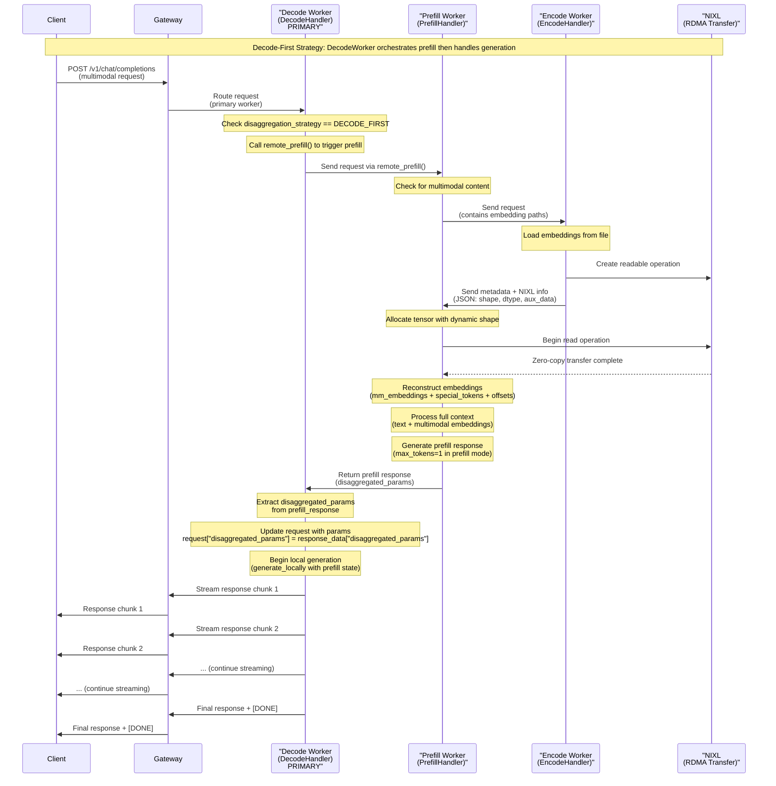

# Encode-Prefill-Decode (EPD) Flow with NIXL

For high-performance multimodal inference with large embeddings, Dynamo supports a specialized **Encode-Prefill-Decode (EPD)** flow using **NIXL (RDMA)** for zero-copy tensor transfer.

## Enabling the Feature

This is an experimental feature that requires using a specific TensorRT-LLM commit.
To enable it build the dynamo container with the `--tensorrtllm-commit` flag, followed by the commit hash:

```bash
./container/build.sh --framework trtllm --tensorrtllm-git-url https://github.com/NVIDIA/TensorRT-LLM.git --tensorrtllm-commit main
```

## Key Features

- **High Performance**: Zero-copy RDMA transfer for embeddings
- **Dynamic Shape Allocation**: Automatically handles variable embedding shapes per image
- **Multi-Format Support**: Works with tensor files (`.pt`) and dictionary-based embeddings
- **Hybrid Transfer**: Large tensors via NIXL, small metadata via JSON

## How to use

```bash
cd $DYNAMO_HOME/components/backends/trtllm

# Launch 3-worker EPD flow with NIXL
./launch/epd_disagg.sh
```

## Configuration

The EPD flow uses a dedicated **Encode Worker** that runs separately from the Prefill and Decode workers. The `ENCODE_ENDPOINT` environment variable specifies how the Prefill worker communicates with the Encode worker:

```bash
export ENCODE_ENDPOINT="dyn://dynamo.tensorrt_llm_encode.generate"
```

This endpoint follows Dynamo's standard format: `dyn://namespace.component.endpoint` where the Encode worker registers itself as `dynamo.tensorrt_llm_encode.generate`.

For local embedding file access, use the `--allowed-local-media-path "$ALLOWED_LOCAL_MEDIA_PATH"` parameter to specify the secure directory path where embedding files can be loaded from (default: `/tmp`). This prevents path traversal attacks while allowing flexible file access within the designated directory.

```bash
export ALLOWED_LOCAL_MEDIA_PATH="/tmp"
```

For tensor file size protection, use the `--max-file-size-mb "$MAX_FILE_SIZE_MB"` parameter to limit the maximum size of downloadable embedding files/Image URLs (default: `50MB`). This prevents Denial of Service (DoS) attacks from maliciously large files while accommodating typical embedding file sizes.

```bash
export MAX_FILE_SIZE_MB=50
```

## Architecture Overview

The EPD flow implements a **3-worker architecture** for high-performance multimodal inference:

- **Encode Worker**: Loads and processes multimodal embeddings
- **Prefill Worker**: Handles initial context processing and KV-cache generation
- **Decode Worker**: Performs streaming token generation

## Request Flow Diagrams

### Prefill-First Disaggregation Strategy



### Decode-First Disaggregation Strategy



## How the System Works

1. **Request Processing**: Multimodal requests containing embedding file paths OR urls are routed based on disaggregation strategy
2. **Multimodal Loading**: EncodeWorker loads large embedding files and extracts auxiliary metadata
3. **NIXL Transfer**: Main tensors transferred via zero-copy RDMA, small metadata via JSON for efficiency
4. **Dynamic Allocation**: Consumer workers allocate tensors with exact shapes received from EncodeWorker
5. **Reconstruction**: Original embedding format (dictionary or tensor) is reconstructed for model processing

## Example Request

The request format is identical to regular multimodal requests:

```bash
curl localhost:8000/v1/chat/completions -H "Content-Type: application/json" -d '{
    "model": "meta-llama/Llama-4-Maverick-17B-128E-Instruct",
    "messages": [
        {
            "role": "user",
            "content": [
                {"type": "text", "text": "Describe the image"},
                {
                    "type": "image_url",
                    "image_url": {"url": "/path/to/embeddings.pt"}
                }
            ]
        }
    ],
    "max_tokens": 160
}'
```
