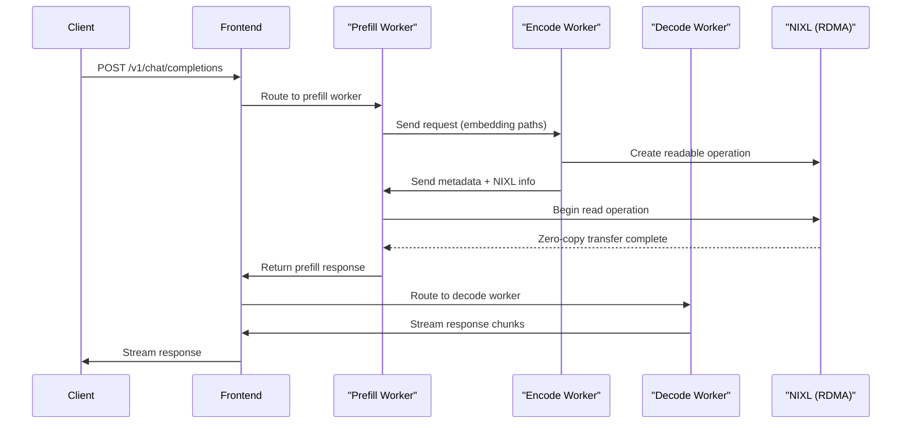

<!--
SPDX-FileCopyrightText: Copyright (c) 2025 NVIDIA CORPORATION & AFFILIATES. All rights reserved.
SPDX-License-Identifier: Apache-2.0
Licensed under the Apache License, Version 2.0 (the "License");
you may not use this file except in compliance with the License.
You may obtain a copy of the License at
http://www.apache.org/licenses/LICENSE-2.0
Unless required by applicable law or agreed to in writing, software
distributed under the License is distributed on an "AS IS" BASIS,
WITHOUT WARRANTIES OR CONDITIONS OF ANY KIND, either express or implied.
See the License for the specific language governing permissions and
limitations under the License.
-->

# Multimodal Support

TRTLLM supports multimodal models with dynamo. You can provide multimodal inputs in the following ways:

- By sending image URLs
- By providing paths to pre-computed embedding files

Please note that you should provide **either image URLs or embedding file paths** in a single request.

## Aggregated

Here are quick steps to launch Llama-4 Maverick BF16 in aggregated mode
```bash
cd $DYNAMO_HOME

export AGG_ENGINE_ARGS=./examples/backends/trtllm/engine_configs/llama4/multimodal/agg.yaml
export SERVED_MODEL_NAME="meta-llama/Llama-4-Maverick-17B-128E-Instruct"
export MODEL_PATH="meta-llama/Llama-4-Maverick-17B-128E-Instruct"
./launch/agg.sh
```
## Example Requests

### With Image URL

Below is an example of an image being sent to `Llama-4-Maverick-17B-128E-Instruct` model

Request :
```bash
curl localhost:8000/v1/chat/completions -H "Content-Type: application/json" -d '{
    "model": "meta-llama/Llama-4-Maverick-17B-128E-Instruct",
    "messages": [
        {
            "role": "user",
            "content": [
                {
                    "type": "text",
                    "text": "Describe the image"
                },
                {
                    "type": "image_url",
                    "image_url": {
                        "url": "https://huggingface.co/datasets/huggingface/documentation-images/resolve/main/diffusers/inpaint.png"
                    }
                }
            ]
        }
    ],
    "stream": false,
    "max_tokens": 160
}'
```
Response :

```
{"id":"unknown-id","choices":[{"index":0,"message":{"content":"The image depicts a serene landscape featuring a large rock formation, likely El Capitan in Yosemite National Park, California. The scene is characterized by a winding road that curves from the bottom-right corner towards the center-left of the image, with a few rocks and trees lining its edge.\n\n**Key Features:**\n\n* **Rock Formation:** A prominent, tall, and flat-topped rock formation dominates the center of the image.\n* **Road:** A paved road winds its way through the landscape, curving from the bottom-right corner towards the center-left.\n* **Trees and Rocks:** Trees are visible on both sides of the road, with rocks scattered along the left side.\n* **Sky:** The sky above is blue, dotted with white clouds.\n* **Atmosphere:** The overall atmosphere of the","refusal":null,"tool_calls":null,"role":"assistant","function_call":null,"audio":null},"finish_reason":"stop","logprobs":null}],"created":1753322607,"model":"meta-llama/Llama-4-Maverick-17B-128E-Instruct","service_tier":null,"system_fingerprint":null,"object":"chat.completion","usage":null}
```

## Disaggregated

Here are quick steps to launch in disaggregated mode.

The following is an example of launching a model in disaggregated mode. While this example uses `Qwen/Qwen2-VL-7B-Instruct`, you can adapt it for other models by modifying the environment variables for the model path and engine configurations.
```bash
cd $DYNAMO_HOME

export MODEL_PATH=${MODEL_PATH:-"Qwen/Qwen2-VL-7B-Instruct"}
export SERVED_MODEL_NAME=${SERVED_MODEL_NAME:-"Qwen/Qwen2-VL-7B-Instruct"}
export PREFILL_ENGINE_ARGS=${PREFILL_ENGINE_ARGS:-"examples/backends/trtllm/engine_configs/qwen2-vl-7b-instruct/prefill.yaml"}
export DECODE_ENGINE_ARGS=${DECODE_ENGINE_ARGS:-"examples/backends/trtllm/engine_configs/qwen2-vl-7b-instruct/decode.yaml"}
export MODALITY=${MODALITY:-"multimodal"}

./launch/disagg.sh
```

For a large model like `meta-llama/Llama-4-Maverick-17B-128E-Instruct`, a multi-node setup is required for disaggregated serving, while aggregated serving can run on a single node. This is because the model with a disaggregated configuration is too large to fit on a single node's GPUs. For instance, running this model in disaggregated mode requires a setup of 2 nodes with 8xH200 GPUs or 4 nodes with 4xGB200 GPUs.

In general, disaggregated serving can run on a single node, provided the model fits on the GPU. The multi-node requirement in this example is specific to the size and configuration of the `meta-llama/Llama-4-Maverick-17B-128E-Instruct` model.

To deploy `Llama-4-Maverick-17B-128E-Instruct` in disaggregated mode, you will need to follow the multi-node setup instructions, which can be found [here](./multinode/multinode-multimodal-example.md).

## Pre-computed Embeddings with EPD Flow

For high-performance multimodal inference, Dynamo supports pre-computed embeddings with an **Encode-Prefill-Decode (EPD)** flow using **NIXL (RDMA)** for zero-copy tensor transfer.

### Enabling the Feature

This is an experimental feature that requires using a specific TensorRT-LLM commit.
To enable it build the dynamo container with the `--tensorrtllm-commit` flag:

```bash
./container/build.sh --framework trtllm --tensorrtllm-git-url https://github.com/NVIDIA/TensorRT-LLM.git --tensorrtllm-commit v1.2.0rc3
```

### Supported File Types

- `.pt` - PyTorch tensor files
- `.pth` - PyTorch checkpoint files
- `.bin` - Binary tensor files

### How to Launch

```bash
cd $DYNAMO_HOME/examples/backends/trtllm

# Launch 3-worker EPD flow with NIXL
./launch/epd_disagg.sh
```

> **Note:** This script is designed for 8-node H200 with `Llama-4-Scout-17B-16E-Instruct` model and assumes you have a model-specific embedding file ready.

### Configuration

```bash
# Encode endpoint for Prefill → Encode communication
export ENCODE_ENDPOINT="dyn://dynamo.tensorrt_llm_encode.generate"

# Security: Allowed directory for embedding files (default: /tmp)
export ALLOWED_LOCAL_MEDIA_PATH="/tmp"

# Security: Max file size to prevent DoS attacks (default: 50MB)
export MAX_FILE_SIZE_MB=50
```

### Example Request

```bash
curl localhost:8000/v1/chat/completions -H "Content-Type: application/json" -d '{
    "model": "meta-llama/Llama-4-Maverick-17B-128E-Instruct",
    "messages": [
        {
            "role": "user",
            "content": [
                {"type": "text", "text": "Describe the image"},
                {"type": "image_url", "image_url": {"url": "/path/to/embedding.pt"}}
            ]
        }
    ],
    "max_tokens": 160
}'
```

### Architecture

The EPD flow implements a **3-worker architecture**:

- **Encode Worker**: Loads pre-computed embeddings, transfers via NIXL
- **Prefill Worker**: Receives embeddings, handles context processing and KV-cache generation
- **Decode Worker**: Performs streaming token generation

### Request Flow



## Supported Multimodal Models

Multimodal models listed in [TensorRT-LLM supported models](https://github.com/NVIDIA/TensorRT-LLM/blob/main/docs/source/models/supported-models.md) are supported by Dynamo.
