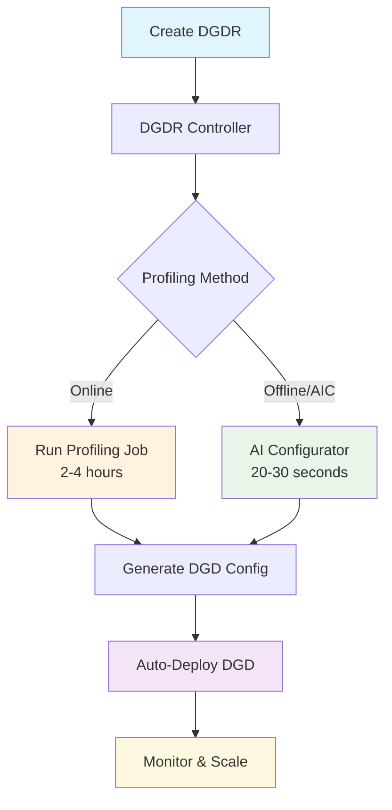
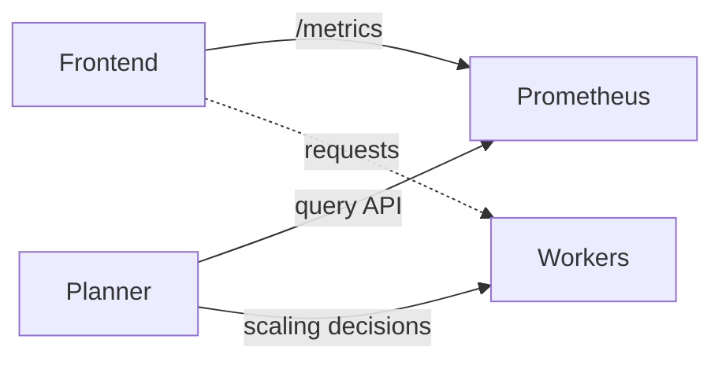

<!--
SPDX-FileCopyrightText: Copyright (c) 2024-2026 NVIDIA CORPORATION & AFFILIATES.
All rights reserved.
SPDX-License-Identifier: Apache-2.0
-->

# Planner Guide

Deployment, configuration, and integration guide for the Dynamo SLA Planner. For a quick overview, see the [Planner README](README.md). For architecture internals, see [Planner Design](/docs/design_docs/planner_design.md).

## Deployment

### Prerequisites

Before deploying the planner, ensure:

- **Dynamo platform installed** with the operator running (see [Installation Guide](/docs/kubernetes/installation_guide.md))
- **[kube-prometheus-stack](/docs/kubernetes/observability/metrics.md) installed and running** (required for SLA planner metric collection)
- **Image pull secrets configured** if using private registries (typically `nvcr-imagepullsecret` for NVIDIA images)
- **Sufficient GPU resources** available in your cluster for profiling
- **Runtime images available** that contain both profiler and runtime components

### Container Images

Each DGDR requires container images for the profiling and deployment process:

**profilingConfig.profilerImage** (Required):
The container image used for the profiling job. Must contain the profiler code and dependencies for SLA-based profiling.

**deploymentOverrides.workersImage** (Optional):
The container image used for DGD worker components (frontend, workers, planner). Used for:
- Temporary DGDs created during online profiling (for performance measurements)
- The final DGD deployed after profiling completes

If `workersImage` is omitted, the image from the base config file (e.g., `disagg.yaml`) is used. Public images are available from 0.6.1 onward.

```yaml
spec:
  profilingConfig:
    profilerImage: "nvcr.io/nvidia/ai-dynamo/vllm-runtime:0.6.1"
  deploymentOverrides:
    workersImage: "nvcr.io/nvidia/ai-dynamo/vllm-runtime:0.6.1"  # Optional
```

### What is a DynamoGraphDeploymentRequest (DGDR)?

A **DGDR** is a Kubernetes Custom Resource that serves as the primary interface for deploying models with specific performance and resource constraints. It specifies:

- **What** model to deploy (`model`)
- **How** it should perform (SLA targets: `ttft`, `itl`)
- **Where** it should run (optional GPU preferences)
- **Which** backend to use (`backend`: vllm, sglang, or trtllm)
- **Which** images to use (`profilingConfig.profilerImage`, `deploymentOverrides.workersImage`)

The Dynamo Operator watches for DGDRs and automatically:
1. Discovers available GPU resources in your cluster
2. Runs profiling (online or offline) to find optimal configurations
3. Generates an optimized DynamoGraphDeployment (DGD) configuration
4. Deploys the DGD to your cluster

**Key Benefits:**
- **Declarative**: Specify what you want, not how to achieve it
- **Automated**: No manual profiling job setup or result processing
- **SLA-Driven**: Ensures deployments meet your performance requirements
- **Integrated**: Works seamlessly with the Dynamo Operator

### DGDR Workflow

The DGDR workflow automates the entire process from SLA specification to deployment:

1. **Define SLAs**: Specify performance requirements (TTFT, ITL) and model information
2. **Automatic Profiling**: The operator profiles your model to find optimal configurations
3. **Auto-Deploy**: The system deploys the optimal configuration that meets your SLAs



### Monitoring Progress

Watch DGDR status:

```bash
# View status
kubectl get dgdr -n $NAMESPACE

# Detailed status
kubectl describe dgdr sla-aic -n $NAMESPACE

# Watch profiling job logs
kubectl logs -f job/profile-sla-aic -n $NAMESPACE
```

**DGDR Status States:**
- `Pending`: Initial state, preparing to profile
- `Profiling`: Running profiling job (20-30 seconds for AIC, 2-4 hours for online)
- `Deploying`: Generating and applying DGD configuration
- `Ready`: DGD successfully deployed and running
- `Failed`: Error occurred (check events for details)

### Relationship to DGD

- **DGDR**: High-level "intent" -- what you want deployed
- **DGD**: Low-level "implementation" -- how it's deployed

The DGDR controller generates a DGD that:
- Uses optimal TP configurations from profiling
- Includes the SLA planner for autoscaling
- Has deployment and engine settings tuned for your SLAs

The generated DGD is tracked via labels:
```yaml
metadata:
  labels:
    dgdr.nvidia.com/name: sla-aic
    dgdr.nvidia.com/namespace: your-namespace
```

## Configuration

### DGDR Configuration

#### Required Fields

| Field | Type | Description |
|-------|------|-------------|
| `spec.model` | string | Model identifier (e.g., `meta-llama/Llama-3-70b`) |
| `spec.backend` | enum | Inference backend: `vllm`, `sglang`, or `trtllm` |
| `spec.profilingConfig.profilerImage` | string | Container image for profiling job |
| `spec.profilingConfig.config.sla` | object | SLA targets (isl, osl, ttft, itl) |

#### Optional Fields

| Field | Type | Description |
|-------|------|-------------|
| `spec.deploymentOverrides.workersImage` | string | Container image for DGD workers. If omitted, uses image from base config. |
| `spec.autoApply` | boolean | Automatically deploy DGD after profiling (default: false) |
| `spec.useMocker` | boolean | Deploy mocker instead of real backend (default: false) |
| `spec.deploymentOverrides` | object | Customize metadata and image for auto-created DGD |

#### SLA Configuration

```yaml
sla:
  isl: 3000      # Average input sequence length (tokens)
  osl: 150       # Average output sequence length (tokens)
  ttft: 200      # Target Time To First Token (milliseconds, float)
  itl: 20        # Target Inter-Token Latency (milliseconds, float)
```

**Choosing SLA Values:**
- **ISL/OSL**: Based on your expected traffic patterns
- **TTFT**: First token latency target (lower = more GPUs needed)
- **ITL**: Token generation latency target (lower = more GPUs needed)
- **Trade-offs**: Tighter SLAs require more GPU resources

For comprehensive documentation of all configuration options, see the [DGDR Configuration Reference](/docs/components/profiler/profiler_guide.md#dgdr-configuration-reference).

### Profiling Methods

Choose between **online profiling** (real measurements, 2-4 hours) or **offline profiling** with AI Configurator (estimated, 20-30 seconds):

```yaml
# Online Profiling (Default)
sweep:
  useAiConfigurator: false

# Offline Profiling (AI Configurator)
sweep:
  useAiConfigurator: true
  aicSystem: h200_sxm
  aicHfId: Qwen/Qwen3-32B
  aicBackendVersion: "0.20.0"
```

For detailed comparison, supported configurations, and limitations, see [SLA-Driven Profiling Documentation](/docs/components/profiler/profiler_guide.md#profiling-methods).

### Load Predictors

The SLA planner forecasts the number of requests, ISL, and OSL in the next adjustment interval. Four prediction models are supported:

#### Constant Predictor
- **Use case**: Stable workloads with long prediction intervals
- **Behavior**: Assumes next load equals current load
- **Configuration**: `load-predictor: "constant"`

#### ARIMA Predictor
- **Use case**: Time-series data with trends and seasonality
- **Behavior**: Uses auto-ARIMA to fit optimal model parameters
- **Configuration**: `load-predictor: "arima"`
- **Tunable parameters**:
  - `--load-predictor-log1p`: model `log1p(y)` instead of `y`. If not set, ARIMA starts in raw space, and if it collapses to `(0,d,0)`, it falls back to `log1p` automatically.

#### Kalman Predictor
- **Use case**: Low-latency online forecasting (observe 1 -> predict 1) with smooth adaptation
- **Behavior**: Local linear trend Kalman filter (fast online updates; good default when ARIMA collapses to mean-only)
- **Configuration**: `load-predictor: "kalman"`
- **Tunable parameters**:
  - `--kalman-q-level`: process noise for level (higher = more responsive)
  - `--kalman-q-trend`: process noise for trend (higher = trend changes faster)
  - `--kalman-r`: measurement noise (lower = trusts new measurements more)
  - `--kalman-min-points`: minimum points before forecasting
  - `--load-predictor-log1p`: model `log1p(y)` instead of `y` (often helps request-rate/count series)

#### Prophet Predictor
- **Use case**: Complex seasonal patterns and trend changes
- **Behavior**: Facebook's [Prophet](https://facebook.github.io/prophet/) model for time-series forecasting
- **Configuration**: `load-predictor: "prophet"`
- **Tunable parameters**:
  - `--prophet-window-size`: bounds internal history to control refit cost
  - `--load-predictor-log1p`: model `log1p(y)` instead of `y`

#### Warm-starting Load Predictors (Optional)

You can warm-start load predictors with a mooncake-style JSONL trace file:

- **CLI argument**: `--load-predictor-warmup-trace <path/to/trace.jsonl>`
- **Effect**: preloads predictors with historical request-count / ISL / OSL samples extracted from the trace

### Planner Scaling Parameters

| Argument | Default | Description |
|----------|---------|-------------|
| `--adjustment-interval` | `180` | Seconds between scaling decisions |
| `--ttft` | `500.0` | Target Time To First Token (ms) |
| `--itl` | `50.0` | Target Inter-Token Latency (ms) |
| `--isl` | `3000` | Expected average input sequence length |
| `--osl` | `150` | Expected average output sequence length |
| `--max-gpu-budget` | `8` | Maximum GPUs across all workers |
| `--min-endpoint` | `1` | Minimum replicas per worker type |
| `--decode-engine-num-gpu` | `1` | GPUs per decode engine |
| `--prefill-engine-num-gpu` | `1` | GPUs per prefill engine |
| `--no-operation` | `false` | Observation mode (no actual scaling) |
| `--no-correction` | `false` | Disable correction factors |

#### Planner Configuration Passthrough

Add planner-specific settings in the DGDR:

```yaml
profilingConfig:
  config:
    planner:
      plannerMinEndpoint: 2
```

## Integration

### Prometheus Setup

The planner queries Prometheus to collect frontend request metrics. The architecture:



**Components:**
- **Frontend**: Serves requests and exposes `/metrics`
- **Prometheus**: Scrapes frontend metrics every 5s (configurable in podmonitor manifest)
- **Planner**: Queries Prometheus and adjusts worker scaling every adjustment interval
- **Workers**: Prefill and backend workers handle inference

The planner requires a frontend that reports metrics at the `/metrics` HTTP endpoint with request count, ISL, OSL, TTFT, and ITL in the correct format. The Dynamo frontend provides these metrics automatically.

**Prometheus endpoint configuration:**

| Variable | Default |
|----------|---------|
| `PROMETHEUS_ENDPOINT` | `http://prometheus-kube-prometheus-prometheus.monitoring.svc.cluster.local:9090` |

If you see errors like "Failed to resolve prometheus service", ensure `PROMETHEUS_ENDPOINT` points to your Prometheus service.

### Virtual Deployment

The SLA planner supports virtual deployment mode for customized environments (e.g., custom orchestrators) through the `VirtualConnector`. This connector enables the planner to communicate scaling decisions without directly managing Kubernetes resources.

The `VirtualConnector` acts as a bridge between the SLA planner and external deployment environments. Instead of PATCHing DGD resources, it writes scaling decisions and waits for the external environment to acknowledge completion.

#### Scaling Decision Flow

1. **Decision Generation**: The planner calculates optimal worker counts
2. **Change Detection**: Skips scaling if target counts match current counts, logging: `"No scaling needed (prefill=X, decode=Y)"`
3. **Readiness Check**: Verifies previous scaling operations completed by checking `scaled_decision_id >= decision_id`
4. **Timeout Handling**: If not acknowledged within 30 minutes (1800 seconds), proceeds with new decisions
5. **Completion Tracking**: Optionally waits for scaling completion confirmation (blocking mode)

#### Configuration

To use virtual deployment mode:

```yaml
environment: "virtual"
backend: "vllm"  # or "sglang"
```

#### Deployment Environment Requirements

The external deployment environment must use `VirtualConnectorClient`:

```python
from dynamo._core import DistributedRuntime, VirtualConnectorClient

client = VirtualConnectorClient(distributed_runtime, namespace)
```

1. **Monitor Planner**: Continuously watch for scaling decisions: `await client.wait()` (blocks until change)
2. **Parse Decisions**: Read values: `decision = await client.get()`
3. **Execute Scaling**: Apply the scaling decisions to your infrastructure
4. **Acknowledge Completion**: Mark done: `await client.complete(decision)`

A scaling decision (returned by `client.get()`) contains:
- `num_prefill_workers`: Target number of prefill workers (-1 if not set)
- `num_decode_workers`: Target number of decode workers (-1 if not set)
- `decision_id`: Incremental ID for each scaling decision

See `components/planner/test/test_virtual_connector.py` for a full example.

### Grafana Dashboard

Deploy the planner Grafana dashboard:

```bash
kubectl apply -n monitoring -f deploy/observability/k8s/grafana-planner-dashboard-configmap.yaml
```

Follow [Dynamo Metrics Collection on Kubernetes](/docs/kubernetes/observability/metrics.md) to access the Grafana UI and select the **Dynamo Planner Dashboard**.

The dashboard displays:
- **Worker Counts & GPU Usage**: Current prefill/decode worker counts and cumulative GPU hours
- **Observed Metrics**: Real-time TTFT, ITL, request rate, and sequence lengths from Prometheus
- **Predicted Metrics**: Planner's load predictions and recommended replica counts
- **Correction Factors**: How the planner adjusts predictions based on observed vs expected performance

> Use the **Namespace** dropdown at the top of the dashboard to filter metrics for your deployment namespace.

## DGDR Immutability

DGDRs are **immutable**. To update SLAs or configuration:

1. Delete the existing DGDR: `kubectl delete dgdr sla-aic`
2. Create a new DGDR with updated specifications

## Manual Deployment Control

### Option 1: Use DGDR-Generated Configuration (Recommended)

Disable auto-deployment to review the generated DGD before applying:

```yaml
spec:
  autoApply: false
```

Then manually extract and apply:

```bash
# Extract generated DGD from DGDR status
kubectl get dgdr sla-aic -n $NAMESPACE -o jsonpath='{.status.generatedDeployment}' | kubectl apply -f -

# Or save to file first for review/modification
kubectl get dgdr sla-aic -n $NAMESPACE -o jsonpath='{.status.generatedDeployment}' > my-dgd.yaml
vi my-dgd.yaml
kubectl apply -f my-dgd.yaml -n $NAMESPACE
```

### Option 2: Use Standalone Planner Templates (Advanced)

For advanced use cases, use the standalone planner templates in `examples/backends/*/deploy/disagg_planner.yaml`:

```bash
# After profiling completes, profiling data is stored in ConfigMaps
kubectl get configmap dgdr-output-<dgdr-name> -n $NAMESPACE -o yaml
kubectl get configmap planner-profile-data -n $NAMESPACE -o yaml

# Update PROMETHEUS_ENDPOINT in the template, then deploy
kubectl apply -f examples/backends/<backend>/deploy/disagg_planner.yaml -n $NAMESPACE
```

## Accessing Profiling Artifacts

By default, profiling jobs save essential data to ConfigMaps. For detailed artifacts, configure the DGDR to use `dynamo-pvc`:

**ConfigMaps (always created):**
- Generated DGD configuration
- Profiling data for Planner (`.json` files)

**PVC (optional):**
- Performance plots (PNGs)
- DGD configuration and logs for each profiled deployment
- AIPerf profiling artifacts
- Raw profiling data (`.npz` files)
- Profiler log

```bash
# Setup PVC
deploy/utils/setup_benchmarking_resources.sh

# Access results after profiling
kubectl apply -f deploy/utils/manifests/pvc-access-pod.yaml -n $NAMESPACE
kubectl wait --for=condition=Ready pod/pvc-access-pod -n $NAMESPACE --timeout=60s
kubectl cp $NAMESPACE/pvc-access-pod:/data ./profiling-results
kubectl delete pod pvc-access-pod -n $NAMESPACE
```

## Troubleshooting

### Quick Diagnostics

```bash
# Check DGDR status and events
kubectl describe dgdr sla-aic -n $NAMESPACE

# Check operator logs
kubectl logs -n $NAMESPACE -l app.kubernetes.io/name=dynamo-operator --tail=100

# Check profiling job logs
kubectl logs -l job-name=profile-sla-aic -n $NAMESPACE
```

### Common Issues

| Issue | Quick Fix |
|-------|-----------|
| **DGDR stuck in Pending** | Check GPU availability: `kubectl get nodes -o jsonpath='{.items[*].status.allocatable.nvidia\.com/gpu}'` |
| **Image pull errors** | Verify secret exists: `kubectl get secret nvcr-imagepullsecret -n $NAMESPACE` |
| **Profiling fails** | Check job logs: `kubectl logs -l job-name=profile-sla-aic -n $NAMESPACE` |
| **SLA cannot be met** | Relax TTFT/ITL targets or add more GPUs |
| **DGD not deployed** | Verify `autoApply: true` in DGDR spec |
| **Prometheus errors** | Ensure `PROMETHEUS_ENDPOINT` env var points to your Prometheus service |

For comprehensive troubleshooting including AI Configurator constraints, performance debugging, and backend-specific issues, see [SLA-Driven Profiling Troubleshooting](/docs/components/profiler/profiler_guide.md#troubleshooting).

## Related Documentation

- [Planner README](README.md) -- Overview and quick start
- [Planner Examples](planner_examples.md) -- DGDR YAML examples and sample configurations
- [Planner Design](/docs/design_docs/planner_design.md) -- Architecture deep-dive for contributors
- [DGDR API Reference](/docs/kubernetes/api_reference.md)
- [Pre-Deployment Profiling](/docs/components/profiler/profiler_guide.md)
- [Dynamo Operator Guide](/docs/kubernetes/dynamo_operator.md)
