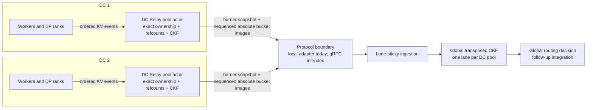

**Experimental.** NVIDIA Dynamo includes the DC-local Relay, Cuckoo-filter publication protocol,
and global consumer data structure. The current end-to-end integration uses an in-process adapter.
Non-local gRPC transport and cross-DC request forwarding remain follow-up integration work.

Multi-DC KV routing needs a compact answer to this question: which data center is likely to have
the longest reusable prefix for a request? Sending every worker's full KV event stream to a global
router would duplicate exact ownership state across the wide-area boundary. The DC KV Relay
instead resolves exact events locally and publishes a lossy, read-optimized Cuckoo-filter (CKF)
projection.

## Architecture



The architecture separates mutation semantics from global search:

- The **DC Relay** discovers KV-event publishers and supervises one actor-owned CKF producer for
  each local pool.
- The **producer** owns exact member state, full-hash refcounts, the mutable CKF, dirty tracking,
  publication sequence, and barrier snapshots.
- The **protocol boundary** carries a full snapshot followed by sequenced deltas containing
  absolute images of changed packed buckets.
- The **global consumer** stores the same logical CKF layout transposed across DC lanes for
  concurrent prefix queries.
- A future **global router** resolves the selected pool to a serving endpoint and forwards the
  request. Native runtime endpoint identity is not part of the CKF wire identity.

## Domains, pools, and lanes

An indexer domain identifies caches that may be compared as one logical routing namespace. It
combines cache semantics, such as compatible event hashing and KV block size, with an isolation
scope. Deployments can use explicit identity material; otherwise Dynamo derives the identity from
the current deployment metadata and warns when a multi-DC join relies on defaults.

A pool adds one stable logical DC to that domain:

```text
PoolId = (IndexerDomainId, DcId)
```

A pool is exactly one DC-local producer and publication stream. `DcId` stays stable across Relay
restarts, scaling, endpoint replacement, and producer generations. It is not a runtime endpoint
identifier and has meaning only within its indexer domain.

One global CKF consumer is scoped to one indexer domain. Its lanes are distinct pools, normally one
per DC. The manifest rejects mixed domains, duplicate pools, and duplicate DC lanes. Query results
identify pools; the runtime resolves those pools to serving endpoints afterward.

## What the Relay aggregates

KV events identify a member by worker and data-parallel rank and carry full block hashes. For each
pool, the Relay records the exact hashes owned by every member and a DC-wide refcount for each full
hash.

| Ownership change | Relay behavior |
| --- | --- |
| First owner of a full hash | Insert one CKF fingerprint |
| Another owner of the same full hash | Increment the refcount only |
| One of several owners removes it | Decrement the refcount only |
| Final owner removes it | Remove one CKF fingerprint |

This gives one CKF contribution per distinct full hash, independent of how many workers or ranks
own it. Two different full hashes can map to the same CKF representation; the Relay still preserves
their physical multiplicity. An unknown `(member, full_hash)` removal is a no-op and never deletes
state merely because a fingerprint matches.

The exact state is authoritative. The CKF is probabilistic and can return false positives. Under
capacity pressure, a failed insertion is also allowed to remain an observable omission, which can
produce a stable false negative for that block while the Relay continues processing other events.

## Why two publication stages use different data

The two stages solve different recovery and distribution problems.

### Stage 1: worker KV events into the DC Relay

Within a DC, ordered KV events carry full hashes and exact ownership changes. The Relay uses the
same worker-query recovery framework as the normal Dynamo indexer:

1. Each `(worker, dp_rank)` source has an ordered event stream and generation fence.
2. Small gaps can be recovered from the worker's event history.
3. Initial discovery, old gaps, or source replacement can install the worker's current tree state.
4. Rank reset and replacement are completion barriers before events from a new source generation
   become active.

This stage must retain full hashes. A CKF fingerprint can collide and has no owner identity, so it
cannot prove which exact edge a remove intended to delete. Moving only fingerprints into the Relay
would make safe removal and shared-owner refcounting impossible. Moving all exact ownership into
the global consumer would defeat DC-local aggregation.

### Stage 2: pool bucket images into the global consumer

After applying exact mutations, the Relay publishes only the resulting CKF projection:

- A **barrier snapshot** contains every packed bucket and the producer's terminal publication
  sequence.
- A **delta** contains a contiguous sequence pair and absolute `u64` images for buckets dirtied
  since an earlier publication.
- A **lease** binds the stream to one consumer instance and physical lane.

Absolute images make delivery idempotent at the bucket level and keep the global side independent
of the producer's relocation choices. Sequence numbers detect missing or reordered batches; they
do not count events or make a multi-bucket update atomic.

The intended non-local integration runs this protocol over gRPC. A connection or lane failure
retires the old lease. Reconnection creates a new lease, installs a fresh barrier snapshot, and
then resumes with the next contiguous delta. The current in-process adapter exercises the same
assignment, snapshot, delta, drain, and resnapshot state machines without a network transport.

## Two CKF roles

The producer and consumer share addressing and packed-bucket format, but their layouts and
concurrency differ.

| Role | Layout and ownership | Purpose |
| --- | --- | --- |
| DC producer | One ordinary packed table owned by one Relay actor | Apply exact mutations, refcounts, relocation, dirty tracking, and snapshots |
| Global consumer | Bucket-major transposed table with one atomic packed word per lane | Search the same candidate buckets across as many as 16 DC pools |

The producer actor serializes complete commands. Each publication batch is sampled after a
complete event, rank clear, or relocation, although one batch can coalesce several commands.

On the consumer, one lane-sticky ingestion worker serializes snapshots, deltas, and drain markers
for a lane. Different lanes and queries can run concurrently. Each packed bucket is atomic as one
`u64`, but a live query can observe a mixture while several bucket images are being applied. The
consumer intentionally does not use a lane-wide lock, reader retry, seqlock, or double buffer.

## Failure and recovery boundaries

Failures recover at the narrowest state boundary whose completion is uncertain:

- A worker event gap or source replacement recovers that worker rank into the Relay producer.
- Suspect exact producer state rebuilds the pool's producer generation.
- A delivery gap or uncertain publisher stream retires the affected consumer lane and installs a
  new barrier snapshot from the still-authoritative producer.
- A malformed or partially applied consumer update recovers only the consumer lane.
- A pre-commit CKF capacity omission is reported but does not trigger producer or consumer
  recovery.

While a lane is retired, queries exclude it from new results. A query that already captured the
old ready set may finish under the documented weak-read contract.

## Current component scope

Start one Relay process with a control-plane-stable DC name:

```bash
python -m dynamo.kv_dc_relay --dc-id <stable-dc-id>
```

The Relay discovers compatible local endpoints, consumes their KV events, and exposes health.
Diagnostic builds can also expose aggregation and producer-snapshot information. The component
does not proxy inference requests, and its diagnostic snapshot endpoint is not the cross-DC
publication protocol.

For component flags and endpoint behavior, see the
[DC KV Relay README](https://github.com/ai-dynamo/dynamo/tree/main/components/src/dynamo/kv_dc_relay).
