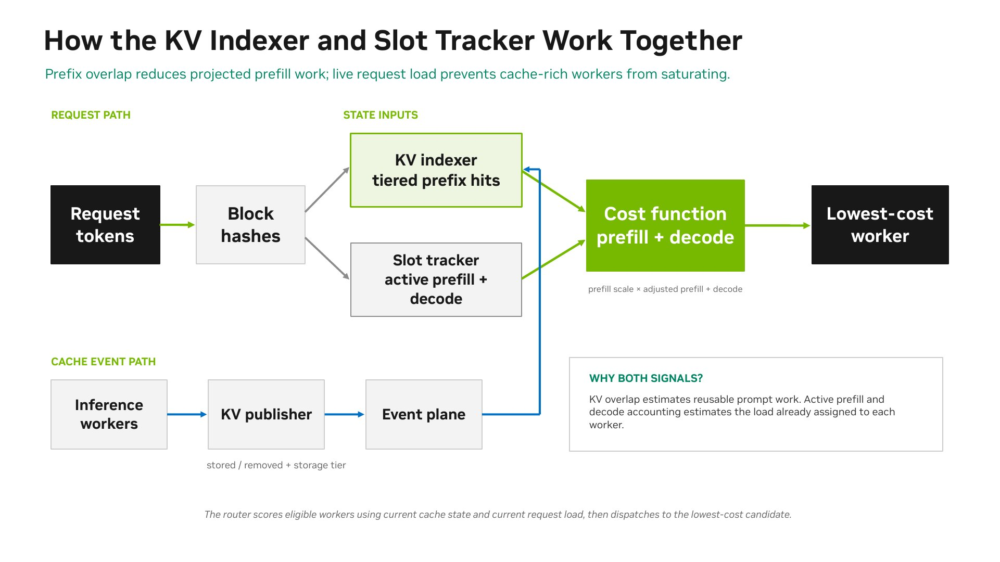
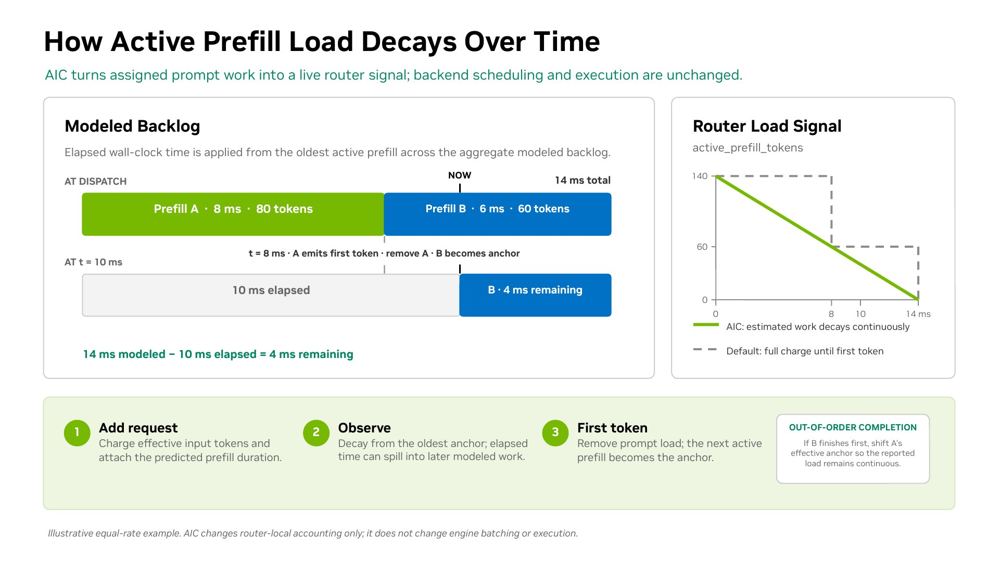

This page explains how the Dynamo router evaluates workers, chooses a target, and fits into the request path. For CLI flags and tuning knobs, see [Configuration and Tuning](router-configuration.md).

## KV Cache Routing

KV cache routing optimizes large language model inference by directing requests using both reusable cache state and projected active load. Cache reuse reduces redundant prompt computation, while live prefill and decode accounting prevents cache-rich workers from becoming overloaded.

KV cache reuse introduces complexity to LLM serving load balancing. While it can significantly reduce computation costs, routing strategies that ignore worker-specific KV states can lead to:
- Missed cache reuse opportunities due to suboptimal worker selection
- System throughput degradation from uneven request distribution across workers

## Cost Calculation



The cost function combines two worker-specific projections:

- **Prefill cost**: Active prompt work already assigned to the worker plus the incoming request's uncached prompt work. Device, host, disk, and shared-cache hits reduce this cost according to their configured credits.
- **Decode cost**: Active KV blocks already assigned to the worker plus the blocks projected for the incoming request.

```text
raw_prefill_blocks = active_prefill_blocks + incoming_prompt_blocks
adjusted_prefill_blocks = max(raw_prefill_blocks - overlap_credit_blocks, 0)
decode_blocks = active_decode_blocks + incoming_active_blocks
cost = prefill_load_scale * adjusted_prefill_blocks + decode_blocks
```

`overlap_credit_blocks` combines the configured device, host, disk, and shared-cache credits. `overlap_score_credit_decay` can reduce the device-local portion when a cache-rich worker has excess active prefill load. The router selects the lowest-cost eligible worker. For exact tuning behavior, see [Configuration and Tuning](router-configuration.md#tuning-guidelines).

### Active Load Modeling

The prefill and decode projections include load from the incoming request plus active load already assigned to each worker.

#### Prefill Load Modeling

For prefill load, the router estimates each candidate worker's uncached prompt work by subtracting its cached prefix tokens from the request's input tokens.

By default, that effective prefill load remains charged at full value until the first output token marks prefill complete. With `--router-prefill-load-model aic`, the router also asks [AIConfigurator (AIC)](../../features/disaggregated-serving/aiconfigurator.md) for an expected prefill duration using the effective ISL and cached prefix length. The active load tracker uses the oldest active prefill as a time anchor and applies elapsed time to the worker's aggregate modeled prefill backlog. When the oldest request completes, the next active prefill becomes the anchor. If a modeled non-anchor request completes first, the tracker adjusts the anchor to keep the reported load continuous.



This model changes router-side prompt load accounting only; it does not change backend batching or execution.

#### Decode Load Modeling

For decode load, the router tracks active KV blocks assigned to each worker. By default, this covers the prompt-side blocks that are already assigned to active requests and frees them when each request finishes.

When `--router-track-output-blocks` is enabled, the router also adds placeholder output blocks as generation crosses block boundaries. If the request includes `nvext.agent_hints.osl`, those output blocks receive a fractional weight based on progress toward the expected output length. This expected OSL proxy lets requests near completion contribute less future decode load. Without an expected OSL, tracked output blocks count at full weight until the request finishes.

For the flags that enable these models, see [Configuration and Tuning](router-configuration.md).

## Worker Selection

The router selects the worker with the lowest cost. When `router_temperature` is set to a non-zero value, the router uses softmax sampling on the normalized cost logits to introduce randomness in the selection, which can help with load distribution.

Before scoring, the router filters candidates by request allow-lists, exact pins, DP-rank bounds, required taints, and busy-threshold overload state. For those hard eligibility rules, see [Router Filtering](router-filtering.md).

When requests wait in policy-class queues, weighted
[Deficit Round Robin Queue Scheduling](deficit-round-robin.md) selects the
physical class to dispatch before worker scoring runs.

## Using the KV Cache Router

To enable KV cache-aware routing, start the frontend node like this:

```bash
python -m dynamo.frontend --router-mode kv
```

When KV blocks are created or removed, the engine notifies the Dynamo router, which then identifies the worker with the best matching blocks and routes traffic accordingly.

To evaluate the benefits of KV-aware routing, compare your workload's performance using `--router-mode random|round-robin` against KV-aware routing.

For detailed CLI arguments and advanced configuration options, see [Configuration and Tuning](router-configuration.md).

## Basic Routing

Dynamo supports several routing strategies when sending requests from one component to another component's endpoint.

First, create a client tied to a component endpoint. Here we get a client tied to the `generate` endpoint of the `VllmWorker` component.

```python
client = runtime.endpoint("dynamo.VllmWorker.generate").client()
```

You can then use the default routing methods exposed by the client class to send requests to the `VllmWorker` component.

- **Random routing**: Default strategy, available via `client.generate()` or `client.random()`
- **Round-robin routing**: Cycles through available workers via `client.round_robin()`
- **Direct routing**: Explicitly targets a specific worker via `client.direct(input, component_id)`
- **Least-loaded routing**: Routes to the worker with fewest active connections via `--router-mode least-loaded`
- **Device-aware weighted routing**: Routes using CPU/non-CPU ratio budgeting plus least-loaded selection within the selected device group via `--router-mode device-aware-weighted`
KV cache routing uses direct routing with a special worker selection algorithm.

For benchmarking KV router performance, see the [KV Router A/B Benchmarking Guide](../../benchmarks/kv-router-ab-testing.md).
For custom routing logic and advanced patterns, see [Routing Patterns](router-examples.md#routing-patterns).

## Device-Aware Weighted Routing

`device-aware-weighted` is designed for heterogeneous fleets where CPU and non-CPU workers share the same endpoint. Instead of comparing raw in-flight counts, the router compares a capability-normalized load across the CPU and non-CPU groups, then selects the least-loaded worker within the winning group.

```text
normalized_load = total_inflight(group) / (instance_count(group) x throughput_weight)
```

The throughput weight is `1` for CPU workers and `DYN_ENCODER_CUDA_TO_CPU_RATIO` for non-CPU workers. This lets the router route proportionally to device capability instead of permanently starving slower devices.

A full multimodal embedding-cache hit bypasses the CPU-to-non-CPU ratio. The router instead selects the least-loaded worker among those that hold every distinct cache key in the request. Partial hits continue through the weighted group selection. See [Embedding Cache](../../features/multimodal/embedding-cache.md#cache-aware-routing).

When only one device class is present, the behavior degenerates to standard least-loaded routing.
