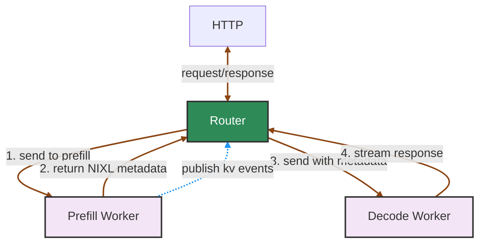

Dynamo supports disaggregated serving where prefill (prompt processing) and decode (token generation) are handled by separate worker pools. When you register workers with `ModelType.Prefill`, the frontend automatically detects them and activates an internal prefill router.

For the high-level deployment matrix, see [Router Guide](router-guide.md). For the router flags used in this setup, see [Configuration and Tuning](router-configuration.md).

If prefill and decode workers span topology domains such as zones or racks, use [Topology-Aware KV Transfer](topology-aware-kv-transfer.md) to constrain or bias decode routing toward workers in the selected prefill worker's transfer domain.

## Automatic Prefill Router Activation

The prefill router is automatically created when:
1. A decode model is registered, for example via `register_model()` with `ModelType.Chat | ModelType.Completions`.
2. A prefill worker is detected with the same model name and `ModelType.Prefill`.

Key characteristics of the prefill router:
- **Always disables active block tracking** (`track_active_blocks=false`) since prefill workers do not perform decode.
- **Seamlessly integrates** into the request pipeline between preprocessing and decode routing.
- **Falls back gracefully** to decode-only mode if prefill fails or no prefill workers are available.

Key characteristics of the decode routing stage in disaggregated mode:
- **Disables overlap scoring** (`overlap_score_credit=0`) because decode routing should not chase prefix reuse.
- **Disables KV reuse assumption** (`assume_kv_reuse=false`) unless the backend can truly deduplicate transferred blocks.
- **Disables prefill-token tracking** (`track_prefill_tokens=false`) so decode-side load reflects decode work rather than already-completed prompt work.

## Setup Example

When both workers are registered, requests are automatically routed.

```python
# Decode worker registration (in your decode worker)
decode_endpoint = runtime.endpoint("dynamo.decode.generate")

await register_model(
    model_input=ModelInput.Tokens,
    model_type=ModelType.Chat | ModelType.Completions,
    endpoint=decode_endpoint,
    model_name="meta-llama/Llama-2-7b-hf",
    # ... other parameters
)

await decode_endpoint.serve_endpoint(decode_handler.generate)

# Prefill worker registration (in your prefill worker)
prefill_endpoint = runtime.endpoint("dynamo.prefill.generate")

await register_model(
    model_input=ModelInput.Tokens,
    model_type=ModelType.Prefill,
    endpoint=prefill_endpoint,
    model_name="meta-llama/Llama-2-7b-hf",
    # ... other parameters
)

await prefill_endpoint.serve_endpoint(prefill_handler.generate)
```

>[!Note]
> The automatic disaggregated routing setup described here is currently supported by the integrated `dynamo.frontend` path. It is not provided as a single turnkey mode by the standalone Python router (`python -m dynamo.router`). If you build this topology with standalone routers, you must launch and connect the prefill and decode routing stages yourself and handle request handoff, including the `disaggregated_params` returned by prefill. For an advanced reference, see the [Global Router](https://github.com/ai-dynamo/dynamo/tree/main/components/src/dynamo/global_router), which composes local prefill and decode router pools explicitly.

## Request Flow

The following diagram shows an overview of the major components in disaggregated serving:



When topology-aware KV transfer is enabled, the prefill router also derives decode `RoutingConstraints` from the selected prefill worker's runtime topology metadata before the request enters the decode router.
