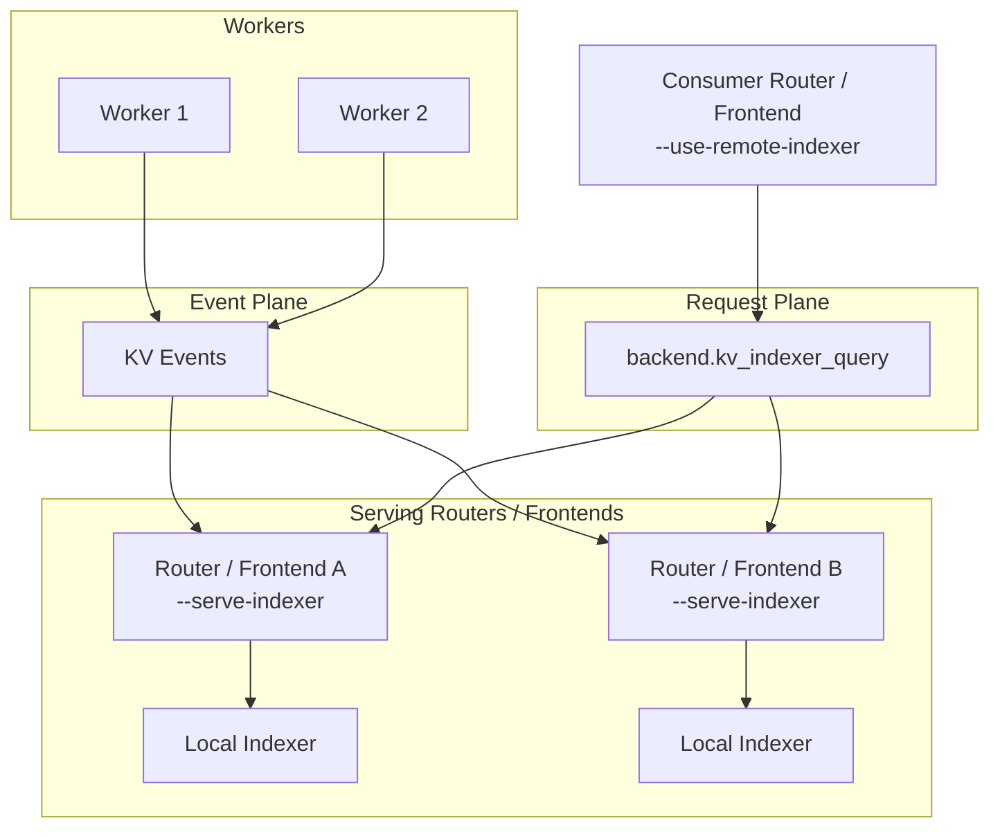

This page covers day-2 operational topics for router deployments. For flags and tuning guidance, see [Configuration and Tuning](router-configuration.md).

## Serving Multiple Router Replicas

For improved fault tolerance, you can launch multiple frontend-plus-router replicas. If multiple `dynamo.frontend` processes share the same host or network namespace, give each instance a different HTTP port. In Kubernetes or on separate hosts, replicas can usually reuse the same container port. Alternatively, you can deploy the router separately as the standalone `python -m dynamo.router` service.

## Router State Management

The KV router maintains two independent state families with different synchronization, persistence, and recovery behavior:

1. **Prefix cache state**: The global view of cached KV prefix blocks on workers. This state drives cache-overlap scoring.
2. **Active block state**: The router's view of KV blocks currently assigned to in-flight requests. This state drives active-load balancing.

For the architecture behind these states, see [Router Design](../../design-docs/router-design.md).

### Prefix Cache State

Prefix cache state is maintained by the KV indexer in each router or frontend. In event-driven mode, workers publish KV `Stored` and `Removed` events, and each router replica consumes those events to update its radix tree. Because KV events are distributed through the event plane, multiple router replicas naturally receive the same prefix-cache updates; they do not need router-to-router synchronization for prefix blocks.

When `--no-router-kv-events` is used, the router does not consume worker KV events. It instead predicts cache state from its own routing decisions and expires predicted blocks with `--router-ttl-secs`. This approximate mode is useful for development or for backends whose KV events are not yet reliable, but it is not the recommended production path.

#### Prefix Cache Persistence and Recovery

Prefix cache recovery matters because stale or missing prefix state directly affects cache-hit routing decisions. Dynamo supports two recovery strategies.

##### NATS Core / Event Plane with Local Indexer Mode

- Prefix state persists on workers. Events are fire-and-forget, but workers retain their local indexer state.
- On startup, each router queries each worker's local indexer to rebuild prefix state.
- Recovery depends on workers being available. If a worker is down, its blocks cannot be recovered until the worker returns.
- This mode keeps the infrastructure simpler because JetStream is not required.

For more on gap detection and replay, see [KV Event Replay — Dynamo vs vLLM](kv-event-replay-comparison.md).

##### JetStream Mode

JetStream mode requires `--router-durable-kv-events` on both frontend and workers.

- Prefix blocks are stored in NATS JetStream with 1-hour retention.
- Snapshots are saved to NATS object store at configurable thresholds.
- New replicas automatically restore this state on startup.
- You can launch a third router replica even if the first two are down, and it will recover the full prefix state.

```bash
python -m dynamo.frontend \
    --router-mode kv \
    --http-port 8002 \
    --router-durable-kv-events
```

>[!Note]
> If you need to start with a fresh state in JetStream mode, you have two options:
> 1. Use a different namespace or component, which creates a new stream and NATS object store path.
> 2. Launch a router with `--router-reset-states`, which purges the entire stream and radix snapshot. Only do this when launching the first router replica in a component, because it can bring existing replicas into an inconsistent state.

### Active Block State

Active block state tracks in-flight request load. It is derived from the request lifecycle: the router records a request when it is assigned to a worker, updates prefill completion and optional output-block growth as responses arrive, and frees the request when it finishes.

This state is deliberately ephemeral. If a router replica restarts, it starts with no active-block knowledge. That is usually acceptable for fault tolerance because active requests are short lived relative to prefix cache state: old active blocks leave the system as requests complete, and the router's view becomes accurate again as it handles new requests.

The operational concern is replica synchronization. Active blocks are tracked locally by the router that routed a request, so multiple frontend or router replicas do not automatically share the same active-load view.

#### Active Block Replica Synchronization

There are two operating modes for active blocks:

- **Local-only tracking**: Leave replicas unsynchronized. Each router balances using the subset of active requests it routed itself. This is simpler and may be acceptable when traffic is already well distributed across replicas or when active-load precision is less important.
- **Replica sync**: Enable `--router-replica-sync` so replicas publish and subscribe to active-sequence lifecycle events through NATS core messaging. This gives each replica a more complete active-load view across the router fleet.

```bash
# Router replica 1
python -m dynamo.frontend --router-mode kv --http-port 8000 --router-replica-sync

# Router replica 2
python -m dynamo.frontend --router-mode kv --http-port 8001 --router-replica-sync
```

With replica sync enabled, a new router still starts with zero active-block knowledge, but it converges through live request handling and active-sequence events from other replicas. Without it, each replica keeps an isolated active-block view, which can lead to suboptimal load balancing.

## Dynamo-Native Remote Indexer

For Dynamo-native deployments, the remote indexer is served by `dynamo.frontend` or `dynamo.router`, not by `dynamo.indexer`.

- Use `--serve-indexer` on router or frontend replicas that should expose `kv_indexer_query` from the worker component.
- Use `--use-remote-indexer` on consumer routers or frontends that should query that served endpoint instead of maintaining a local overlap indexer.
- `dynamo.indexer` remains the standalone HTTP plus ZMQ microservice for non-Dynamo or direct-ZMQ deployments.

Frontend example:

```bash
# Serving anchors
python -m dynamo.frontend --router-mode kv --serve-indexer

# Consumer frontend
python -m dynamo.frontend --router-mode kv --use-remote-indexer
```

The served service is request-plane only. Each serving router or frontend keeps its normal local KV event ingestion, gap detection, and worker-query recovery path; remote consumers only issue hash-based overlap queries.

Approximate mode (`--no-router-kv-events`) is singleton-only for remote serving: only one `--serve-indexer` replica may exist for a given worker component. Event-driven mode allows multiple serving replicas behind the same worker component.



## Additional Notes

Request-plane transport is independent of KV event transport. The request plane (`DYN_REQUEST_PLANE` or `--request-plane`) controls how requests reach workers. KV events use NATS in JetStream or NATS Core modes, or ZMQ when `--event-plane zmq` is set. With `--event-plane zmq` and `--discovery-backend file` or `mem`, the router can run without etcd or NATS. When using a NATS-based event plane, NATS is initialized automatically; set `NATS_SERVER=nats://...` to override the default `localhost:4222`.

When `--router-kv-overlap-score-credit` is set to 0, no KV indexer is created and prefix matching is disabled. When `--no-router-kv-events` is set, a KV indexer is still created but no event subscriber is launched; the router predicts cache state from its own routing decisions with TTL-based expiration.

Backend KV event publishing is independent of the frontend's `--no-router-kv-events` flag. The frontend flag controls whether the router consumes events; backend flags control whether workers publish them. If the router is not consuming events, workers that still publish will waste resources but cause no harm.

- **vLLM**: Pass `--kv-events-config '{"enable_kv_cache_events": false}'` to disable, or `'{"enable_kv_cache_events": true, "publisher": "zmq", "endpoint": "tcp://*:5557"}'` to enable.
- **SGLang**: Pass `--kv-events-config` with a JSON config to enable, or omit it to keep publishing disabled.
- **TRT-LLM**: Pass `--publish-events-and-metrics` to enable, or omit it to keep publishing disabled.

The CLI arg `--router-ttl-secs` controls local cache prediction lifetime when the router operates without receiving events from workers. When workers are configured to publish KV events, the router relies on worker-side eviction events and this parameter is ignored.

`--router-queue-threshold` and the busy thresholds (`--active-decode-blocks-threshold`, `--active-prefill-tokens-threshold`, `--active-prefill-tokens-threshold-frac`) serve different purposes. Busy thresholds reject a worker entirely from the candidate set when it exceeds a utilization limit. In contrast, `--router-queue-threshold` defers the entire routing decision until at least one worker has capacity, so the request is routed with the freshest load metrics. The busy thresholds can be updated at runtime without restarting the frontend via the `/busy_threshold` HTTP endpoint. For the eligibility and backpressure distinction, see [Router Filtering](router-filtering.md). For rejection behavior details, see [Request Rejection](../../fault-tolerance/request-rejection.md).
