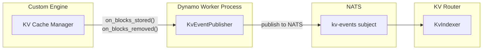
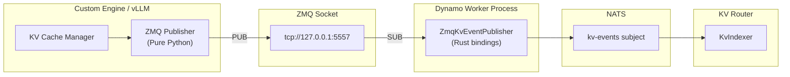

<!--
SPDX-FileCopyrightText: Copyright (c) 2025-2026 NVIDIA CORPORATION & AFFILIATES. All rights reserved.
SPDX-License-Identifier: Apache-2.0
-->

# Router Examples

For quick start instructions, see the [Router README](README.md). This document provides further examples for using the Dynamo Router, including Python API usage, Kubernetes deployments, and custom routing patterns.

## Table of Contents

- [Using KvPushRouter Python API](#using-kvpushrouter-python-api)
- [K8s Examples](#k8s-examples)
- [Routing Patterns](#routing-patterns)
- [Custom Routing Example: Minimizing TTFT](#custom-routing-example-minimizing-ttft)
- [KV Event Publishing for Custom Engines](#kv-event-publishing-for-custom-engines)

## Using KvPushRouter Python API

Instead of launching the KV Router via command line, you can create a `KvPushRouter` object directly in Python. This allows per-request routing configuration overrides.

>[!Warning]
> **Multiple Routers in Same Process**: If you need to run multiple `KvPushRouter` instances for fault tolerance or load distribution, you must launch them in **separate processes** (e.g., using `python -m dynamo.frontend` with different ports). Creating multiple `KvPushRouter` objects in the same Python process is not supported - they share the same cancellation token from the component's primary lease, so dropping one router will cancel all routers in that process. For in-process routing, use a single `KvPushRouter` instance.

### Methods

The `KvPushRouter` provides the following methods:

- **`generate(token_ids, model, ...)`**: Route and execute a request, returning an async stream of responses. Automatically handles worker selection, state tracking, and lifecycle management.

- **`best_worker(token_ids, router_config_override=None, request_id=None)`**: Query which worker would be selected for given tokens. Returns `(worker_id, dp_rank, overlap_blocks)`.
  - Without `request_id`: Query-only, doesn't update router state
  - With `request_id`: Updates router state to track the request. **Note**: If used with `request_id`, you must call `mark_prefill_complete()` and `free()` at the appropriate lifecycle points to maintain accurate load tracking

- **`get_potential_loads(token_ids)`**: Get detailed load information for all workers, including potential prefill tokens and active decode blocks. Returns a list of load dictionaries.

- **`mark_prefill_complete(request_id)`**: Signal that a request has completed its prefill phase. Only used for [manual lifecycle management](#2-manual-state-management-advanced) when using `best_worker()` for manual routing instead of `generate()`.

- **`free(request_id)`**: Signal that a request has completed and its resources should be released. Only used for [manual lifecycle management](#2-manual-state-management-advanced) when using `best_worker()` for manual routing instead of `generate()`.

- **`dump_events()`**: Dump all KV cache events from the router's indexer as a JSON string. Useful for debugging and analysis.

### Setup

First, launch your backend engines:
```bash
python -m dynamo.vllm --model meta-llama/Llama-2-7b-hf
```

### Example Script

```python
import asyncio
from dynamollm import DistributedRuntime, KvPushRouter, KvRouterConfig

async def main():
    # Get runtime and create endpoint
    runtime = DistributedRuntime.detached()
    namespace = runtime.namespace("dynamo")
    component = namespace.component("backend")
    endpoint = component.endpoint("generate")

    # Create KV router
    kv_router_config = KvRouterConfig()
    router = KvPushRouter(
        endpoint=endpoint,
        block_size=16,
        kv_router_config=kv_router_config
    )

    # Your input tokens
    token_ids = [1, 2, 3, 4, 5, 6, 7, 8, 9, 10]

    # Generate with per-request routing override
    stream = await router.generate(
        token_ids=token_ids,
        model="meta-llama/Llama-2-7b-hf",
        stop_conditions={
            "max_tokens": 20,        # Generate exactly 20 tokens
            "ignore_eos": True,      # Don't stop at EOS token
        },
        sampling_options={
            "temperature": 0.7,
            "top_p": 0.9,
        },
        router_config_override={
            "overlap_score_weight": 2.0,    # Prioritize cache hits for this request
            "router_temperature": 0.5,       # Add routing randomness
        }
    )

    # Collect generated tokens
    generated_tokens = []
    async for response in stream:
        if isinstance(response, dict) and "token_ids" in response:
            generated_tokens.extend(response["token_ids"])

    print(f"Generated {len(generated_tokens)} tokens: {generated_tokens}")

if __name__ == "__main__":
    asyncio.run(main())
```

## K8s Examples

For basic Kubernetes deployment with the KV Router, see the [Kubernetes Deployment section](README.md#kubernetes-deployment) in the Quick Start guide.

### Complete K8s Examples

- [TRT-LLM aggregated router example](../../examples/backends/trtllm/deploy/agg_router.yaml)
- [vLLM aggregated router example](../../examples/backends/vllm/deploy/agg_router.yaml)
- [SGLang aggregated router example](../../examples/backends/sglang/deploy/agg_router.yaml)
- [Distributed inference tutorial](../../examples/basics/kubernetes/Distributed_Inference/agg_router.yaml)

**For A/B Testing and Advanced K8s Setup:**
See the comprehensive [KV Router A/B Benchmarking Guide](../../benchmarks/kv-router-ab-testing.md) for step-by-step instructions on deploying, configuring, and benchmarking the KV router in Kubernetes.

### Example with Advanced Configuration

```yaml
apiVersion: nvidia.com/v1alpha1
kind: DynamoGraphDeployment
metadata:
  name: my-deployment
spec:
  services:
    Frontend:
      dynamoNamespace: my-namespace
      componentType: frontend
      replicas: 1
      envs:
        - name: DYN_ROUTER_MODE
          value: kv
        - name: DYN_ROUTER_TEMPERATURE
          value: "0.5"  # Add some randomness to prevent worker saturation
        - name: DYN_KV_OVERLAP_SCORE_WEIGHT
          value: "1.5"  # Prioritize TTFT over ITL
        - name: DYN_KV_CACHE_BLOCK_SIZE
          value: "16"
      extraPodSpec:
        mainContainer:
          image: nvcr.io/nvidia/ai-dynamo/vllm-runtime:0.6.0
```

### Alternative: Using Command Args in K8s

You can also pass CLI arguments directly in the container command:

```yaml
extraPodSpec:
  mainContainer:
    image: nvcr.io/nvidia/ai-dynamo/vllm-runtime:0.6.0
    command:
      - /bin/sh
      - -c
    args:
      - "python3 -m dynamo.frontend --router-mode kv --router-temperature 0.5 --http-port 8000"
```

**Recommendation:** Use environment variables for easier configuration management and consistency with Dynamo's K8s patterns.

## Routing Patterns

The `KvPushRouter` supports multiple usage patterns depending on your control requirements:

### 1. Automatic Routing (Recommended)
Call `generate()` directly and let the router handle everything:
```python
stream = await router.generate(token_ids=tokens, model="model-name")
```
- **Best for**: Most use cases
- **Router automatically**: Selects best worker, updates state, routes request, tracks lifecycle

### 2. Manual State Management (Advanced)
Use `best_worker(request_id=...)` to select and track, then manage the request yourself:
```python
worker_id, _dp_rank, overlap = await router.best_worker(tokens, request_id="req-123")
response = await client.generate(tokens, request_id="req-123")
# await anext(response)  # Get first token
await router.mark_prefill_complete("req-123")  # After first token
# async for _ in response:  # Continue generating
#     ...
await router.free("req-123")  # After completion
```
- **Best for**: Custom request handling with router state tracking
- **Requires**: Calling `mark_prefill_complete()` and `free()` at correct lifecycle points
- **Caution**: Incorrect lifecycle management degrades load balancing accuracy

### 3. Hierarchical Router Probing
Query without state updates, then route through a chosen router:
```python
# Probe multiple routers without updating state
worker_id_1, dp_rank, overlap_1 = await router_1.best_worker(tokens)  # No request_id
worker_id_2, dp_rank, overlap_2 = await router_2.best_worker(tokens)

# Pick the best router based on results
chosen_router = router_1 if overlap_1 > overlap_2 else router_2
stream = await chosen_router.generate(tokens, model="model-name", worker_id=worker_id)
```
- **Best for**: Multi-tier deployments (e.g., Envoy Gateway routing to multiple router groups)
- **Advantage**: Query multiple routers before committing to one

### 4. Custom Load-Based Routing
Use `get_potential_loads()` to implement custom routing logic:
```python
loads = await router.get_potential_loads(tokens)
# Apply custom logic (e.g., weighted scoring, constraints)
best_worker = min(loads, key=lambda x: custom_cost_fn(x))
stream = await router.generate(tokens, model="model-name", worker_id=best_worker['worker_id'])
```
- **Best for**: Custom optimization strategies beyond the built-in cost function
- **Advantage**: Full control over worker selection logic
- **See also**: Detailed example below in "Custom Routing Example: Minimizing TTFT"

All patterns support `router_config_override` to adjust routing behavior per-request without recreating the router.

## Custom Routing Example: Minimizing TTFT

Here's an example of using `get_potential_loads()` to implement custom routing that minimizes Time To First Token (TTFT) by selecting the worker with the least prefill work:

```python
import asyncio
from dynamo.llm import DistributedRuntime, KvPushRouter, KvRouterConfig

async def minimize_ttft_routing():
    # Setup router
    runtime = DistributedRuntime.detached()
    namespace = runtime.namespace("dynamo")
    component = namespace.component("backend")
    endpoint = component.endpoint("generate")

    router = KvPushRouter(
        endpoint=endpoint,
        block_size=16,
        kv_router_config=KvRouterConfig()
    )

    # Your input tokens
    token_ids = [1, 2, 3, 4, 5, 6, 7, 8, 9, 10]

    # Get potential loads for all workers
    potential_loads = await router.get_potential_loads(token_ids)

    # Find worker with minimum prefill tokens (best for TTFT)
    best_worker = min(potential_loads, key=lambda x: x['potential_prefill_tokens'])

    print(f"Worker loads: {potential_loads}")
    print(f"Selected worker {best_worker['worker_id']} with {best_worker['potential_prefill_tokens']} prefill tokens")

    # Route directly to the selected worker
    stream = await router.generate(
        token_ids=token_ids,
        model="meta-llama/Llama-2-7b-hf",
        worker_id=best_worker['worker_id'],  # Force routing to optimal worker
        stop_conditions={"max_tokens": 20}
    )

    # Process response
    async for response in stream:
        if isinstance(response, dict) and "token_ids" in response:
            print(f"Generated tokens: {response['token_ids']}")

if __name__ == "__main__":
    asyncio.run(minimize_ttft_routing())
```

This approach gives you complete control over routing decisions, allowing you to optimize for different metrics based on your specific requirements. As some examples:

- **Minimize TTFT**: Select worker with lowest `potential_prefill_tokens`
- **Maximize cache reuse**: Use `best_worker()` which considers both prefill and decode loads
- **Balance load**: Consider both `potential_prefill_tokens` and `potential_decode_blocks` together

See [Router Design](../../design_docs/router_design.md) for architecture details and the cost function algorithm.

## KV Event Publishing for Custom Engines

The KV Router relies on real-time events from backend workers to track which KV cache blocks are stored on each worker. When your custom engine allocates or evicts KV cache blocks, it should publish these events so the router can make optimal routing decisions. There are two main publishing pathways: direct NATS publishing (`KvEventPublisher`) which publishes events directly to NATS and is the simplest approach for custom engines, and ZMQ-based publishing for engines with ZMQ event output (like vLLM) which uses a ZMQ publisher in the engine and `ZmqKvEventPublisher` to forward events to NATS.

### Event Types

The KV cache supports three event types:

| Event Type | Description | When to Publish |
|------------|-------------|-----------------|
| `BlockStored` | New blocks added to cache | After KV cache allocation succeeds |
| `BlockRemoved` | Blocks evicted from cache | When blocks are evicted or freed |
| `AllBlocksCleared` | All blocks removed | On cache reset or worker restart |

### Event Structure

Each event contains:
- **`event_id`**: Monotonically increasing identifier per worker
- **`dp_rank`**: Data parallel rank (0 if DP not enabled)
- **`data`**: One of `Stored`, `Removed`, or `Cleared`

For `BlockStored` events:
- **`token_ids`**: List of token IDs for the stored blocks
- **`block_hashes`**: List of **sequence block hashes** from the engine's block manager. These are cumulative hashes that incorporate all tokens from the start of the sequence up to and including the current block (not just the tokens within that block). This enables prefix matching across requests.
- **`num_block_tokens`**: Number of tokens per block (should all equal `kv_block_size`)
- **`parent_hash`**: Hash of the parent block. Required for all blocks except the first block in a sequence (which has no parent).
- **`lora_id`**: LoRA adapter ID (0 if not using LoRA)

For `BlockRemoved` events:
- **`block_hashes`**: List of sequence block hashes being evicted

### Option 1: Direct NATS Publishing (Recommended)

The `KvEventPublisher` class publishes events directly to NATS. This is the simplest approach for custom engines.



**When to use:**
- Building a custom inference engine from scratch
- Your engine doesn't have a ZMQ-based event system
- You want the simplest integration path

#### Basic Setup

```python
from dynamo.llm import KvEventPublisher

class CustomEnginePublisher:
    def __init__(self, component, worker_id: int, block_size: int, dp_rank: int = 0):
        self.block_size = block_size
        self.event_id = 0
        self.kv_publisher = KvEventPublisher(
            component=component,
            worker_id=worker_id,
            kv_block_size=block_size,
            dp_rank=dp_rank,
            enable_local_indexer=False,
        )

    def on_blocks_stored(self, token_ids: list[int], block_hashes: list[int],
                         lora_id: int = 0, parent_hash: int | None = None):
        """Call after KV cache blocks are allocated."""
        self.event_id += 1
        num_block_tokens = [self.block_size] * len(block_hashes)
        self.kv_publisher.publish_stored(
            event_id=self.event_id,
            token_ids=token_ids,
            num_block_tokens=num_block_tokens,
            block_hashes=block_hashes,
            lora_id=lora_id,
            parent_hash=parent_hash,
        )

    def on_blocks_removed(self, block_hashes: list[int]):
        """Call when KV cache blocks are evicted."""
        self.event_id += 1
        self.kv_publisher.publish_removed(event_id=self.event_id, block_hashes=block_hashes)
```

#### Integration with Your Engine

```python
from dynamo.llm import register_llm

async def main():
    # Register your engine with Dynamo
    component, endpoint = await register_llm(
        model="my-model",
        generator=my_generate_fn,
    )

    # Initialize publisher
    publisher = CustomEnginePublisher(
        component=component,
        worker_id=endpoint.connection_id(),
        block_size=16,  # Match your engine's block size
    )

    # Hook into your engine's cache events
    def on_prefill_complete(request_id, token_ids, blocks):
        block_hashes = [block.hash for block in blocks]
        publisher.on_blocks_stored(token_ids=token_ids, block_hashes=block_hashes)

    def on_cache_eviction(evicted_blocks):
        block_hashes = [block.hash for block in evicted_blocks]
        publisher.on_blocks_removed(block_hashes=block_hashes)
```

### Option 2: ZMQ-based Publishing

For engines that publish events via ZMQ (like vLLM), this option uses two components that work together:

1. **ZMQ Publisher** (in your engine) - Publishes events to a ZMQ socket
2. **ZmqKvEventPublisher** (Dynamo binding) - Subscribes to ZMQ and forwards to NATS



**When to use:**
- Your engine already has a ZMQ-based event system (like vLLM)
- You're integrating with a consolidator (like KVBM)
- You want to decouple event publishing from your engine's main loop

#### Part 1: ZMQ Subscriber (Dynamo Bindings)

If your engine already publishes to ZMQ, use `ZmqKvEventPublisher` to subscribe and forward to NATS:

```python
from dynamo.llm import ZmqKvEventPublisher, ZmqKvEventPublisherConfig

# Configure the ZMQ subscriber
config = ZmqKvEventPublisherConfig(
    worker_id=endpoint.connection_id(),
    kv_block_size=block_size,
    zmq_endpoint="tcp://127.0.0.1:5557",  # Where your engine publishes
    zmq_topic="",                          # Subscribe to all topics
    enable_local_indexer=False,
)

# Create publisher - it automatically subscribes to ZMQ and forwards to NATS
kv_publisher = ZmqKvEventPublisher(
    component=component,
    config=config,
)
```

#### Part 2: ZMQ Publisher (Pure Python)

If your engine needs to publish to ZMQ (e.g., for consolidator integration), implement the ZMQ protocol:

```python
import zmq
import msgpack
import time

class ZmqKvEventPublisher:
    """Pure Python ZMQ publisher for KV events (vLLM-compatible format)."""

    def __init__(self, zmq_endpoint: str, kv_block_size: int, topic: str = ""):
        self.kv_block_size = kv_block_size
        self.topic = topic
        self.ctx = zmq.Context()
        self.socket = self.ctx.socket(zmq.PUB)
        self.socket.bind(zmq_endpoint)
        self.sequence = 0
        self.data_parallel_rank = 0

    def _to_signed_i64(self, value: int | None) -> int | None:
        if value is None:
            return None
        return value - 0x10000000000000000 if value > 0x7FFFFFFFFFFFFFFF else value

    def publish_stored(self, event_id: int, token_ids: list[int], num_block_tokens: list[int],
                       block_hashes: list[int], lora_id: int = 0, parent_hash: int | None = None):
        event = {
            "type": "BlockStored",
            "block_hashes": [self._to_signed_i64(h) for h in block_hashes],
            "parent_block_hash": self._to_signed_i64(parent_hash),
            "token_ids": token_ids,
            "block_size": self.kv_block_size,
            "lora_id": lora_id if lora_id != 0 else None,
        }
        self._publish_event(event)

    def publish_removed(self, event_id: int, block_hashes: list[int]):
        event = {"type": "BlockRemoved", "block_hashes": [self._to_signed_i64(h) for h in block_hashes]}
        self._publish_event(event)

    def publish_all_cleared(self):
        self._publish_event({"type": "AllBlocksCleared"})

    def _publish_event(self, event: dict):
        batch = [time.time(), [event], self.data_parallel_rank]
        payload = msgpack.packb(batch, use_bin_type=True)
        sequence_bytes = self.sequence.to_bytes(8, byteorder="big")
        self.sequence += 1
        self.socket.send_multipart([self.topic.encode(), sequence_bytes, payload])

    def shutdown(self):
        self.socket.close()
        self.ctx.term()
```

### ZMQ Wire Format

The ZMQ message format (compatible with vLLM):

| Frame | Description |
|-------|-------------|
| 1 | Topic (empty string for all topics) |
| 2 | Sequence number (8 bytes, big-endian) |
| 3 | Msgpack payload: `[timestamp, [events], dp_rank]` |

Each event in the payload is a dictionary with `type` field (`BlockStored`, `BlockRemoved`, or `AllBlocksCleared`).

### Best Practices

1. **Event IDs must be monotonically increasing** per worker (use a thread-safe counter)

2. **Block size must match** your engine's actual `kv_block_size`

3. **`parent_hash` is required** for all blocks except the first in a sequence - it links blocks to enable prefix matching

## See Also

- **[Router README](README.md)**: Quick start guide for the KV Router
- **[Router Guide](router_guide.md)**: Configuration, tuning, and production setup
- **[Router Design](../../design_docs/router_design.md)**: Architecture details and event transport modes
