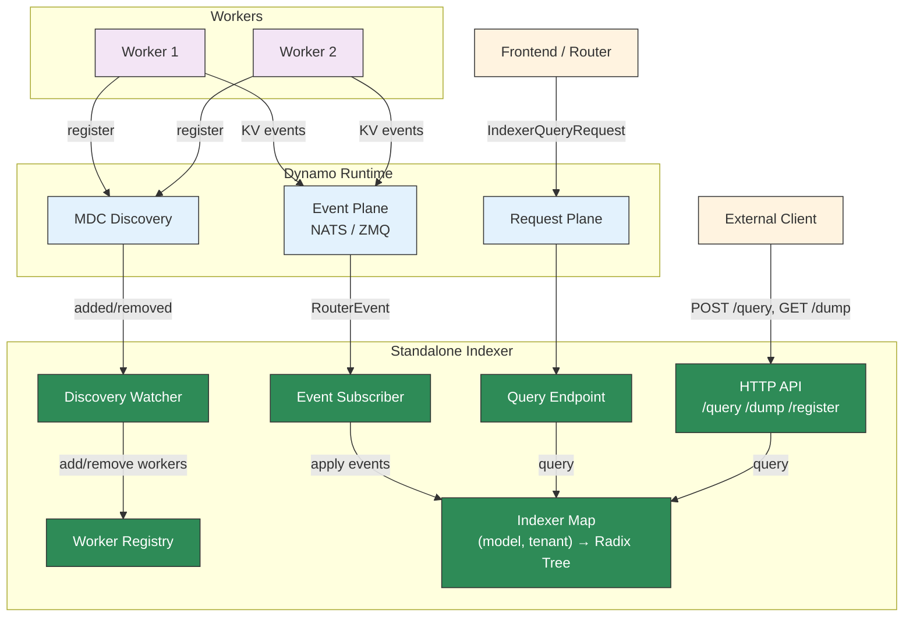
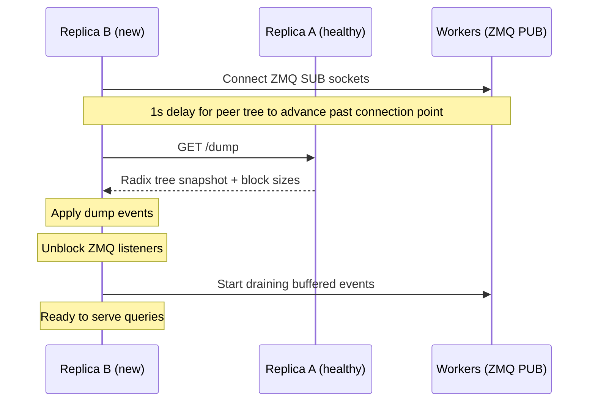

## Overview

The standalone KV indexer (`dynamo-kv-indexer`) is a lightweight binary that maintains a radix tree of cached blocks and exposes HTTP endpoints for querying and managing workers. It supports two operational modes:

- **Standalone mode** (default): Subscribes to ZMQ KV event streams directly from workers. No Dynamo runtime dependencies required.
- **Dynamo runtime mode** (`--dynamo-runtime`): Integrates with the Dynamo runtime for automatic worker discovery via MDC, KV event ingestion via the event plane (NATS or ZMQ), and serves indexer queries over the request plane for remote frontends.

This is distinct from the [Standalone Router](../../../components/src/dynamo/router/README.md), which is a full routing service. The standalone indexer provides only the indexing and query layer without routing logic.

The HTTP API follows the [Mooncake KV Indexer RFC](https://github.com/kvcache-ai/Mooncake/issues/1403) conventions.

## Multi-Model and Multi-Tenant Support

The indexer maintains one radix tree per `(model_name, tenant_id)` pair. Workers registered with different model names or tenant IDs are isolated into separate indexers — queries against one model/tenant never return scores from another.

- **`model_name`** (required on `/register` and `/query`): Identifies the model. Workers serving different models get separate radix trees.
- **`tenant_id`** (optional, defaults to `"default"`): Enables multi-tenant isolation within the same model. Omit for single-tenant deployments.
- **`block_size`** is per-indexer: the first `/register` call for a given `(model_name, tenant_id)` sets the block size. Subsequent registrations for the same pair must use the same block size or the request will fail.

## Compatibility

In standalone mode, the indexer works with any engine that publishes KV cache events over ZMQ in the expected msgpack format. This includes bare vLLM and SGLang engines, which emit ZMQ KV events natively — no Dynamo-specific wrapper is required.

In Dynamo runtime mode, the indexer discovers workers automatically via MDC and receives KV events through the event plane. It also registers a query endpoint on the request plane, allowing frontends to query overlap scores remotely without needing direct HTTP access.

## Use Cases

- **Debugging**: Inspect the radix tree state to verify which blocks are cached on which workers.
- **State verification**: Confirm that the indexer's view of KV cache state matches the router's internal state (used in integration tests).
- **Custom routing**: Build external routing logic that queries the indexer for overlap scores and makes its own worker selection decisions.
- **Monitoring**: Observe KV cache distribution across workers without running a full router.
- **Remote indexing**: In Dynamo runtime mode, frontends can offload KV cache indexing to a dedicated service and query it over the request plane.

## P2P Recovery

Multiple indexer replicas can subscribe to the same ZMQ worker endpoints for fault tolerance. When a replica starts (or restarts after a crash), it bootstraps its radix tree state from a healthy peer before processing live events.

### How It Works

1. Workers are registered via `--workers` CLI, which connects ZMQ SUB sockets immediately.
2. A 1-second delay ensures the peer's tree state has advanced past the ZMQ connection point, so the dump covers any events that would otherwise be lost to the slow-joiner window.
3. The indexer fetches a `/dump` from the first reachable peer in `--peers`.
4. Dump events are applied to populate the radix tree.
5. ZMQ listeners are unblocked and begin draining any events that buffered during recovery.

If no peers are reachable, the indexer starts with an empty state.

### Example: Two-Replica Setup

```bash
# Replica A (first instance, no peers)
dynamo-kv-indexer --port 8090 --block-size 16 \
  --workers "1=tcp://worker1:5557,2=tcp://worker2:5558"

# Replica B (recovers from A on startup)
dynamo-kv-indexer --port 8091 --block-size 16 \
  --workers "1=tcp://worker1:5557,2=tcp://worker2:5558" \
  --peers "http://localhost:8090"
```

Both replicas subscribe to the same workers. Replica B recovers A's tree state on startup, then both independently process live ZMQ events going forward.

### Consistency

The dump is a weakly consistent BFS snapshot of the radix tree — concurrent writes may race with the traversal. This is acceptable because:

- **Stale blocks** (partially removed branches): live `Remove` events will clean them up.
- **Missing blocks** (partially added branches): live `Stored` events will add them.
- The tree converges to the correct state after live events catch up.

### Peer Management

Peers can be registered at startup via `--peers` or dynamically via the HTTP API. The peer list is used for recovery only — peers do not synchronize state in real time.

## Building

The binary is a feature-gated target in the `dynamo-kv-router` crate. The available cargo features control which capabilities are compiled in:

| Feature | Description |
|---------|-------------|
| `standalone-indexer` | Core standalone indexer library (HTTP server, ZMQ listeners, P2P recovery) |
| `metrics` | Prometheus metrics (`/metrics` endpoint, request/worker gauges) |
| `indexer-bin` | CLI binary target |
| `indexer-runtime` | Dynamo runtime integration (discovery, event plane, request plane) |
| `test-endpoints` | Test-only endpoints (`/test/pause_listener`, `/test/resume_listener`) |

### Standalone build (no runtime dependency)

```bash
cargo build -p dynamo-kv-router --features indexer-bin --bin dynamo-kv-indexer
```

This produces a binary with no `dynamo-runtime` dependency. It supports ZMQ event listeners, HTTP API, and P2P recovery.

### Standalone build with metrics

```bash
cargo build -p dynamo-kv-router --features indexer-bin,metrics --bin dynamo-kv-indexer
```

Adds Prometheus metrics support (`/metrics` endpoint). Pulls in `dynamo-runtime` for the metrics implementation.

### Runtime-enabled build

```bash
cargo build -p dynamo-kv-router --features indexer-bin,indexer-runtime --bin dynamo-kv-indexer
```

Enables the `--dynamo-runtime` CLI flag for MDC discovery, event plane subscription, and request plane query endpoint. Includes metrics.

## CLI

### Standalone mode (default)

```bash
dynamo-kv-indexer --port 8090 [--threads 4] [--block-size 16 --model-name my-model --tenant-id default --workers "1=tcp://host:5557,2:1=tcp://host:5558"] [--peers "http://peer1:8090,http://peer2:8091"]
```

### Dynamo runtime mode (requires `indexer-runtime` feature)

```bash
dynamo-kv-indexer --dynamo-runtime --namespace default --component-name kv-indexer --worker-component backend --port 8090 [--threads 4]
```

In runtime mode, workers are discovered automatically via MDC. The `--workers` flag can still be used to register additional static workers alongside discovered ones.

| Flag | Default | Description |
|------|---------|-------------|
| `--block-size` | (none) | KV cache block size for initial `--workers` (required when `--workers` is set) |
| `--port` | `8090` | HTTP server listen port |
| `--threads` | `4` | Number of indexer threads (1 = single-threaded, >1 = thread pool) |
| `--workers` | (none) | Initial workers as `instance_id[:dp_rank]=zmq_address,...` pairs (dp_rank defaults to 0) |
| `--model-name` | `default` | Model name for initial `--workers` |
| `--tenant-id` | `default` | Tenant ID for initial `--workers` |
| `--peers` | (none) | Comma-separated peer indexer URLs for P2P recovery on startup |
| `--dynamo-runtime` | `false` | Enable Dynamo runtime integration (requires `indexer-runtime` feature) |
| `--namespace` | `default` | Dynamo namespace to register the indexer component under (runtime mode) |
| `--component-name` | `kv-indexer` | Component name for this indexer in the Dynamo runtime (runtime mode) |
| `--worker-component` | `backend` | Component name that workers register under, for event plane subscription (runtime mode) |

## HTTP API

### `GET /health` — Liveness check

Returns `200 OK` unconditionally.

```bash
curl http://localhost:8090/health
```

### `GET /metrics` — Prometheus metrics

Returns metrics in Prometheus text exposition format. Available when the binary is built with the `metrics` or `indexer-runtime` feature.

```bash
curl http://localhost:8090/metrics
```

| Metric | Type | Labels | Description |
|--------|------|--------|-------------|
| `dynamo_kvindexer_request_duration_seconds` | Histogram | `endpoint` | HTTP request latency |
| `dynamo_kvindexer_requests_total` | Counter | `endpoint`, `method` | Total HTTP requests |
| `dynamo_kvindexer_errors_total` | Counter | `endpoint`, `status_class` | HTTP error responses (4xx/5xx) |
| `dynamo_kvindexer_models` | Gauge | — | Number of active model+tenant indexers |
| `dynamo_kvindexer_workers` | Gauge | — | Number of registered worker instances |

### `POST /register` — Register an endpoint

Register a ZMQ endpoint for an instance. Each call creates or reuses the indexer for the given `(model_name, tenant_id)` pair.

```bash
# Single model, default tenant
curl -X POST http://localhost:8090/register \
  -H 'Content-Type: application/json' \
  -d '{
    "instance_id": 1,
    "endpoint": "tcp://127.0.0.1:5557",
    "model_name": "llama-3-8b",
    "block_size": 16
  }'

# With tenant isolation
curl -X POST http://localhost:8090/register \
  -H 'Content-Type: application/json' \
  -d '{
    "instance_id": 2,
    "endpoint": "tcp://127.0.0.1:5558",
    "model_name": "llama-3-8b",
    "tenant_id": "customer-a",
    "block_size": 16,
    "dp_rank": 0
  }'
```

| Field | Required | Default | Description |
|-------|----------|---------|-------------|
| `instance_id` | yes | — | Worker instance identifier |
| `endpoint` | yes | — | ZMQ PUB address to subscribe to |
| `model_name` | yes | — | Model name (used to select the indexer) |
| `block_size` | yes | — | KV cache block size (must match the engine) |
| `tenant_id` | no | `"default"` | Tenant identifier for isolation |
| `dp_rank` | no | `0` | Data parallel rank |
| `replay_endpoint` | no | — | ZMQ ROUTER address for gap replay (e.g. `tcp://host:5560`) |

### `POST /unregister` — Deregister an instance

Remove an instance. Omitting `tenant_id` removes the instance from **all** tenants for the given model; providing it targets only that tenant's indexer.

```bash
# Remove from all tenants
curl -X POST http://localhost:8090/unregister \
  -H 'Content-Type: application/json' \
  -d '{"instance_id": 1, "model_name": "llama-3-8b"}'

# Remove from a specific tenant
curl -X POST http://localhost:8090/unregister \
  -H 'Content-Type: application/json' \
  -d '{"instance_id": 1, "model_name": "llama-3-8b", "tenant_id": "customer-a"}'

# Remove a specific dp_rank
curl -X POST http://localhost:8090/unregister \
  -H 'Content-Type: application/json' \
  -d '{"instance_id": 1, "model_name": "llama-3-8b", "tenant_id": "default", "dp_rank": 0}'
```

| Field | Required | Default | Description |
|-------|----------|---------|-------------|
| `instance_id` | yes | — | Worker instance to remove |
| `model_name` | yes | — | Model name (identifies the indexer) |
| `tenant_id` | no | — | Tenant identifier (omit to remove from all tenants) |
| `dp_rank` | no | — | Specific dp_rank to remove (omit to remove all) |

### `GET /workers` — List registered instances

```bash
curl http://localhost:8090/workers
```

Returns:
```json
[{"instance_id": 1, "endpoints": {"0": "tcp://127.0.0.1:5557", "1": "tcp://127.0.0.1:5558"}}]
```

### `POST /query` — Query overlap for token IDs

Given raw token IDs, compute block hashes and return per-instance overlap scores (in matched tokens):

```bash
curl -X POST http://localhost:8090/query \
  -H 'Content-Type: application/json' \
  -d '{"token_ids": [1, 2, 3, 4, 5, 6, 7, 8, 9, 10, 11, 12, 13, 14, 15, 16], "model_name": "llama-3-8b"}'
```

Returns:
```json
{
  "scores": {"1": {"0": 32}, "2": {"1": 0}},
  "frequencies": [1, 1],
  "tree_sizes": {"1": {"0": 5}, "2": {"1": 3}}
}
```

Scores are in **matched tokens** (block overlap count × block size). Nested by `instance_id` then `dp_rank`.

| Field | Required | Default | Description |
|-------|----------|---------|-------------|
| `token_ids` | yes | — | Token sequence to query |
| `model_name` | yes | — | Model name (selects the indexer) |
| `tenant_id` | no | `"default"` | Tenant identifier |
| `lora_name` | no | — | LoRA adapter (overrides indexer-level lora_name for this query) |

### `POST /query_by_hash` — Query overlap for pre-computed hashes

```bash
curl -X POST http://localhost:8090/query_by_hash \
  -H 'Content-Type: application/json' \
  -d '{"block_hashes": [123456, 789012], "model_name": "llama-3-8b"}'
```

Same response format as `/query`. Scores are in matched tokens.

| Field | Required | Default | Description |
|-------|----------|---------|-------------|
| `block_hashes` | yes | — | Pre-computed block hash array |
| `model_name` | yes | — | Model name (selects the indexer) |
| `tenant_id` | no | `"default"` | Tenant identifier |

### `GET /dump` — Dump all radix tree events

Returns the full radix tree state as a JSON object keyed by `model_name:tenant_id`:

```bash
curl http://localhost:8090/dump
```

Returns:
```json
{
  "llama-3-8b:default": {
    "block_size": 16,
    "events": [<RouterEvent>, ...]
  },
  "mistral-7b:customer-a": {
    "block_size": 16,
    "events": [<RouterEvent>, ...]
  }
}
```

Each indexer is dumped concurrently. The `block_size` field lets recovering peers create indexers with the correct block size without requiring `--block-size` on every replica.

### `POST /register_peer` — Register a peer indexer

```bash
curl -X POST http://localhost:8090/register_peer \
  -H 'Content-Type: application/json' \
  -d '{"url": "http://peer:8091"}'
```

### `POST /deregister_peer` — Remove a peer indexer

```bash
curl -X POST http://localhost:8090/deregister_peer \
  -H 'Content-Type: application/json' \
  -d '{"url": "http://peer:8091"}'
```

### `GET /peers` — List registered peers

```bash
curl http://localhost:8090/peers
```

Returns:
```json
["http://peer:8091"]
```

## DP Rank Handling

When a worker registers with the standalone KV indexer (`/register`), it provides an `instance_id`, a ZMQ `endpoint`, and an optional `dp_rank` (defaults to 0). The service spawns one ZMQ listener per registration.

Each incoming `KvEventBatch` may carry an optional `data_parallel_rank` field. If present, it **overrides** the statically-registered `dp_rank` for that batch. This allows a single ZMQ port to multiplex events from multiple DP ranks.

**Caveat**: the registry only tracks dp_ranks from explicit `/register` calls. If an engine dynamically emits batches with a dp_rank that was never registered, the indexer will store those blocks correctly (under the dynamic `WorkerWithDpRank` key), but per-dp_rank deregistration (`/unregister` with `dp_rank`) will not find them. Full-instance deregistration (`/unregister` without `dp_rank`) still cleans up all dp_ranks for a given `worker_id` in the tree via `remove_worker`.

## Gap Detection and Replay

ZMQ PUB/SUB is lossy — messages can be dropped under backpressure or brief disconnects. The indexer detects gaps by tracking the sequence number of each batch: if `seq > last_seq + 1`, a gap is detected.

When a `replay_endpoint` is provided during `/register`, the indexer connects a DEALER socket to the engine's ROUTER socket and requests the missing batches by sequence number. The engine streams back buffered `(seq, payload)` pairs from its ring buffer until an empty-payload sentinel.

If no `replay_endpoint` is configured, gaps are logged as warnings but not recovered.

The sequence counter (`last_seq`) persists across unregister/register cycles, so re-registering a worker after a gap will trigger replay on the first batch received by the new listener.

## Dynamo Runtime Mode

When started with `--dynamo-runtime`, the indexer integrates with the Dynamo distributed runtime:

### Worker Discovery

The indexer watches MDC (Model Discovery Catalog) for worker additions and removals. When a worker registers with MDC, the indexer automatically creates an indexer for its model and block size. Workers discovered via MDC are tracked separately from those registered via `--workers` or the `/register` HTTP API — a worker cannot be registered through both paths simultaneously.

### Event Plane Subscription

Instead of connecting directly to ZMQ PUB sockets on each worker, the indexer subscribes to KV events through the Dynamo event plane. The transport (NATS or ZMQ) is determined by the `DYNAMO_EVENT_TRANSPORT` environment variable. Events are routed to the appropriate indexer based on the worker ID.

### Request Plane Query Endpoint

The indexer registers a query endpoint on the Dynamo request plane, allowing frontends to send `IndexerQueryRequest` messages containing a model name, namespace, and block hashes. The indexer looks up the appropriate radix tree and returns overlap scores. This enables frontends to use a remote indexer for KV-aware routing without direct HTTP access.

### Example

```bash
# Start the indexer with runtime integration
dynamo-kv-indexer --dynamo-runtime \
  --namespace my-namespace \
  --component-name kv-indexer \
  --worker-component backend \
  --port 8090 --threads 4
```

The HTTP API remains fully available in runtime mode. Static workers can be added via `--workers` alongside discovered workers.

## Limitations

- **Standalone mode is ZMQ only**: In standalone mode, workers must publish KV events via ZMQ PUB sockets. Build with `indexer-runtime` and use `--dynamo-runtime` to receive events via the event plane (NATS or ZMQ).
- **No routing logic**: The indexer only maintains the radix tree and answers queries. It does not track active blocks, manage request lifecycle, or perform worker selection.

## Architecture

### Standalone Mode


### Dynamo Runtime Mode



### P2P Recovery Flow



## See Also

- **[Mooncake KV Indexer RFC](https://github.com/kvcache-ai/Mooncake/issues/1403)**: Community API standardization for KV cache indexers
- **[Router Guide](router-guide.md)**: Full KV router configuration and tuning
- **[Router Design](../../design-docs/router-design.md)**: Architecture and event transport modes
- **[Standalone Router](../../../components/src/dynamo/router/README.md)**: Full routing service (routes requests to workers)
