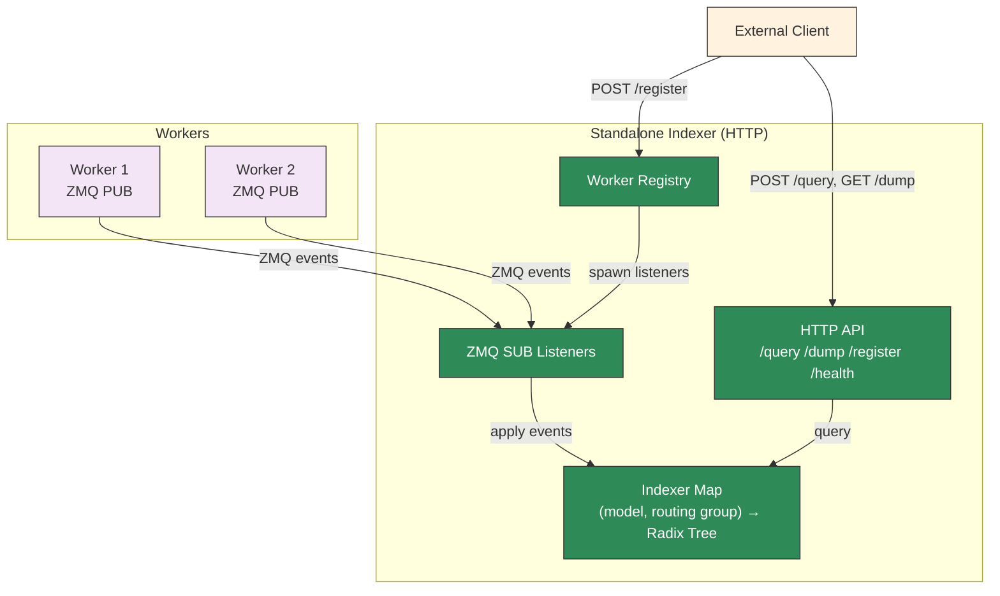
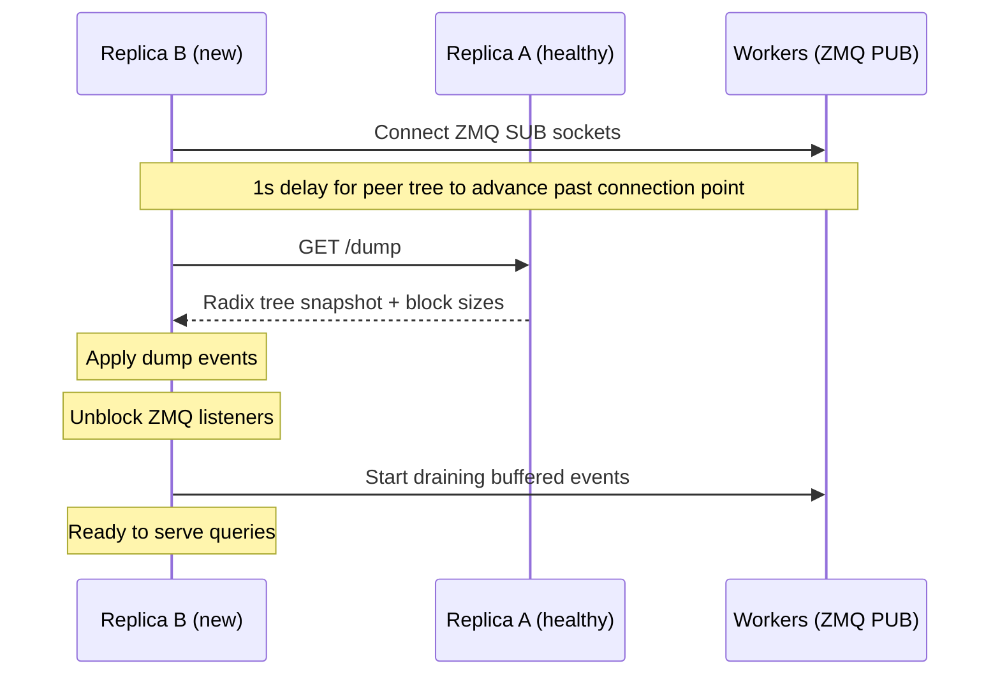

## Overview

The standalone KV indexer (`python -m dynamo.indexer`) is a lightweight service that maintains a radix tree of cached blocks and exposes HTTP endpoints for querying and managing workers.

- It subscribes to ZMQ KV event streams directly from workers.
- It exposes an HTTP API for registration, inspection, and overlap queries.
- It preserves P2P recovery and gap detection/replay for the standalone ZMQ path.
- It indexes device, host-pinned, and disk tier blocks and reports per-tier matches in `/query` responses.

This is distinct from the [Standalone Router](../../../components/src/dynamo/router/README.md), which is a full routing service. The standalone indexer provides only the indexing and query layer without routing logic.

For Dynamo-native remote indexing, use `--serve-indexer` on `dynamo.frontend` or `dynamo.router` and `--use-remote-indexer` on consumers instead. That request-plane service reuses the router's existing event ingestion and recovery machinery; it is not implemented by `dynamo.indexer`.

The HTTP API follows the [Mooncake KV Indexer RFC](https://github.com/kvcache-ai/Mooncake/issues/1403) conventions.

`DYN_ROUTER_MIN_INITIAL_WORKERS` is also honored here. When set to a positive integer, the
standalone indexer waits for that many workers to register before opening its startup-ready
gate, matching the frontend/router startup behavior.

## Model and Routing Group Support

The indexer maintains one radix tree per `(model_name, routing_group)` pair. Workers registered with different model names or routing groups are isolated into separate indexers. Queries against one pair never return scores from another.

- **`model_name`** (required on `/register` and `/query`): Identifies the model. Workers serving different models get separate radix trees.
- **`routing_group`** (optional, defaults to `"default"`): Identifies a statically assigned worker pool within the model. Omit it when the model does not need independently selectable pools.
- **`block_size`** is per-indexer: the first `/register` call for a given `(model_name, routing_group)` sets the block size. Subsequent registrations for the same pair must use the same block size or the request will fail.

## Compatibility

The standalone indexer works with any engine that publishes KV cache events over ZMQ in the expected msgpack format. This includes bare vLLM and SGLang engines, which emit ZMQ KV events natively — no Dynamo-specific wrapper is required.

Events tagged with non-device storage tiers (host-pinned, disk, external) are routed into a lower-tier slot rather than dropped, and surface in `/query` responses as `cpu` / `disk` reach.

## Use Cases

- **Debugging**: Inspect the radix tree state to verify which blocks are cached on which workers.
- **State verification**: Confirm that the indexer's view of KV cache state matches the router's internal state (used in integration tests).
- **Custom routing**: Build external routing logic that queries the indexer for overlap scores and makes its own worker selection decisions.
- **Monitoring**: Observe KV cache distribution across workers without running a full router.
- **Standalone microservice**: Run an indexer independently of the router/frontend when you want direct HTTP inspection and ZMQ-based ingestion.

## P2P Recovery

Multiple indexer replicas can subscribe to the same ZMQ worker endpoints for fault tolerance. When a replica starts (or restarts after a crash), it bootstraps its radix tree state from a healthy peer before processing live events.

### How It Works

1. Workers are registered via `--workers` or `/register`. Each ZMQ listener enters `pending` state and begins its initial subscribe/connect attempt in the background.
2. A 1-second delay biases peer recovery past the slow-joiner window, so the dump covers events that may have occurred before a fresh listener can safely start draining.
3. The indexer fetches a `/dump` from the first reachable peer in `--peers`.
4. Dump events are applied to populate the radix tree.
5. After recovery completes, the ready gate opens. Any listener whose initial ZMQ connect has already succeeded transitions to `active` and begins draining buffered events; listeners for workers that are still down remain `pending` until they connect.

If no peers are reachable, the indexer starts with an empty state.

### Example: Two-Replica Setup

```bash
# Replica A (first instance, no peers)
python -m dynamo.indexer --port 8090 --block-size 16 \
  --workers "1=tcp://worker1:5557,2=tcp://worker2:5558"

# Replica B (recovers from A on startup)
python -m dynamo.indexer --port 8091 --block-size 16 \
  --workers "1=tcp://worker1:5557,2=tcp://worker2:5558" \
  --peers "http://localhost:8090"
```

Both replicas subscribe to the same workers. Replica B recovers A's tree state on startup, then both independently process live ZMQ events going forward.

### Consistency

The dump is a weakly consistent BFS snapshot of the radix tree — concurrent writes may race with the traversal. This is acceptable because:

- **Stale blocks** (partially removed branches): live `Remove` events will clean them up.
- **Missing blocks** (partially added branches): live `Stored` events will add them.
- The tree converges to the correct state after live events catch up.

### Peer Management

Peers can be registered at startup via `--peers` or dynamically via the HTTP API. The peer list is used for recovery only — peers do not synchronize state in real time.

## Building

The service is exposed through the Python bindings package and launched with `python -m dynamo.indexer` after building the bindings with maturin. Feature flags control which capabilities are compiled in:

| Feature | Description |
|---------|-------------|
| `kv-indexer` | Core standalone indexer service path (`python -m dynamo.indexer`: HTTP API, ZMQ listeners, P2P recovery) |
| `kv-indexer-metrics` | Optional `/metrics` endpoint |

### Standalone build

```bash
cd lib/bindings/python && VIRTUAL_ENV=../../.venv ../../.venv/bin/maturin develop --uv --features kv-indexer
```

After installation, launch the service with `python -m dynamo.indexer`.

### Standalone build with metrics

```bash
cd lib/bindings/python && VIRTUAL_ENV=../../.venv ../../.venv/bin/maturin develop --uv --features kv-indexer,kv-indexer-metrics
```

This keeps the default `kv-indexer` build lean while still allowing Prometheus metrics when needed.

## CLI

```bash
python -m dynamo.indexer --port 8090 [--threads 4] [--block-size 16 --model-name my-model --routing-group default --workers "1=tcp://host:5557,2:1=tcp://host:5558"] [--peers "http://peer1:8090,http://peer2:8091"]
```

| Flag | Default | Description |
|------|---------|-------------|
| `--block-size` | (none) | KV cache block size for initial `--workers` (required when `--workers` is set) |
| `--port` | `8090` | HTTP server listen port |
| `--threads` | `4` | Number of indexer threads (1 = single-threaded, >1 = thread pool) |
| `--workers` | (none) | Initial workers as `instance_id[:dp_rank]=zmq_address,...` pairs (dp_rank defaults to 0) |
| `--model-name` | `default` | Model name for initial `--workers` |
| `--routing-group` | `default` | Routing group for initial `--workers` |
| `--peers` | (none) | Comma-separated peer indexer URLs for P2P recovery on startup |
| `--access-log` | (none) | Write one JSON access-log record per request to this file |
| `--trace-id-header` | `x-trace-id` | Request header copied into each access-log record's `trace_id` field |
| `--access-log-local-time` | disabled | Use local time for access-log timestamps instead of UTC |

### Shared Startup Gate

Set `DYN_ROUTER_MIN_INITIAL_WORKERS=<n>` to require at least `<n>` workers before the
standalone indexer, frontend push-router path, and KV router config-ready gate all proceed.
Leave it unset or set it to `0` to disable the startup wait.

## HTTP API

### `GET /health` — Liveness check

Returns `200 OK` unconditionally.

```bash
curl http://localhost:8090/health
```

### `GET /metrics` — Prometheus metrics

Returns metrics in Prometheus text exposition format. Available when the Python bindings are built with the `kv-indexer-metrics` feature.

```bash
curl http://localhost:8090/metrics
```

| Metric | Type | Labels | Description |
|--------|------|--------|-------------|
| `dynamo_kvindexer_request_duration_seconds` | Histogram | `endpoint` | HTTP request latency |
| `dynamo_kvindexer_requests_total` | Counter | `endpoint`, `method` | Total HTTP requests |
| `dynamo_kvindexer_errors_total` | Counter | `endpoint`, `status_class` | HTTP error responses (4xx/5xx) |
| `dynamo_kvindexer_models` | Gauge | — | Number of active model+routing-group indexers |
| `dynamo_kvindexer_workers` | Gauge | — | Number of registered worker instances |
| `dynamo_kvindexer_listeners` | Gauge | `status` | Number of ZMQ listeners by status (`pending`, `active`, `paused`, `failed`) |
| `dynamo_kvrouter_kv_cache_events_applied` | Counter | `event_type`, `status` | Primary device-tier KV events applied, partitioned by event type and result |
| `dynamo_kvrouter_kv_cache_event_warnings` | Counter | `warning_kind` | Suspicious-but-valid primary device-tier events, including duplicate STORE content |

The core event counters aggregate process-wide across model and routing-group indexers and
across all indexer threads. A `duplicate_store` warning is not necessarily an error:
peer recovery replay can reapply content already restored from a snapshot. Lower-tier
events and listener transport or replay failures are not represented by these core
event counters; use the standalone service metrics and logs for those paths. These
device-tier-only semantics apply to the standalone indexer. The frontend-embedded
router's component-scoped `dynamo_component_kv_cache_events_applied` counter includes
both device- and lower-tier events. See [KV Indexer Metrics](../../observability/metrics.md#kv-indexer-metrics).

### `POST /reopen_logs` — Reopen the access log

Reopen the file configured by `--access-log` after an external log rotation renames or
moves the active file. When access logging is disabled, the endpoint returns the same
successful no-op response.

```bash
curl -X POST http://localhost:8090/reopen_logs
```

Returns:

```json
{"status":"ok"}
```

### `POST /register` — Register an endpoint

Register a ZMQ endpoint for an instance. Each call creates or reuses the indexer for the given `(model_name, routing_group)` pair.
Registration is non-blocking: if the worker is not up yet, the listener is accepted in `pending` state and transitions to `active` once the initial ZMQ connection succeeds.

```bash
# Single model, default routing group
curl -X POST http://localhost:8090/register \
  -H 'Content-Type: application/json' \
  -d '{
    "instance_id": 1,
    "endpoint": "tcp://127.0.0.1:5557",
    "model_name": "llama-3-8b",
    "block_size": 16
  }'

# With an explicit routing group
curl -X POST http://localhost:8090/register \
  -H 'Content-Type: application/json' \
  -d '{
    "instance_id": 2,
    "endpoint": "tcp://127.0.0.1:5558",
    "model_name": "llama-3-8b",
    "routing_group": "customer-a",
    "block_size": 16,
    "dp_rank": 0
  }'
```

| Field | Required | Default | Description |
|-------|----------|---------|-------------|
| `instance_id` | yes | — | Worker instance identifier |
| `endpoint` | yes | — | ZMQ PUB address to subscribe to |
| `model_name` | yes | — | Model name (used to select the indexer) |
| `block_size` | yes | — | KV cache block size (must match the engine) |
| `routing_group` | no | `"default"` | Worker routing group |
| `dp_rank` | no | `0` | Data parallel rank |
| `replay_endpoint` | no | — | ZMQ ROUTER address for gap replay (e.g. `tcp://host:5560`) |
| `additional_salt` | no | — | Per-tenant salt (Mooncake RFC #1403 `additionalsalt`, alias accepted). Currently parsed for forward compatibility — engines apply their own salting today. |

For transition compatibility, indexer HTTP inputs also accept a string `tenant_id`, and the
CLI accepts the hidden `--tenant-id` flag. These values are ignored. `routing_group` always
controls worker eligibility; when it is omitted, the endpoint's normal default or all-groups
behavior applies. Responses never include `tenant_id`.

### `POST /unregister` — Deregister an instance

Remove an instance. Omitting `routing_group` removes the instance from every routing group for the given model; providing it targets one routing group.

```bash
# Remove from all routing groups
curl -X POST http://localhost:8090/unregister \
  -H 'Content-Type: application/json' \
  -d '{"instance_id": 1, "model_name": "llama-3-8b"}'

# Remove from a specific routing group
curl -X POST http://localhost:8090/unregister \
  -H 'Content-Type: application/json' \
  -d '{"instance_id": 1, "model_name": "llama-3-8b", "routing_group": "customer-a"}'

# Remove a specific dp_rank
curl -X POST http://localhost:8090/unregister \
  -H 'Content-Type: application/json' \
  -d '{"instance_id": 1, "model_name": "llama-3-8b", "routing_group": "default", "dp_rank": 0}'
```

| Field | Required | Default | Description |
|-------|----------|---------|-------------|
| `instance_id` | yes | — | Worker instance to remove |
| `model_name` | yes | — | Model name (identifies the indexer) |
| `routing_group` | no | — | Routing group (omit to remove from every group) |
| `dp_rank` | no | — | Specific dp_rank to remove (omit to remove all) |

### `GET /workers` — List registered instances

Returns all registered workers, optionally filtered by model and routing group.

| Query parameter | Description |
|-----------------|-------------|
| `model_name` | Return only workers registered for this model. Omit to return all models. |
| `routing_group` | Return only workers registered for this routing group. Omit to return all groups. |

```bash
# All workers
curl http://localhost:8090/workers

# Workers for a specific model
curl "http://localhost:8090/workers?model_name=llama-3-8b"

# Workers for a specific model and routing group
curl "http://localhost:8090/workers?model_name=llama-3-8b&routing_group=customer-a"
```

Returns:
```json
[
  {
    "instance_id": 1,
    "source": "zmq",
    "status": "active",
    "model_name": "llama-3-8b",
    "routing_group": "default",
    "block_size": 16,
    "endpoints": {
      "0": "tcp://127.0.0.1:5557",
      "1": "tcp://127.0.0.1:5558"
    },
    "listeners": {
      "0": {
        "endpoint": "tcp://127.0.0.1:5557",
        "status": "active"
      },
      "1": {
        "endpoint": "tcp://127.0.0.1:5558",
        "status": "active"
      }
    }
  }
]
```

| Response field | Description |
|----------------|-------------|
| `instance_id` | Worker instance identifier |
| `source` | Always `"zmq"` for ZMQ-managed workers |
| `status` | Aggregated listener status: `failed > pending > active > paused` |
| `model_name` | Model this worker is registered under |
| `routing_group` | Routing group this worker is registered under |
| `block_size` | KV cache block size for this worker's `(model_name, routing_group)` indexer |
| `endpoints` | Map of `dp_rank → zmq_address` |
| `listeners` | Per-dp_rank listener detail; each entry may include a `last_error` field when the most recent startup or recv-loop attempt failed |

Filters are independent — providing both `model_name` and `routing_group` returns only workers matching both. An empty array is returned (not a 404) when no workers match the filter.

### `POST /query` — Query overlap for token IDs

Given raw token IDs, compute block hashes and return per-instance overlap scores (in matched tokens):

```bash
curl -X POST http://localhost:8090/query \
  -H 'Content-Type: application/json' \
  -d '{"token_ids": [1, 2, 3, 4, 5, 6, 7, 8, 9, 10, 11, 12, 13, 14, 15, 16], "model_name": "llama-3-8b"}'
```

Returns:
```json
{
  "scores": {"1": {"0": 32}, "2": {"1": 0}},
  "frequencies": [1, 1],
  "instances": {
    "1": {
      "longest_matched": 48,
      "gpu": 32,
      "dp": {"0": 32},
      "cpu": 48,
      "disk": 48
    },
    "2": {
      "longest_matched": 0,
      "gpu": 0,
      "dp": {"1": 0},
      "cpu": 0,
      "disk": 0
    }
  }
}
```

All counts are in **matched tokens** (block overlap count × block size).

- `scores` / `frequencies`: legacy device-tier overlap. `scores` is nested by `instance_id` then `dp_rank`. Preserved for backward compatibility — existing callers do not need to change.
- `instances`: per-instance, per-tier breakdown aligned with [Mooncake RFC #1403](https://github.com/kvcache-ai/Mooncake/issues/1403). See [Per-instance tier breakdown](#per-instance-tier-breakdown) below.

| Field | Required | Default | Description |
|-------|----------|---------|-------------|
| `token_ids` | yes | — | Token sequence to query |
| `model_name` | yes | — | Model name (selects the indexer) |
| `routing_group` | no | `"default"` | Worker routing group |
| `lora_name` | no | — | LoRA adapter (overrides indexer-level lora_name for this query) |
| `cache_salt` | no | — | Per-request cache salt (Mooncake RFC #1403). The indexer mixes it into hashes computed from `token_ids`; equal tokens with different salts do not match. |

### `POST /query_by_hash` — Query overlap for pre-computed hashes

```bash
curl -X POST http://localhost:8090/query_by_hash \
  -H 'Content-Type: application/json' \
  -d '{"block_hashes": [123456, 789012], "model_name": "llama-3-8b"}'
```

Same response format as `/query`, including the per-instance `instances` map. Scores are in matched tokens.

| Field | Required | Default | Description |
|-------|----------|---------|-------------|
| `block_hashes` | yes | — | Pre-computed block hash array |
| `model_name` | yes | — | Model name (selects the indexer) |
| `routing_group` | no | `"default"` | Worker routing group |
| `cache_salt` | no | — | Must be omitted or `null`. Any string value, including an empty string, returns `400 Bad Request`. |

`block_hashes` are opaque outputs of token hashing, so the indexer cannot apply or verify a salt
after they have been computed. Callers must precompute these hashes with the intended cache salt
and omit `cache_salt` from `/query_by_hash`. Use `/query` when the indexer should compute salted
hashes from tokens server-side.

### Per-instance tier breakdown

Each entry in `instances` is keyed by `instance_id` (as a string) and reports prefix reach across the device, host-pinned, and disk storage tiers:

| Field | Description |
|-------|-------------|
| `gpu` | Tokens matched on the device tier (the longest device-tier prefix for any `dp_rank` of this instance). |
| `dp` | Per-`dp_rank` device-tier match count, as `{rank: tokens}`. |
| `cpu` | Tokens matched through the host-pinned tier. **Cumulative** through the device tier — includes everything counted in `gpu` plus any host-pinned extension. |
| `disk` | Tokens matched through the disk (or external) tier. **Cumulative** through the device → host-pinned walk. |
| `longest_matched` | The maximum of `gpu`, `cpu`, and `disk` — a single "best prefix length" the gateway can sort on. |

Tier counts are cumulative because the lower-tier walk reports each tier's *extension* on top of the previous one. Under a natural offload pipeline (device → host → disk), this guarantees `gpu ≤ cpu ≤ disk` for every instance — lower tiers extend the device-tier prefix rather than shrink it.

Legacy callers that only consume `scores` keep working: those values are equal to each instance's per-`dp_rank` `gpu` count.

### `GET /dump` — Dump all radix tree events

Returns the full radix tree state as a JSON object keyed by `model_name:routing_group`:

```bash
curl http://localhost:8090/dump
```

Returns:
```json
{
  "llama-3-8b:default": {
    "block_size": 16,
    "events": [<RouterEvent>, ...]
  },
  "mistral-7b:customer-a": {
    "block_size": 16,
    "events": [<RouterEvent>, ...]
  }
}
```

Each indexer is dumped concurrently. The `block_size` field lets recovering peers create indexers with the correct block size without requiring `--block-size` on every replica.

### `POST /register_peer` — Register a peer indexer

```bash
curl -X POST http://localhost:8090/register_peer \
  -H 'Content-Type: application/json' \
  -d '{"url": "http://peer:8091"}'
```

### `POST /deregister_peer` — Remove a peer indexer

```bash
curl -X POST http://localhost:8090/deregister_peer \
  -H 'Content-Type: application/json' \
  -d '{"url": "http://peer:8091"}'
```

### `GET /peers` — List registered peers

```bash
curl http://localhost:8090/peers
```

Returns:
```json
["http://peer:8091"]
```

## DP Rank Handling

When a worker registers with the standalone KV indexer (`/register`), it provides an `instance_id`, a ZMQ `endpoint`, and an optional `dp_rank` (defaults to 0). The service spawns one ZMQ listener per registration.

Each incoming `KvEventBatch` may carry an optional `data_parallel_rank` field. If present, it **overrides** the statically-registered `dp_rank` for that batch. This allows a single ZMQ port to multiplex events from multiple DP ranks.

**Caveat**: the registry only tracks dp_ranks from explicit `/register` calls. If an engine dynamically emits batches with a dp_rank that was never registered, the indexer will store those blocks correctly (under the dynamic `WorkerWithDpRank` key), but per-dp_rank deregistration (`/unregister` with `dp_rank`) will not find them. Full-instance deregistration (`/unregister` without `dp_rank`) still cleans up all dp_ranks for a given `worker_id` in the tree via `remove_worker`.

## Gap Detection and Replay

ZMQ PUB/SUB is lossy — messages can be dropped under backpressure or brief disconnects. The indexer detects gaps by tracking the sequence number of each batch: if `seq > last_seq + 1`, a gap is detected.

When a `replay_endpoint` is provided during `/register`, the indexer connects a DEALER socket to the engine's ROUTER socket and requests the missing batches by sequence number. The engine streams back buffered `(seq, payload)` pairs from its ring buffer until an empty-payload sentinel.

If no `replay_endpoint` is configured, gaps are logged as warnings but not recovered.

The sequence counter (`last_seq`) persists across unregister/register cycles, so re-registering a worker after a gap will trigger replay on the first batch received by the new listener.

## Limitations

- **Standalone mode is ZMQ only**: Workers must publish KV events via ZMQ PUB sockets.
- **No routing logic**: The indexer only maintains the radix tree and answers queries. It does not track active blocks, manage request lifecycle, or perform worker selection.

## Architecture

### Standalone Mode



### P2P Recovery Flow



## See Also

- **[Mooncake KV Indexer RFC](https://github.com/kvcache-ai/Mooncake/issues/1403)**: Community API standardization for KV cache indexers
- **[Configuration and Tuning](router-configuration.md)**: Full KV router configuration and tuning
- **[Router Design](../../design-docs/router-design.md)**: Architecture and event transport modes
- **[Standalone Router](../../../components/src/dynamo/router/README.md)**: Full routing service (routes requests to workers)
