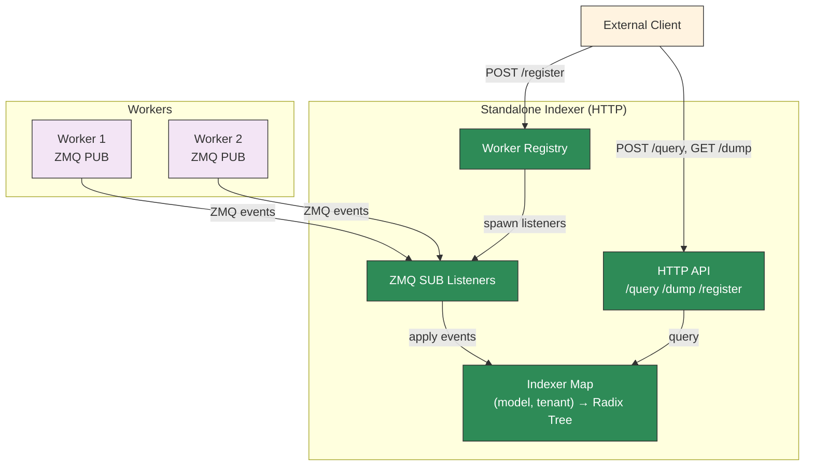

## Overview

The standalone KV indexer (`dynamo-kv-indexer`) is a lightweight HTTP binary that subscribes to ZMQ KV event streams from workers, maintains a radix tree of cached blocks, and exposes HTTP endpoints for querying and managing workers.

This is distinct from the [Standalone Router](../../../components/src/dynamo/router/README.md), which is a full routing service. The standalone indexer provides only the indexing and query layer without routing logic.

The HTTP API follows the [Mooncake KV Indexer RFC](https://github.com/kvcache-ai/Mooncake/issues/1403) conventions.

## Multi-Model and Multi-Tenant Support

The indexer maintains one radix tree per `(model_name, tenant_id)` pair. Workers registered with different model names or tenant IDs are isolated into separate indexers — queries against one model/tenant never return scores from another.

- **`model_name`** (required on `/register` and `/query`): Identifies the model. Workers serving different models get separate radix trees.
- **`tenant_id`** (optional, defaults to `"default"`): Enables multi-tenant isolation within the same model. Omit for single-tenant deployments.
- **`block_size`** is per-indexer: the first `/register` call for a given `(model_name, tenant_id)` sets the block size. Subsequent registrations for the same pair must use the same block size or the request will fail.

## Compatibility

The standalone indexer works with any engine that publishes KV cache events over ZMQ in the expected msgpack format. This includes bare vLLM and SGLang engines, which emit ZMQ KV events natively — no Dynamo-specific wrapper is required.

## Use Cases

- **Debugging**: Inspect the radix tree state to verify which blocks are cached on which workers.
- **State verification**: Confirm that the indexer's view of KV cache state matches the router's internal state (used in integration tests).
- **Custom routing**: Build external routing logic that queries the indexer for overlap scores and makes its own worker selection decisions.
- **Monitoring**: Observe KV cache distribution across workers without running a full router.

## Building

The binary is a feature-gated target in the `dynamo-kv-router` crate:

```bash
cargo build -p dynamo-kv-router --features indexer-bin --bin dynamo-kv-indexer
```

## CLI

```bash
dynamo-kv-indexer --port 8090 [--threads 1] [--block-size 16 --model-name my-model --tenant-id default --workers "1=tcp://host:5557,2=tcp://host:5558"]
```

| Flag | Default | Description |
|------|---------|-------------|
| `--block-size` | (none) | KV cache block size for initial `--workers` (required when `--workers` is set) |
| `--port` | `8090` | HTTP server listen port |
| `--threads` | `1` | Number of indexer threads (1 = single-threaded, >1 = thread pool) |
| `--workers` | (none) | Initial workers as `instance_id=zmq_address,...` pairs |
| `--model-name` | `default` | Model name for initial `--workers` |
| `--tenant-id` | `default` | Tenant ID for initial `--workers` |

## HTTP API

### `POST /register` — Register an endpoint

Register a ZMQ endpoint for an instance. Each call creates or reuses the indexer for the given `(model_name, tenant_id)` pair.

```bash
# Single model, default tenant
curl -X POST http://localhost:8090/register \
  -H 'Content-Type: application/json' \
  -d '{
    "instance_id": 1,
    "endpoint": "tcp://127.0.0.1:5557",
    "model_name": "llama-3-8b",
    "block_size": 16
  }'

# With tenant isolation
curl -X POST http://localhost:8090/register \
  -H 'Content-Type: application/json' \
  -d '{
    "instance_id": 2,
    "endpoint": "tcp://127.0.0.1:5558",
    "model_name": "llama-3-8b",
    "tenant_id": "customer-a",
    "block_size": 16,
    "dp_rank": 0
  }'
```

| Field | Required | Default | Description |
|-------|----------|---------|-------------|
| `instance_id` | yes | — | Worker instance identifier |
| `endpoint` | yes | — | ZMQ PUB address to subscribe to |
| `model_name` | yes | — | Model name (used to select the indexer) |
| `block_size` | yes | — | KV cache block size (must match the engine) |
| `tenant_id` | no | `"default"` | Tenant identifier for isolation |
| `dp_rank` | no | `0` | Data parallel rank |

### `POST /unregister` — Deregister an instance

Remove an instance. Omitting `tenant_id` removes the instance from **all** tenants for the given model; providing it targets only that tenant's indexer.

```bash
# Remove from all tenants
curl -X POST http://localhost:8090/unregister \
  -H 'Content-Type: application/json' \
  -d '{"instance_id": 1, "model_name": "llama-3-8b"}'

# Remove from a specific tenant
curl -X POST http://localhost:8090/unregister \
  -H 'Content-Type: application/json' \
  -d '{"instance_id": 1, "model_name": "llama-3-8b", "tenant_id": "customer-a"}'

# Remove a specific dp_rank
curl -X POST http://localhost:8090/unregister \
  -H 'Content-Type: application/json' \
  -d '{"instance_id": 1, "model_name": "llama-3-8b", "tenant_id": "default", "dp_rank": 0}'
```

| Field | Required | Default | Description |
|-------|----------|---------|-------------|
| `instance_id` | yes | — | Worker instance to remove |
| `model_name` | yes | — | Model name (identifies the indexer) |
| `tenant_id` | no | — | Tenant identifier (omit to remove from all tenants) |
| `dp_rank` | no | — | Specific dp_rank to remove (omit to remove all) |

### `GET /workers` — List registered instances

```bash
curl http://localhost:8090/workers
```

Returns:
```json
[{"instance_id": 1, "endpoints": {"0": "tcp://127.0.0.1:5557", "1": "tcp://127.0.0.1:5558"}}]
```

### `POST /query` — Query overlap for token IDs

Given raw token IDs, compute block hashes and return per-instance overlap scores (in matched tokens):

```bash
curl -X POST http://localhost:8090/query \
  -H 'Content-Type: application/json' \
  -d '{"token_ids": [1, 2, 3, 4, 5, 6, 7, 8, 9, 10, 11, 12, 13, 14, 15, 16], "model_name": "llama-3-8b"}'
```

Returns:
```json
{
  "scores": {"1": {"0": 32}, "2": {"1": 0}},
  "frequencies": [1, 1],
  "tree_sizes": {"1": {"0": 5}, "2": {"1": 3}}
}
```

Scores are in **matched tokens** (block overlap count × block size). Nested by `instance_id` then `dp_rank`.

| Field | Required | Default | Description |
|-------|----------|---------|-------------|
| `token_ids` | yes | — | Token sequence to query |
| `model_name` | yes | — | Model name (selects the indexer) |
| `tenant_id` | no | `"default"` | Tenant identifier |
| `lora_name` | no | — | LoRA adapter (overrides indexer-level lora_name for this query) |

### `POST /query_by_hash` — Query overlap for pre-computed hashes

```bash
curl -X POST http://localhost:8090/query_by_hash \
  -H 'Content-Type: application/json' \
  -d '{"block_hashes": [123456, 789012], "model_name": "llama-3-8b"}'
```

Same response format as `/query`. Scores are in matched tokens.

| Field | Required | Default | Description |
|-------|----------|---------|-------------|
| `block_hashes` | yes | — | Pre-computed block hash array |
| `model_name` | yes | — | Model name (selects the indexer) |
| `tenant_id` | no | `"default"` | Tenant identifier |

### `GET /dump` — Dump all radix tree events

Returns the full radix tree state as a JSON object keyed by `model_name:tenant_id`:

```bash
curl http://localhost:8090/dump
```

Returns:
```json
{
  "llama-3-8b:default": [<RouterEvent>, ...],
  "mistral-7b:customer-a": [<RouterEvent>, ...]
}
```

Each indexer is dumped concurrently.

## Limitations

- **ZMQ only**: Workers must publish KV events via ZMQ PUB sockets. The standalone indexer does not subscribe to NATS event streams.
- **No routing logic**: The indexer only maintains the radix tree and answers queries. It does not track active blocks, manage request lifecycle, or perform worker selection.

## Architecture



## See Also

- **[Mooncake KV Indexer RFC](https://github.com/kvcache-ai/Mooncake/issues/1403)**: Community API standardization for KV cache indexers
- **[Router Guide](router-guide.md)**: Full KV router configuration and tuning
- **[Router Design](../../design-docs/router-design.md)**: Architecture and event transport modes
- **[Standalone Router](../../../components/src/dynamo/router/README.md)**: Full routing service (routes requests to workers)
