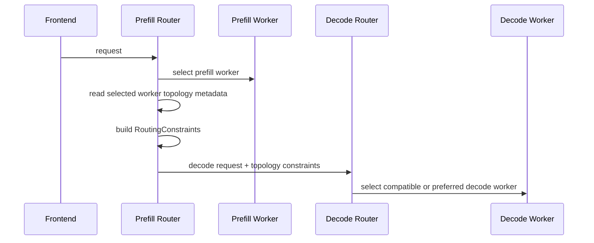

Topology-aware KV transfer constrains or biases decode worker selection after a prefill worker has been selected. The router derives standard `RoutingConstraints` from the selected prefill worker's published topology metadata, then merges those constraints into the decode request.

Use the Kubernetes operator path when possible.
For deployment examples, see [Kubernetes Topology-Aware KV Transfer](../../kubernetes/topology-aware-kv-transfer.md).

## Runtime Contract

Workers publish topology and policy fields through `ModelRuntimeConfig`:

| Field | Meaning |
|-------|---------|
| `topology_domains` | Map of logical domain name to this worker's topology value, for example `{"zone": "us-east-1a"}`. |
| `kv_transfer_domain` | Domain key used for prefill-to-decode KV transfer routing, for example `zone`. |
| `kv_transfer_enforcement` | `required` or `preferred`. |
| `kv_transfer_preferred_weight` | Preferred-taint weight used only when enforcement is `preferred`. |

Each topology entry also becomes a canonical worker taint:

```text
dynamo.topology/<domain>=<value>
```

For example:

```json
{
  "topology_domains": {
    "zone": "us-east-1a",
    "rack": "rack-22"
  },
  "kv_transfer_domain": "zone",
  "kv_transfer_enforcement": "preferred",
  "kv_transfer_preferred_weight": 0.85
}
```

This creates worker taints:

```text
dynamo.topology/zone=us-east-1a
dynamo.topology/rack=rack-22
```

The KV-transfer policy uses only `kv_transfer_domain` to derive the decode constraint. Other topology domains remain available as ordinary routing taints.

## Request Flow



The prefill router builds the decode constraint before dispatching prefill when the selected worker is already known. This keeps `required` policy fail-closed: if the router cannot derive authoritative decode constraints for a required policy, it fails the request instead of dispatching prefill and then discovering that decode cannot be routed safely.

## Enforcement Modes

### Required

`required` turns the selected prefill worker's transfer-domain topology into a required taint.

```text
required_taints = {"dynamo.topology/zone=us-east-1a"}
```

Decode workers without that taint are ineligible. If no eligible decode worker exists, routing returns no endpoint for that request.

### Preferred

`preferred` turns the same topology into a preferred taint.

```text
preferred_taints = {"dynamo.topology/zone=us-east-1a": 0.85}
```

All decode workers remain eligible, but matching workers receive a lower routing cost. `preferredWeight` controls the strength of the preference from `0` to `1`.

## Worker Environment Contract

The Python backend utility reads topology from files and transfer policy from environment variables:

| Environment variable | Description |
|----------------------|-------------|
| `DYN_TOPOLOGY_ENABLED` | Set to `true` to enable topology reading. |
| `DYN_TOPOLOGY_MOUNT_PATH` | Directory containing topology files. Defaults to `/etc/dynamo/topology`. |
| `DYN_KV_TRANSFER_DOMAIN` | Required when topology is enabled. Names the topology file and runtime domain to use for KV transfer constraints. |
| `DYN_KV_TRANSFER_ENFORCEMENT` | `required` or `preferred`. Defaults to `required` when a domain is set. |
| `DYN_KV_TRANSFER_PREFERRED_WEIGHT` | Weight used when enforcement is `preferred`. |

Each non-hidden, non-empty file under `DYN_TOPOLOGY_MOUNT_PATH` is interpreted as one topology domain. The file name is the domain; the file content is the worker's value for that domain.

For example:

```bash
mkdir -p /tmp/dynamo-topology
printf 'us-east-1a\n' > /tmp/dynamo-topology/zone

export DYN_TOPOLOGY_ENABLED=true
export DYN_TOPOLOGY_MOUNT_PATH=/tmp/dynamo-topology
export DYN_KV_TRANSFER_DOMAIN=zone
export DYN_KV_TRANSFER_ENFORCEMENT=required
```

When topology is enabled, the worker polls until the selected transfer-domain file exists and has content. If it remains missing or empty through the timeout window, the worker exits so the bad topology source is visible during startup.

## Backend Support

The integrated Python backends apply the topology config during worker registration:

- vLLM
- SGLang
- TensorRT-LLM

The topology utility writes the fields onto `ModelRuntimeConfig`; Rust owns validation and canonical topology-taint generation.

## Interactions with Existing Routing Constraints

Topology-aware KV transfer uses the existing `RoutingConstraints` path. It does not add a topology-specific selector. If a request already has routing constraints, the prefill router merges the generated topology constraints into the decode request:

- Required topology taints are appended to existing `required_taints`.
- Preferred topology taints are appended to existing `preferred_taints`.

User-provided constraints still apply. A decode worker must satisfy all required constraints to be eligible.

## Operational Notes

- Configure this only for disaggregated prefill/decode deployments. Aggregated workers do not perform a remote prefill-to-decode KV transfer.
- Keep `DYN_ROUTER_MODE=kv` on the frontend so the prefill and decode routing paths use the KV router.
- Make sure every prefill domain has enough decode capacity when using `required`; otherwise the router can legitimately fail requests in domains without decode workers.
- Use `preferred` during incremental rollouts when same-domain transfer is a latency preference rather than a hard placement requirement.
- Transport health is separate from topology selection. Topology-aware routing chooses a better peer, but RDMA, EFA, UCX, or libfabric still need to be configured correctly for NIXL KV transfer.

## Troubleshooting Signals

| Symptom | Likely cause | Check |
|---------|--------------|-------|
| Worker exits during startup | `DYN_KV_TRANSFER_DOMAIN` missing, or topology file never populated. | Worker logs and contents of `DYN_TOPOLOGY_MOUNT_PATH`. |
| Required policy returns no endpoint | No decode worker has the selected prefill worker's generated topology taint. | Worker `ModelRuntimeConfig` topology metadata and decode worker placement. |
| Preferred policy still routes cross-domain | Matching domain is overloaded or unavailable, or weight is too low relative to load. | Increase `preferredWeight`, add same-domain decode capacity, or switch to `required`. |
| Router sees no topology metadata | Worker did not publish topology fields. | Backend startup logs and runtime config metrics/discovery data. |

For Kubernetes-specific verification commands, see
[Verify the Deployment](../../kubernetes/topology-aware-kv-transfer.md#verify-the-deployment).
