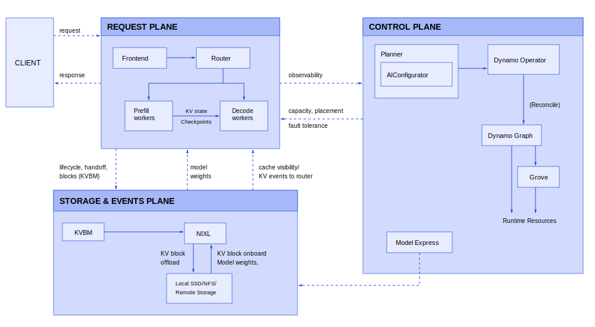

  <a href="./architecture.md" hreflang="en">English</a> | <strong>简体中文</strong>

# Dynamo 架构

Dynamo 是面向生成式 AI 系统的分布式推理运行时，适用于必须在变化的流量条件下保持高吞吐、低延迟和高可靠性的场景。它不绑定具体后端（SGLang、TRT-LLM、vLLM 等），并围绕三个相互协作的关注点构建：

- 用于 token 生成的快速 **request path**
- 用于扩缩容和放置的响应式 **control path**
- 用于 KV 复用和故障恢复的弹性 **state path**

本文从架构视角介绍 Dynamo，而不是罗列功能：每个平面负责什么、请求如何流转、系统如何自适应，以及在故障下如何保持正确性。

## 设计目标

Dynamo 旨在同时满足以下目标：

1. **延迟稳定性**：在突发流量和混合长度流量下，让 TTFT 和 ITL 保持可预测。
2. **GPU 效率**：解耦 prefill 和 decode，使二者可以独立扩缩容。
3. **计算复用**：通过 KV 感知路由和缓存生命周期管理，最大限度减少 KV 重新计算。
4. **运维弹性**：将 worker 崩溃、重启和过载视为正常运行事件。
5. **部署可移植性**：支持 Kubernetes 原生控制路径和非 Kubernetes 运行模式。

## 为什么需要这种架构

现代 LLM 服务会反复遇到一些瓶颈：

- **Prefill/decode 不均衡** 会在流量组合变化时导致 GPU 利用率不足（[DistServe](https://arxiv.org/abs/2401.09670)）。
- **KV 重新计算** 会在路由忽略缓存重叠时增加 TTFT 并浪费计算资源（[DeepSeek](https://arxiv.org/abs/2501.12948)）。
- 来自长上下文和并发的 **内存压力** 在没有多层缓存管理的情况下会超出 HBM 容量（[KVBM](https://docs.nvidia.com/dynamo/components/kvbm)、[Mooncake](https://kvcache-ai.github.io/Mooncake/design/mooncake-store.html)、[AIBrix](https://blog.vllm.ai/2025/02/21/aibrix-release.html)、[FlexKV](https://github.com/taco-project/FlexKV)、[LMCache](https://lmcache.ai/)）。
- **动态需求** 会打破静态资源预置的假设（[AzureTrace](https://github.com/Azure/AzurePublicDataset)）。
- **真实世界故障**（pod 重启、分区、热点过载）需要一等的恢复行为。

Dynamo 通过将服务、控制和状态传播拆分为明确的平面与控制循环来应对这些约束。

## 架构概览

## 系统模型

### Request Plane（关键数据路径）

request plane 负责请求/响应执行：

- **Frontend** 接收并规范化请求。
- **Router** 基于负载和 KV 重叠选择 worker。
- **Prefill workers** 计算 prompt KV 状态。
- **Decode workers** 生成输出 token。

该路径针对低开销和连续 token 流式输出进行优化。

### Control Plane（自适应与编排路径）

control plane 负责期望状态管理：

- **Planner** 根据实时指标计算扩缩容目标。
- **Dynamo Operator** 根据 Dynamo CRD 协调 Kubernetes 资源。
- **Discovery + Endpoints/CRD** 建立存活状态和可发现性。
- **Grove/KAI Scheduler path** 在多节点 Kubernetes 部署中提供拓扑感知放置和分组扩缩容。
- **Model Express** 在配置后作为可选的模型管理端点。

该路径针对正确性以及向目标容量收敛进行优化。

### Storage & Events Plane（状态传播路径）

storage/events plane 负责缓存状态可见性和移动：

- **KV Events** 发布缓存生命周期转换。
- **KVBM** 管理跨内存层级的 block 复用、驱逐以及 offload/recall。
- **NIXL** 在 workers 和内存域之间执行高速 KV/data 传输。

该路径针对缓存复用和跨 worker 交接效率进行优化。

## 端到端请求叙事（Disaggregated Mode）

1. Client 将请求发送到 **Frontend**。
2. Frontend 进行校验/预处理，并转发给 **Router**。
3. Router 选择一个 **Prefill worker**。
4. Prefill 计算 KV 并返回传输元数据。
5. Router 选择一个 **Decode worker**。
6. Decode 接收 KV 状态（通常通过 **NIXL** 传输路径）。
7. Decode 通过 Frontend 流式返回 token。
8. **KV Events** 更新缓存可见性，供未来路由决策使用。
9. **KVBM** 可以根据压力和复用潜力 offload 或 recall KV blocks。

有关流程级细节，请参阅 [Architecture Flow](dynamo-flow.md)。
有关请求传输选项，请参阅 [Request Plane](request-plane.md)。

## 控制循环

### Serving Loop

在 frontend、router、prefill 和 decode workers 之间维持低延迟请求执行。

### Planning Loop

保持容量与需求一致：

- Planner 消费运行时指标。
- Planner 计算 prefill/decode 目标。
- Connector layer 将目标应用到运行时资源。

Planner 支持基于吞吐量和基于负载的策略。请参阅 [Planner Design](planner-design.md)。

### Resilience Loop

在故障下维持系统连续性：

- Health checks 检测不健康的 workers。
- Discovery liveness 移除陈旧端点。
- Graceful shutdown 排空正在处理的工作。
- Request migration/cancellation 控制正在处理中的行为。
- Load shedding 防止过载下的级联崩溃。

请参阅 [Fault Tolerance](../fault-tolerance/README.md)。

## Kubernetes 原生实现（CRD + Grove）

在 Kubernetes 部署中，同一架构映射为声明式资源：

- Dynamo Operator 协调 `DynamoGraphDeployment`。
- 可发现性由 `DynamoWorkerMetadata` + EndpointSlices 派生。
- Grove 支持的多节点部署将 worker groups 建模为 `PodCliqueSet` 和 `PodClique`。
- 独立的 prefill/decode 弹性通过 `PodCliqueScalingGroup` 表示，并使用独立的 `replicas` 和 `min` 目标。

图中的 `PodClique A/B`、`ScalingGroup "Prefill"`、`ScalingGroup "Decode"` 和 `(replicas, min)` 等标签表示这种分组扩缩容模型。

## Fault Tolerance 架构

Fault tolerance 嵌入在各层中：

| 层 | 机制 | 实际效果 |
|------|-----------|------------------|
| Request | Migration、cancellation | 正在处理的工作可以继续，或按意图终止 |
| Worker | Health checks、graceful shutdown、endpoint draining | 失败/正在终止的 workers 会安全地停止接收新流量 |
| System | Request rejection/load shedding | 防止过载在 workers 之间传播 |
| Infrastructure | Discovery lease expiry、event-path recovery | 移除陈旧成员并重新路由流量 |

该模型假定故障是常规事件，而非异常事件。

## 性能依据

### 分离式服务

分离 prefill 和 decode 可以提升利用率，并支持按阶段扩缩容。

*在 H100 上使用 vLLM 运行 R1 Distilled Llama 70B FP8 进行测试。3K ISL / 150 OSL。*

### KV-Aware Routing

结合缓存重叠和负载信号的路由可以减少 prefill 重新计算并改善延迟。
有关外部生产案例研究，请参阅 [How Baseten achieved 2x faster inference with NVIDIA Dynamo](https://www.baseten.co/blog/how-baseten-achieved-2x-faster-inference-with-nvidia-dynamo/#how-baseten-uses-nvidia-dynamo)。

*使用 2 个 H100 节点上的 R1 Distilled Llama 70B FP8，对 R1 发起 100K 个请求进行测试。平均 4K ISL / 800 OSL。*

### KV Block Manager (KVBM)

KVBM 通过多层内存 offload/recall 扩展有效缓存容量。

*使用 H100 上的 Qwen3-8B，在不同 QPS 值下测试。平均 20K ISL / 100 OSL。*

### NIXL Data Transfer

NIXL 通过优化跨异构内存的 worker 间传输行为，降低分布式服务中的 KV 交接成本。

## 实现模型

- **Rust** 用于性能敏感的运行时组件。
- **Python** 用于后端集成和可扩展性。
- 模块化子系统边界使 routing、planning、memory 和 transport 可以独立演进。

## 相关文档

- [Architecture Flow](dynamo-flow.md)
- [Router Design](router-design.md)
- [Planner Design](planner-design.md)
- [Discovery Plane](discovery-plane.md)
- [Event Plane](event-plane.md)
- [Request Plane](request-plane.md)
- [Fault Tolerance](../fault-tolerance/README.md)
- [Grove](../kubernetes/grove.md)

## 致谢

Dynamo 受到以下既有开源工作的启发：

- vLLM
- SGLang
- DistServe
- Mooncake
- AIBrix
- BentoML
