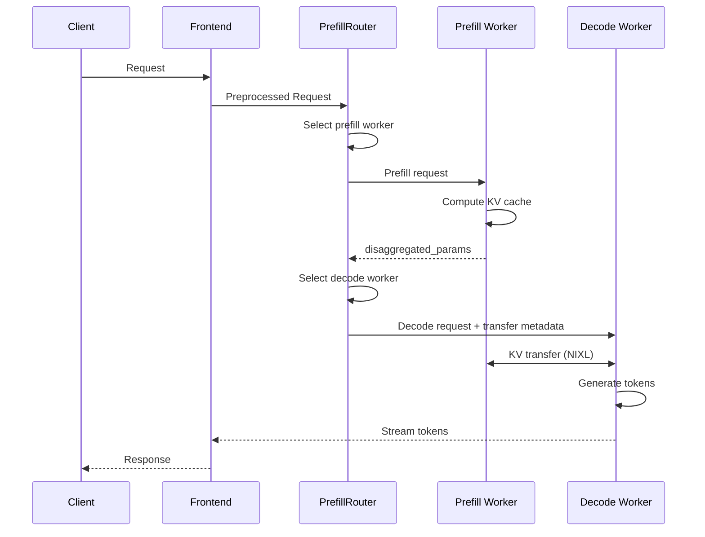

  <a href="./disagg-serving.md" hreflang="en">English</a> | <strong>简体中文</strong>

LLM 请求的预填充和解码阶段具有不同的计算特征和内存占用。将这些阶段拆分到专门的 llm engine 中，可以实现更好的硬件分配、更高的可扩展性以及整体性能提升。例如，对受内存限制的解码阶段使用更大的 TP，而对受计算限制的预填充阶段使用更小的 TP，可以让两个阶段都高效执行。此外，对于长上下文请求，将其预填充阶段分离到专用的 prefill engine 中，可以让正在进行的解码请求得到高效处理，而不会被这些长预填充阻塞。

一次请求的解耦执行主要包含三个步骤：
1. Prefill engine 计算预填充阶段并生成 KV cache
2. Prefill engine 将 KV cache 传输到 decode engine
3. Decode engine 计算解码阶段。

Dynamo 中的解耦设计提供了一个灵活的框架，可在多种条件下实现强劲性能。

## 高效 KV 传输

高性能解耦的关键是高效的 KV 传输。Dynamo 利用 NIXL 将 KV cache 直接从 prefill engine 的 VRAM 传输到 decode engine 的 VRAM。KV 传输是非阻塞的，因此在传输期间 GPU forward pass 仍可继续为其他请求服务。

### Router 编排

解耦 serving 流程由 `PrefillRouter` 编排：

1. **Worker 选择**：Router 使用 KV 感知路由（基于 cache 重叠分数和负载）或简单负载均衡来选择 prefill worker。

2. **Prefill 执行**：Router 将预填充请求发送给选定的 prefill worker。Prefill worker 计算 KV cache，并返回包含后端特定传输元数据的 `disaggregated_params`。

3. **Decode 路由**：Router 将 prefill 结果注入到 decode 请求中，然后路由到 decode worker。

4. **KV 传输**：Decode worker 使用传输元数据与 prefill worker 协调。NIXL 使用最佳可用传输方式（NVLink、InfiniBand/UCX 等）处理直接 GPU 到 GPU 传输。

### 后端特定传输元数据

传输元数据格式因后端而异：

- **SGLang**：使用 `bootstrap_info`（host、port、room_id）进行 RDMA bootstrap 协调。SGLang prefill worker 会在初始化期间将其 bootstrap endpoint 发布到 discovery service。借助这种机制，prefill 可以作为后台任务运行，使 decode 阶段能够立即开始，同时 KV 传输并行进行。

- **vLLM**：使用包含 block ID 和远程 worker 连接信息的 `kv_transfer_params`。Prefill 同步运行；decode 会等待 prefill 完成后再继续。

- **TRTLLM**：使用包含序列化 TRT-LLM 内部元数据的 `opaque_state`。Prefill 同步运行；decode 会等待 prefill 完成后再继续。

## 运行时可重新配置的 xPyD

Dynamo 的解耦设计支持运行时可重新配置的 xPyD（x 个 prefill worker，y 个 decode worker）。Worker 可以在运行时添加和移除：

- **添加 worker**：Worker 向 discovery service 注册，并发布其 `RuntimeConfig`（包括 KV 容量）。
- **移除 worker**：Worker 排空活跃请求，并从 discovery 注销。

Router 会通过 discovery service 自动发现新的 worker，并将其纳入路由决策。
