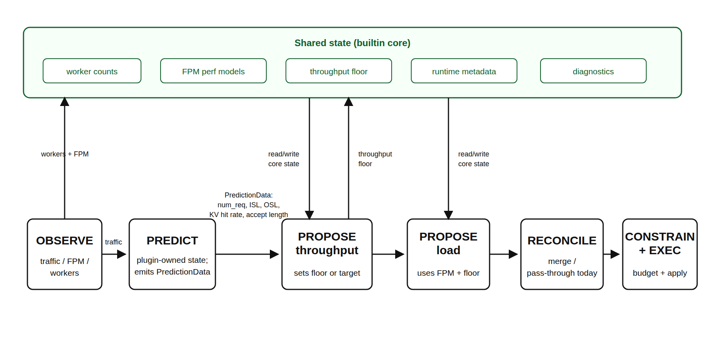

> **Tier 3 design documentation** for contributors and architects. For user-facing docs, see [docs/components/planner/](../components/planner/README.md).

## Overview

The Planner is Dynamo's autoscaling controller. It supports two scaling modes: **throughput-based** (using profiling data and traffic prediction) and **load-based** (using real-time engine metrics and online regression). This document covers the internal architecture, algorithms, and design trade-offs for both modes.

## Runtime Pipeline

The runtime planner is driven by `OrchestratorEngineAdapter`, which wraps the
local scaling algorithms as builtin plugins and runs the same plugin pipeline
used by external gRPC plugins.

1. **OBSERVE**: `NativePlannerBase` and the engine adapter collect worker
   counts, traffic metrics, and forward-pass metrics. Observations are exposed
   through `PipelineContext.observations`.
2. **PREDICT**: `builtin_load_predict` runs on the throughput interval. It
   consumes traffic observations and emits predicted request count, ISL, OSL,
   KV hit rate, and speculative accept length for this tick.
3. **PROPOSE**: `builtin_throughput_propose` consumes same-tick predictions and
   updates the throughput lower bound. `builtin_load_propose` consumes FPM and
   worker observations and applies the load-based +/-1 scaling algorithm.
4. **RECONCILE / CONSTRAIN**: The generic pipeline merges proposals from
   builtin and external plugins. After CONSTRAIN, the engine adapter applies
   the local planner's final `min_endpoint` and GPU-budget invariants before
   returning any scaling effect.
5. **EXECUTE**: The adapter returns `PlannerEffects.scale_to`; `NativePlannerBase`
   applies those targets through the configured connector.

For compatibility with existing configs and DGDR-generated planner payloads,
`load_adjustment_interval_seconds` and `throughput_adjustment_interval_seconds`
still define the builtin plugin fire intervals. The base
`scheduling.scale_interval_seconds` defaults to the greatest common divisor of
those enabled intervals, so existing load and throughput fire times are preserved.



### Why Two Scaling Loops?

The two builtin scaling loops serve different control horizons.
Throughput-based scaling is the slower predictive capacity loop: it uses a
longer traffic window, load prediction, and profiling or perf-model capacity
estimates to provision for sustained demand. This avoids reacting to short-lived
metric noise and gives scale-out enough time to complete before the predicted
load arrives.

Load-based scaling is the faster reactive SLA-correction loop. It uses current
FPM, queue, worker-count, and online perf-model observations to handle short-term
overload, prediction or profiling error, runtime metadata changes such as KV hit
rate or speculative accept length, and the actual state observed after previous
scaling actions.

When both loops are enabled, throughput-based scaling sets the replica lower
bound, and load-based scaling runs more frequently above that floor. This keeps
capacity that was predicted for near-future demand from being removed because of
short idle periods, while still allowing the planner to react faster than the
throughput interval when real-time SLA pressure appears.

### Builtin Shared State

The pipeline context is a per-tick data plane: observations, predictions, and
proposals are produced for the current tick and passed through the public plugin
API. The builtin local planner also needs cross-tick state to preserve existing
planner behavior. That state is kept in `PlannerScalingState`, which is private
to the builtin plugins and the engine adapter rather than exposed as a public
gRPC plugin contract.

`PlannerScalingState` stores:

- **Worker inventory**: current ready prefill/decode counts, expected counts, and
  whether a prefill or decode scale operation is still in progress.
- **Perf models**: prefill, decode, or aggregated `PlannerEnginePerfModel`
  instances, including pre-deployment benchmark FPMs and online FPM updates.
- **Throughput lower bounds**: the current prefill/decode floor produced by
  throughput-based scaling. Load-based scaling can scale above this floor but
  cannot scale below it.
- **Runtime metadata**: last observed KV hit rate and speculative accept length.
  These use last-value semantics and are input features for capacity estimation.
- **Per-tick diagnostics scratch**: estimated TTFT/ITL, predicted traffic shape,
  engine RPS, decision reasons, lower bounds, and execution/audit metadata used
  by metrics and HTML reports.
- **Worker capabilities and budget inputs**: component GPU counts and runtime
  capabilities used to clamp final targets to `min_endpoint` and GPU budgets.

Predictor history is intentionally not stored in `PlannerScalingState`.
`builtin_load_predict` owns the request-count, ISL, and OSL predictor state and
passes same-tick output through `PredictionData`. This keeps PREDICT -> PROPOSE
dependencies explicit while allowing the builtin proposer plugins to share the
state that is inherently cross-tick, such as perf-model fitting and throughput
floors.

## Throughput-Based Scaling

Throughput-based scaling is implemented by two builtin plugins:
`builtin_load_predict` and `builtin_throughput_propose`.

### Step 1: Traffic Observation

On throughput-cadence ticks, the engine adapter queries Prometheus for traffic
metrics from either the frontend or router, depending on
`throughput_metrics_source`:

- request count
- average input sequence length (ISL)
- average output sequence length (OSL)
- KV hit rate
- speculative decode accept length

The observation window is `throughput_adjustment_interval_seconds`, while the
outer pipeline cadence remains `scheduling.scale_interval_seconds`.

### Step 2: Load Prediction

The planner forecasts three traffic-shape values for the next interval:

- `next_num_req`: Number of requests
- `next_isl`: Average input sequence length
- `next_osl`: Average output sequence length

Four predictor implementations are available:


| Predictor    | Algorithm                                | Best For                         |
| ------------ | ---------------------------------------- | -------------------------------- |
| **Constant** | `next = current`                         | Stable workloads, long intervals |
| **ARIMA**    | Auto-ARIMA with optional log1p transform | Trending/seasonal patterns       |
| **Kalman**   | Local linear trend Kalman filter         | Bursty traffics                  |
| **Prophet**  | Facebook Prophet time-series model       | Complex seasonality              |


All predictors support warm-starting from trace files (`--load-predictor-warmup-trace`).

Runtime metadata that describes engine/router behavior is not forecast with
these predictors. KV hit rate and speculative decode accept length use
last-value semantics: the planner stores the latest valid Prometheus
observation and reuses it until a newer valid value arrives. Cold start falls
back to no KV hit-rate discount and accept length `1.0`.

### Step 3: Capacity Estimation

`builtin_throughput_propose` consumes same-tick predictions and asks the
planner perf model for prefill/decode capacity under the configured SLA
targets. The perf model is bootstrapped from the first available source:

1. worker `get_perf_metrics` self-benchmark data
2. AI Configurator interpolation when `aic_interpolation` is present
3. `profile_results_dir` NPZ/JSON fallback data
4. live FPM regression warmup when no pre-deployment data is available

The Rust perf shim can use native AIC estimates and online FPM tuning. Runtime
metadata such as KV hit rate and speculative accept length are applied as input
features, not as persistent correction-factor flags.

### Step 4: Proposal and Lower Bound

The throughput proposer converts predicted load and per-engine capacity into
replica targets. When both throughput and load scaling are enabled,
throughput-based scaling writes a lower bound; the faster load-based proposer
can scale above that bound but will not scale below it.

### Step 5: Scaling Execution

The merged pipeline result becomes `PlannerEffects.scale_to`. The runtime base
then calls the configured connector to apply component replica targets.

## Connector Design

### Interface

```python
class PlannerConnector(ABC):
    async def add_component(self, component_name)
    async def remove_component(self, component_name)
    # Extended interface (not on ABC, but implemented by both connectors):
    async def set_component_replicas(self, targets, blocking)
    async def validate_deployment(self, ...)
    async def wait_for_deployment_ready(self)
```

### KubernetesConnector

Directly PATCHes the DGD resource to update replica counts. The operator watches for DGD changes and reconciles component deployments.

**Design decisions:**

- Uses `DYN_PARENT_DGD_K8S_NAME` to find its parent DGD (injected by operator)
- Resolves services by `subComponentType` field (prefill/decode), with fallback to legacy component names
- Validates deployment structure on startup: checks that prefill and decode services exist and model names match

### VirtualConnector

For non-native environments (e.g., custom orchestrators). Writes scaling decisions to the distributed runtime via `VirtualConnectorCoordinator` (Rust binding). External systems use `VirtualConnectorClient` to poll decisions and report completion.

**Scaling decision flow:**

1. Planner writes `(num_prefill, num_decode, decision_id)` to runtime
2. External system reads decision via `client.wait()`
3. External system executes scaling
4. External system reports completion via `client.complete(decision)`
5. Planner sees `scaled_decision_id >= decision_id` and proceeds

**Timeout**: If scaling isn't acknowledged within 1800s (configurable), the planner proceeds with new decisions anyway.

## Performance Interpolation

The planner uses pre-deployment profiling data (NPZ files) to map (throughput, ISL/OSL, context_length) -> (TTFT, ITL). This data comes from the SLA-driven profiling process (either online GPU profiling or AI Configurator estimation).

Two interpolators are maintained:

- **Prefill interpolator**: Maps (throughput_per_gpu, ISL) -> TTFT
- **Decode interpolator**: Maps (throughput_per_gpu, context_length) -> ITL

The interpolators use the profiling sweep granularity to determine precision. Finer granularity means more profiling samples but more accurate interpolation.

## Initialization

The `python -m dynamo.planner` entrypoint loads `PlannerConfig`, constructs
the mode-specific planner wrapper, and then initializes the selected
connector. The runtime base validates worker topology, discovers worker
capabilities, installs any available pre-deployment FPMs into the perf model,
bootstraps builtin and configured plugins, and enters the tick loop.

## Performance Considerations

- **Adjustment interval sizing**: The plugin execution interval must be long enough for scaling operations to complete. If `load_adjustment_interval_seconds` or `throughput_adjustment_interval_seconds` is shorter than the time to add/remove a worker (which includes pod scheduling, model loading, and registration), scaling decisions may observe an in-progress replica transition and hold until it completes.
- **Perf-model bootstrap quality**: Throughput-based scaling can start from worker self-benchmark data, AI Configurator interpolation, `profile_results_dir` files, or live FPM regression. Missing bootstrap data is allowed, but early decisions may hold until enough live FPM observations arrive.
- **Interpolation accuracy vs profiling cost**: Higher `prefillInterpolationGranularity` and `decodeInterpolationGranularity` in the profiler sweep produce more accurate bootstrap data but increase profiling time linearly. Default granularity (16 prefill, 6 decode) balances accuracy with profiling duration.
- **Predictor warm-up period**: All predictors need observation history before making reliable forecasts. ARIMA and Prophet need multiple adjustment intervals of data. Kalman starts forecasting after `--kalman-min-points` observations. During warm-up, the planner uses the constant predictor as fallback.

## Load-Based Scaling

The load-based mode uses ForwardPassMetrics (FPM) from the Dynamo event plane to make SLA-aware scaling decisions without requiring profiling data or the KV Router.

### Metrics

Each engine emits per-iteration `ForwardPassMetrics` via ZMQ -> FpmEventRelay -> event plane. The planner subscribes via `FpmEventSubscriber` with automatic engine discovery and MDC-based lifecycle tracking. Key fields used:
- **wall_time**: per-iteration execution time (regression target)
- **scheduled_requests.sum_prefill_tokens**: prefill regression input
- **scheduled_requests.sum_decode_kv_tokens**: decode regression input
- **queued_requests**: queued prefill/decode load for TTFT/ITL simulation
- Idle heartbeats (wall_time=0) are skipped

### Diagnostics

Each tick, the scaling state machine fills `TickDiagnostics` with intermediate decision data—estimated latencies, predicted load, per-engine RPS, and decision reasons—via internal `_diag_*` fields. The adapter layer reads this from `PlannerEffects.diagnostics` and:

- Sets Prometheus gauges (e.g. `dynamo_planner_estimated_ttft_ms` and related estimates)
- Records enum metrics for load-scaling decision reasons (`dynamo_planner_load_scaling_decision`)
- Feeds `DiagnosticsRecorder`, which accumulates per-tick snapshots and emits Plotly-based HTML reports on a schedule

Per-engine FPM queue depths from `_collect_fpm()` are exported as labeled Prometheus gauges.

### Regression Models

Three specialized regression models live under
`components/src/dynamo/planner/core/perf_model/`:
- **PrefillRegressionModel**: 1D regression `sum_prefill_tokens -> wall_time`. Estimates TTFT by simulating chunked prefill scheduling (chunks of `max_num_batched_tokens`).
- **DecodeRegressionModel**: 1D regression `sum_decode_kv_tokens -> wall_time`. Estimates ITL for total decode load (scheduled + queued + avg decode length).
- **AggRegressionModel**: 2D regression `(sum_prefill_tokens, sum_decode_kv_tokens) -> wall_time`. Estimates both TTFT (simulated prefill with piggybacked decode) and ITL (decode with average piggybacked prefill).

### Scaling Decisions

- **Prefill/Decode**: Scale up if ALL engines' estimated TTFT/ITL > SLA; scale down if ALL < SLA * sensitivity
- **Agg**: Scale up if (ALL TTFT > SLA) OR (ALL ITL > SLA); scale down if (ALL TTFT < SLA * sensitivity) AND (ALL ITL < SLA * sensitivity)
- Only scales by +/-1 per interval (non-blocking with pending-desired guard: metrics continue to be observed while scaling is in progress, but no new scaling action is issued until the previous one completes)

### Co-existence with Throughput-Based Scaling

When both modes are enabled, throughput-based scaling (longer interval) sets a lower bound on replicas while load-based scaling (shorter interval) handles real-time adjustments above that floor.

### Aggregated Mode

In aggregated mode (`--mode agg`), engines handle both prefill and decode via chunked prefill. The planner maintains both TTFT and ITL regression models but uses per-worker time-averaged metrics (not instantaneous) for regression training to smooth out chunked prefill noise. Scale up if either prefill or decode signals overload; scale down only if both signal underload.

## Known Limitations

1. **Adjustment interval vs scaling latency**: If a plugin interval is shorter than the time to scale, later ticks may observe an in-progress transition and hold rather than stacking new replica changes.
2. **Average-based prediction**: Throughput-based scaling uses average ISL/OSL, which may not represent bimodal or heavy-tailed distributions well.
3. **Single DGD scope**: Each planner instance manages exactly one DGD. Multi-model/multi-DGD coordination is not supported.

## Future Work

- Multi-DGD coordination for shared-cluster scenarios
- Distribution-aware interpolation (beyond mean ISL/OSL)
- Adaptive adjustment interval based on observed scaling latency

## File Map


| File / package | Purpose |
| --------------- | ------- |
| `components/src/dynamo/planner/core/base.py` | Runtime I/O loop: gathers observations and applies scaling effects. |
| `components/src/dynamo/planner/core/state_machine.py` | Shared builtin scaling state used by local planner plugins. |
| `components/src/dynamo/planner/core/load_scaling.py` | FPM-driven load scaling algorithm. |
| `components/src/dynamo/planner/core/throughput_scaling.py` | Prediction-driven throughput scaling algorithm. |
| `components/src/dynamo/planner/plugins/builtins/` | Builtin plugins that expose the local planner algorithms to the pipeline. |
| `components/src/dynamo/planner/plugins/orchestrator/` | PREDICT -> PROPOSE -> RECONCILE -> CONSTRAIN pipeline driver and engine adapter. |
| `components/src/dynamo/planner/plugins/proto/v1/` | Public gRPC/proto plugin API. |
| `components/src/dynamo/planner/monitoring/` | Prometheus, diagnostics reports, live dashboard, and worker metadata. |
| `components/src/dynamo/planner/connectors/` | K8s, virtual, global-planner, and remote connector implementations. |
| `components/src/dynamo/planner/config/` | PlannerConfig schema, defaults, backend component names, and profiling bootstrap specs. |
