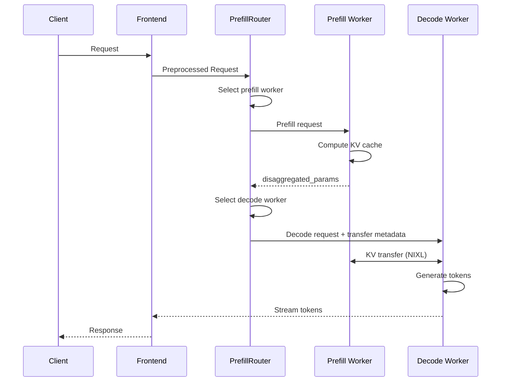

<!--
SPDX-FileCopyrightText: Copyright (c) 2025-2026 NVIDIA CORPORATION & AFFILIATES.
All rights reserved.
SPDX-License-Identifier: Apache-2.0
-->

# Dynamo Disaggregation: Separating Prefill and Decode for Enhanced Performance

The prefill and decode phases of LLM requests have different computation characteristics and memory footprints. Disaggregating these phases into specialized llm engines allows for better hardware allocation, improved scalability, and overall enhanced performance. For example, using a larger TP for the memory-bound decoding phase while a smaller TP for the computation-bound prefill phase allows both phases to be computed efficiently. In addition, for requests with long context, separating their prefill phase into dedicated prefill engines allows the ongoing decoding requests to be efficiently processed without being blocked by these long prefills.

Disaggregated execution of a request has three main steps:
1. Prefill engine computes prefill phase and generates KV cache
2. Prefill engine transfers the KV cache to decode engine
3. Decode engine computes decode phase.

The disaggregation design in Dynamo features a flexible framework that delivers strong performance across various conditions.

## Efficient KV Transfer

The key to high-performance disaggregation is efficient KV transfer. Dynamo leverages NIXL to transfer KV cache directly from the VRAM of the prefill engine to the VRAM of the decode engine. The KV transfer is non-blocking, allowing GPU forward passes to continue serving other requests during the transfer.

### Router Orchestration

The disaggregated serving flow is orchestrated by the `PrefillRouter`:

1. **Worker Selection**: The router selects a prefill worker using KV-aware routing (based on cache overlap scores and load) or simple load balancing.

2. **Prefill Execution**: The router sends the prefill request to the selected prefill worker. The prefill worker computes the KV cache and returns `disaggregated_params` containing backend-specific transfer metadata.

3. **Decode Routing**: The router injects the prefill result into the decode request, then routes to the decode worker.

4. **KV Transfer**: The decode worker uses the transfer metadata to coordinate with the prefill worker. NIXL handles the direct GPU-to-GPU transfer using the optimal available transport (NVLink, InfiniBand/UCX, etc.).

### Backend-Specific Transfer Metadata

The transfer metadata format varies by backend:

- **SGLang**: Uses `bootstrap_info` (host, port, room_id) for RDMA bootstrap coordination. SGLang prefill workers publish their bootstrap endpoint to the discovery service during initialization. With this mechanism, prefill can run as a background task, allowing the decode phase to begin immediately while the KV transfer proceeds in parallel.

- **vLLM**: Uses `kv_transfer_params` containing block IDs and remote worker connection info. Prefill runs synchronously; decode waits for prefill to complete before proceeding.

- **TRTLLM**: Uses `opaque_state` containing serialized TRT-LLM internal metadata. Prefill runs synchronously; decode waits for prefill to complete before proceeding.

## Runtime-Reconfigurable xPyD

Dynamo's disaggregation design supports runtime-reconfigurable xPyD (x prefill workers, y decode workers). Workers can be added and removed at runtime:

- **Add worker**: Worker registers with the discovery service and publishes its `RuntimeConfig` (including KV capacity).
- **Remove worker**: Worker drains active requests and deregisters from discovery.

The router automatically discovers new workers via the discovery service and incorporates them into routing decisions.

