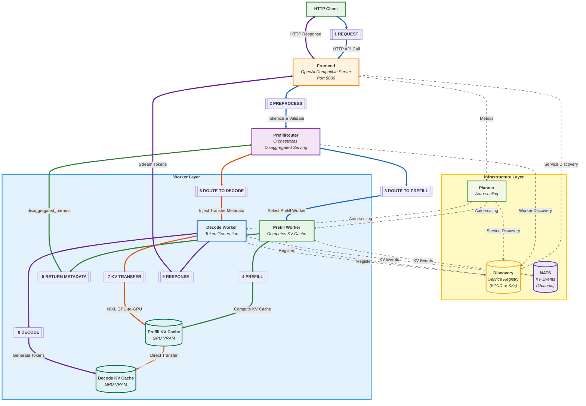

<!--
SPDX-FileCopyrightText: Copyright (c) 2025-2026 NVIDIA CORPORATION & AFFILIATES. All rights reserved.
SPDX-License-Identifier: Apache-2.0

Licensed under the Apache License, Version 2.0 (the "License");
you may not use this file except in compliance with the License.
You may obtain a copy of the License at

http://www.apache.org/licenses/LICENSE-2.0

Unless required by applicable law or agreed to in writing, software
distributed under the License is distributed on an "AS IS" BASIS,
WITHOUT WARRANTIES OR CONDITIONS OF ANY KIND, either express or implied.
See the License for the specific language governing permissions and
limitations under the License.
-->

# Dynamo Architecture Flow

This diagram shows the NVIDIA Dynamo disaggregated inference system. Color-coded flows indicate different types of operations.

## 🔵 Main Request Flow (Blue)
The primary user journey through the system:

1. **Request (S1)**: HTTP client sends API request to Frontend (OpenAI-compatible server on port 8000)
2. **Preprocess (S2)**: Frontend preprocesses the request (applies chat template, tokenizes) and validates it
3. **Route to Prefill (S3)**: PrefillRouter selects a prefill worker using KV-aware routing or load balancing

## 🟢 Prefill Flow (Green)
The prefill processing pipeline:

4. **Prefill (S4)**: Prefill worker executes the prefill computation on the input tokens and generates KV cache
5. **Return Metadata (S5)**: Prefill worker returns `disaggregated_params` containing backend-specific transfer metadata

## 🟠 Decode Routing Flow (Orange)
Router orchestration to decode phase:

6. **Route to Decode (S6)**: PrefillRouter injects prefill result into decode request and routes to decode worker
7. **KV Transfer (S7)**: Decode worker coordinates with prefill worker for direct GPU-to-GPU KV cache transfer via NIXL

## 🟣 Completion Flow (Purple)
The response generation and delivery:

8. **Decode (S8)**: Decode worker generates tokens using the transferred KV cache
9. **Response (S9)**: Generated tokens stream back through Frontend for post-processing (detokenization) and delivery to Client

## 🔗 Infrastructure Connections (Dotted lines)
Coordination and messaging support:

### Service Discovery
- **On Kubernetes** (default): Uses native K8s resources (DynamoWorkerMetadata CRD, EndpointSlices). No etcd required.
- **On bare metal**: Uses etcd or filesystem for service discovery and endpoint registration.

### Request Plane
- **TCP** (default): Direct TCP connections between Frontend and Workers for request/response transport.
- **HTTP/NATS**: Alternative transports configurable via `DYN_REQUEST_PLANE`.

### NATS Connections (Optional, for KV routing)
- **KV Events**: Cache state events for KV-aware routing (can be disabled with `--no-kv-events`)

### Planning Connections (Gold, dotted)
- **Frontend → Planner**: Metrics collection for auto-scaling decisions
- **Planner → Workers**: Resource scaling commands for workers

## Technical Implementation Details

### PrefillRouter Orchestration:
- The `PrefillRouter` sits between the Frontend and workers, orchestrating disaggregated serving
- Selects prefill workers using KV-aware routing (cache overlap scores + load) or simple load balancing
- Injects transfer metadata into decode requests for KV cache coordination

### NIXL (NVIDIA Interchange Library):
- Enables high-speed GPU-to-GPU data transfers using NVLink, InfiniBand/UCX, or PCIe
- Transfer metadata exchanged via `disaggregated_params` in prefill response
- Backend-specific coordination: SGLang uses bootstrap connections, vLLM uses block IDs, TRTLLM uses opaque state

### Disaggregated KV Cache:
- Each worker maintains local KV cache in its GPU memory
- No shared storage bottlenecks—transfers are direct worker-to-worker via NIXL
- Non-blocking transfers allow GPU forward passes to continue during KV transfer

