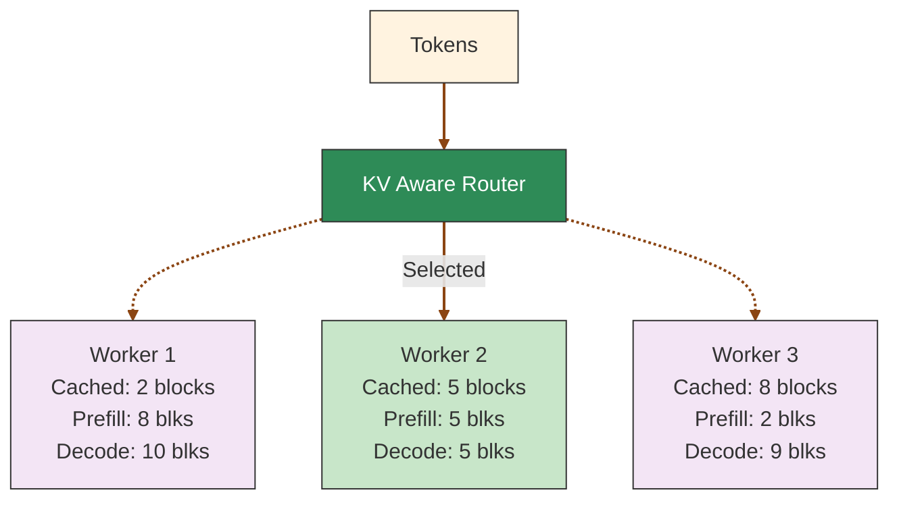
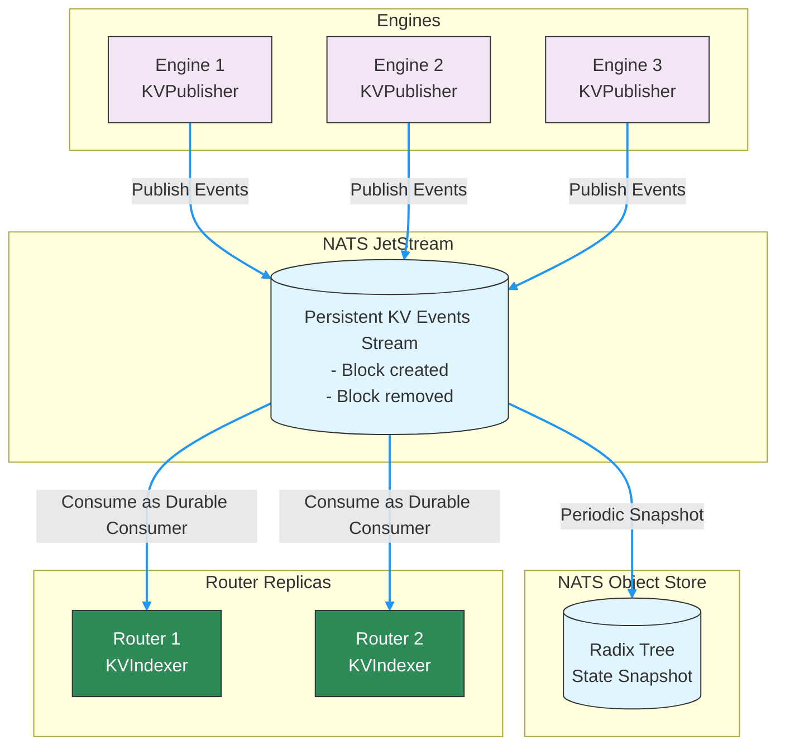
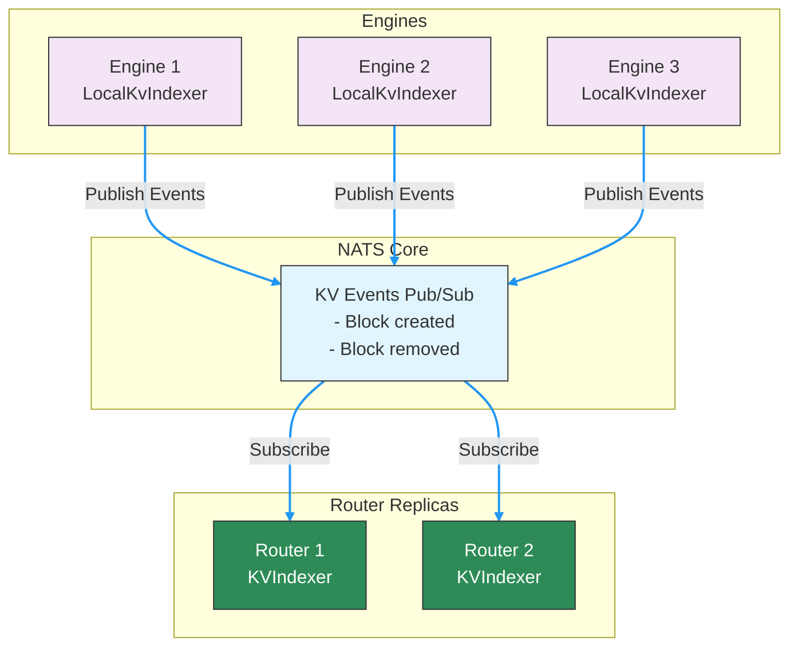
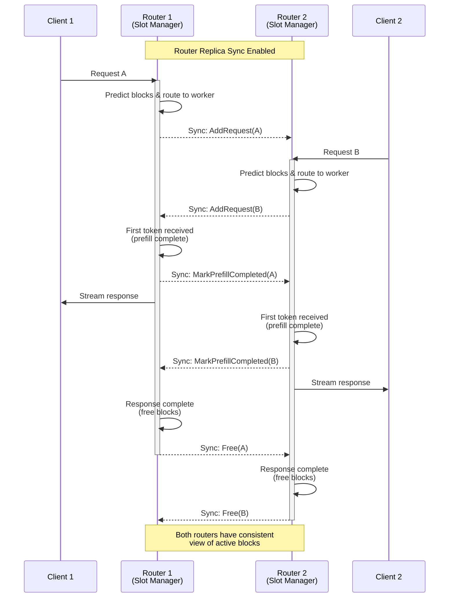

<!--
SPDX-FileCopyrightText: Copyright (c) 2025-2026 NVIDIA CORPORATION & AFFILIATES. All rights reserved.
SPDX-License-Identifier: Apache-2.0
-->

# Router Design

This document describes the internal architecture of the Dynamo KV Router, including block tracking mechanisms, the KV cache optimization system, event handling, and transport modes.

## KV Router Architecture

The KV Router tracks two key metrics for each worker:

1. **Potential Active Blocks**: The number of blocks that would be used for decoding if a request is routed to a worker. This includes both existing active blocks and new blocks from the incoming request.

2. **Potential New Prefill Blocks**: The number of tokens that need to be computed from scratch on a worker, calculated as:
   - New prefill tokens = Total input tokens - (Overlap blocks × Block size)
   - Potential prefill blocks = New prefill tokens / Block size

### Block Tracking Mechanisms

The router maintains block information through two complementary systems:

- **Active Decoding Blocks**: Tracked locally by the router throughout the request lifecycle:
  - Incremented when adding a new request
  - Updated during token generation
  - Decremented upon request completion

- **Cached Blocks**: Maintained globally by the KvIndexer using a prefix tree built from worker-reported KV events. This provides accurate overlap information for routing decisions.

## KV Cache Router

The leading Large Language Models (LLMs) today are auto-regressive and based off of the [transformer architecture](https://proceedings.neurips.cc/paper_files/paper/2017/file/3f5ee243547dee91fbd053c1c4a845aa-Paper.pdf). One key inference optimization technique is to cache the already computed keys and values and to reuse them for the future tokens. This is called the [KV Cache](https://developer.nvidia.com/blog/mastering-llm-techniques-inference-optimization/#key-value_caching).

### KV Cache Routing and Load Balancing

The router uses a cost function that considers both the prefill cost (influenced by cached blocks) and the decode load to make optimal routing decisions.

#### Cost Calculation

1. **Prefill blocks**: Calculated by dividing the number of tokens requiring prefill processing by the block size. The system predicts this based on input tokens and available cached blocks per worker, updating the count when the first output token signals prefill completion.

2. **Decode blocks**: Estimated from the request's input tokens and each worker's active sequences. The count updates when requests complete and their blocks are freed.

3. **Cost formula**: `cost = overlap_score_weight * prefill_blocks + decode_blocks`
   - Lower costs indicate better routing choices
   - `overlap_score_weight` balances cache hit optimization against load distribution
   - Higher weights favor cache reuse (improving TTFT), while lower weights prioritize even load distribution (improving ITL)

#### Worker Selection

The router selects the worker with the lowest cost. When `router_temperature` is set to a non-zero value, the router uses softmax sampling on the normalized cost logits to introduce randomness in the selection, which can help with load distribution.

Example calculation with `overlap_score_weight = 1.0`:
- Worker 1: cost = 1.0 * 8 + 10 = 18
- **Worker 2: cost = 1.0 * 5 + 5 = 10** (selected - lowest cost)
- Worker 3: cost = 1.0 * 2 + 9 = 11

### KV Cache Optimizations

Every inference framework will have a KV Cache for each worker. A popular inference framework library is [vLLM](https://github.com/vllm-project/vllm) where a key contribution was [PagedAttention](https://arxiv.org/abs/2309.06180), which allowed them to manage KV Cache in an efficient way by chunking requests into blocks.

Another popular inference framework, [SGLang](https://github.com/sgl-project/sglang), contributed [RadixAttention](https://arxiv.org/abs/2312.07104) which introduced a prefix tree which allows for efficient matching, inserting and eviction of KV Cache blocks. The prefix tree structure popularized KV Cache reuse.

In Dynamo, we introduce a KVPublisher which emits KV Cache events that occur at each worker and a KVIndexer which keeps track of these events globally.

### KV Block Management Flow

To get a feel for how KV Cache management works on a single worker with KV Cache reuse turned on and where the KVPublisher gets plugged in, we can walk through the KV Block management flow:

1. **Request tokenization**: The incoming prompt is converted into tokens
2. **Block partitioning**: The token sequence is divided into fixed-size blocks (e.g., 16 or 64 tokens per block)
3. **Block hashing**: Each block of tokens is hashed to create a unique identifier
4. **Cache lookup**:
    - For each block, the system checks if a matching block already exists in the KV cache
    - If a match is found, the existing KV cache block is reused
    - If no match is found, the system proceeds to the next step
5. **Resource allocation**:
    - For blocks without matches, the system attempts to allocate new memory space
    - If sufficient memory is available, allocate memory space and proceed to step 7
    - If memory is constrained, proceed to step 6
6. **Cache eviction** (when necessary):
    - The system applies an eviction policy (e.g., LRU, LFU) to identify blocks for removal
    - Selected blocks are evicted from the cache
    - **KVPublisher emits a KV removed event notifying KVIndexer about the removed block.**
    - Alternatively, some systems may offload less-frequently used blocks to CPU memory.
7. **KV computation**:
    - For new blocks, the model computes key and value tensors
    - These tensors are stored in the newly allocated cache blocks
    - **KVPublisher emits a kv stored event notifying KVIndexer about newly stored blocks**.

Further details can be found for: [TRT-LLM](https://developer.nvidia.com/blog/introducing-new-kv-cache-reuse-optimizations-in-nvidia-tensorrt-llm/), [vLLM](https://docs.vllm.ai/en/latest/design/automatic_prefix_caching.html#design-automatic-prefix-caching) and [SGLang](https://lmsys.org/blog/2024-01-17-sglang/).

## Events

### KVPublisher

The KVPublisher can be initialized and then called in the inference framework where blocks are allocated and removed.

The two types of events are:
- KV stored event
- KV removed event

The publisher can be initialized and used through C bindings or Python bindings.

### Deterministic Event IDs

Engines do not need to emit deterministic block identifiers in KV events, as the router uses local block hashes (computed from token content) for tracking and matching blocks across workers. However, it is strongly preferred that engines do emit deterministic block identifiers, as this keeps the KvIndexer's internal lookup table smaller and more efficient. To ensure deterministic behavior, all workers should use identical engine versions/configuration. If your engine relies on Python's built-in `hash()` for any event IDs, set `PYTHONHASHSEED=0`; otherwise this setting has no effect.

### KVIndexer

The KVIndexer builds and maintains a global view of cached blocks in a prefix tree. We modify the original prefix tree by also storing the worker id on each node. This is so we can return the number of matched blocks for each worker.

The KVIndexer has a method `find_matches_for_request`, which takes in tokens and returns a dictionary with keys of worker id and values of the number of matched KV Blocks.

### Inter-Router Communication

In distributed deployments with multiple routers, each router maintains visibility over only a portion of the total requests. To ensure consistent routing decisions, routers synchronize their states through three event types:

1. **AddRequest**: Notifies other routers when a request is assigned to a worker. Includes request ID, worker ID, token sequence blocks, and overlap score to track block usage across the system.

2. **MarkPrefillCompleted**: Signals when a request moves from prefill to decode phase, allowing routers to update their worker load calculations by excluding completed prefill tokens.

3. **Free**: Indicates request completion and resource release, enabling accurate block reference counting across all routers.

Each event carries a unique router ID to prevent self-event processing. This asynchronous communication system ensures optimal routing decisions by maintaining consistent KV cache state across all routers, even as they handle different request streams.

## Event Transport Modes

The router supports two event transport modes for KV cache state synchronization:

- **JetStream (default)**: Persistent event stream with durable consumers. State persists across router restarts via snapshots in NATS object store. Best for production with multi-replica consistency.

- **NATS Core with Local Indexer** (`--enable-local-indexer` on workers): Fire-and-forget pub/sub where workers maintain local radix trees. Router rebuilds state by querying workers on startup. Lower latency, simpler setup.

### JetStream Mode

KV events are sent to a persistent NATS JetStream. Each KV router/indexer replica acts as a durable consumer, pulling messages from this shared stream. This architecture ensures consistency across router replicas and persistence across restarts.

- **Best for**: Production deployments requiring durability and multi-replica router consistency
- **Tradeoffs**: Requires JetStream setup; slightly higher latency due to persistence guarantees

### NATS Core with Local Indexer

When workers are started with `--enable-local-indexer`, each worker maintains its own local radix tree (local indexer) and publishes events over NATS Core (fire-and-forget pub/sub) instead of JetStream. Each worker assigns monotonically increasing event IDs to its events. The router detects gaps in event sequences and recovers missed events by querying the worker's local indexer directly.

- **Best for**: Lower-latency setups; simpler deployments without JetStream; single-router scenarios
- **Tradeoffs**: State persists on workers (not centralized); recovery depends on workers being available
- **Enable with**: `--enable-local-indexer` flag on workers (vLLM, mocker)

**How gap detection works:**
1. Each worker assigns monotonically increasing event IDs starting from 0
2. The router tracks the last received event ID per worker
3. If an event arrives with `event_id > last_id + 1`, the router detects a gap
4. The router queries the worker's local indexer for the missing event range `[last_id+1, event_id-1]`
5. On worker discovery (Added event), the router dumps the worker's entire local indexer state

**Startup behavior:**
- When a worker is discovered, the router queries and ingests its full local indexer state
- When a worker is removed, the router removes all its blocks from the global radix tree

>[!Note]
> The router automatically selects the transport mode based on worker configuration. If all connected workers have `enable_local_indexer=true`, the router uses NATS Core mode. Otherwise, it uses JetStream mode.

### Local Active Block Management with Replica Sync

In addition to cached blocks, each router replica needs to track active blocks (blocks being used for ongoing generation) as load metrics. Since this information is highly time-sensitive, it should be predicted immediately when:
- The router receives and routes a request
- The first token is generated (prefill complete)
- The response ends (request freed)

This is managed locally in each router via a "slot manager". To maintain consistency across the system, router replicas synchronize these local predictions with each other through NATS core messaging.

This dual-layer approach—persistent global KV cache state via JetStream and ephemeral active block synchronization via router replicas—enables the system to make optimal routing decisions that balance cache reuse with load distribution.

## See Also

- **[Router README](../router/README.md)**: Quick start guide for the KV Router
- **[Router Guide](../router/router_guide.md)**: Configuration, tuning, and production setup
- **[Router Examples](../router/router_examples.md)**: Python API usage and custom routing patterns
- **[KV Event Publishing for Custom Engines](../integrations/kv_events_custom_engines.md)**: Integrate custom inference engines with KV-aware routing
