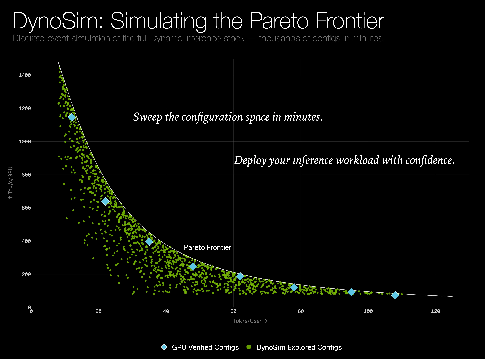

DynoSim is a workload-driven discrete-event simulation of NVIDIA Dynamo: a Dynamo twin for exploring LLM serving behavior before running full deployments. It brings measured engine forward-pass timing, Mocker scheduler cores, Router and Planner behavior, KV cache effects, and workload traces onto one virtual timeline. In our blog post, [DynoSim: Simulating the Pareto Frontier](https://developer.nvidia.com/blog/dynosim-simulating-the-pareto-frontier/), we show how simulation becomes the inner loop for design exploration: sweep broadly, map the throughput-latency Pareto frontier, shortlist the most promising candidates, and verify them on real clusters.
