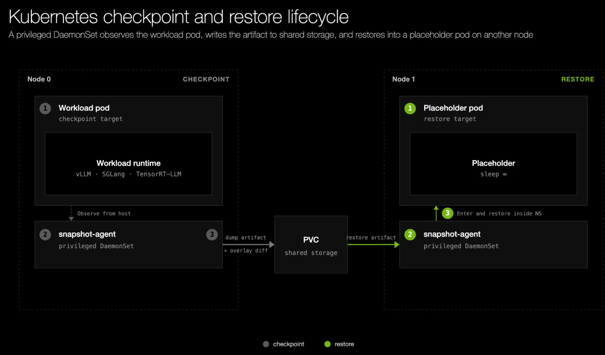

Cold-starting inference replicas on Kubernetes can take minutes while engines load weights, warm kernels, and compile graphs. In our blog post, [NVIDIA Dynamo Snapshot: Fast Startup for Inference Workloads on Kubernetes](https://developer.nvidia.com/blog/nvidia-dynamo-snapshot-fast-startup-for-inference-workloads-on-kubernetes/), we introduce Dynamo Snapshot, a checkpoint/restore approach that combines `cuda-checkpoint`, CRIU, and a privileged `snapshot-agent` DaemonSet to restore warm workers from shared storage. We also walk through KV cache unmapping, CRIU restore optimizations, and GPU Memory Service (GMS), which bring the `gpt-oss-120b` prototype below five seconds and reduce startup time by 21x.
