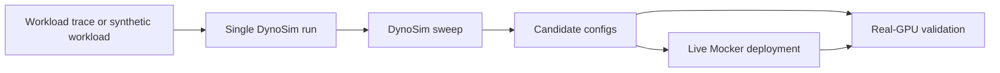

DynoSim is Dynamo's simulation stack for exploring serving configurations before validating them on real clusters. It is not a separate service; it is the product surface that connects workload-driven simulation runs, configuration sweeps, the mocker engine, Planner simulation, Router simulation, and AIC-backed timing models into one workflow.

Use DynoSim when you want to answer questions such as:

- Which aggregated or disaggregated topology should this workload use?
- How many prefill and decode workers fit within my GPU budget?
- How sensitive is the deployment to startup time, queue pressure, prefix reuse, or router tuning?
- Which candidates should I validate with AIPerf on real GPUs?

## Components

| Component | Entry Point | Role |
|---|---|---|
| DynoSim run | `python -m dynamo.replay` | Runs one workload against one simulated Dynamo configuration and emits metrics plus a report |
| DynoSim sweep | `dynamo.profiler.utils.replay_optimize` | Sweeps many simulation trials across TP shape, worker split, router knobs, SLA constraints, and GPU budget |
| Live simulation with Mocker | `python -m dynamo.mocker` | Runs simulated workers inside a live Dynamo deployment path, including worker registration and KV event publishing |
| Mocker core | `lib/mocker` | Models engine scheduling, KV allocation, prefix caching, preemption, and timing |
| AIC | AI Configurator SDK | Supplies calibrated timing and candidate-shape data for supported model/backend/GPU tuples |
| Planner simulation | `--planner-config` on DynoSim runs | Runs Planner decisions in the simulation loop to study scaling behavior and SLA compliance |

## Workflow

Start with a single DynoSim run to verify the workload shape and engine arguments. Use DynoSim sweeps when you want to search the design space. Use live Mocker deployments when you need to exercise the real Dynamo frontend, router, worker registration, KV events, and planner paths without running model inference. Validate the shortlist on real GPUs before production rollout.

## Where AIC Fits

AIC provides performance models and candidate-shape information. DynoSim uses those models as one timing source inside the mocker engine and sweep optimizer. Mocker still owns the scheduler and KV-memory simulation: batching, prefix-cache hits, preemption, block allocation, and request lifecycle are simulated by Dynamo's mocker core, while AIC-backed timing predicts how long prefill and decode work should take for supported model/backend/GPU combinations.

## Choosing an Entry Point

| Goal | Start Here |
|---|---|
| Run one trace or synthetic workload through one config | [DynoSim Runs](runs.md) |
| Sweep topology and router choices under SLA/GPU constraints | [DynoSim Sweeps](sweeps.md) |
| Exercise a live frontend/router setup without GPUs | [Live Simulation with Mocker](mocker.md) |
| Study Planner scaling decisions against a trace | [Planner DynoSim Benchmarking](planner-benchmarking.md) |
| Generate a deployable Kubernetes config from model/SLA intent | [Model Deployment Guide](../kubernetes/model-deployment-guide.md) |

DynoSim narrows the search space; it does not replace real-hardware validation. Use it to move quickly, find promising candidates, and understand failure modes before spending cluster time.
