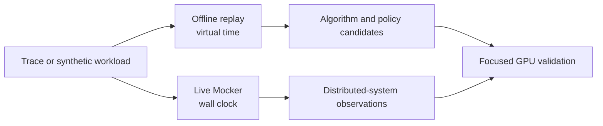

DynoSim is NVIDIA Dynamo's simulation stack for studying serving behavior without running model
inference on GPUs. Start with the simulation loop that matches the question you want to answer.

## Two Simulation Loops

| Loop | Use It For | What It Runs |
|---|---|---|
| [Offline replay](runs.md) | Develop routing algorithms, compare scheduling policies, evaluate Planner decisions, and sweep configurations | A deterministic virtual-time harness around Mocker engine cores and in-process models of the KV router, Planner, transfer, and offload |
| [Live Mocker](mocker.md) | Test a distributed deployment, probe component behavior, and measure frontend, router, transport, event, and control-plane overhead | Simulated workers inside the live Dynamo runtime path |

Offline replay removes wall-clock waits and external services. This makes algorithm and policy
experiments fast and repeatable. Live Mocker preserves the distributed path around the worker. Use
it when the behavior or overhead of that path is part of the experiment.

```mermaid
flowchart LR
    W["Trace or synthetic workload"] --> O["Offline replay<br/>virtual time"]
    W --> L["Live Mocker<br/>wall clock"]
    O --> A["Algorithm and policy candidates"]
    L --> D["Distributed-system observations"]
    A --> G["Focused GPU validation"]
    D --> G
```

## Build Fidelity Bottom-Up

DynoSim separates three layers of fidelity:

1. **Timing** predicts the duration of prefill and decode work. Choose a built-in heuristic,
   profile-derived interpolation, or
   [AIConfigurator](https://github.com/ai-dynamo/aiconfigurator) model.
2. **Scheduler and KV state** model batching, admission, prefix reuse, memory pressure, preemption or
   retraction, and token emission for vLLM, SGLang, and TensorRT-LLM.
3. **Distributed system** composes workers with routing, Planner decisions, prefill/decode handoff,
   multi-tier KV movement, workload arrivals, and reporting.

See [Simulation Model](modeling.md) for the engine-specific behavior and fidelity boundaries at
each layer.

## Choose an Entry Point

| Goal | Start With |
|---|---|
| Test a new routing or queueing algorithm | [DynoSim Runs](runs.md) |
| Compare one workload across worker counts or topologies | [DynoSim Runs](runs.md) |
| Search a larger configuration space | [DynoSim Sweeps](sweeps.md) |
| Exercise a live frontend, router, Planner, and worker topology | [Live Simulation with Mocker](mocker.md) |
| Study Planner scaling decisions against a trace | [Planner Simulation Benchmarking](planner-benchmarking.md) |
| Validate endpoint behavior and performance on GPUs | [Dynamo Benchmarking](../benchmarks/benchmarking.md) |

DynoSim narrows the configurations and hypotheses that need GPU time. Validate the selected
candidates on representative hardware before using simulation results for production sizing.
