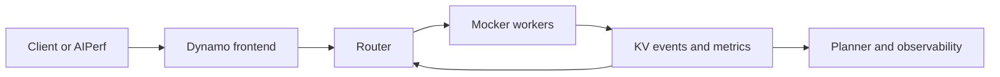

Mocker runs as a Dynamo backend without executing model inference on GPUs. It registers workers,
accepts requests, publishes metrics and KV events, and participates in the live frontend, router,
Planner, discovery, and transport paths.

Use live Mocker when the distributed system is part of the experiment. To develop a routing
algorithm or compare policies without external services or wall-clock waits, use
[offline DynoSim replay](runs.md).

## What Live Mocker Exercises



The frontend, routing decision, request transport, worker registration, KV-event propagation,
metrics collection, and Planner integration run through their live implementations. Mocker replaces
the GPU engine with a stateful scheduler and KV-cache simulation.

This makes live Mocker useful for:

- integration tests across frontend, router, Planner, and worker components;
- load tests that probe request, event, and control-plane overhead;
- KV-router and prefix-affinity experiments with live event propagation;
- multi-worker and data-parallel topology tests;
- disaggregated prefill/decode coordination and transfer-delay experiments.

See [Simulation Model](modeling.md) for the engine support matrix, timing sources, KVBM tiers,
handoff lifecycle, and fidelity boundaries.

## Run a Local Deployment

Use file discovery for a single-machine run without etcd or NATS.

Start the frontend:

```bash
python3 -m dynamo.frontend --discovery-backend file
```

Start an aggregated Mocker worker in another terminal:

```bash
python3 -m dynamo.mocker \
    --model-path Qwen/Qwen3-0.6B \
    --discovery-backend file
```

Send a request after the worker registers:

```bash
curl localhost:8000/v1/chat/completions \
  -H "Content-Type: application/json" \
  -d '{"model":"Qwen/Qwen3-0.6B",
       "messages":[{"role":"user","content":"Explain prefix caching."}],
       "max_tokens":50}'
```

The model path supplies tokenizer and KV-cache metadata. Mocker emits synthetic token IDs rather
than model-generated text unless output replay is configured.

## Configure the Simulation

The CLI exposes detailed engine, timing, transport, and memory controls. Start with the major
choices below and use the built-in help for the complete, version-matched list:

```bash
python3 -m dynamo.mocker --help
```

| Goal | Major Knobs |
|---|---|
| Select engine behavior | `--engine-type`, `--g1-backend`, `--trtllm-capacity-scheduler-policy`, `--sglang-*` |
| Set G1 capacity and batching | `--num-gpu-blocks-override`, `--block-size`, `--max-num-seqs`, `--max-num-batched-tokens` |
| Control prefix and prefill behavior | `--enable-prefix-caching`, `--enable-chunked-prefill`, `--preemption-mode` |
| Scale the worker topology | `--num-workers`, `--data-parallel-size`, `--stagger-delay` |
| Choose timing | `--planner-profile-data`, `--aic-perf-model`, `--aic-*`, `--speedup-ratio`, `--decode-speedup-ratio` |
| Configure direct or coordinated P/D handoff | `--disaggregation-mode`, `--bootstrap-ports`, `--kv-transfer-bandwidth`, `--kv-transfer-timing-mode` |
| Configure KVBM lower tiers | `--num-g2-blocks`, `--num-g3-blocks`, `--enable-g4-storage`, `--offload-batch-size`, `--bandwidth-*-gbps` |
| Select runtime integration | `--discovery-backend`, `--request-plane`, `--event-plane`, `--endpoint` |
| Replay exact outputs | `--response-replay-trace-path` |

Some defaults depend on the selected engine or timing source. For example, the effective block size
is 64 for vLLM, 1 for SGLang unless a page size is supplied, and 32 for TensorRT-LLM. With AIC
timing, Mocker estimates KV capacity unless `--num-gpu-blocks-override` is set.

### Choose an Engine Mode

```bash
python3 -m dynamo.mocker \
    --model-path Qwen/Qwen3-0.6B \
    --engine-type trtllm \
    --g1-backend native \
    --discovery-backend file
```

vLLM and TensorRT-LLM use the shared block-scheduler core with different admission and memory
pressure policies. SGLang uses a radix-cache scheduler. Engine-specific behavior is summarized in
[Engine Behavior](modeling.md#engine-behavior).

### Choose a Timing Source

Use the built-in polynomial model for functional tests. To reproduce a profiled configuration,
pass either a profiler results directory or a Mocker-format NPZ:

```bash
python3 -m dynamo.mocker \
    --model-path nvidia/Llama-3.1-8B-Instruct-FP8 \
    --planner-profile-data /path/to/profiler-results
```

To predict timing with
[AIConfigurator](https://github.com/ai-dynamo/aiconfigurator), enable its performance model and
identify the system:

```bash
python3 -m dynamo.mocker \
    --model-path nvidia/Llama-3.1-8B-Instruct-FP8 \
    --engine-type vllm \
    --aic-perf-model \
    --aic-system h200_sxm
```

Use `--aic-backend` to decouple the timing backend from `--engine-type`. The remaining `--aic-*`
knobs select parallelism, quantization identity, and MTP/speculative-token behavior. Omit
`--aic-backend-version` to use the AIConfigurator default for the selected backend.

### Simulate Multi-Tier KV Memory

Configure G2 host capacity to enable KVBM offload. Add G3 or G4 when the experiment includes a
lower shared tier:

```bash
python3 -m dynamo.mocker \
    --model-path nvidia/Llama-3.1-8B-Instruct-FP8 \
    --engine-type vllm \
    --g1-backend kvbm \
    --num-gpu-blocks-override 4096 \
    --num-g2-blocks 8192 \
    --num-g3-blocks 32768 \
    --bandwidth-g1-to-g2-gbps 14 \
    --bandwidth-g2-to-g1-gbps 14 \
    --bandwidth-g2-to-g3-gbps 7 \
    --bandwidth-g3-to-g2-gbps 7
```

KVBM tier transfers contend through a processor-sharing link model. G3 and G4 hits stage through G2
before onboarding to G1. See [Multi-Tier KV Memory](modeling.md#multi-tier-kv-memory) for the
topology and boundaries.

## Run Disaggregated Workers

Prefill and decode workers use separate endpoints. Without bootstrap ports, Mocker uses the direct
completion path: prefill completes, the router forwards its result to decode, and no coordinated
reservation or activation lifecycle runs.

Start a prefill worker:

```bash
python3 -m dynamo.mocker \
    --model-path Qwen/Qwen3-0.6B \
    --disaggregation-mode prefill
```

Start a decode worker:

```bash
python3 -m dynamo.mocker \
    --model-path Qwen/Qwen3-0.6B \
    --disaggregation-mode decode
```

The direct path still applies a full-prompt line-rate transfer delay when transfer bandwidth and KV
bytes per token are available.

To exercise coordinated handoff, add `--bootstrap-ports 50100` to the prefill worker. The router
then gives decode the selected endpoint and handoff ID. Use
`--kv-transfer-timing-mode destination_missing` on both workers when transfer cost should reflect
the destination's existing prefix instead of the full prompt. This mode exercises vLLM's
source-first lifecycle or SGLang's destination-first lifecycle, including destination reservation,
activation, cancellation, and source release.

`--kv-transfer-bandwidth` controls the line-rate delay in both paths. Mocker derives bytes per token
from the model configuration and `--kv-cache-dtype`; use `--kv-bytes-per-token` to override it. Set
`--kv-transfer-bandwidth 0` to disable the delay. TensorRT-LLM disaggregation is not supported. See
[Prefill/Decode Handoff](modeling.md#prefilldecode-handoff) for the semantic differences.

## Scale Workers and Observe Overhead

Use `--num-workers` to start several logical workers on one Tokio runtime. Each worker owns its
scheduler state; each data-parallel rank owns an independent scheduler and KV pool.

```bash
python3 -m dynamo.mocker \
    --model-path Qwen/Qwen3-0.6B \
    --num-workers 4 \
    --data-parallel-size 2
```

For a distributed-overhead experiment, hold the request workload and Mocker configuration fixed
while changing the frontend, router, event plane, worker count, or deployment topology. Increase
`--speedup-ratio` when you want simulated engine time to contribute less to wall-clock results.
Measure the live endpoint with [Dynamo Benchmarking](../benchmarks/benchmarking.md), and interpret
the result as system-path overhead plus configured simulated engine time, not GPU performance.

Set `DYN_MOCKER_KV_CACHE_TRACE=1` to log structured allocation and eviction traces. Choose ZMQ
events explicitly with `--event-plane zmq`; use `--zmq-kv-events-ports` and
`--zmq-replay-ports` when an experiment requires fixed per-worker event and gap-recovery ports.

## Kubernetes Examples

The current `DynamoGraphDeployment` examples require an installed Dynamo platform, an image tag,
and the referenced Hugging Face secret:

- [Aggregated Mocker deployment](https://github.com/ai-dynamo/dynamo/blob/main/examples/backends/mocker/deploy/v1beta1/agg.yaml)
- [Disaggregated Mocker deployment](https://github.com/ai-dynamo/dynamo/blob/main/examples/backends/mocker/deploy/v1beta1/disagg.yaml)
- [Global Planner Mocker deployment](https://github.com/ai-dynamo/dynamo/blob/main/examples/global_planner/v1beta1/global-planner-mocker-test.yaml)

Use the aggregated and disaggregated manifests as alternatives, not as two resources to apply
together.

## Related Workflows

- Use [DynoSim Runs](runs.md) for deterministic offline routing, scheduling, and Planner experiments.
- Use [DynoSim Sweeps](sweeps.md) to search worker shapes and configuration choices.
- Read [Simulation Model](modeling.md) before interpreting engine timing, transfer, or memory
  results.
- Use [Dynamo Benchmarking](../benchmarks/benchmarking.md) for live endpoint load generation and
  GPU validation.
