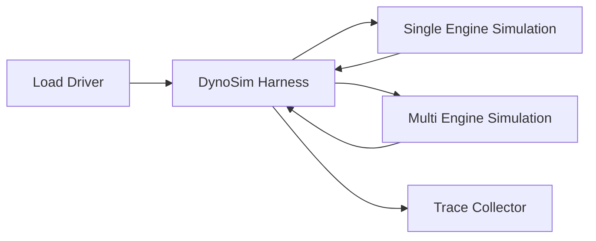
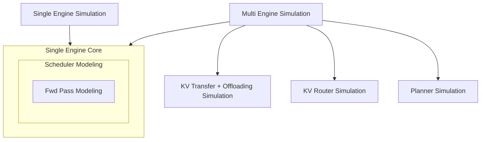

A DynoSim run evaluates one workload against one simulated Dynamo configuration. The current CLI is
`python -m dynamo.replay`, which prints an AIPerf-style summary table, writes the full report JSON
to disk, and exposes `offline|online`, `round_robin|kv_router`, `arrival_speedup_ratio`,
closed-loop concurrency, and synthetic workload inputs directly.

The command keeps the existing `replay` name for now. The docs use "DynoSim run" for the product
concept: one workload, one simulated configuration, one report.

Unlike normal `dynamo.mocker` usage, offline mode does not launch workers, register endpoints, or
require NATS, etcd, or a frontend. Online mode does exercise the live mock-worker runtime path.

Use DynoSim runs when you want to:

- benchmark scheduler behavior from a saved trace
- compare timing and cache behavior across mocker configurations
- validate simulation logic in CI without bringing up a distributed stack

## Harness Overview

The DynoSim run harness wires a load driver (trace file or synthetic workload generator) into one or more mocker engine simulations and tees request/token timing into a trace collector.



The load driver is either a Mooncake-style JSONL trace (timestamps, ISL/OSL, `hash_ids`) or a synthetic generator parameterized by `isl`/`osl`/`concurrency`. Single-engine simulation (`SES`) is the fast path for `num_workers == 1` with vLLM, SGLang, or TRT-LLM; multi-engine simulation (`MES`) covers aggregated multi-worker runs, disaggregated prefill/decode runs, and KV-router runs. The trace collector produces the AIPerf-style summary table, the JSON report, and the per-request timing fields consumed by downstream analysis.

Each simulation composes a different set of components. SES drives the engine core directly (scheduler + forward-pass modeling). MES composes multiple engine cores with KV transfer/offloading, KV routing, and planner simulation layered on top:



See [`lib/mocker/src/replay/offline/README.md`](../../lib/mocker/src/replay/offline/README.md) for offline-harness internals (logical clock, event queue, worker model) and [Live Simulation with Mocker](mocker.md) for engine-core details (scheduler, KV block manager).

## Quick Start

Run an offline DynoSim trial through the dedicated CLI:

```bash
python -m dynamo.replay /path/to/mooncake_trace.jsonl \
    --num-workers 4 \
    --replay-mode offline \
    --router-mode round_robin \
    --trace-block-size 512 \
    --extra-engine-args '{"block_size":64}' \
    --report-json /tmp/dynosim-report.json
```

Run a synthetic DynoSim trial through the same CLI when you want fixed request shapes without a trace file:

```bash
python -m dynamo.replay \
    --input-tokens 5000 \
    --output-tokens 500 \
    --request-count 1000 \
    --arrival-interval-ms 1.0 \
    --num-workers 1 \
    --replay-mode offline \
    --replay-concurrency 100 \
    --extra-engine-args '{"block_size":512}' \
    --report-json /tmp/dynosim-report.json
```

Run a synthetic workload when you want shared-prefix or multi-turn structure without a trace
file:

```bash
python -m dynamo.replay \
    --input-tokens 5000 \
    --output-tokens 500 \
    --request-count 200 \
    --turns-per-session 3 \
    --shared-prefix-ratio 0.5 \
    --num-prefix-groups 8 \
    --inter-turn-delay-ms 250 \
    --replay-mode offline \
    --replay-concurrency 32 \
    --extra-engine-args '{"block_size":512}' \
    --report-json /tmp/dynosim-report.json
```

`python -m dynamo.replay` prints an AIPerf-style summary table to stdout and writes the full
report JSON to disk.

## Input Format

The trace file must be Mooncake-style JSONL. Each line should contain:

- `timestamp` or `created_time`
- `input_length` or `input_tokens`
- `output_length` or `output_tokens`
- `hash_ids`

Example:

```json
{"timestamp": 0, "input_length": 6755, "output_length": 500, "hash_ids": [0, 1, 2, 3]}
{"timestamp": 0, "input_length": 4096, "output_length": 128, "hash_ids": [9, 10, 11, 12]}
```

Rows without `session_id` are independent timestamped requests. Use this shape for wall-clock
request traces, including agent-converted traces where parallel LLM calls should remain parallel.

DynoSim runs also support multi-turn sessions. Use the same `session_id` on all turns in a session.
Multi-turn sessions are closed-loop: turn `n+1` waits until turn `n` completes plus either the
explicit `delay` / `delay_ms` or the timestamp delta inferred from consecutive rows in the same
session.

Example:

```json
{"session_id":"session-a","timestamp":1000,"input_length":2048,"output_length":128,"hash_ids":[1,2,3,4]}
{"session_id":"session-a","delay_ms":50,"input_length":2560,"output_length":128,"hash_ids":[1,2,3,4,5]}
{"session_id":"session-b","timestamp":1010,"input_length":1024,"output_length":64,"hash_ids":[9,10]}
{"session_id":"session-b","timestamp":1060,"input_length":1536,"output_length":64,"hash_ids":[9,10,11]}
```

The second `session-a` row waits for the first turn to complete plus 50 ms. The second `session-b`
row also waits for the first turn to complete plus the inferred 50 ms timestamp delta.

### Agentic Mooncake

`--trace-format agentic_mooncake` simulates request-level workflow dependencies in addition to the
Mooncake request fields. Each row should contain the normal Mooncake fields plus a stable
`request_id`. Dependency fields are optional.

```json
{
  "request_id": "root-2",
  "session_id": "run-42:root",
  "timestamp": 1000.0,
  "input_length": 4096,
  "output_length": 256,
  "hash_ids": [0, 1, 2, 3],
  "wait_for": ["child-1"],
  "branches": ["child-1"],
  "prefix_reset": false,
  "delay": 10.0,
  "tool_wait_ms": 2500.0
}
```

Rows with no `wait_for` use `timestamp` as their start time. Rows with dependencies wait for every
listed request to complete, then wait `delay + tool_wait_ms` before dispatch. `branches` records
child requests spawned by this row, and `prefix_reset` marks the first row in a trajectory.

Use `agent_trace_to_mooncake --agentic` to create this format from Dynamo agent traces:

```bash
cargo run -p dynamo-bench --bin agent_trace_to_mooncake -- \
  --agentic \
  --input-path /tmp/dynamo-agent-trace.jsonl \
  --output-file /tmp/dynamo-agent-trace.agentic-mooncake.jsonl
```

Run it with:

```bash
python -m dynamo.replay /tmp/dynamo-agent-trace.agentic-mooncake.jsonl \
    --trace-format agentic_mooncake \
    --trace-block-size 128 \
    --replay-mode offline \
    --router-mode kv_router \
    --num-workers 4 \
    --extra-engine-args '{"block_size":128}' \
    --report-json /tmp/agentic-dynosim-report.json
```

DynoSim uses two different block-size concepts for trace files:

- `--trace-block-size`: how many tokens each `hash_id` in the dataset represents
- engine `block_size`: the block size used by the simulated engine and router when they re-chunk the
  synthesized tokens into sequence hashes

Public Mooncake/toolagent traces use `512` tokens per `hash_id`, so DynoSim runs should normally
use `--trace-block-size 512`. The engine `block_size` can still be smaller, for example the live
vLLM benchmark setup uses `block_size=64`. For `engine_type=sglang`, DynoSim still uses canonical
`block_size` internally; `sglang.page_size` is accepted as a compatibility alias and is normalized
into `block_size` before simulation starts.

## DynoSim Surfaces

### `python -m dynamo.replay`

The dedicated DynoSim CLI exposes:

- either a positional `trace_file`, or all of `--input-tokens`, `--output-tokens`, and `--request-count`
- `--replay-mode offline|online`
- `--router-mode round_robin|kv_router`
- `--num-workers`
- `--num-prefill-workers`
- `--num-decode-workers`
- `--replay-concurrency`
- `--arrival-interval-ms`
- `--arrival-speedup-ratio`
- `--trace-format mooncake|mooncake-delta|agentic_mooncake|applied_compute_agentic`
- `--trace-block-size`
- `--turns-per-session`
- `--shared-prefix-ratio`
- `--num-prefix-groups`
- `--inter-turn-delay-ms`
- `--extra-engine-args` (JSON string)
- `--prefill-engine-args` (JSON string)
- `--decode-engine-args` (JSON string)
- `--router-config` (JSON string)
- `--aic-backend`
- `--aic-system`
- `--aic-backend-version`
- `--aic-tp-size`
- `--aic-model-path`
- `--aic-moe-tp-size`
- `--aic-moe-ep-size`
- `--aic-attention-dp-size`
- `--report-json`

Defaults:

- `--replay-mode offline`
- `--router-mode round_robin`

Example:

```bash
python -m dynamo.replay /path/to/mooncake_trace.jsonl \
    --replay-mode online \
    --router-mode kv_router \
    --num-workers 4 \
    --arrival-speedup-ratio 10 \
    --trace-block-size 512 \
    --extra-engine-args '{"block_size":64}' \
    --router-config '{"router_queue_policy":"fcfs","router_temperature":0.0}' \
    --report-json /tmp/dynosim-report.json
```

SGLang simulation uses the same CLI surface. A minimal extra-engine-args file can use either
`block_size` directly or the compatibility alias `sglang.page_size`:

```json
{
  "engine_type": "sglang",
  "num_gpu_blocks": 512,
  "sglang": {
    "page_size": 2
  }
}
```

Both `--extra-engine-args` and `--router-config` accept partial JSON objects. Engine settings such
as `block_size`, `engine_type`, `dp_size`, `speedup_ratio`, and `decode_speedup_ratio` belong in
`--extra-engine-args`, not as top-level DynoSim CLI flags. `--trace-block-size` is separate and is
used only for trace-file runs. Unspecified fields fall back to the same defaults used by
`MockEngineArgs::default()` and `KvRouterConfig::default()`.

DynoSim has two independent AIC surfaces:

- engine timing AIC via `--extra-engine-args` / staged engine JSON
- router-side prompt-load AIC via top-level `--aic-*` flags together with
  `router_prefill_load_model: "aic"` in `--router-config`

Both surfaces accept MoE parallelism fields. For Kimi-style TP-only MoE configs, keep them aligned by
setting `aic_moe_tp_size` to the same value as `aic_tp_size`, with `aic_moe_ep_size=1` and
`aic_attention_dp_size=1`.

Offline disaggregated simulation uses staged engine args instead of `--extra-engine-args`:

- `--prefill-engine-args` for the prefill worker config
- `--decode-engine-args` for the decode worker config
- `--num-prefill-workers` and `--num-decode-workers` for pool sizes

For offline disaggregated simulation, the staged JSON must set `worker_type` explicitly:

- `--prefill-engine-args` must use `worker_type: "prefill"`
- `--decode-engine-args` must use `worker_type: "decode"`

The staged configs must also use the same engine `block_size`. `--trace-block-size` remains a
separate trace-file input knob.

### Synthetic Workloads

Synthetic mode bypasses trace loading and generates in-memory requests with fixed input/output
lengths and optional synthetic arrival spacing:

```bash
python -m dynamo.replay \
    --input-tokens 5000 \
    --output-tokens 500 \
    --request-count 200 \
    --arrival-interval-ms 0.5 \
    --replay-mode offline \
    --replay-concurrency 50 \
    --extra-engine-args '{"block_size":512}'
```

This is useful for parameter sweeps where Mooncake-style prefix structure is not required.

When `--turns-per-session > 1`, `--request-count` is interpreted as the number of sessions rather
than the total number of emitted turns. The total completed request count becomes:

- `request_count * turns_per_session`

Synthetic workload options:

- `--turns-per-session`: number of turns in each synthetic session
- `--shared-prefix-ratio`: fraction of prompt blocks shared inside a prefix group
- `--num-prefix-groups`: number of shared-prefix groups; `0` disables grouping
- `--inter-turn-delay-ms`: constant delay applied after each completed turn before the next turn in
  the same session becomes eligible

## Modes

### Fixed-Schedule Runs

Default trace mode preserves the timestamps from the trace and simulates arrivals according to
those timestamps:

```bash
python -m dynamo.replay /path/to/mooncake_trace.jsonl \
    --replay-mode offline \
    --num-workers 4 \
    --trace-block-size 512 \
    --extra-engine-args '{"block_size":64}'
```

This is the right mode when you want deterministic simulation of the original request-arrival pattern.
For wall-clock request traces, omit `session_id` so each row is scheduled independently by timestamp.
Rows that share a `session_id` are simulated as a closed-loop session, where each later turn waits for
the previous turn to complete.

### Closed-Loop Concurrency

Use `--replay-concurrency` to ignore first-turn trace arrival timing and keep a fixed number of
requests in flight:

```bash
python -m dynamo.replay /path/to/mooncake_trace.jsonl \
    --replay-mode offline \
    --num-workers 4 \
    --replay-concurrency 16
```

This mode is useful when you want to compare scheduler behavior under a fixed offered concurrency rather than the original trace schedule.

For multi-turn sessions, concurrency mode still enforces session order and inter-turn delays:

- first-turn timestamps are ignored
- turn `n+1` is not eligible until turn `n` completes
- `delay` / `delay_ms` / synthetic `--inter-turn-delay-ms` are still applied after completion
- TTFT is measured from actual dispatch under the cap, not from the ignored trace timestamp

### Online Mode

Online mode launches the mock workers and runs the trace against the live runtime path. This
is useful when you want the run to include live request dispatch, live output handling, and the
same async KV-event propagation model used by the current router integration.

```bash
python -m dynamo.replay /path/to/mooncake_trace.jsonl \
    --replay-mode online \
    --router-mode kv_router \
    --num-workers 4 \
    --arrival-speedup-ratio 10 \
    --trace-block-size 512 \
    --extra-engine-args '{"block_size":64}'
```

### Arrival Speedup

Use `--arrival-speedup-ratio` to compress or stretch the trace arrival process without changing the
mocker compute model. Larger values make arrivals happen sooner relative to the original trace.

```bash
python -m dynamo.replay /path/to/mooncake_trace.jsonl \
    --replay-mode offline \
    --num-workers 4 \
    --arrival-speedup-ratio 5 \
    --trace-block-size 512 \
    --extra-engine-args '{"block_size":64}'
```

### Router Modes

DynoSim currently supports:

- `round_robin`
- `kv_router`

`kv_router` uses the shared local scheduler and an in-process KV indexer. Router policy tuning is
provided through `--router-config`, not a dedicated top-level CLI flag. In offline mode:

- `kv_router` is supported only when `num_workers > 1`
- router queueing is enabled and uses simulation time rather than wall-clock time
- KV visibility is delayed slightly relative to request lifecycle events
- queue admission is driven by router lifecycle edges (`add_request`, `mark_prefill_completed`, and `free`)
- transient in-pass prefill occupancy is still approximated at the router level rather than modeled exactly
- when `router_prefill_load_model` is `"aic"`, DynoSim predicts one expected prefill duration per
  admitted request and decays only the oldest active prefill request on each worker

To compare queue policies manually, keep the same trace and engine args fixed and swap only
`router_queue_policy` inside `--router-config`:

```bash
python -m dynamo.replay /path/to/mooncake_trace.jsonl \
    --replay-mode offline \
    --router-mode kv_router \
    --num-workers 4 \
    --trace-block-size 512 \
    --extra-engine-args '{"block_size":64}' \
    --router-config '{"router_queue_policy":"fcfs"}'

python -m dynamo.replay /path/to/mooncake_trace.jsonl \
    --replay-mode offline \
    --router-mode kv_router \
    --num-workers 4 \
    --trace-block-size 512 \
    --extra-engine-args '{"block_size":64}' \
    --router-config '{"router_queue_policy":"lcfs"}'
```

`lcfs` is intentionally a worse comparison policy under saturation; use it for experiments, not as
an expected production default.

To enable router-side AIC prefill-load modeling during simulation:

```bash
python -m dynamo.replay /path/to/mooncake_trace.jsonl \
    --replay-mode offline \
    --router-mode kv_router \
    --num-workers 4 \
    --trace-block-size 512 \
    --extra-engine-args '{"block_size":64}' \
    --router-config '{"router_track_prefill_tokens":true,"router_prefill_load_model":"aic"}' \
    --aic-backend vllm \
    --aic-system h200_sxm \
    --aic-model-path nvidia/Llama-3.1-8B-Instruct-FP8 \
    --aic-tp-size 1
```

For offline disaggregated simulation, the same top-level `--aic-*` flags are supported, but the estimator is
applied only to the prefill-stage router.

For MoE models that require AIC MoE parallelism, add the matching top-level router AIC flags, for
example:

```bash
    --aic-tp-size 2 \
    --aic-moe-tp-size 2 \
    --aic-moe-ep-size 1 \
    --aic-attention-dp-size 1
```

## Output

The report contains:

- request counts
- input and output token totals
- virtual duration and wall-clock runtime
- request and token throughput
- prefix cache reuse ratio
- TTFT, TTST, TPOT, ITL, and end-to-end latency summaries
- output-token-throughput-per-user summaries

The dedicated DynoSim CLI returns the same report schema as the Python APIs
`dynamo.replay.run_trace_replay(...)` and `dynamo.replay.run_synthetic_trace_replay(...)`.

If `--report-json` is not provided, `python -m dynamo.replay` writes a timestamped
`dynamo_replay_report_*.json` file in the current working directory.

## Constraints

Shared constraints:

- `extra_engine_args.engine_type` must be `vllm`, `sglang`, or `trtllm`
- aggregated simulation requires the existing aggregated args path
- disaggregated simulation requires both `prefill_engine_args` and `decode_engine_args`
- disaggregated simulation requires `router_mode=kv_router`
- `dp_size` must be `1`
- disaggregated simulation requires matching `block_size` in `prefill_engine_args` and `decode_engine_args`

Additional offline constraints:

- offline `kv_router` requires `num_workers > 1`
- single-worker offline mode is a dedicated fast path for `vllm`, `sglang`, and `trtllm`;
  it supports flat request runs and workload-driven multi-turn runs
- offline disaggregated simulation is a separate two-stage runtime with prefill and decode worker pools

Additional online constraints:

- the current live simulation path is also limited to aggregated workers

If you violate those constraints, DynoSim fails immediately with a validation error.

## Practical Notes

- `python -m dynamo.replay` requires exactly one of:
  either a trace file, or all of `--input-tokens`, `--output-tokens`, and `--request-count`
- `--replay-concurrency` works with both trace-file and synthetic workloads
- mocker compute-speed knobs such as `speedup_ratio` still affect simulated timing when passed via
  the engine-args JSON for the chosen mode
- `--arrival-speedup-ratio` affects trace timestamps, not worker compute speed
- `--trace-block-size` affects only how trace `hash_ids` expand into tokens
- `--arrival-interval-ms` only applies to synthetic workloads
- `--turns-per-session`, `--shared-prefix-ratio`, `--num-prefix-groups`, and
  `--inter-turn-delay-ms` only apply to synthetic workloads
- `--extra-engine-args`, `--prefill-engine-args`, `--decode-engine-args`, and `--router-config`
  are JSON strings on the standalone DynoSim CLI
- top-level `--aic-*` flags are used only for router-side prompt-load modeling; engine timing AIC
  still belongs in the engine-args JSON
- offline mode does not need planner runtime setup, router registration, or external event transport
- trace-file workloads can use different values for `--trace-block-size` and engine `block_size`
- Mooncake/toolagent traces typically use `--trace-block-size 512`, while engine `block_size`
  often stays `64`

## When To Use This vs AIPerf

Use offline DynoSim when:

- you want a fast scheduler-only simulation
- you want deterministic CI coverage of simulation behavior
- you do not need HTTP serving, frontend behavior, or network effects

Use [Dynamo Benchmarking](../benchmarks/benchmarking.md) when:

- you want end-to-end benchmarking against a live endpoint
- you need frontend, transport, or cluster-level behavior
- you want AIPerf dashboards and endpoint-facing metrics
