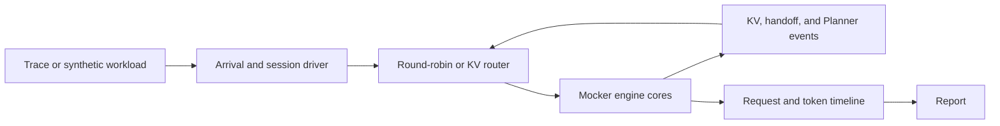

An offline DynoSim run evaluates one workload against one simulated Dynamo configuration. Use it to
develop routing algorithms, compare queueing or scheduling policies, study Planner decisions, and
screen deployment shapes before running live or GPU-backed tests.

The CLI remains `python -m dynamo.replay`. Offline mode drives Mocker engine cores with a virtual
clock and in-process models of the router, Planner, prefill/decode handoff, and KV movement. It does
not start a frontend, external discovery service, event transport, or worker processes.

To exercise those live components and measure their overhead, use
[Live Simulation with Mocker](mocker.md).

## How Offline Replay Works


```mermaid
flowchart LR
    W["Trace or synthetic workload"] --> A["Arrival and session driver"]
    A --> R["Round-robin or KV router"]
    R --> E["Mocker engine cores"]
    E --> K["KV, handoff, and Planner events"]
    K --> R
    E --> Q["Request and token timeline"]
    Q --> O["Report"]
```

The event queue advances directly to the next arrival, worker completion, transfer completion, or
Planner event. Repeated runs with the same input and seed follow the same virtual-time sequence.
Each engine core still runs its engine-specific batching, KV allocation, memory-pressure, and token
emission logic.

## Quick Start

Run a timestamped trace against four round-robin workers:

```bash
python3 -m dynamo.replay /path/to/mooncake-trace.jsonl \
    --replay-mode offline \
    --router-mode round_robin \
    --num-workers 4 \
    --trace-block-size 512 \
    --extra-engine-args '{"engine_type":"vllm","block_size":64}' \
    --report-json /tmp/dynosim-report.json
```

Run a closed-loop synthetic workload without creating a trace:

```bash
python3 -m dynamo.replay \
    --input-tokens 5000 \
    --output-tokens 500 \
    --request-count 1000 \
    --replay-concurrency 100 \
    --replay-mode offline \
    --router-mode round_robin \
    --num-workers 4 \
    --extra-engine-args '{"engine_type":"vllm","block_size":64}' \
    --report-json /tmp/dynosim-report.json
```

The CLI prints an AIPerf-style summary and writes a full JSON report. If `--report-json` is omitted,
it writes a timestamped `dynamo_replay_report_*.json` in the current directory.

## Configure an Experiment

Start from one workload and one baseline configuration. Change only the algorithm or policy under
test, then compare the reports. For example, keep the trace, engine arguments, worker count, and
arrival mode fixed while changing `router_queue_policy`:

```bash
python3 -m dynamo.replay /path/to/mooncake-trace.jsonl \
    --replay-mode offline \
    --router-mode kv_router \
    --num-workers 4 \
    --trace-block-size 512 \
    --extra-engine-args '{"engine_type":"vllm","block_size":64}' \
    --router-config '{"router_queue_policy":"fcfs"}' \
    --report-json /tmp/fcfs-report.json
```

Use the major controls below to define a run. Use the built-in help for the complete,
version-matched CLI:

```bash
python3 -m dynamo.replay --help
```

| Goal | Major Knobs |
|---|---|
| Select the runtime | `--replay-mode`, `--router-mode` |
| Set the worker topology | `--num-workers`, `--num-prefill-workers`, `--num-decode-workers` |
| Configure engine cores | `--extra-engine-args`, `--prefill-engine-args`, `--decode-engine-args` |
| Control offered load | `--replay-concurrency`, `--request-rate`, `--arrival-interval-ms`, `--arrival-speedup-ratio`, `--arrival-seed` |
| Define synthetic reuse and sessions | `--turns-per-session`, `--shared-prefix-ratio`, `--num-prefix-groups`, `--inter-turn-delay-ms` |
| Configure the router | `--router-config`, `--router-policy-config`, `--model-name` |
| Run Planner in the loop | `--planner-config`, `--benchmark-granularity` |
| Capture results | `--report-json`, `--report-jsonl`, `--max-sim-time-seconds`, `--sla-*` |

Engine timing, capacity, KVBM tiers, and transfer settings belong in the engine-argument JSON. See
[Simulation Model](modeling.md) for their semantics.

## Choose a Workload

Provide either trace files or all three synthetic shape arguments: `--input-tokens`,
`--output-tokens`, and `--request-count`.

### Trace Formats

| Format | Intended Input | Main Restrictions |
|---|---|---|
| `mooncake` | Timestamped request and cache-hash rows | Supported across aggregated offline, disaggregated offline, and online replay |
| `mooncake-delta` | Session rows whose later prompts contain only new input deltas | Not supported by online or disaggregated replay |
| `agentic_mooncake` | Request rows with explicit workflow dependencies | Offline aggregated timestamp mode only |
| `applied_compute_agentic` | Applied Compute agentic traces without first-turn timestamps | Requires `--replay-concurrency` |
| `dynamo` | `dynamo.request.trace.v1` JSONL or JSONL.GZ shards | Accepts multiple shards and derives the trace block size |

Mooncake rows contain input and output lengths plus the cache hashes used to reconstruct prefix
structure:

```json
{"timestamp":0,"input_length":6755,"output_length":500,"hash_ids":[0,1,2,3]}
{"timestamp":10,"input_length":4096,"output_length":128,"hash_ids":[9,10,11,12]}
```

Optional `priority`, `strict_priority`, and `policy_class` fields affect the KV router's pending
queue. They do not change round-robin routing or execution order inside a selected engine.

Use a shared `session_id` for closed-loop multi-turn traces. A later turn waits for the previous
turn to finish plus its explicit `delay_ms`, `delay`, or inferred timestamp delta:

```json
{"session_id":"session-a","timestamp":1000,"input_length":2048,"output_length":128,"hash_ids":[1,2,3,4]}
{"session_id":"session-a","delay_ms":50,"input_length":2560,"output_length":128,"hash_ids":[1,2,3,4,5]}
```

For Mooncake-derived traces, `--trace-block-size` is the number of tokens represented by each
`hash_id`. Public Mooncake and tool-agent traces commonly use 512. Engine `block_size` is a separate
value used when Mocker re-chunks the synthesized tokens. Dynamo request traces embed their block
size; replay derives it and rejects an explicit mismatch.

Replay Dynamo request-trace shards directly:

```bash
python3 -m dynamo.replay /tmp/dynamo-request-trace.*.jsonl.gz \
    --trace-format dynamo \
    --replay-mode offline \
    --router-mode kv_router \
    --num-workers 4 \
    --report-json /tmp/dynamo-trace-report.json
```

### Synthetic Workloads

Synthetic replay requires exactly one load controller:

- `--replay-concurrency` keeps a fixed number of requests or sessions in flight.
- `--request-rate` generates seeded Poisson open-loop arrivals.
- `--arrival-interval-ms` generates fixed open-loop spacing.

Use `--arrival-seed` to reproduce a Poisson arrival sequence. When `--turns-per-session` is greater
than one, `--request-count` counts sessions rather than turns.

This example generates eight groups that share half of each first prompt:

```bash
python3 -m dynamo.replay \
    --input-tokens 5000 \
    --output-tokens 500 \
    --request-count 200 \
    --request-rate 20 \
    --arrival-seed 42 \
    --turns-per-session 3 \
    --shared-prefix-ratio 0.5 \
    --num-prefix-groups 8 \
    --inter-turn-delay-ms 250 \
    --replay-mode offline \
    --num-workers 4 \
    --extra-engine-args '{"engine_type":"vllm","block_size":64}' \
    --report-json /tmp/synthetic-report.json
```

## Choose an Execution Mode

### Aggregated Offline Replay

Aggregated replay supports vLLM, SGLang, and TensorRT-LLM engine modes. For one worker with one
data-parallel rank, replay uses a direct fast path. Multi-worker, KV-router, and data-parallel
topologies use the general event-driven harness.

Set `dp_size` in `--extra-engine-args` to give each logical worker independent rank schedulers and KV
pools. Offline KV routing requires more than one routing target:

```text
num_workers * dp_size > 1
```

### Disaggregated Offline Replay

Disaggregated replay uses separate prefill and decode worker pools under one logical clock. It
supports round-robin and KV-router modes for vLLM and SGLang. TensorRT-LLM disaggregation is not
supported.

```bash
python3 -m dynamo.replay /path/to/mooncake-trace.jsonl \
    --replay-mode offline \
    --router-mode kv_router \
    --replay-concurrency 32 \
    --num-prefill-workers 2 \
    --num-decode-workers 6 \
    --trace-block-size 512 \
    --prefill-engine-args '{"worker_type":"prefill","engine_type":"vllm","block_size":64}' \
    --decode-engine-args '{"worker_type":"decode","engine_type":"vllm","block_size":64}' \
    --router-config '{"router_queue_policy":"wspt"}' \
    --report-json /tmp/disaggregated-report.json
```

Prefill and decode arguments must use matching engine types and block sizes. Both stages currently
require `dp_size=1`. The public report follows the decode-visible request, so Time To First Token
(TTFT) includes prefill queueing, prefill compute, handoff, and decode activation.

Set `kv_transfer_timing_mode`, `kv_transfer_bandwidth`, `kv_bytes_per_token`, and KVBM lower-tier
fields in the staged JSON to include the corresponding memory and handoff models.

### Online Replay

`--replay-mode online` drives the live mock-worker runtime from the replay load driver. Use it for
offline-versus-live parity checks that do not require a frontend. It supports aggregated workers and
requires `dp_size=1`.

For endpoint-facing benchmarks, real discovery, frontend routing, transport overhead, and Planner
integration, run [Live Simulation with Mocker](mocker.md) and use
[Dynamo Benchmarking](../benchmarks/benchmarking.md).

## Configure AIConfigurator

DynoSim has two independent
[AIConfigurator](https://github.com/ai-dynamo/aiconfigurator) surfaces:

- **Engine timing** fields live in `--extra-engine-args` or the staged prefill/decode JSON.
- **Router prefill-load estimation** uses the top-level `--aic-*` flags with
  `router_prefill_load_model: "aic"` in `--router-config`.

Example engine-timing configuration:

```bash
python3 -m dynamo.replay /path/to/mooncake-trace.jsonl \
    --num-workers 4 \
    --extra-engine-args \
      '{"engine_type":"vllm",
        "aic_backend":"vllm",
        "aic_system":"h200_sxm",
        "aic_model_path":"nvidia/Llama-3.1-8B-Instruct-FP8",
        "aic_tp_size":1}' \
    --report-json /tmp/aic-engine-report.json
```

Example router-load configuration:

```bash
python3 -m dynamo.replay /path/to/mooncake-trace.jsonl \
    --router-mode kv_router \
    --num-workers 4 \
    --extra-engine-args '{"engine_type":"vllm","block_size":64}' \
    --router-config \
      '{"router_track_prefill_tokens":true,"router_prefill_load_model":"aic"}' \
    --aic-backend vllm \
    --aic-system h200_sxm \
    --aic-model-path nvidia/Llama-3.1-8B-Instruct-FP8 \
    --aic-tp-size 1 \
    --report-json /tmp/aic-router-report.json
```

Keep the two surfaces aligned when the experiment intends the router and worker to model the same
configuration. They can also differ deliberately to test estimator error or policy sensitivity.

## Run Planner in the Loop

Pass `--planner-config` to apply scaling decisions during offline aggregated or disaggregated
replay. Planner events share the simulation clock with workload, worker, router, and transfer
events. Use the `--sla-*` flags separately to calculate goodput; those report thresholds do not
change Planner's own scaling SLA.

Planner-in-the-loop replay is offline only. For trace-driven runs, provide exactly one trace file
in Mooncake format. Planner replay does not support `--report-jsonl` or
`--max-sim-time-seconds`; synthetic inputs remain supported.

See [Planner Simulation Benchmarking](planner-benchmarking.md) for configuration and interpretation.

## Read the Report

The report includes:

- completed and incomplete request counts;
- input and output token totals;
- virtual duration and host runtime;
- request and token throughput;
- prefix-cache reuse;
- TTFT, Time To Second Token (TTST), Time Per Output Token (TPOT), Inter-Token Latency (ITL), and
  end-to-end latency summaries;
- output-token throughput per user;
- goodput when an SLA threshold is configured.

For offline trace-file runs, `--report-jsonl` records one JSON object per request with its
arrival, admission, token, worker-residency, and completion timeline. Use
`--max-sim-time-seconds` to stop a trace-file replay at a virtual-time boundary and retain
incomplete requests in the report. These options are not available with every Planner or synthetic
mode; `--help` reports the current constraints.

## Reproducibility and Validation

Record the Dynamo commit, trace identity, engine and router JSON, timing-data version, seed, and
report with each result. A simulator can compare policies consistently even when its timing model
is not calibrated for absolute hardware prediction.

On Apple Silicon, run the native `linux/arm64` image for multi-worker replay. If an existing Docker
tag resolves to an amd64 image, pass `--platform linux/arm64` explicitly. Rosetta translation can
segfault multi-worker, multi-turn runs; use QEMU only when an amd64 image is required.

Use DynoSim to explore broadly and identify sensitive decisions. Validate the selected
configurations with live Mocker for distributed-system behavior and with representative GPUs for
hardware performance.
