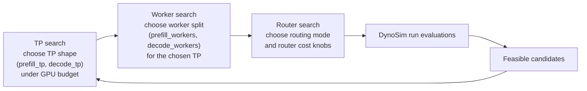

A DynoSim sweep runs many simulated trials across candidate topologies, router settings, and timing-model inputs, then ranks the results against SLA constraints and GPU budget. Use sweeps when a single [DynoSim run](runs.md) is not enough and you want to search the design space before validating on real GPUs.

The current Python API is `dynamo.profiler.utils.replay_optimize`. The docs use "DynoSim sweep" as the product term while keeping the existing implementation name for now.

## What It Answers

A sweep answers a concrete deployment question:

- given a fixed GPU budget
- for a workload with prefix overlap
- and latency SLAs that still permit meaningful throughput

which topology, worker split, and router settings produce the best simulated result?

For disaggregated deployments, the search can cover:

- tensor-parallel shape for prefill and decode workers
- prefill and decode worker counts
- KV-router overlap credit
- prompt-load scaling
- throughput, TTFT, ITL, or end-to-end latency objectives

This is a heuristic search over simulated states, not an exact optimizer over every feasible configuration.

## How It Works



Each candidate state is evaluated by the DynoSim run harness. The optimizer records the metrics from each run, filters candidates that violate SLA or GPU-budget constraints, and returns the best feasible state plus the full evaluated table for analysis.

The descent is budget-focused: each step prunes to near-budget-edge states so the sweep ends up at a TP/worker shape that actually consumes the available GPU budget, rather than at a pure throughput-per-GPU point. Aggregated sweeps collapse the TP and worker dimensions into `(tp, workers)` but otherwise follow the same idea.

## Spec Shape

The public API takes a single `ReplayOptimizeSpec` composed of:

| Spec | Purpose |
|---|---|
| `EngineSpec` | Model, backend, and JSON-like engine arguments. Disaggregated sweeps use prefill and decode engine args; aggregated sweeps use `baseEngineArgs`. |
| `HardwareSpec` | GPU SKU and total simulated GPU budget |
| `WorkloadSpec` | Synthetic workload knobs or a trace file |
| `SLASpec` | Optional TTFT, ITL, end-to-end latency, and p95 bounds |
| `RouterSpec` | Router mode, overlap-score-credit sweep, prefill-load-scale sweep, and KV-router base config |
| `objective` | Ranking target, such as throughput, mean TTFT, or mean end-to-end latency |
| `maxParallelEvals` | Number of candidate evaluations to run concurrently |

Field names use lowerCamelCase to align with `DynamoGraphDeploymentRequest` concepts. Method names stay snake_case to match Pydantic convention.

## Prerequisites

Run from the repository root.

Use the project virtual environment:

```bash
.venv/bin/python --version
```

If the runtime `_core` bindings are not importable yet, build them first:

```bash
.venv/bin/maturin develop --uv -m lib/bindings/python/Cargo.toml
```

The example uses AIC-backed timing by default:

- AIC enumerates dense TP candidates
- AIC-backed engine timing is used for candidate configs

Install `aiconfigurator` into the project environment:

```bash
uv pip install --python .venv/bin/python aiconfigurator
```

If a regular install fails to load usable perf data, reinstall from a source checkout that has real systems data materialized:

```bash
uv pip install --python .venv/bin/python --force-reinstall /path/to/aiconfigurator
```

If DynoSim sweep setup fails with AIC errors about missing perf databases or parse failures such as `KeyError: 'gemm_dtype'`, inspect the installed files under:

```text
.venv/lib/python*/site-packages/aiconfigurator/systems/data/...
```

If those files begin with `version https://git-lfs.github.com/spec/v1`, you have Git LFS pointer stubs instead of real perf tables. Install `aiconfigurator` from a checkout or wheel that includes the real LFS materialized payloads in `systems/`.

When running directly from a source checkout, expose the in-repo Python components
and runtime bindings:

```bash
export PYTHONPATH=components/src:lib/bindings/python/src
```

If the sweep uses multiple worker processes, prefer a real script file over a heredoc. On macOS, `ProcessPoolExecutor` child workers need a stable module path, and the driver module must guard its entry behind `if __name__ == "__main__":`.

For KV-router logs, this filter keeps the run readable without hiding useful `info` output:

```bash
export DYN_LOG='info,dynamo_kv_router::scheduling::selector=warn'
```

## Run The Example

The canonical starting point is the checked-in driver script:

```bash
.venv/bin/python components/src/dynamo/profiler/utils/replay_optimize/example.py \
  --max-parallel-evals 4
```

The default example searches a synthetic disaggregated KV-router workload using AIC-backed candidate timing. It prints the best feasible state and a table of top feasible configurations.

The example uses:

- model: `Qwen/Qwen3-32B`
- backend: `vllm`
- GPU SKU: `h200_sxm`
- total simulated GPUs: `16`
- router mode: `kv_router`
- synthetic workload:
  - `isl=32768`
  - `osl=256`
  - `requestCount=5000`
  - `concurrency=200`
  - `sharedPrefixRatio=0.5`
  - `numPrefixGroups=50`

The GPU budget is a simulated search constraint. You do not need 16 real GPUs locally to run the search.

The base engine args stay conservative:

- `block_size=512`
- `enable_prefix_caching=True`
- explicit `worker_type` for prefill versus decode

The example intentionally omits `num_gpu_blocks`; AIC-backed DynoSim estimates capacity for each candidate TP shape unless a base input explicitly pins it.

This setup does not force scheduler-specific bottlenecks such as:

- `enable_chunked_prefill`
- a small `max_num_seqs`
- a pinned `max_num_batched_tokens`

Only add those when the experiment is specifically about scheduler limits.

## Run Against A Trace

To run against a Mooncake-style trace instead of the synthetic workload:

```bash
.venv/bin/python components/src/dynamo/profiler/utils/replay_optimize/example.py \
  --trace-file /path/to/mooncake_trace.jsonl \
  --arrival-speedup-ratio 1.0 \
  --max-parallel-evals 4
```

For a public starting point, download the FAST'25 toolagent trace:

```bash
curl -sL \
  https://raw.githubusercontent.com/kvcache-ai/Mooncake/refs/heads/main/FAST25-release/traces/toolagent_trace.jsonl \
  -o /tmp/toolagent_trace.jsonl
```

Then run:

```bash
.venv/bin/python components/src/dynamo/profiler/utils/replay_optimize/example.py \
  --trace-file /tmp/toolagent_trace.jsonl \
  --arrival-speedup-ratio 1.0 \
  --max-parallel-evals 4
```

In trace mode:

- `traceFile` points at the Mooncake-style JSONL input
- `arrivalSpeedupRatio` compresses or stretches the trace arrival process
- synthetic-only knobs such as `isl`, `osl`, `requestCount`, `concurrency`, `sharedPrefixRatio`, and `numPrefixGroups` are ignored

Important notes for the public toolagent trace:

- the dataset uses Mooncake-style `hash_ids` with `512` tokens per block
- the underlying `run_trace_replay(...)` API defaults `trace_block_size` to `512`
- `WorkloadSpec` does not yet expose a separate `traceBlockSize` field

## Customize A Sweep

Treat the example driver as a starting point, not a frozen harness. Modify it as needed for your search:

- change the `WorkloadSpec` shape or switch to a trace source with `traceFile`
- add SLA bounds on `SLASpec`, such as `ttft`, `itl`, `e2eLatency`, or their p95 variants
- change `RouterSpec.overlapCredits` within the valid `0.0` to `1.0` range
- change `RouterSpec.prefillLoadScales` when you want to weigh TTFT/prompt-side load more or less heavily
- print different columns from `result.evaluated_df` or `result.feasible_df`
- persist the tables to CSV or Parquet for downstream analysis

Useful axes to vary:

- `HardwareSpec.totalGpus`
- `RouterSpec.overlapCredits`
- `RouterSpec.prefillLoadScales`
- `WorkloadSpec.sharedPrefixRatio`
- `WorkloadSpec.numPrefixGroups`
- base prefill/decode engine args

If you want to compare routing strategies directly, use `RouterSpec(mode="both")` instead of the default KV-router-only search.

## Outputs

The optimizer returns a `DenseReplayOptimizationResult` with:

- `best_feasible`: best visited state that satisfies all configured SLA and GPU-budget constraints
- `best_infeasible`: best visited state that misses at least one SLA bound or the budget
- `evaluated_df`: all visited states
- `feasible_df`: only feasible states

Common columns to inspect:

- topology: `prefill_tp`, `decode_tp`, `prefill_workers`, `decode_workers`
- routing: `router_mode`, `overlap_score_credit`, `prefill_load_scale`
- budget: `total_gpus_used`
  This is the simulated GPU footprint of the candidate state, not a count of GPUs actually allocated on the machine running the search.
- throughput: `output_throughput_tok_s`
- cache behavior: `prefix_cache_reused_ratio`
- latency: `mean_ttft_ms`, `mean_tpot_ms`, `mean_e2e_latency_ms`

The report DataFrame still uses the Rust DynoSim runner's metric keys (`mean_ttft_ms`, `mean_tpot_ms`, `mean_e2e_latency_ms`) even though the input `SLASpec` uses DGDR-style camelCase names (`ttft`, `itl`, `e2eLatency`). `SLASpec` carries an internal translation map.

In local testing, the default synthetic setup produced a non-trivial mean-E2E winner around:

- `prefill_tp=4`, `decode_tp=1`, `prefill_workers=3`, `decode_workers=4`, `overlap_score_credit=0.5`, `prefill_load_scale=1.0`
- `output_throughput_tok_s ~= 970`, `prefix_cache_reused_ratio ~= 0.5`, `mean_ttft_ms ~= 42800`, `mean_tpot_ms ~= 35`, `mean_e2e_latency_ms ~= 51900`

Treat those as sanity-check ranges, not fixed assertions.

## Relationship To DynoSim Runs

A [DynoSim run](runs.md) answers "how does this one configuration perform?" A DynoSim sweep answers "which configuration should I try next?"

For final validation, take feasible candidates into a live Mocker deployment or a real-GPU AIPerf benchmark. DynoSim is designed to narrow the search space before cluster validation, not to replace it.
