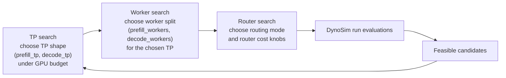

A DynoSim sweep evaluates candidate topologies, router settings, and timing inputs against a fixed
workload, Service Level Agreement (SLA), and GPU budget. Use it after a single
[DynoSim run](runs.md) establishes a valid baseline.

The current Python API is `dynamo.profiler.utils.replay_optimize`. The docs use "DynoSim sweep" as the product term while keeping the existing implementation name for now.

## What It Answers

A sweep searches for the topology, worker split, and router settings that best satisfy the selected
objective under the configured workload, SLA, and GPU budget.

For disaggregated deployments, the search can cover:

- tensor-parallel shape for prefill and decode workers
- prefill and decode worker counts
- KV-router overlap credit
- prompt-load scaling
- throughput, TTFT, ITL, or end-to-end latency objectives

This is a heuristic search over simulated states, not an exact optimizer over every feasible configuration.

## How It Works


```mermaid
flowchart LR
    A["TP search<br/>choose TP shape<br/>(prefill_tp, decode_tp)<br/>under GPU budget"] --> B["Worker search<br/>choose worker split<br/>(prefill_workers, decode_workers)<br/>for the chosen TP"]
    B --> C["Router search<br/>choose routing mode<br/>and router cost knobs"]
    C --> D["DynoSim run evaluations"]
    D --> E["Feasible candidates"]
    E --> A
```

Each candidate state is evaluated by the DynoSim run harness. The optimizer records the metrics from each run, filters candidates that violate SLA or GPU-budget constraints, and returns the best feasible state plus the full evaluated table for analysis.

The descent is budget-focused: each step prunes to near-budget-edge states so the sweep ends up at a TP/worker shape that actually consumes the available GPU budget, rather than at a pure throughput-per-GPU point. Aggregated sweeps collapse the TP and worker dimensions into `(tp, workers)` but otherwise follow the same idea.

## Spec Shape

The public API takes a single `ReplayOptimizeSpec` composed of:

| Spec | Purpose |
|---|---|
| `EngineSpec` | Model, backend, and JSON-like engine arguments. Disaggregated sweeps use prefill and decode engine args; aggregated sweeps use `baseEngineArgs`. |
| `HardwareSpec` | GPU SKU and total simulated GPU budget |
| `WorkloadSpec` | Synthetic workload knobs or a trace file |
| `SLASpec` | Optional TTFT, ITL, end-to-end latency, and p95 bounds |
| `RouterSpec` | Router mode, overlap-score-credit sweep, prefill-load-scale sweep, and KV-router base config |
| `objective` | Ranking target, such as throughput, mean TTFT, or mean end-to-end latency |
| `maxParallelEvals` | Number of candidate evaluations to run concurrently |

## Prerequisites

Run from the repository root.

Use the project virtual environment:

```bash
.venv/bin/python --version
```

If the runtime `_core` bindings are not importable yet, build them first:

```bash
.venv/bin/maturin develop --uv -m lib/bindings/python/Cargo.toml
```

The example uses AIC-backed timing by default:

- AIC enumerates dense TP candidates
- AIC-backed engine timing is used for candidate configs

Install `aiconfigurator` into the project environment:

```bash
uv pip install --python .venv/bin/python aiconfigurator
```

The installed [AIConfigurator](https://github.com/ai-dynamo/aiconfigurator) package must include
the performance data for the selected model, system, backend, and version.

When running directly from a source checkout, expose the in-repo Python components
and runtime bindings:

```bash
export PYTHONPATH=components/src:lib/bindings/python/src
```

If the sweep uses multiple worker processes, prefer a real script file over a heredoc. On macOS, `ProcessPoolExecutor` child workers need a stable module path, and the driver module must guard its entry behind `if __name__ == "__main__":`.

For KV-router logs, this filter keeps the run readable without hiding useful `info` output:

```bash
export DYN_LOG='info,dynamo_kv_router::scheduling::selector=warn'
```

## Run The Example

The canonical starting point is the checked-in driver script:

```bash
.venv/bin/python components/src/dynamo/profiler/utils/replay_optimize/example.py \
  --max-parallel-evals 4
```

The default example searches a synthetic disaggregated KV-router workload using AIC-backed candidate timing. It prints the best feasible state and a table of top feasible configurations.

The checked-in example defines the model, workload, GPU budget, router search, and base engine
arguments. Treat that file as the source of truth for its defaults. The budget is a simulation
constraint; the host running the sweep does not need the corresponding GPU allocation.

The example omits `num_gpu_blocks`, so AIC-backed runs estimate capacity for each candidate tensor
parallel shape. Set capacity and scheduler limits explicitly when those are part of the experiment.

## Run Against A Trace

To run against a Mooncake-style trace instead of the synthetic workload:

```bash
.venv/bin/python components/src/dynamo/profiler/utils/replay_optimize/example.py \
  --trace-file /path/to/mooncake_trace.jsonl \
  --arrival-speedup-ratio 1.0 \
  --max-parallel-evals 4
```

For a public starting point, download the FAST'25 toolagent trace:

```bash
curl -sL \
  https://raw.githubusercontent.com/kvcache-ai/Mooncake/refs/heads/main/FAST25-release/traces/toolagent_trace.jsonl \
  -o /tmp/toolagent_trace.jsonl
```

Then run:

```bash
.venv/bin/python components/src/dynamo/profiler/utils/replay_optimize/example.py \
  --trace-file /tmp/toolagent_trace.jsonl \
  --arrival-speedup-ratio 1.0 \
  --max-parallel-evals 4
```

In trace mode:

- `traceFile` points at the Mooncake-style JSONL input
- `arrivalSpeedupRatio` compresses or stretches the trace arrival process
- synthetic-only knobs such as `isl`, `osl`, `requestCount`, `concurrency`, `sharedPrefixRatio`, and `numPrefixGroups` are ignored

For the public tool-agent trace:

- the dataset uses Mooncake-style `hash_ids` with `512` tokens per block
- the underlying `run_trace_replay(...)` API defaults `trace_block_size` to `512`
- `WorkloadSpec` uses that default rather than exposing a separate `traceBlockSize` field

## Customize A Sweep

Treat the example driver as a starting point, not a frozen harness. Modify it as needed for your search:

- change the `WorkloadSpec` shape or switch to a trace source with `traceFile`
- add SLA bounds on `SLASpec`, such as `ttft`, `itl`, `e2eLatency`, or their p95 variants
- change `RouterSpec.overlapCredits` within the valid `0.0` to `1.0` range
- change `RouterSpec.prefillLoadScales` when you want to weigh TTFT/prompt-side load more or less heavily
- print different columns from `result.evaluated_df` or `result.feasible_df`
- persist the tables to CSV or Parquet for downstream analysis

Useful axes to vary:

- `HardwareSpec.totalGpus`
- `RouterSpec.overlapCredits`
- `RouterSpec.prefillLoadScales`
- `WorkloadSpec.sharedPrefixRatio`
- `WorkloadSpec.numPrefixGroups`
- base prefill/decode engine args

If you want to compare routing strategies directly, use `RouterSpec(mode="both")` instead of the default KV-router-only search.

## Outputs

The optimizer returns a `DenseReplayOptimizationResult` with:

- `best_feasible`: best visited state that satisfies all configured SLA and GPU-budget constraints
- `best_infeasible`: best visited state that misses at least one SLA bound or the budget
- `evaluated_df`: all visited states
- `feasible_df`: only feasible states

Common columns to inspect:

- topology: `prefill_tp`, `decode_tp`, `prefill_workers`, `decode_workers`
- routing: `router_mode`, `overlap_score_credit`, `prefill_load_scale`
- budget: `total_gpus_used`
  This is the simulated GPU footprint of the candidate state, not a count of GPUs actually allocated on the machine running the search.
- throughput: `output_throughput_tok_s`
- cache behavior: `prefix_cache_reused_ratio`
- latency: `mean_ttft_ms`, `mean_tpot_ms`, `mean_e2e_latency_ms`

The report DataFrame uses the Rust DynoSim runner's metric keys (`mean_ttft_ms`, `mean_tpot_ms`,
`mean_e2e_latency_ms`). The input `SLASpec` uses `ttft`, `itl`, and `e2eLatency`; it translates
those fields before evaluating candidates.

## Relationship To DynoSim Runs

A [DynoSim run](runs.md) evaluates one configuration. A sweep selects candidates for
[live Mocker](mocker.md) and GPU validation.
