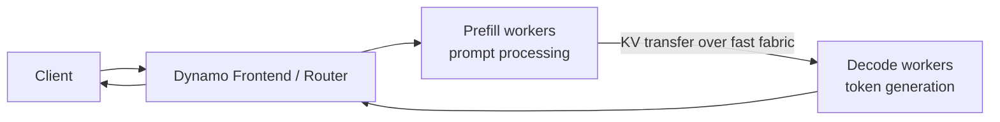

Disaggregated serving separates the two main phases of LLM inference:

| Phase | What it does | Scaling pressure |
|---|---|---|
| Prefill | Processes the prompt and produces the initial KV cache. | Input length, prompt reuse, context size |
| Decode | Generates output tokens using the KV cache. | Concurrency, output length, active KV memory |

In an aggregated deployment, each worker does both phases. In a disaggregated
deployment, prefill workers and decode workers are separate pools. Dynamo routes
each request through prefill first, transfers or exposes the KV cache state to
decode, and streams the response from the decode worker.



## When It Helps

Disaggregated serving is most useful when prefill and decode need different
resource shapes:

- long prompts or retrieval-heavy traffic make prefill expensive
- long generations or high concurrency make decode the bottleneck
- you want to scale prefill and decode replicas independently
- you want to pair prefill/decode separation with KV-aware routing
- large models need different parallelism for prompt processing and generation

It is not automatically better for every workload. For small models, short
prompts, low concurrency, or clusters without fast KV transfer, an aggregated
deployment may be simpler and faster.

## Mental Model

Disaggregated serving usually combines four pieces:

| Piece | Role |
|---|---|
| Frontend/router | Accepts OpenAI-compatible requests and coordinates routing. |
| Prefill workers | Run the prompt phase and prepare KV transfer state. |
| Decode workers | Continue generation after prefill completes. |
| KV transfer path | Moves or exposes KV cache state between prefill and decode workers. |

KV-aware routing is related but separate. Disaggregated serving splits prefill
and decode. KV-aware routing chooses workers based on cache locality. Many
production deployments use both, but you can reason about them independently.

For router-specific behavior, see [Router: Disaggregated Serving](../../components/router/router-disaggregated-serving.md)
and [KV Cache Aware Routing](../../components/router/router-guide.md).

## KV Transfer Is the Critical Path

Disaggregation only helps when decode workers can access the KV cache produced
by prefill quickly. In cross-node or high-throughput deployments, the KV
transfer path commonly depends on RDMA-capable networking through the backend's
transfer layer, such as NIXL/UCX. If RDMA is missing or silently falls back to
TCP, TTFT and throughput can be dominated by KV movement rather than model
compute.

Treat KV transfer as an early validation step, not a final tuning detail. Common
failure modes include missing RDMA device-plugin resources, pods without the
needed `rdma/ib` requests or `IPC_LOCK` capability, UCX/NIXL transport errors,
mismatched model or KV cache settings between prefill and decode workers, and
benchmarks that run through local port-forwarding instead of inside the cluster.

Symptoms usually look like high TTFT despite available prefill capacity, decode
workers sitting idle while prefill workers are busy, or disaggregated throughput
falling below an aggregated baseline after splitting workers across nodes.

> [!IMPORTANT]
> Production cross-node disaggregated deployments usually require RDMA or an
> equivalent fast fabric for KV cache transfer. Without it, the backend may fall
> back to TCP and KV transfer can dominate TTFT and throughput. Validate the
> transfer path before spending time tuning replica counts.

### Deploying Disaggregated with RDMA

Disaggregated deployments transfer KV cache between prefill and decode workers.
Without RDMA or another fast transfer path, this movement can become the main
performance bottleneck.

Prerequisites for a production cross-node deployment:

1. **RDMA-capable network** such as InfiniBand, RoCE, or an equivalent fast
   fabric.
2. **RDMA device plugin** installed on the cluster so worker pods can request
   `rdma/ib` resources.
3. **ETCD and NATS** deployed for Dynamo coordination.

The following example shows the RDMA-relevant fields in a disaggregated vLLM
`DynamoGraphDeployment`. Start from a validated recipe when one exists, then
adapt the resource requests, model, image, and parallelism for your cluster.

```yaml
apiVersion: nvidia.com/v1alpha1
kind: DynamoGraphDeployment
metadata:
  name: dynamo-disagg
  namespace: your-namespace
spec:
  backendFramework: vllm
  pvcs:
    - name: model-cache
      create: false
  services:
    Frontend:
      componentType: frontend
      replicas: 1
      volumeMounts:
        - name: model-cache
          mountPoint: /opt/models
      envs:
        - name: HF_HOME
          value: /opt/models
      extraPodSpec:
        mainContainer:
          image: nvcr.io/nvidia/ai-dynamo/vllm-runtime:1.2.1
          imagePullPolicy: IfNotPresent

    VLLMPrefillWorker:
      envFromSecret: hf-token-secret
      componentType: worker
      subComponentType: prefill
      replicas: 2
      resources:
        limits:
          gpu: "2"
      sharedMemory:
        size: 16Gi
      volumeMounts:
        - name: model-cache
          mountPoint: /opt/models
      envs:
        - name: HF_HOME
          value: /opt/models
        - name: UCX_TLS
          value: "rc_x,rc,dc_x,dc,cuda_copy,cuda_ipc"
        - name: UCX_RNDV_SCHEME
          value: "get_zcopy"
        - name: UCX_RNDV_THRESH
          value: "0"
      extraPodSpec:
        mainContainer:
          image: nvcr.io/nvidia/ai-dynamo/vllm-runtime:1.2.1
          workingDir: /workspace
          imagePullPolicy: IfNotPresent
          securityContext:
            capabilities:
              add: ["IPC_LOCK"]
          resources:
            limits:
              rdma/ib: "2"
            requests:
              rdma/ib: "2"
          command: ["python3", "-m", "dynamo.vllm"]
          args:
            - --model
            - "Qwen/Qwen3-32B-FP8"
            - "--tensor-parallel-size"
            - "2"
            - "--kv-cache-dtype"
            - "fp8"
            - "--max-num-seqs"
            - "1"
            - --disaggregation-mode
            - prefill

    VLLMDecodeWorker:
      envFromSecret: hf-token-secret
      componentType: worker
      subComponentType: decode
      replicas: 1
      resources:
        limits:
          gpu: "4"
      sharedMemory:
        size: 16Gi
      volumeMounts:
        - name: model-cache
          mountPoint: /opt/models
      envs:
        - name: HF_HOME
          value: /opt/models
        - name: UCX_TLS
          value: "rc_x,rc,dc_x,dc,cuda_copy,cuda_ipc"
        - name: UCX_RNDV_SCHEME
          value: "get_zcopy"
        - name: UCX_RNDV_THRESH
          value: "0"
      extraPodSpec:
        mainContainer:
          image: nvcr.io/nvidia/ai-dynamo/vllm-runtime:1.2.1
          workingDir: /workspace
          imagePullPolicy: IfNotPresent
          securityContext:
            capabilities:
              add: ["IPC_LOCK"]
          resources:
            limits:
              rdma/ib: "4"
            requests:
              rdma/ib: "4"
          command: ["python3", "-m", "dynamo.vllm"]
          args:
            - --model
            - "Qwen/Qwen3-32B-FP8"
            - "--tensor-parallel-size"
            - "4"
            - "--kv-cache-dtype"
            - "fp8"
            - "--max-num-seqs"
            - "1024"
            - --disaggregation-mode
            - decode
```

Critical RDMA settings:

| Setting | Purpose |
|---|---|
| `rdma/ib: "N"` | Requests RDMA resources for the worker pod. In most disaggregated vLLM deployments, match this to the worker TP size. |
| `IPC_LOCK` capability | Allows RDMA memory registration and pinned-memory use. |
| `UCX_TLS` | Enables RDMA-capable UCX transports such as `rc_x` and `dc_x`, plus CUDA transports for GPU buffers. |
| `UCX_RNDV_SCHEME=get_zcopy` | Enables zero-copy RDMA transfers for large KV-cache movement. |

After deployment, check the worker logs for UCX/NIXL initialization:

```bash
kubectl logs <prefill-worker-pod> | grep -i "UCX\|NIXL"
```

Expected output includes:

```text
NIXL INFO Backend UCX was instantiated
```

If logs only show TCP transports, RDMA is not active. Check the RDMA device
plugin, worker `rdma/ib` resource requests, security context, and UCX settings.
For full transport setup and troubleshooting, see the
[Disaggregated Communication Guide](../../kubernetes/disagg-communication-guide.md).

## Deployment Paths

Choose the path that matches how much control you need:

| Starting point | Use when |
|---|---|
| [Dynamo Recipes](https://github.com/ai-dynamo/dynamo/tree/main/recipes) | A recipe matches your model, backend, hardware, and serving mode. Start here for validated baselines and `perf.yaml` benchmarks. |
| Direct `DynamoGraphDeployment` | You already know the prefill/decode layout, images, parallelism, and KV transfer settings. |
| [DGDR](../../kubernetes/dgdr.md) | You want Dynamo to generate a DGD from model, backend, hardware, workload, and SLA intent. |
| [Sizing with AIConfigurator](aiconfigurator.md) | You want to compare aggregated vs. disaggregated layouts and estimate prefill/decode sizing before deployment. |

Good recipe starting points include:

- [Qwen3-32B vLLM disagg + KV router](https://github.com/ai-dynamo/dynamo/tree/main/recipes/qwen3-32b)
- [DeepSeek V3.2 TensorRT-LLM disagg + KV router](https://github.com/ai-dynamo/dynamo/tree/main/recipes/deepseek-v32-fp4)
- [Llama 3 70B vLLM disaggregated recipes](https://github.com/ai-dynamo/dynamo/tree/main/recipes/llama-3-70b)

For the Kubernetes resource model, see the [Deployment Overview](../../kubernetes/model-deployment-guide.md).

## Backend Examples

Each built-in backend has examples that show the concrete worker flags and
transfer settings:

| Backend | Examples |
|---|---|
| vLLM | [Deployment examples](https://github.com/ai-dynamo/dynamo/tree/main/examples/backends/vllm/deploy), including `disagg.yaml`, `disagg_router.yaml`, and `disagg_planner.yaml` |
| TensorRT-LLM | [Deployment examples](https://github.com/ai-dynamo/dynamo/tree/main/examples/backends/trtllm/deploy), including disaggregated, router, and planner variants |
| SGLang | [Deployment examples](https://github.com/ai-dynamo/dynamo/tree/main/examples/backends/sglang/deploy), including NIXL-based disaggregated serving |

## Operational Notes

Disaggregated deployments add a data-movement path between workers. Before
moving to production, verify:

- KV transfer backend and network fabric are configured for your backend
- RDMA resources, UCX/NIXL settings, and security context are active when your
  deployment depends on RDMA
- prefill and decode workers agree on model, dtype, block size, and KV layout
- pods have the required GPU, shared memory, and network resources
- frontend/router flags match your routing strategy
- benchmarks run inside the cluster, not through local port-forwarding, when
  validating high-load performance

Use [Dynamo Benchmarking](../../benchmarks/benchmarking.md) to compare
aggregated and disaggregated configurations with the same workload.

## Next Steps

1. Start from a matching [Dynamo Recipe](https://github.com/ai-dynamo/dynamo/tree/main/recipes) when available.
2. Read the backend-specific deployment example for your engine.
3. Use [Sizing with AIConfigurator](aiconfigurator.md) or DGDR when you need help choosing prefill/decode sizing.
4. Validate the result with [Dynamo Benchmarking](../../benchmarks/benchmarking.md).
