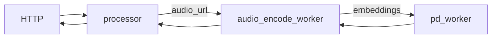
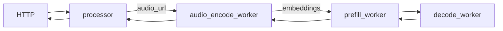
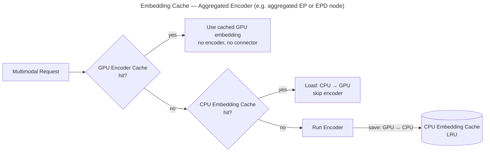
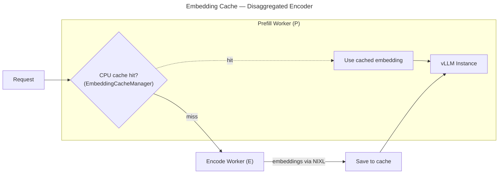

This document provides a comprehensive guide for multimodal inference using vLLM backend in Dynamo.

<Warning>
**Security Requirement**: All multimodal workers require the `--enable-multimodal` flag to be explicitly set at startup. This is a security feature to prevent unintended processing of multimodal data from untrusted sources. Workers will fail at startup if a multimodal worker mode is enabled without `--enable-multimodal`. This flag is analogous to `--enable-mm-embeds` in vllm serve but also extends it to all multimodal content (url, embeddings, b64).
</Warning>

## Support Matrix

| Modality                 | Aggregated | Disaggregated |
| ------------------------ | ---------- | ------------- |
| **Image**                | Yes        | Yes           |
| **Video**                | Yes        | Yes           |
| **Audio** (Experimental) | Yes        | Yes           |

### Supported URL Formats

| Format         | Example                              | Description                |
| -------------- | ------------------------------------ | -------------------------- |
| **HTTP/HTTPS** | `http://example.com/image.jpg`       | Remote media files         |
| **Data URL**   | `data:image/jpeg;base64,/9j/4AAQ...` | Base64-encoded inline data |

## Deployment Patterns

The main multimodal vLLM launchers in this repo are:

| Pattern                     | Launch Script               | Best For                                                                            |
| --------------------------- | --------------------------- | ----------------------------------------------------------------------------------- |
| Aggregated                  | `agg_multimodal.sh`         | Simplest image/video serving from a single multimodal worker                        |
| E/PD (Encode + PD)          | `disagg_multimodal_e_pd.sh` | Simple example of separating encoder, good for testing embedding-cache workflows    |
| E/P/D (Full Disaggregation) | `disagg_multimodal_epd.sh`  | Disaggregated image/video serving with separate encode, prefill, and decode workers |

## Image/Video Serving

Dynamo supports multimodal image and video requests for Vision Language Models (VLMs). `Qwen/Qwen3-VL-2B-Instruct` is a good example because the same model can handle both `image_url` and `video_url` requests through the standard OpenAI chat endpoint.

### Aggregated Serving

Use the single-worker aggregated launcher for the simplest image/video setup:

```bash
cd $DYNAMO_HOME/examples/backends/vllm
bash launch/agg_multimodal.sh --model Qwen/Qwen3-VL-2B-Instruct
```

**Image request:**

```bash
curl http://localhost:8000/v1/chat/completions \
  -H "Content-Type: application/json" \
  -d '{
      "model": "Qwen/Qwen3-VL-2B-Instruct",
      "messages": [
        {
          "role": "user",
          "content": [
            {
              "type": "text",
              "text": "What is in this image?"
            },
            {
              "type": "image_url",
              "image_url": {
                "url": "http://images.cocodataset.org/test2017/000000155781.jpg"
              }
            }
          ]
        }
      ],
      "max_tokens": 64,
      "temperature": 0.0,
      "stream": false
    }'
```

**Video request:**

```bash
curl http://localhost:8000/v1/chat/completions \
  -H "Content-Type: application/json" \
  -d '{
      "model": "Qwen/Qwen3-VL-2B-Instruct",
      "messages": [
        {
          "role": "user",
          "content": [
            {
              "type": "text",
              "text": "Describe the video in detail"
            },
            {
              "type": "video_url",
              "video_url": {
                "url": "https://qianwen-res.oss-cn-beijing.aliyuncs.com/Qwen3-Omni/demo/draw.mp4"
              }
            }
          ]
        }
      ],
      "max_tokens": 64,
      "stream": false
    }' | jq
```

### E/PD Serving (Encode + PD)

Use `disagg_multimodal_e_pd.sh` when you want a separate encode worker and a combined prefill/decode worker. This path is primarily useful for image-centric workloads and embedding-cache experiments; use `agg_multimodal.sh` or `disagg_multimodal_epd.sh` for general video serving.

```bash
cd $DYNAMO_HOME/examples/backends/vllm

# Multi-GPU deployment
bash launch/disagg_multimodal_e_pd.sh --model Qwen/Qwen3-VL-2B-Instruct

# Single-GPU (functional testing with small models)
bash launch/disagg_multimodal_e_pd.sh --model Qwen/Qwen3-VL-2B-Instruct --single-gpu

```

### E/P/D Serving (Full Disaggregation)

Use the full disaggregated launcher when you want separate encode, prefill, and decode workers for image/video workloads:

```bash
cd $DYNAMO_HOME/examples/backends/vllm

# Multi-GPU deployment
bash launch/disagg_multimodal_epd.sh --model Qwen/Qwen3-VL-2B-Instruct

# Single-GPU (functional testing with small models)
bash launch/disagg_multimodal_epd.sh --model Qwen/Qwen3-VL-2B-Instruct --single-gpu
```

## Audio Serving (Experimental)

### Audio Aggregated Serving

**Components:**

- workers: [AudioEncodeWorker](https://github.com/ai-dynamo/dynamo/tree/main/examples/multimodal/components/audio_encode_worker.py) for decoding audio into embeddings, and [VllmPDWorker](https://github.com/ai-dynamo/dynamo/tree/main/examples/multimodal/components/worker.py) for prefilling and decoding.
- processor: Tokenizes the prompt and passes it to the AudioEncodeWorker.
- frontend: HTTP endpoint to handle incoming requests.

**Workflow:**



**Launch:**

```bash
pip install 'vllm[audio]' accelerate # multimodal audio models dependency
cd $DYNAMO_HOME/examples/multimodal
bash launch/audio_agg.sh
```

**Client:**

```bash
curl http://localhost:8000/v1/chat/completions \
  -H "Content-Type: application/json" \
  -d '{
      "model": "Qwen/Qwen2-Audio-7B-Instruct",
      "messages": [
        {
          "role": "user",
          "content": [
            {
              "type": "text",
              "text": "What is recited in the audio?"
            },
            {
              "type": "audio_url",
              "audio_url": {
                "url": "https://raw.githubusercontent.com/yuekaizhang/Triton-ASR-Client/main/datasets/mini_en/wav/1221-135766-0002.wav"
              }
            }
          ]
        }
      ],
      "max_tokens": 6000,
      "temperature": 0.8,
      "stream": false
    }' | jq
```

### Audio Disaggregated Serving

**Workflow:**

For the Qwen2-Audio model, audio embeddings are only required during the prefill stage. The AudioEncodeWorker is connected directly to the prefill worker.



**Launch:**

```bash
pip install 'vllm[audio]' accelerate # multimodal audio models dependency
cd $DYNAMO_HOME/examples/multimodal
bash launch/audio_disagg.sh
```

## Embedding Cache

Dynamo supports embedding cache in both aggregated and disaggregated settings:

| Setting                   | Implementation                                                 | Launch Script               |
| ------------------------- | -------------------------------------------------------------- | --------------------------- |
| **Aggregated**            | Supported via vLLM ECConnector in vLLM 0.18+                   | `agg_multimodal.sh` (or with `vllm serve` directly) |
| **Disaggregated encoder** | Dynamo-managed cache in the worker layer on top of vLLM engine | `disagg_multimodal_e_pd.sh` |

### Aggregated Worker

A single vLLM instance caches encoded embeddings on CPU so repeated images skip encoding entirely.



**Launch:**

<!-- TODO: Add an example of Dynamo+vLLM Agg worker + Embedding Cache -->

```bash
vllm serve $model \
    --ec-transfer-config "{
        \"ec_role\": \"ec_both\",
        \"ec_connector\": \"DynamoMultimodalEmbeddingCacheConnector\",
        \"ec_connector_module_path\": \"dynamo.vllm.multimodal_utils.multimodal_embedding_cache_connector\",
        \"ec_connector_extra_config\": {\"multimodal_embedding_cache_capacity_gb\": 10}
    }"
```

This configures `vllm serve` with `ec_role=ec_both` and the `DynamoMultimodalEmbeddingCacheConnector` automatically. The capacity parameter controls the CPU-side LRU cache size in GB (0 = disabled).

### Disaggregated Encoder (Embedding Cache in Prefill Worker)

In the disaggregated setting, the Prefill Worker (P) owns a CPU-side LRU embedding cache (`EmbeddingCacheManager`). On each request P checks the cache first — on a hit, the Encode Worker is skipped entirely. On a miss, P routes to the Encode Worker (E), receives embeddings via NIXL, saves them to the cache, and then feeds the embeddings along with the request into the vLLM Instance for prefill.



**Launch:**

```bash
cd $DYNAMO_HOME/examples/backends/vllm
bash launch/disagg_multimodal_e_pd.sh --multimodal-embedding-cache-capacity-gb 10
```

**Client:** Use the same `image_url` request format shown in [Aggregated Serving](#aggregated-serving).

## LoRA Adapters on Multimodal Workers

Multimodal workers support dynamic loading and unloading of LoRA adapters at runtime via the management API. This enables serving fine-tuned multimodal models alongside the base model.

### Loading a LoRA Adapter

Load an adapter on a running multimodal worker via the `load_lora` endpoint:

```bash
# For components workers (URI-based, requires DYN_LORA_ENABLED=true)
curl -X POST http://<worker-host>:<port>/load_lora \
  -H "Content-Type: application/json" \
  -d '{
    "lora_name": "my-vlm-adapter",
    "source": {"uri": "s3://my-bucket/adapters/my-vlm-adapter"}
  }'

# For example workers (path-based)
curl -X POST http://<worker-host>:<port>/load_lora \
  -H "Content-Type: application/json" \
  -d '{
    "lora_name": "my-vlm-adapter",
    "lora_path": "/path/to/adapter"
  }'
```

### Sending Requests with a LoRA

Set the `model` field in the request to the LoRA adapter name:

```bash
curl -X POST http://<frontend-host>:<port>/v1/chat/completions \
  -H "Content-Type: application/json" \
  -d '{
    "model": "my-vlm-adapter",
    "messages": [
      {"role": "user", "content": [
        {"type": "text", "text": "Describe this image"},
        {"type": "image_url", "image_url": {"url": "https://example.com/image.jpg"}}
      ]}
    ]
  }'
```

Requests without a LoRA name (or with the base model name) will use the base model.

### Unloading a LoRA Adapter

```bash
curl -X POST http://<worker-host>:<port>/unload_lora \
  -H "Content-Type: application/json" \
  -d '{"lora_name": "my-vlm-adapter"}'
```

### Listing Loaded Adapters

```bash
curl -X POST http://<worker-host>:<port>/list_loras
```

### Disaggregated Mode

In disaggregated (prefill/decode) deployments, the **same LoRA adapter must be loaded on both the prefill and decode workers**. The LoRA identity (`model` field) is automatically propagated from the prefill worker to the decode worker in the forwarded request.

```bash
# Load on prefill worker
curl -X POST http://<prefill-worker>/load_lora \
  -d '{"lora_name": "my-adapter", "source": {"uri": "s3://bucket/adapter"}}'

# Load on decode worker (same adapter)
curl -X POST http://<decode-worker>/load_lora \
  -d '{"lora_name": "my-adapter", "source": {"uri": "s3://bucket/adapter"}}'
```

If a LoRA is loaded on the prefill worker but not on the decode worker, the decode worker will fall back to the base model for that request.

## Supported Models

For a list of multimodal models supported by vLLM, see [vLLM Supported Multimodal Models](https://docs.vllm.ai/en/latest/models/supported_models/#list-of-multimodal-language-models). Models listed there should generally work with aggregated serving, though they may not all be explicitly tested in this repo.
