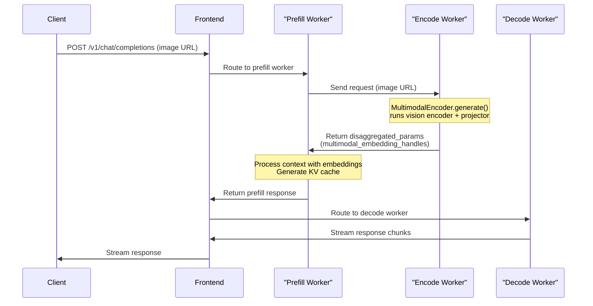
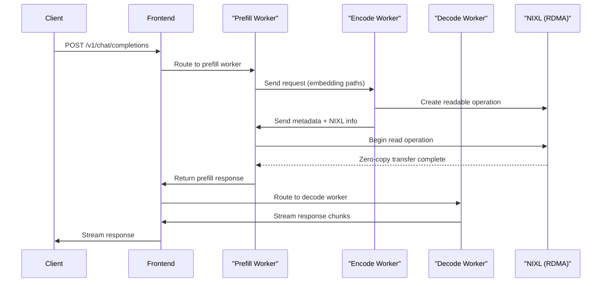

<!--
SPDX-FileCopyrightText: Copyright (c) 2025-2026 NVIDIA CORPORATION & AFFILIATES. All rights reserved.
SPDX-License-Identifier: Apache-2.0

Licensed under the Apache License, Version 2.0 (the "License");
you may not use this file except in compliance with the License.
You may obtain a copy of the License at

http://www.apache.org/licenses/LICENSE-2.0

Unless required by applicable law or agreed to in writing, software
distributed under the License is distributed on an "AS IS" BASIS,
WITHOUT WARRANTIES OR CONDITIONS OF ANY KIND, either express or implied.
See the License for the specific language governing permissions and
limitations under the License.
-->

# TensorRT-LLM Multimodal

This document provides a comprehensive guide for multimodal inference using TensorRT-LLM backend in Dynamo.

You can provide multimodal inputs in the following ways:
- By sending image URLs
- By providing paths to pre-computed embedding files

> **Note:** You should provide **either image URLs or embedding file paths** in a single request.

## Support Matrix

| Modality | Input Format | Aggregated | Disaggregated | Notes |
|----------|--------------|------------|---------------|-------|
| **Image** | HTTP/HTTPS URL | Yes | Yes | Full support for all image models |
| **Image** | Pre-computed Embeddings (.pt, .pth, .bin) | Yes | Yes | Direct embedding files |
| **Video** | HTTP/HTTPS URL | No | No | Not implemented |
| **Audio** | HTTP/HTTPS URL | No | No | Not implemented |

### Supported URL Formats

| Format | Example | Description |
|--------|---------|-------------|
| **HTTP/HTTPS** | `http://example.com/image.jpg` | Remote media files |
| **Pre-computed Embeddings** | `/path/to/embedding.pt` | Local embedding files (.pt, .pth, .bin) |

## Deployment Patterns

TRT-LLM supports aggregated and traditional disaggregated patterns. See [Architecture Patterns](README.md#architecture-patterns) for detailed explanations.

| Pattern | Supported | Launch Script | Notes |
|---------|-----------|---------------|-------|
| Aggregated | ✅ | `agg.sh` | Easiest setup, single worker |
| EP/D (Traditional Disaggregated) | ✅ | `disagg_multimodal.sh` | Prefill handles encoding, 2 workers |
| E/P/D (Full - Image URLs) | ✅ | `epd_multimodal_image_and_embeddings.sh` | Standalone encoder with `MultimodalEncoder`, 3 workers |
| E/P/D (Full - Pre-computed Embeddings) | ✅ | `epd_multimodal_image_and_embeddings.sh` | Standalone encoder with NIXL transfer, 3 workers |
| E/P/D (Large Models) | ✅ | `epd_disagg.sh` | For Llama-4 Scout/Maverick, multi-node |

### Component Flags

| Component | Flag | Purpose |
|-----------|------|---------|
| Worker | `--modality multimodal` | Complete pipeline (aggregated) |
| Prefill Worker | `--disaggregation-mode prefill` | Image processing + Prefill (multimodal tokenization happens here) |
| Decode Worker | `--disaggregation-mode decode` | Decode only |
| Encode Worker | `--disaggregation-mode encode` | Image encoding (E/P/D flow) |

## Aggregated Serving

Quick steps to launch Llama-4 Maverick BF16 in aggregated mode:

```bash
cd $DYNAMO_HOME

export AGG_ENGINE_ARGS=./examples/backends/trtllm/engine_configs/llama4/multimodal/agg.yaml
export SERVED_MODEL_NAME="meta-llama/Llama-4-Maverick-17B-128E-Instruct"
export MODEL_PATH="meta-llama/Llama-4-Maverick-17B-128E-Instruct"
./examples/backends/trtllm/launch/agg.sh
```

**Client:**
```bash
curl localhost:8000/v1/chat/completions -H "Content-Type: application/json" -d '{
    "model": "meta-llama/Llama-4-Maverick-17B-128E-Instruct",
    "messages": [
        {
            "role": "user",
            "content": [
                {
                    "type": "text",
                    "text": "Describe the image"
                },
                {
                    "type": "image_url",
                    "image_url": {
                        "url": "https://huggingface.co/datasets/huggingface/documentation-images/resolve/main/diffusers/inpaint.png"
                    }
                }
            ]
        }
    ],
    "stream": false,
    "max_tokens": 160
}'
```

## Disaggregated Serving

Example using `Qwen/Qwen2-VL-7B-Instruct`:

```bash
cd $DYNAMO_HOME

export MODEL_PATH="Qwen/Qwen2-VL-7B-Instruct"
export SERVED_MODEL_NAME="Qwen/Qwen2-VL-7B-Instruct"
export PREFILL_ENGINE_ARGS="examples/backends/trtllm/engine_configs/qwen2-vl-7b-instruct/prefill.yaml"
export DECODE_ENGINE_ARGS="examples/backends/trtllm/engine_configs/qwen2-vl-7b-instruct/decode.yaml"
export MODALITY="multimodal"

./examples/backends/trtllm/launch/disagg.sh
```

```bash
curl localhost:8000/v1/chat/completions -H "Content-Type: application/json" -d '{
    "model": "Qwen/Qwen2-VL-7B-Instruct",
    "messages": [
        {
            "role": "user",
            "content": [
                {
                    "type": "text",
                    "text": "Describe the image"
                },
                {
                    "type": "image_url",
                    "image_url": {
                        "url": "https://huggingface.co/datasets/huggingface/documentation-images/resolve/main/diffusers/inpaint.png"
                    }
                }
            ]
        }
    ],
    "stream": false,
    "max_tokens": 160
}'
```

For a large model like `meta-llama/Llama-4-Maverick-17B-128E-Instruct`, a multi-node setup is required for disaggregated serving (see [Multi-node Deployment](#multi-node-deployment-slurm) below), while aggregated serving can run on a single node. This is because the model with a disaggregated configuration is too large to fit on a single node's GPUs. For instance, running this model in disaggregated mode requires 2 nodes with 8xH200 GPUs or 4 nodes with 4xGB200 GPUs.

## Full E/P/D Flow (Image URLs)

For high-performance multimodal inference, Dynamo supports a standalone encoder with an **Encode-Prefill-Decode (E/P/D)** flow using TRT-LLM's `MultimodalEncoder`. This separates the vision encoding stage from prefill and decode, enabling better GPU utilization and scalability.

### Supported Input Formats

| Format | Example | Description |
|--------|---------|-------------|
| **HTTP/HTTPS URL** | `https://example.com/image.jpg` | Remote image files |
| **Base64 Data URL** | `data:image/jpeg;base64,...` | Inline base64-encoded images |

### How It Works

In the full E/P/D flow:

1. **Encode Worker**: Runs TRT-LLM's `MultimodalEncoder.generate()` to process image URLs through the vision encoder and projector
2. **Prefill Worker**: Receives `disaggregated_params` containing multimodal embedding handles, processes context and generates KV cache
3. **Decode Worker**: Performs streaming token generation using the KV cache

The encode worker uses TRT-LLM's `MultimodalEncoder` class (which inherits from `BaseLLM`) and only requires the model path and batch size - no KV cache configuration is needed since it only runs the vision encoder + projector.

### How to Launch

```bash
cd $DYNAMO_HOME

# Launch 3-worker E/P/D flow with image URL support
./examples/backends/trtllm/launch/epd_multimodal_image_and_embeddings.sh
```

### Example Request

```bash
curl localhost:8000/v1/chat/completions -H "Content-Type: application/json" -d '{
    "model": "llava-v1.6-mistral-7b-hf",
    "messages": [
        {
            "role": "user",
            "content": [
                {"type": "text", "text": "Describe the image"},
                {
                    "type": "image_url",
                    "image_url": {
                        "url": "https://huggingface.co/datasets/huggingface/documentation-images/resolve/main/diffusers/inpaint.png"
                    }
                }
            ]
        }
    ],
    "max_tokens": 160
}'
```

### E/P/D Architecture (Image URLs)



### Key Differences from EP/D (Traditional Disaggregated)

| Aspect | EP/D (Traditional) | E/P/D (Full) |
|--------|-------------------|--------------|
| **Encoding** | Prefill worker handles image encoding | Dedicated encode worker |
| **Prefill Load** | Higher (encoding + prefill) | Lower (prefill only) |
| **Use Case** | Simpler setup | Better scalability for vision-heavy workloads |
| **Launch Script** | `disagg_multimodal.sh` | `epd_multimodal_image_and_embeddings.sh` |

## Pre-computed Embeddings with E/P/D Flow

For high-performance multimodal inference, Dynamo supports pre-computed embeddings with an **Encode-Prefill-Decode (E/P/D)** flow using **NIXL (RDMA)** for zero-copy tensor transfer.

### Supported File Types

- `.pt` - PyTorch tensor files
- `.pth` - PyTorch checkpoint files
- `.bin` - Binary tensor files

### Embedding File Formats

TRT-LLM supports two formats for embedding files:

**1. Simple Tensor Format**

Direct tensor saved as `.pt` file containing only the embedding tensor:

```python
embedding_tensor = torch.rand(1, 576, 4096)  # [batch, seq_len, hidden_dim]
torch.save(embedding_tensor, "embedding.pt")
```

**2. Dictionary Format with Auxiliary Data**

Dictionary containing multiple keys, used by models like Llama-4 that require additional metadata:

```python
embedding_dict = {
    "mm_embeddings": torch.rand(1, 576, 4096),
    "special_tokens": [128256, 128257],
    "image_token_offsets": [[0, 576]],
    # ... other model-specific metadata
}
torch.save(embedding_dict, "llama4_embedding.pt")
```

- **Simple tensors**: Loaded directly and passed to `mm_embeddings` parameter
- **Dictionary format**: `mm_embeddings` key extracted as main tensor, other keys preserved as auxiliary data

### How to Launch

```bash
cd $DYNAMO_HOME/examples/backends/trtllm

# Launch 3-worker E/P/D flow with NIXL
./launch/epd_disagg.sh
```

> **Note:** This script is designed for 8-node H200 with `Llama-4-Scout-17B-16E-Instruct` model and assumes you have a model-specific embedding file ready.

### Configuration

```bash
# Encode endpoint for Prefill → Encode communication
export ENCODE_ENDPOINT="dyn://dynamo.tensorrt_llm_encode.generate"

# Security: Allowed directory for embedding files (default: /tmp)
export ALLOWED_LOCAL_MEDIA_PATH="/tmp"

# Security: Max file size to prevent DoS attacks (default: 50MB)
export MAX_FILE_SIZE_MB=50
```

### Example Request with Pre-computed Embeddings

```bash
curl localhost:8000/v1/chat/completions -H "Content-Type: application/json" -d '{
    "model": "meta-llama/Llama-4-Maverick-17B-128E-Instruct",
    "messages": [
        {
            "role": "user",
            "content": [
                {"type": "text", "text": "Describe the image"},
                {"type": "image_url", "image_url": {"url": "/path/to/embedding.pt"}}
            ]
        }
    ],
    "max_tokens": 160
}'
```

### E/P/D Architecture

The E/P/D flow implements a **3-worker architecture**:

- **Encode Worker**: Loads pre-computed embeddings, transfers via NIXL
- **Prefill Worker**: Receives embeddings, handles context processing and KV-cache generation
- **Decode Worker**: Performs streaming token generation



## Multi-node Deployment (Slurm)

This section demonstrates how to deploy large multimodal models that require a multi-node setup using Slurm.

> **Note:** The scripts referenced in this section can be found in [`examples/basics/multinode/trtllm/`](https://github.com/ai-dynamo/dynamo/tree/main/examples/basics/multinode/trtllm/).

### Environment Setup

Assuming you have allocated your nodes via `salloc` and are inside an interactive shell:

```bash
# Container image (build using docs/backends/trtllm/README.md#build-container)
export IMAGE="<dynamo_trtllm_image>"

# Host:container path pairs for mounting
export MOUNTS="${PWD}/../../../../:/mnt"

# Model configuration
export MODEL_PATH="meta-llama/Llama-4-Maverick-17B-128E-Instruct"
export SERVED_MODEL_NAME="meta-llama/Llama-4-Maverick-17B-128E-Instruct"
export MODALITY=${MODALITY:-"multimodal"}
```

### Multi-node Disaggregated Launch

For 4 4xGB200 nodes (2 for prefill, 2 for decode):

```bash
# Customize parallelism to match your engine configs
# export PREFILL_ENGINE_CONFIG="/mnt/examples/backends/trtllm/engine_configs/llama4/multimodal/prefill.yaml"
# export DECODE_ENGINE_CONFIG="/mnt/examples/backends/trtllm/engine_configs/llama4/multimodal/decode.yaml"
# export NUM_PREFILL_NODES=2
# export NUM_DECODE_NODES=2
# export NUM_GPUS_PER_NODE=4

# Launches frontend + etcd/nats on head node, plus prefill and decode workers
./srun_disaggregated.sh
```

### Understanding the Output

1. `srun_disaggregated.sh` launches three srun jobs: frontend, prefill worker, and decode worker
2. The OpenAI frontend will dynamically discover workers as they register:
   ```text
   INFO dynamo_run::input::http: Watching for remote model at models
   INFO dynamo_llm::http::service::service_v2: Starting HTTP service on: 0.0.0.0:8000
   ```
3. TRT-LLM workers output progress from each MPI rank while loading
4. When ready, the frontend logs:
   ```text
   INFO dynamo_llm::discovery::watcher: added model model_name="meta-llama/Llama-4-Maverick-17B-128E-Instruct"
   ```

### Cleanup

```bash
pkill srun
```

## NIXL Usage

| Use Case | Script | NIXL Used? | Data Transfer |
|----------|--------|------------|---------------|
| Aggregated | `agg.sh` | No | All in one worker |
| EP/D (Traditional Disaggregated) | `disagg_multimodal.sh` | Optional | Prefill → Decode (KV cache via UCX or NIXL) |
| E/P/D (Image URLs) | `epd_multimodal_image_and_embeddings.sh` | No | Encoder → Prefill (handles via params), Prefill → Decode (KV cache) |
| E/P/D (Pre-computed Embeddings) | `epd_multimodal_image_and_embeddings.sh` | Yes | Encoder → Prefill (embeddings via NIXL RDMA) |
| E/P/D (Large Models) | `epd_disagg.sh` | Yes | Encoder → Prefill (embeddings via NIXL), Prefill → Decode (KV cache) |

> **Note:** NIXL for KV cache transfer is currently beta and only supported on AMD64 (x86_64) architecture.

## ModelInput Types and Registration

TRT-LLM workers register with Dynamo using:

| ModelInput Type | Preprocessing | Use Case |
|-----------------|---------------|----------|
| `ModelInput.Tokens` | Rust frontend may tokenize, but multimodal flows re-tokenize and build inputs in the Python worker; Rust token_ids are ignored | All TRT-LLM workers |

```python
# TRT-LLM Worker - Register with Tokens
await register_llm(
    ModelInput.Tokens,      # Rust does minimal preprocessing
    model_type,             # ModelType.Chat or ModelType.Prefill
    generate_endpoint,
    model_name,
    ...
)
```

## Inter-Component Communication

| Transfer Stage | Message | NIXL Transfer |
|----------------|---------|---------------|
| **Frontend → Prefill** | Request with image URL or embedding path | No |
| **Prefill → Encode (Image URL)** | Request with image URL | No |
| **Encode → Prefill (Image URL)** | `ep_disaggregated_params` with `multimodal_embedding_handles`, processed prompt, and token IDs | No |
| **Prefill → Encode (Embedding Path)** | Request with embedding file path | No |
| **Encode → Prefill (Embedding Path)** | NIXL readable metadata + shape/dtype + auxiliary data | Yes (Embeddings tensor via RDMA) |
| **Prefill → Decode** | `disaggregated_params` with `_epd_metadata` (prompt, token IDs) | Configurable (KV cache: NIXL default, UCX optional) |

## Known Limitations

- **No video support** - No video encoder implementation
- **No audio support** - No audio encoder implementation
- **Multimodal preprocessing/tokenization happens in Python** - Rust may forward token_ids, but multimodal requests are parsed and re-tokenized in the Python worker
- **Multi-node H100 limitation** - Loading `meta-llama/Llama-4-Maverick-17B-128E-Instruct` with 8 nodes of H100 with TP=16 is not possible due to head count divisibility (`num_attention_heads: 40` not divisible by `tp_size: 16`)
- **llava-v1.6-mistral-7b-hf model crash** - Known issue with TRTLLM backend compatibility with `TensorRT LLM version: 1.2.0rc6.post1`. To use Llava model download revision `revision='52320fb52229` locally using HF.
- **Embeddings file crash** - Known issue with TRTLLM backend compatibility with `TensorRT LLM version: 1.2.0rc6.post1`. Embedding file parsing crashes in `attach_multimodal_embeddings(`. To be fixed in next TRTLLM upgrade.

## Supported Models

Multimodal models listed in [TensorRT-LLM supported models](https://github.com/NVIDIA/TensorRT-LLM/blob/main/docs/source/models/supported-models.md) are supported by Dynamo.

Common examples:
- **Llama 4 Vision models** (Maverick, Scout) - Recommended for large-scale deployments
- **LLaVA models** (e.g., `llava-hf/llava-v1.6-mistral-7b-hf`) - Default model for E/P/D examples
- **Qwen2-VL models** - Supported in traditional disaggregated mode
- Other vision-language models with TRT-LLM support

## Key Files

| File | Description |
|------|-------------|
| `components/src/dynamo/trtllm/main.py` | Worker initialization and setup |
| `components/src/dynamo/trtllm/engine.py` | TensorRTLLMEngine wrapper (LLM and MultimodalEncoder) |
| `components/src/dynamo/trtllm/constants.py` | DisaggregationMode enum (AGGREGATED, PREFILL, DECODE, ENCODE) |
| `components/src/dynamo/trtllm/encode_helper.py` | Encode worker request processing (embedding-path and full EPD flows) |
| `components/src/dynamo/trtllm/multimodal_processor.py` | Multimodal request processing |
| `components/src/dynamo/trtllm/request_handlers/handlers.py` | Request handlers (EncodeHandler, PrefillHandler, DecodeHandler) |
| `components/src/dynamo/trtllm/request_handlers/handler_base.py` | Base handler with disaggregated params encoding/decoding |
| `components/src/dynamo/trtllm/utils/disagg_utils.py` | DisaggregatedParamsCodec for network transfer |
| `components/src/dynamo/trtllm/utils/trtllm_utils.py` | Command-line argument parsing |

