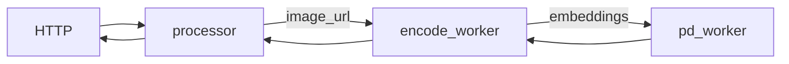
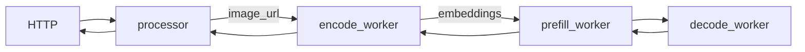
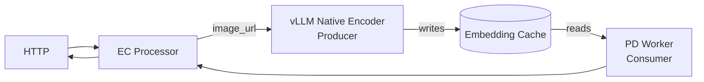
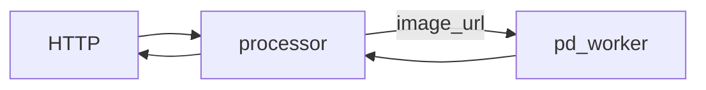
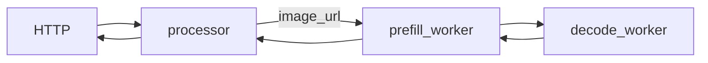
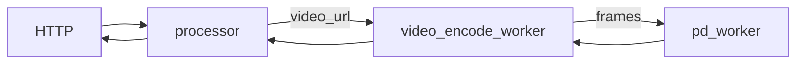
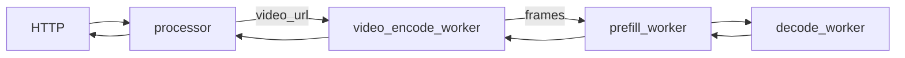
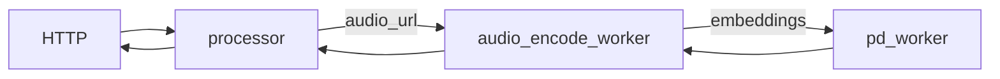
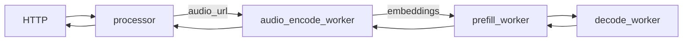

<!--
SPDX-FileCopyrightText: Copyright (c) 2025-2026 NVIDIA CORPORATION & AFFILIATES. All rights reserved.
SPDX-License-Identifier: Apache-2.0

Licensed under the Apache License, Version 2.0 (the "License");
you may not use this file except in compliance with the License.
You may obtain a copy of the License at

http://www.apache.org/licenses/LICENSE-2.0

Unless required by applicable law or agreed to in writing, software
distributed under the License is distributed on an "AS IS" BASIS,
WITHOUT WARRANTIES OR CONDITIONS OF ANY KIND, either express or implied.
See the License for the specific language governing permissions and
limitations under the License.
-->

# vLLM Multimodal

This document provides a comprehensive guide for multimodal inference using vLLM backend in Dynamo.

> [!IMPORTANT]
> **Security Requirement**: All multimodal workers require the `--enable-multimodal` flag to be explicitly set at startup. This is a security feature to prevent unintended processing of multimodal data from untrusted sources. Workers will fail at startup if multimodal flags (e.g., `--multimodal-worker`, `--multimodal-processor`) are used without `--enable-multimodal`.
> This flag is analogous to `--enable-mm-embeds` in vllm serve but also extends it to all multimodal content (url, embeddings, b64).

## Support Matrix

| Modality | Input Format | Aggregated | Disaggregated | Notes |
|----------|--------------|------------|---------------|-------|
| **Image** | HTTP/HTTPS URL | Yes | Yes | Full support for all image models |
| **Image** | Data URL (Base64) | Yes | Yes | Inline base64-encoded images |
| **Video** | HTTP/HTTPS URL | Yes | Yes | Frame extraction and processing |
| **Audio** | HTTP/HTTPS URL | Yes | Yes | Experimental - requires audio dependencies |

### Supported URL Formats

| Format | Example | Description |
|--------|---------|-------------|
| **HTTP/HTTPS** | `http://example.com/image.jpg` | Remote media files |
| **Data URL** | `data:image/jpeg;base64,/9j/4AAQ...` | Base64-encoded inline data |

## Deployment Patterns

vLLM supports all multimodal deployment patterns. See [Architecture Patterns](README.md#architecture-patterns) for detailed explanations.

| Pattern | Supported | Launch Script | Notes |
|---------|-----------|---------------|-------|
| EPD (Simple Aggregated) | ✅ | `agg_multimodal.sh` | Easiest setup |
| E/PD (Encode Separate) | ✅ | `agg_multimodal_epd.sh` | Separate encode worker |
| E/P/D (Full Disaggregation) | ✅ | `disagg_multimodal_epd.sh` | All stages separate |
| EP/D (Traditional Disaggregated) | ✅ | `disagg_multimodal_llama.sh` | For Llama 4 models |
| E/PD (EC Connector) | ✅ | `agg_multimodal_ec_connector.sh` | vLLM-native encoder with ECConnector |

### Component Flags

| Component | Flag | Purpose |
|-----------|------|---------|
| Processor | `--multimodal-processor` | HTTP entry, tokenization |
| Encode Worker | `--multimodal-encode-worker` | Media encoding |
| PD Worker | `--multimodal-worker` | Prefill + Decode |
| Prefill Worker | `--multimodal-worker --is-prefill-worker` | Prefill only |
| Decode Worker | `--multimodal-decode-worker` | Decode only |
| Encode+Prefill Worker | `--multimodal-encode-prefill-worker --is-prefill-worker` | Combined (Llama 4) |
| vLLM Native Encoder | `--vllm-native-encoder-worker` | vLLM-native encoding with ECConnector |

## Use the Latest Release

We recommend using the latest stable release of dynamo to avoid breaking changes:

[](https://github.com/ai-dynamo/dynamo/releases/latest)

You can find the [latest release](https://github.com/ai-dynamo/dynamo/releases/latest) and check out the corresponding branch with:

```bash
git checkout $(git describe --tags $(git rev-list --tags --max-count=1))
```

## Image Serving

### E/PD Serving (Encode Separate)

**Components:**

- workers: [EncodeWorkerHandler](../../components/src/dynamo/vllm/multimodal_handlers/encode_worker_handler.py) for encoding and [MultimodalPDWorkerHandler](../../components/src/dynamo/vllm/multimodal_handlers/worker_handler.py) for prefilling and decoding.
- processor: Tokenizes the prompt and passes it to the EncodeWorkerHandler.
- frontend: HTTP endpoint to handle incoming requests.

**Workflow:**

The EncodeWorkerHandler encodes the image and passes the embeddings to the MultimodalPDWorkerHandler via NATS and RDMA. The work complete event is sent via NATS, while the embeddings tensor is transferred via RDMA through the NIXL interface.



> **Note:** Aggregated serving supports LLaVA 1.5 7B and Qwen2.5-VL-7B-Instruct. Disaggregated serving is currently only confirmed for LLaVA.

**Launch:**

```bash
cd $DYNAMO_HOME/examples/backends/vllm
# Serve a LLaVA 1.5 7B model:
bash launch/agg_multimodal_epd.sh --model llava-hf/llava-1.5-7b-hf
# Serve a Qwen2.5-VL model:
bash launch/agg_multimodal_epd.sh --model Qwen/Qwen2.5-VL-7B-Instruct
```

**Client:**

```bash
curl http://localhost:8000/v1/chat/completions \
  -H "Content-Type: application/json" \
  -d '{
      "model": "llava-hf/llava-1.5-7b-hf",
      "messages": [
        {
          "role": "user",
          "content": [
            {
              "type": "text",
              "text": "What is in this image?"
            },
            {
              "type": "image_url",
              "image_url": {
                "url": "http://images.cocodataset.org/test2017/000000155781.jpg"
              }
            }
          ]
        }
      ],
      "max_tokens": 300,
      "temperature": 0.0,
      "stream": false
    }'
```

### E/P/D Serving (Full Disaggregation)

**Components:**

- workers: [EncodeWorkerHandler](../../components/src/dynamo/vllm/multimodal_handlers/encode_worker_handler.py) for encoding, [MultimodalDecodeWorkerHandler](../../components/src/dynamo/vllm/multimodal_handlers/worker_handler.py) for decoding, and [MultimodalPDWorkerHandler](../../components/src/dynamo/vllm/multimodal_handlers/worker_handler.py) for prefilling.
- processor: Tokenizes the prompt and passes it to the EncodeWorkerHandler.
- frontend: HTTP endpoint to handle incoming requests.

**Workflow:**

For the LLaVA model, embeddings are only required during the prefill stage. The EncodeWorkerHandler is connected directly to the prefill worker, encoding the image and passing embeddings via NATS and RDMA. The prefill worker performs the prefilling step and forwards the KV cache to the decode worker.



**Launch:**

```bash
cd $DYNAMO_HOME/examples/backends/vllm
bash launch/disagg_multimodal_epd.sh --model llava-hf/llava-1.5-7b-hf
```

> [!NOTE] Disaggregation is currently only confirmed to work with LLaVA. Qwen2.5-VL is not confirmed to be supported.

## ECConnector Serving

ECConnector is vLLM's native connector for transferring multimodal embeddings via an Embedding Cache. The encoder worker acts as a **producer** (writes embeddings), while the PD worker acts as a **consumer** (reads embeddings).

**Workflow:**



**Launch:**

```bash
cd $DYNAMO_HOME/examples/backends/vllm
bash launch/agg_multimodal_ec_connector.sh --model llava-hf/llava-1.5-7b-hf

# Custom storage path for Embedding Cache
bash launch/agg_multimodal_ec_connector.sh --ec-storage-path /shared/encoder-cache
```

**Client:** Same as [E/PD Serving](#epd-serving-encode-separate)

## Llama 4 Serving

The Llama 4 model family is natively multimodal. Unlike LLaVA, they do not directly consume image embeddings as input (see the [vLLM support matrix](https://docs.vllm.ai/en/latest/models/supported_models.html#text-generation_1)). Therefore, the encoder worker is not used and encoding is done alongside prefill.

Example model: `meta-llama/Llama-4-Maverick-17B-128E-Instruct-FP8` on H100x8.

### Llama 4 Aggregated Serving

**Workflow:**



**Launch:**

```bash
cd $DYNAMO_HOME/examples/backends/vllm
bash launch/agg_multimodal_llama.sh
```

**Client:**

```bash
curl http://localhost:8000/v1/chat/completions \
  -H "Content-Type: application/json" \
  -d '{
      "model": "meta-llama/Llama-4-Maverick-17B-128E-Instruct-FP8",
      "messages": [
        {
          "role": "user",
          "content": [
            {
              "type": "text",
              "text": "What is in this image?"
            },
            {
              "type": "image_url",
              "image_url": {
                "url": "http://images.cocodataset.org/test2017/000000155781.jpg"
              }
            }
          ]
        }
      ],
      "max_tokens": 300,
      "temperature": 0.0,
      "stream": false
    }'
```

### Llama 4 Disaggregated Serving

**Workflow:**



**Launch:**

```bash
cd $DYNAMO_HOME/examples/backends/vllm
bash launch/disagg_multimodal_llama.sh --head-node

# On a separate node with NATS_SERVER and ETCD_ENDPOINTS pointing to head node:
cd $DYNAMO_HOME/examples/backends/vllm
bash launch/disagg_multimodal_llama.sh
```

## Video Serving

### Video Aggregated Serving

**Components:**

- workers: [VideoEncodeWorker](../../examples/multimodal/components/video_encode_worker.py) for decoding video into frames, and [VllmPDWorker](../../examples/multimodal/components/worker.py) for prefilling and decoding.
- processor: Tokenizes the prompt and passes it to the VideoEncodeWorker.
- frontend: HTTP endpoint to handle incoming requests.

**Workflow:**

The VideoEncodeWorker decodes the video into frames. Unlike the image pipeline which generates embeddings, this pipeline passes raw frames directly to the VllmPDWorker via NATS and RDMA.



**Launch:**

```bash
cd $DYNAMO_HOME/examples/multimodal
bash launch/video_agg.sh
```

**Client:**

```bash
curl http://localhost:8000/v1/chat/completions \
  -H "Content-Type: application/json" \
  -d '{
      "model": "llava-hf/LLaVA-NeXT-Video-7B-hf",
      "messages": [
        {
          "role": "user",
          "content": [
            {
              "type": "text",
              "text": "Describe the video in detail"
            },
            {
              "type": "video_url",
              "video_url": {
                "url": "https://storage.googleapis.com/gtv-videos-bucket/sample/BigBuckBunny.mp4"
              }
            }
          ]
        }
      ],
      "max_tokens": 300,
      "stream": false
    }' | jq
```

### Video Disaggregated Serving

**Workflow:**

For the LLaVA-NeXT-Video-7B model, frames are only required during the prefill stage. The VideoEncodeWorker is connected directly to the prefill worker, decoding the video into frames and passing them via RDMA.



**Launch:**

```bash
cd $DYNAMO_HOME/examples/multimodal
bash launch/video_disagg.sh
```

## Audio Serving

### Audio Aggregated Serving

**Components:**

- workers: [AudioEncodeWorker](../../examples/multimodal/components/audio_encode_worker.py) for decoding audio into embeddings, and [VllmPDWorker](../../examples/multimodal/components/worker.py) for prefilling and decoding.
- processor: Tokenizes the prompt and passes it to the AudioEncodeWorker.
- frontend: HTTP endpoint to handle incoming requests.

**Workflow:**



**Launch:**

```bash
pip install 'vllm[audio]' accelerate # multimodal audio models dependency
cd $DYNAMO_HOME/examples/multimodal
bash launch/audio_agg.sh
```

**Client:**

```bash
curl http://localhost:8000/v1/chat/completions \
  -H "Content-Type: application/json" \
  -d '{
      "model": "Qwen/Qwen2-Audio-7B-Instruct",
      "messages": [
        {
          "role": "user",
          "content": [
            {
              "type": "text",
              "text": "What is recited in the audio?"
            },
            {
              "type": "audio_url",
              "audio_url": {
                "url": "https://raw.githubusercontent.com/yuekaizhang/Triton-ASR-Client/main/datasets/mini_en/wav/1221-135766-0002.wav"
              }
            }
          ]
        }
      ],
      "max_tokens": 6000,
      "temperature": 0.8,
      "stream": false
    }' | jq
```

### Audio Disaggregated Serving

**Workflow:**

For the Qwen2-Audio model, audio embeddings are only required during the prefill stage. The AudioEncodeWorker is connected directly to the prefill worker.



**Launch:**

```bash
pip install 'vllm[audio]' accelerate # multimodal audio models dependency
cd $DYNAMO_HOME/examples/multimodal
bash launch/audio_disagg.sh
```

## NIXL Usage

| Use Case | Script | NIXL Used? | Data Transfer |
|----------|--------|------------|---------------|
| EPD (Simple Aggregated) | `agg_multimodal.sh` | No | All in one worker |
| E/PD (Encode Separate) | `agg_multimodal_epd.sh` | Yes | Encoder → PD (embeddings) |
| E/P/D (Full Disaggregation) | `disagg_multimodal_epd.sh` | Yes | Encoder → Prefill (embeddings), Prefill → Decode (KV cache) |
| EP/D (Llama 4) | `disagg_multimodal_llama.sh` | Yes | Prefill → Decode (KV cache) |
| E/PD (EC Connector) | `agg_multimodal_ec_connector.sh` | No | ECConnector via Embedding Cache |

## ModelInput Types and Registration

Dynamo's Rust SDK supports two input types that determine how the HTTP frontend preprocesses requests:

| ModelInput Type | Preprocessing | Use Case |
|-----------------|---------------|----------|
| `ModelInput.Text` | None (raw text passed through) | Components that tokenize themselves |
| `ModelInput.Tokens` | Rust SDK would tokenize (but bypassed in multimodal) | Components expecting pre-tokenized input |

**Registration Pattern:**

```python
# Processor - Entry point from HTTP frontend
await register_llm(
    ModelInput.Text,        # Frontend sends raw text
    ModelType.Chat,
    generate_endpoint,
    model_name,
    ...
)

# Workers - Internal components
await register_llm(
    ModelInput.Tokens,      # Expect pre-tokenized input
    ModelType.Chat,         # or ModelType.Prefill for prefill workers
    generate_endpoint,
    model_name,
    ...
)
```

## Known Limitations

- **Disaggregated flows require Python Processor** - All multimodal disaggregation requires the Python Processor component (`ModelInput.Text`).

## Supported Models

The following models have been tested with Dynamo's vLLM multimodal backend:

- **Qwen2.5-VL** - `Qwen/Qwen2.5-VL-7B-Instruct`
- **Qwen3-VL** - `Qwen/Qwen3-VL-30B-A3B-Instruct-FP8`
- **LLaVA 1.5** - `llava-hf/llava-1.5-7b-hf`
- **Llama 4 Maverick** - `meta-llama/Llama-4-Maverick-17B-128E-Instruct-FP8`
- **LLaVA Next Video** - `llava-hf/LLaVA-NeXT-Video-7B-hf`
- **Qwen2-Audio** - `Qwen/Qwen2-Audio-7B-Instruct`

For a complete list of multimodal models supported by vLLM, see [vLLM Supported Multimodal Models](https://docs.vllm.ai/en/latest/models/supported_models/#list-of-multimodal-language-models). Models listed there should work with Simple Aggregated Mode but may not be explicitly tested.

## Key Files

| File | Description |
|------|-------------|
| `components/src/dynamo/vllm/main.py` | Worker initialization and setup |
| `components/src/dynamo/vllm/args.py` | Command-line argument parsing |
| `components/src/dynamo/vllm/multimodal_handlers/processor_handler.py` | Processor implementation |
| `components/src/dynamo/vllm/multimodal_handlers/encode_worker_handler.py` | Encode worker implementations (custom and vLLM-native) |
| `components/src/dynamo/vllm/multimodal_handlers/worker_handler.py` | PD/Prefill/Decode worker implementation |
