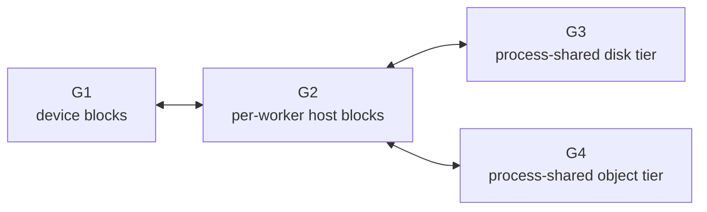

DynoSim builds a distributed serving simulation from Mocker engine cores. Each core owns
engine-specific scheduler and KV-cache state. Offline replay and live Mocker drive the same core
through virtual-time and wall-clock execution, respectively.

## Engine Behavior

Mocker exposes three engine modes through two scheduler cores. The TensorRT-LLM mode uses the
vLLM-shaped core with a different capacity policy.

| Behavior | vLLM | SGLang | TensorRT-LLM |
|---|---|---|---|
| Scheduler model | Waiting and running queues with a shared token budget | Cache-aware waiting and running queues | vLLM-shaped core with capacity-first admission |
| KV representation | Block manager selected by `g1_backend` | Token pool and radix cache | Block manager selected by `g1_backend` |
| Memory pressure | LIFO or FIFO recompute preemption | Decode retraction with cached-prefix preservation | `GUARANTEED_NO_EVICT`; reserves prompt plus maximum output at admission |
| Prefix reuse | Block-hash matching when prefix caching is enabled | Radix-prefix matching | Block-hash matching when prefix caching is enabled |
| Default block or page size | 64 tokens | 1 token, or `sglang.page_size` | 32 tokens |
| Aggregated simulation | Supported | Supported | Supported |
| Prefill/decode disaggregation | Supported | Supported | Not supported |
| KVBM lower tiers | Supported | Not attached to the SGLang core | Supported through the shared core |

Data-parallel ranks own independent scheduler and KV-pool state. Live Mocker and offline aggregated
replay can use multiple ranks per logical worker. Online replay and offline-disaggregated replay
currently require one rank per worker.

### G1 Managers

For the shared vLLM/TensorRT-LLM core, `g1_backend` selects the GPU-tier block manager:

- `kvbm` uses the KVBM logical block manager and its lineage-aware inactive pool.
- `native` uses Mocker's self-contained physical block-pool model.

When `g1_backend` is unset, Mocker selects `native` unless `num_g2_blocks`,
`num_g3_blocks`, or `enable_g4_storage` enables a lower tier. Lower-tier configuration
automatically selects `kvbm`. An explicit `g1_backend: native` conflicts with lower-tier
configuration and fails validation; omit `g1_backend` to select KVBM automatically or set it to
`kvbm`.

Both managers model G1 capacity, prefix reuse, request ownership, eviction, and router-visible KV
events. Their event visibility and allocation timing can differ, which can change KV-router
decisions and numeric replay results. Set `g1_backend` explicitly when comparing a new run with a
baseline created under a specific manager.

The SGLang core uses its own token-pool and radix-cache implementation. It ignores `g1_backend` and
does not support KVBM lower-tier offload.

## Timing Sources

Scheduler state determines the batch and cache-hit inputs to the timing source. Choose one timing
source for prefill and decode work.

### Polynomial Baseline

The default model is an uncalibrated synthetic baseline. Prefill latency follows a polynomial over
the uncached tokens scheduled in the pass. Decode latency follows a polynomial over active KV-cache
utilization. Use it for functional tests and relative experiments where hardware calibration is not
required.

### Profile-Derived Interpolation

Set `--planner-profile-data` to either:

- a profiler results directory, which Mocker converts to its interpolation input; or
- a Mocker-format `.npz` file.

The model linearly interpolates prefill latency over uncached batch tokens and bilinearly
interpolates decode latency over the profiled decode dimensions. Values outside the measured grid
are extrapolated, so inspect the profile coverage before relying on boundary results.

### AIConfigurator

Set `--aic-perf-model` to use
[AIConfigurator](https://github.com/ai-dynamo/aiconfigurator) for forward-pass latency prediction.
Select the model, system, backend, parallelism, and quantization identity with the `--aic-*` knobs.
`--aic-backend` can differ from `--engine-type` when an experiment intentionally decouples simulated
scheduler behavior from the timing backend.

When block capacity is not overridden, the AIC-backed configuration estimates KV capacity from the
backend-specific GPU-memory fraction. `--aic-nextn`, `--aic-nextn-accept-rates`, and
`--aic-mtp-seed` add deterministic speculative-token burst sampling to the scheduler simulation.

AIC predicts forward-pass duration and capacity inputs. Mocker still owns request admission,
batching, prefix hits, memory pressure, token emission, and handoff state.

## Multi-Tier KV Memory

KVBM lower-tier simulation models this topology for the shared vLLM/TensorRT-LLM core:



Configure capacities with `num_g2_blocks`, `num_g3_blocks`, and `enable_g4_storage`. Configure the
offload batch size and each directional link independently. A hit in G3 or G4 stages through G2
before onboarding to G1.

Each KVBM link uses deterministic processor sharing. If several transfers use the same directional
link, they divide its bandwidth and speed up as peers finish. Directional links maintain separate
contention state.

The simulation runs the KVBM block lifecycle and moves metadata through the tiers. It does not copy
KV payload bytes. G3 and G4 are process-local shared models; they do not model a remote NIXL data
path, object-store retries, or consistency behavior. KVBM lower tiers require the `kvbm` G1
manager. The `native` G1 choice models only the engine-owned GPU tier and cannot be combined with
the lower-tier configuration.

## Prefill/Decode Handoff

Live disaggregated Mocker has two handoff paths. The prefill worker's bootstrap configuration,
rather than its engine type alone, selects the path.

### Direct Completion Path

This is the default when the prefill worker omits `--bootstrap-ports`. The prefill worker completes
the request, and the router consumes that result before dispatching decode. There is no handoff ID,
source/destination rendezvous, destination reservation, or coordinated activation and release.

The direct path still applies the simple full-prompt line-rate delay as part of prefill completion
when transfer bandwidth and KV bytes per token are available. It does not use destination cache
state, so `--kv-transfer-timing-mode destination_missing` does not apply.

### Coordinated Bootstrap Path

Set `--bootstrap-ports` on prefill workers to advertise a handoff endpoint. The router can then
dispatch decode with a handoff ID and endpoint while prefill remains active. The two workers
coordinate this lifecycle:

1. The source finishes prefill and holds the terminal prefill result.
2. The destination accepts the request and reserves capacity.
3. The handoff applies the configured transfer delay.
4. The destination activates the request.
5. The source releases its hold.

Cancellation and failure paths release the corresponding reservation or hold. vLLM uses
source-first coordination; SGLang uses destination-first coordination. TensorRT-LLM handoff is not
supported.

Both paths use a per-request line-rate model:

```text
transfer time = transferred KV bytes / kv_transfer_bandwidth
transferred KV bytes = charged tokens * kv_bytes_per_token
```

The direct path always charges the full logical prompt. In the coordinated path,
`--kv-transfer-timing-mode full_prompt` does the same, while `destination_missing` charges only the
prompt footprint missing at the destination and can produce zero delay on a full destination hit.
Neither handoff path makes concurrent requests contend for a shared link; KVBM tier movement uses
the separate processor-sharing model described above.

Mocker derives `kv_bytes_per_token` from model metadata and `--kv-cache-dtype` when possible. Set
`--kv-bytes-per-token` when the model configuration is unavailable or when the experiment requires
an explicit value. Set `--kv-transfer-bandwidth 0` to disable P/D transfer delay.

## Distributed Signals

Live Mocker publishes the same categories of signals consumed by the distributed runtime:

- stored and removed KV events for KV-aware routing;
- engine-shaped Prometheus scheduler and request metrics;
- per-rank cache, queue, running-request, and preemption counters;
- forward-pass metrics with scheduled and queued prefill/decode work.

Offline KV-router replay captures the corresponding scheduler events and applies them to an
in-process indexer at deterministic event boundaries.

## Fidelity Boundaries

Interpret simulation results within these boundaries:

- Timing accuracy depends on the selected timing source and its calibration range.
- KV capacity and state transitions are modeled; KV tensor payloads are not.
- Live Mocker includes Dynamo component and transport overhead but does not measure GPU kernel or
  inference-engine overhead.
- Offline replay replaces external services and wall-clock concurrency with an event queue and
  shared logical clock.
- TensorRT-LLM disaggregation and SGLang KVBM lower-tier movement are not modeled.
- Mocker simulates text-token processing; it does not model multimodal encoder or cross-attention
  compute.

Use offline replay for broad algorithm and configuration exploration. Use live Mocker to validate
the distributed path, then run focused GPU benchmarks for hardware conclusions.
