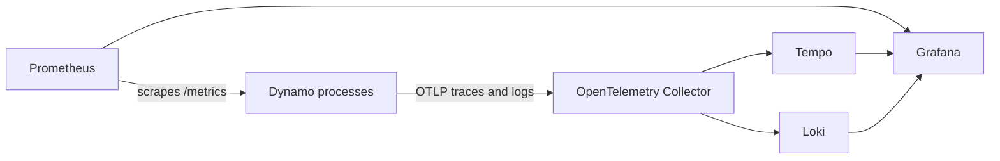
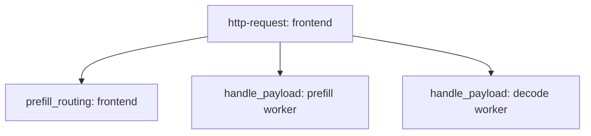
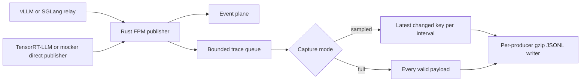
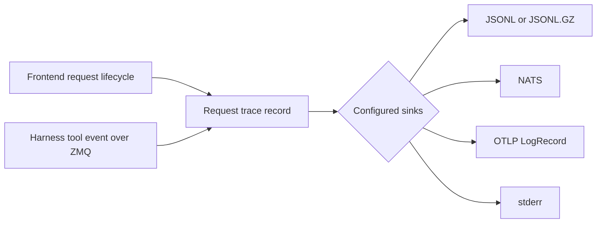

Dynamo uses different transport models for metrics and OpenTelemetry signals. It also separates
passive HTTP status endpoints from active worker checks. This design keeps local and Kubernetes
workflows consistent while allowing each signal to use its native collection model.

## Signal Paths

Metrics use a pull model: each Dynamo process exposes Prometheus text format, and Prometheus scrapes
the endpoint. The frontend exposes metrics on its HTTP port. Workers and standalone routers expose
them through the system-status server when `DYN_SYSTEM_PORT` is enabled.

Traces and logs use a push model. Each participating process exports OTLP records to a collector.
`OTEL_EXPORT_ENABLED` intentionally controls both signals so their trace context stays aligned. The
collector can route the records to different backends, such as Tempo and Loki.

## Trace and Log Correlation

The frontend creates the root `http-request` span for an incoming HTTP request. Dynamo propagates the
trace context over its internal transports, and receiving components create child `handle_payload`
spans. Disaggregated deployments can add routing and backend-specific spans between those layers.

The exact child spans depend on the backend and deployment mode; users should treat span names as
diagnostic structure rather than a stable public API.

If a caller supplies `x-request-id`, Dynamo propagates it with the trace context. Structured log
events emitted inside a request span can therefore include three correlation keys:

- `x_request_id` for the caller's application-level identifier
- `trace_id` for the complete distributed request
- `span_id` for the component-local operation

This is why JSONL logging is required for reliable log-to-trace correlation: the identifiers remain
separate fields instead of being embedded in formatted text.

## Forward Pass Metrics Persistence

Forward Pass Metrics (FPM) tracing branches from the Rust publication path after Dynamo has
validated and normalized the backend payload. The branch is additive: the event-plane publisher
continues independently of the local persistence consumer.

The trace queue is bounded and producer enqueueing is nonblocking. When persistence falls behind,
Dynamo drops trace records instead of delaying inference or event-plane publication. `sampled` mode
coalesces records by `(namespace, component, worker_id, dp_rank)` and writes only changed counters at
the configured interval. `full` mode preserves every accepted payload, including idle heartbeats.

A writer owns one producer-specific file sequence. Rotation uses uncompressed JSONL bytes, retention
applies independently to each producer, and graceful shutdown flushes accepted pending records. These
properties make the files useful for analysis but not equivalent to a durable event log.

## Request Trace Fan-Out

Request tracing separates record creation from destination selection. The frontend creates
`request_end` and optional `request_payload` rows, while a harness can inject tool events through
ZMQ. Dynamo normalizes the rows before sending each one to every configured sink.

The OTLP request-trace sink uses the logs protocol and endpoint resolution rules but does not depend
on the runtime log stream. Selecting `stderr` while configuring an OTLP endpoint does not export the
row; the sink list must include `otel`. Header capture is applied only to payload rows and stores
unredacted allowlisted values.

## Active Worker Health Checks

HTTP `/live` and `/health` endpoints are passive: they report current process and runtime state when
an external system queries them. Canary checks are active: Dynamo sends a real request through an
idle worker endpoint to verify that the inference path still completes.

1. **Observe successful activity.** A successful response chunk marks the endpoint ready and resets
   its idle timer.
2. **Wait for the endpoint to become idle.** If no successful activity arrives for
   `DYN_CANARY_WAIT_TIME`, the endpoint's timer expires.
3. **Send the backend canary payload.** Dynamo sends the backend's minimal health-check payload
   through the registered endpoint. Unified backends can override that payload with
   `DYN_HEALTH_CHECK_PAYLOAD`.
4. **Apply the result.** A successful response restores or retains `ready`. If no response arrives
   within `DYN_HEALTH_CHECK_REQUEST_TIMEOUT`, Dynamo marks the endpoint `notready`.

Normal traffic suppresses unnecessary canaries because it already proves that the endpoint can
serve requests. Active checks are disabled by default and should be enabled only where this extra
failure-detection path is required.

## Related Documentation

- [Observe a Local Deployment](../../../cli/operations/observability.mdx)
- [Observe a Local Deployment](../../../cli/operations/observability.mdx#check-deployment-health)
- [Local Observability Stack Reference](../../../reference/observability/local-stack.mdx)
- [Health Check Reference](../../../reference/observability/health-checks.mdx)
- [Logging Reference](../../../reference/observability/logging.mdx)
- [Forward Pass Metrics Trace Reference](../../../reference/observability/forward-pass-metrics-traces.mdx)
- [Request Trace Reference](../../../reference/observability/request-traces.mdx)
