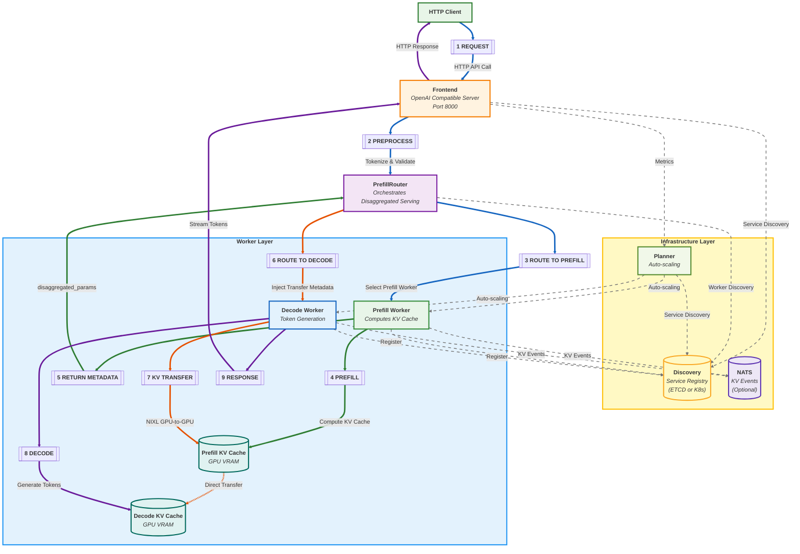

NVIDIA Dynamo separates request execution, service discovery, and event delivery. This page describes how those parts work together in local and Kubernetes deployments.

## Request Flow

The main request path is:

1. **Request (S1)**: HTTP client sends API request to Frontend (OpenAI-compatible server on port 8000)
2. **Preprocess (S2)**: Frontend preprocesses the request (applies chat template, tokenizes) and validates it
3. **Route to Prefill (S3)**: PrefillRouter selects a prefill worker using KV-aware routing or load balancing

### Prefill

4. **Prefill (S4)**: Prefill worker executes the prefill computation on the input tokens and generates KV cache
5. **Return Metadata (S5)**: Prefill worker returns `disaggregated_params` containing backend-specific transfer metadata

### Decode Routing

6. **Route to Decode (S6)**: PrefillRouter injects prefill result into decode request and routes to decode worker
7. **KV Transfer (S7)**: Decode worker coordinates with prefill worker for direct GPU-to-GPU KV cache transfer via NIXL

### Completion

8. **Decode (S8)**: Decode worker generates tokens using the transferred KV cache
9. **Response (S9)**: Generated tokens stream back through Frontend for post-processing (detokenization) and delivery to Client

## Distributed Runtime

The Rust `DistributedRuntime` in `lib/runtime` provides discovery, endpoint registration, request transport, and lifecycle management. Python components use the same runtime through the bindings in `lib/bindings/python`.

The runtime organizes services into four levels:

- `DistributedRuntime` owns connections, background tasks, and cancellation.
- `Namespace` isolates one logical deployment or model group.
- `Component` groups workers that perform the same role.
- `Endpoint` exposes a network service such as `generate`, `clear_kv_blocks`, or `load_metrics`.

Each process creates its own runtime. Components in one deployment use the same namespace so that frontends, routers, planners, and workers can discover each other. A client resolves an endpoint path such as `namespace.component.endpoint`, watches for membership changes, and selects an instance with random, round-robin, or direct dispatch.

### Local Worker Inhibition

After a routed request fails, the local runtime temporarily inhibits the failed worker while service discovery catches up. `DYN_RUNTIME_INHIBITED_DURATION_SECS` controls this interval and defaults to 5 seconds. Discovery remains authoritative and can restore or remove the worker before the timer expires.

## Communication Planes

Dynamo uses separate planes for discovery, requests, and events. The planes can use different transports.

### Discovery Plane

Workers register endpoints when they start. Clients watch the selected discovery backend for membership changes.

| Deployment | Discovery backend | Configuration |
| --- | --- | --- |
| Kubernetes with the Dynamo Operator | `DynamoWorkerMetadata` resources and `EndpointSlice` objects | The operator sets `DYN_DISCOVERY_BACKEND=kubernetes` |
| Local or bare metal | etcd by default | `DYN_DISCOVERY_BACKEND=etcd` and `ETCD_ENDPOINTS` |

The runtime also supports memory and file-backed discovery for development. In etcd mode, leases remove stale endpoints after a process stops sending keep-alive messages.

### Request Plane

The request plane carries RPC traffic between Dynamo components. `DYN_REQUEST_PLANE` selects the transport:

- `tcp` is the default and uses direct pooled connections.
- `nats` uses brokered request transport.

`DYN_REQUEST_PLANE_CODEC` selects `msgpack` or `json`. The destination endpoint advertises its codec, so one client can communicate with endpoints that use different codecs.

### Event Plane

The event plane carries KV cache updates, worker telemetry, and other asynchronous signals. `DYN_EVENT_PLANE` selects `zmq` or `nats`. ZMQ is the default and discovers publishers through the discovery plane. NATS uses subjects scoped by namespace and component.

The request and event planes are independent. For example, a deployment can use TCP for requests and ZMQ for KV events. To route without published KV events, start the frontend with `--no-router-kv-events`.

### Control Connections

- The frontend and workers expose signals that the Planner uses for scaling decisions.
- The Planner updates the desired worker counts.
- The Dynamo Operator reconciles those counts on Kubernetes.

## Technical Implementation Details

### PrefillRouter Orchestration
- The `PrefillRouter` sits between the Frontend and workers, orchestrating disaggregated serving
- Selects prefill workers using KV-aware routing (cache overlap scores + load) or simple load balancing
- Injects transfer metadata into decode requests for KV cache coordination

### NIXL
- Enables high-speed GPU-to-GPU data transfers using NVLink, InfiniBand/UCX, or PCIe
- Transfer metadata exchanged via `disaggregated_params` in prefill response
- Backend-specific coordination: SGLang uses bootstrap connections, TRTLLM uses opaque state, vLLM uses block IDs

### Disaggregated KV Cache
- Each worker maintains local KV cache in its GPU memory
- No shared storage bottlenecks—transfers are direct worker-to-worker via NIXL
- Non-blocking transfers allow GPU forward passes to continue during KV transfer

