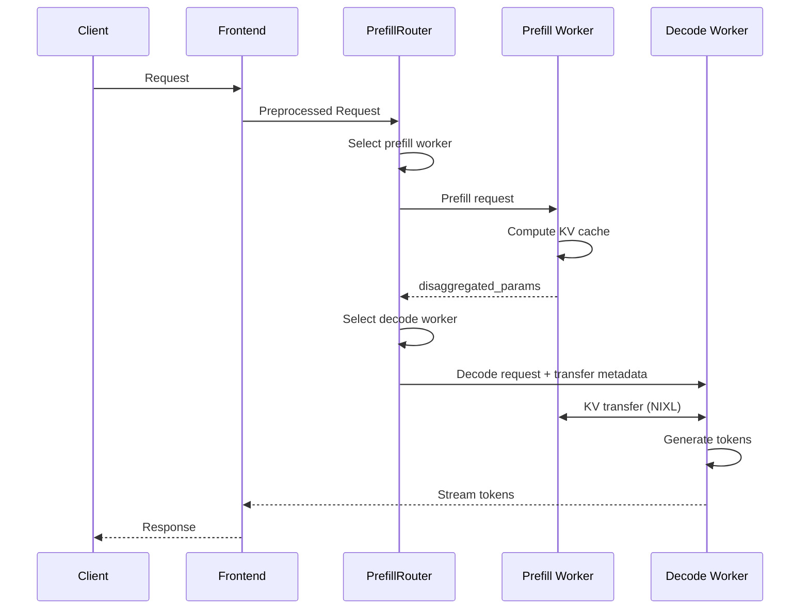

The prefill and decode phases of LLM requests have different computation characteristics and memory footprints. Disaggregating these phases into specialized llm engines allows for better hardware allocation, improved scalability, and overall enhanced performance. For example, using a larger TP for the memory-bound decoding phase while a smaller TP for the computation-bound prefill phase allows both phases to be computed efficiently. In addition, for requests with long context, separating their prefill phase into dedicated prefill engines allows the ongoing decoding requests to be efficiently processed without being blocked by these long prefills.

Disaggregated execution of a request has three main steps:
1. Prefill engine computes prefill phase and generates KV cache
2. Prefill engine transfers the KV cache to decode engine
3. Decode engine computes decode phase.

The disaggregation design in Dynamo features a flexible framework that delivers strong performance across various conditions.

## Efficient KV Transfer

The key to high-performance disaggregation is efficient KV transfer. Dynamo leverages NIXL to transfer KV cache directly from the VRAM of the prefill engine to the VRAM of the decode engine. The KV transfer is non-blocking, allowing GPU forward passes to continue serving other requests during the transfer.

### Router Orchestration

The disaggregated serving flow is orchestrated by the `PrefillRouter`:

1. **Worker Selection**: The router selects a prefill worker using KV-aware routing (based on cache overlap scores and load) or simple load balancing.

2. **Prefill Execution**: The router sends the prefill request to the selected prefill worker. The prefill worker computes the KV cache and returns `disaggregated_params` containing backend-specific transfer metadata.

3. **Decode Routing**: The router injects the prefill result into the decode request, then routes to the decode worker.

4. **KV Transfer**: The decode worker uses the transfer metadata to coordinate with the prefill worker. NIXL handles the direct GPU-to-GPU transfer using the optimal available transport (NVLink, InfiniBand/UCX, etc.).

### Backend-Specific Transfer Metadata

The transfer metadata format varies by backend:

- **SGLang**: Uses `bootstrap_info` (host, port, room_id) for RDMA bootstrap coordination. SGLang prefill workers publish their bootstrap endpoint to the discovery service during initialization. With this mechanism, prefill can run as a background task, allowing the decode phase to begin immediately while the KV transfer proceeds in parallel.

- **vLLM**: Uses `kv_transfer_params` containing block IDs and remote worker connection info. Prefill runs synchronously; decode waits for prefill to complete before proceeding.

- **TRTLLM**: Uses `opaque_state` containing serialized TRT-LLM internal metadata. Prefill runs synchronously; decode waits for prefill to complete before proceeding.

## Runtime-Reconfigurable xPyD

Dynamo's disaggregation design supports runtime-reconfigurable xPyD (x prefill workers, y decode workers). Workers can be added and removed at runtime:

- **Add worker**: Worker registers with the discovery service and publishes its `RuntimeConfig` (including KV capacity).
- **Remove worker**: Worker drains active requests and deregisters from discovery.

The router automatically discovers new workers via the discovery service and incorporates them into routing decisions.

## Performance Characteristics

Disaggregation changes where compute and memory are consumed; it does not make either phase free.
The following implementation characteristics explain the user-visible tuning tradeoffs.

### Mixed prefill and decode iterations

When an aggregated or decode engine combines chunked prefill and decode work in one forward
iteration, the backend can launch separate attention work for context tokens and decode tokens,
followed by dense work over the combined active tokens. TensorRT-LLM, for example, uses its context
FMHA path for context tokens and its XQA path for decode tokens.

The token budget assigned to a mixed iteration controls the shape of the latency disturbance:

- A larger prefill chunk produces fewer, longer interruptions to decode progress.
- A smaller prefill chunk produces more frequent, shorter interruptions.

This is why local-prefill and chunked-prefill policy affects ITL even when total prefill work is
unchanged. The exact scheduler controls and supported modes are backend-specific.

### Prefill saturation

Prefill is compute-intensive and becomes more efficient as the prompt supplies enough work to
saturate the GPU. Below that point, fixed launch and scheduling costs dominate. Above it, attention
cost grows with the context history and absolute TTFT continues to increase.

A dedicated prefill pool can therefore optimize for relatively small batches and large token work
units, while the decode pool optimizes for concurrent sequences and KV-cache capacity. The optimal
boundary depends on the model, quantization, GPU, backend, and request-length distribution; it should
not be encoded as a universal token threshold.

### Decode memory tradeoff

Decode engines divide GPU memory among model weights, activation and communication buffers,
intermediate tensors, and KV cache. Raising maximum batch or token limits can enlarge intermediate
allocations and leave less room for KV blocks. More KV capacity admits more concurrent or longer
sequences, but overly restrictive execution limits can reduce batching efficiency.

Tensor parallelism also changes this balance. Adding ranks shards model state and can expose more
aggregate memory for KV cache, while communication overhead can reduce throughput per GPU. This is
why the minimum configuration that fits the weights is not necessarily the best decode
configuration.

### Capacity effects of disaggregation

Moving prefill to dedicated workers can improve decode latency by preventing long prompts from
blocking generation, but it also reserves GPUs for a pool whose KV cache is not used during decode.
The net result depends on the operating point:

- At low concurrency, an aggregated worker often avoids transfer and pool-fragmentation overhead.
- When prefill and decode contend under sustained load, separate pools can improve latency isolation.
- When decode KV capacity is the bottleneck, adding prefill replicas can reduce total serving
  capacity unless the latency benefit compensates for the GPUs removed from decode.

The Planner can use runtime load and capacity signals to automate pool redistribution, while the
router uses those signals to route requests within the current prefill and decode pools.
User-facing measurement and adjustment steps belong in
[Advanced Performance Tuning](../../../../kubernetes/operations/performance-tuning.md); configuration fields belong in the
component and backend references.
