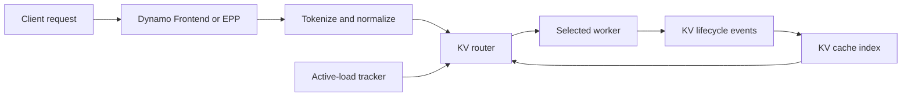

KV-aware routing chooses the worker that can serve a request at the lowest projected cost. It combines reusable key-value (KV) cache state with active prefill and decode load, reducing repeated prompt computation without concentrating work on cache-rich workers.

## Why KV State Affects Routing

Two requests with the same prompt can have very different costs on different workers. A worker that already holds the request prefix can reuse its cached attention state and avoid recomputing that portion of prefill. A worker with no matching prefix must compute the whole prompt.

Round-robin and load-only policies do not account for that difference. KV-aware routing does, while still charging workers for in-flight prompt and decode work so that cache locality does not create a hot spot.

## Selection and Feedback Loop

The request host tokenizes and normalizes the request before the router evaluates candidate workers. The KV cache index reports prefix overlap for each worker, and the active-load tracker accounts for work already assigned there. The router filters ineligible workers, scores the remaining candidates, and chooses one target.

Workers publish KV creation and release events that keep the index current. When a deployment cannot publish KV events, set `--no-router-kv-events` to predict cache state from routing decisions; otherwise `kv` mode uses load-only scoring. See [Configuration and Tuning](../../modular-components/router/configuration-and-tuning.md#kv-event-transport) for the operational tradeoff.

## Cache Locality and Load Work Together

The router estimates the prompt work that a worker can reuse, then combines the remaining prompt work with projected decode load. A large cache overlap lowers the prefill part of the score. Active prefill, active decode blocks, and optional active-request accounting raise it.

This makes routing a placement decision, not an unconditional affinity rule. A cache-hot worker can lose to a colder worker when its active load makes the total cost higher. For the cost model, worker filters, and configuration surface, see [Routing Concepts](../../modular-components/router/routing-concepts.md) and [Router Filtering](../../modular-components/router/worker-filtering.md).

## Request-Path Hosts

Dynamo uses the same selection behavior in several request-path topologies:

- **Dynamo Frontend** hosts the OpenAI-compatible request path and selects a worker directly.
- **Endpoint Picker Plugin (EPP)** hosts selection behind Gateway API Inference Extension when a Kubernetes Gateway owns request entry.
- **Standalone router services** expose router functions to custom request paths and multi-tier deployments.

The host determines where selection runs; it does not change the cache-and-load model. For the Kubernetes topology choices, see [KV-Aware Routing on Kubernetes](../../../../kubernetes/kv-aware-routing/overview.md). For deployment modes and standalone services, see the [Router Guide](../../modular-components/router/router-guide.md).

## Relationship to Disaggregated Serving

In an aggregated deployment, KV-aware routing selects the worker that runs both prefill and decode. In a disaggregated deployment, it selects from separate prefill and decode pools and incorporates cache state appropriate to each hop.

Selection and transfer are separate responsibilities. The router chooses the prefill and decode workers; backend transfer mechanisms such as NIXL move KV state between them. See [Disaggregated Serving](disaggregated-serving.md) for the serving architecture and [Router Design](../../modular-components/router/router-design.md) for router internals.

## Related Documentation

- [Router Overview](../../modular-components/router/overview.md)
- [Routing Concepts](../../modular-components/router/routing-concepts.md)
- [Router Design](../../modular-components/router/router-design.md)
- [KV-Aware Routing on Kubernetes](../../../../kubernetes/kv-aware-routing/overview.md)
