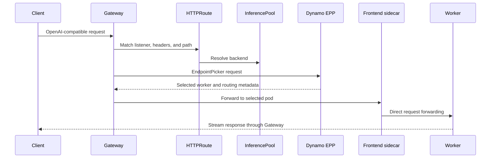
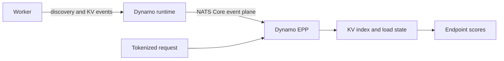

Gateway API routing moves worker selection out of the public-facing Dynamo Frontend and into a
Dynamo Endpoint Picker Plugin (EPP). Kubernetes Gateway API owns traffic entry and route matching;
Dynamo continues to own the serving graph, worker discovery, KV cache state, and endpoint scoring.

For the task-oriented setup, see [Using GAIE with Dynamo](../../../../kubernetes/kv-aware-routing/gateway-api.mdx).

## Component Responsibilities

| Component | Responsibility | Managed by |
|---|---|---|
| `Gateway` | Accepts external traffic and runs the Gateway data plane. | Platform or application team |
| `HTTPRoute` | Matches model traffic and targets an `InferencePool`. | Application team |
| `InferencePool` | Defines eligible worker pods and identifies the EPP Service. | Dynamo operator |
| Dynamo EPP | Tokenizes requests, consumes routing state, scores endpoints, and returns a worker selection. | Dynamo operator |
| Frontend sidecar | Receives an already-routed request and forwards it in direct mode. | Dynamo operator from the DGD |
| Worker | Runs the inference backend and publishes lifecycle and KV cache events. | Dynamo operator from the DGD |

The operator generates the EPP Deployment and Service and the `InferencePool` from the
`DynamoGraphDeployment`. Users create the `Gateway`, `HTTPRoute`, and DGD.

## Request Flow

The Frontend sidecar runs with `--router-mode direct`. Running it in `kv` mode would introduce a
second worker-selection decision after the EPP has already selected an endpoint.

## Routing-State Flow

In the operator-managed topology, the EPP receives worker state through the Dynamo event plane using
NATS Core. A direct vLLM ZMQ subscription is a different integration shape and is not part of this
request path.

The EPP can route with two levels of state:

- **KV cache aware:** worker-published events identify cached prompt blocks and active sequences.
- **Approximate:** tokenized requests and local lifecycle bookkeeping predict state when worker KV
  events are unavailable or disabled.

Both modes also account for endpoint readiness and load. KV events improve the accuracy of prefix
locality decisions; they do not replace health and eligibility filters.

## Operator Reconciliation Boundary

A DGD with an EPP component causes the operator to reconcile:

1. An EPP configuration `ConfigMap` when inline configuration is used.
2. An EPP Deployment and Service.
3. An `InferencePool` that selects Dynamo worker pods and points its `endpointPickerRef` to the EPP
   Service on gRPC port `9002`.
4. Frontend sidecar defaults and worker labels used by the Gateway and EPP.

Generated resources are implementation details of the DGD. Persistent changes belong in the DGD,
not in manual patches to the generated `InferencePool`, Service, or Deployment.

## Gateway Independence

Dynamo does not require a specific data-plane implementation. The Gateway implementation must:

- Support Gateway API and GAIE `InferencePool` resources.
- Call the `endpointPickerRef` before forwarding a request.
- Forward the request to the endpoint selected by the EPP.
- Preserve the routing metadata and body mutation returned by the EPP.

agentgateway and Istio are the documented integrations. Other implementations can work when they
honor the same GAIE endpoint-picker contract.

## Failure Boundaries

The topology introduces distinct readiness boundaries:

- A Gateway can be programmed while the `HTTPRoute` is unresolved.
- An `HTTPRoute` can be accepted while its generated `InferencePool` has no ready endpoints.
- The EPP can be running but not ready while it waits for eligible workers.
- Workers can be ready for inference but unroutable when their labels do not match EPP filters or the
  `InferencePool` selector.
- Service-mesh policy can allow client-to-Gateway traffic while blocking Gateway-to-EPP gRPC traffic.

Troubleshooting should follow the request path in that order rather than treating Gateway API routing
as one process.

For field and environment-variable contracts, see the
[Gateway API Routing Reference](../../../../reference/components/gateway-api-routing.mdx).
