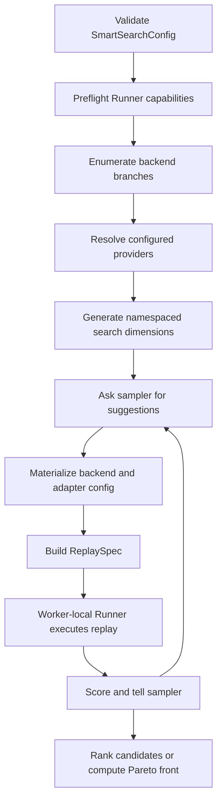

<!--
Generated from `aisimulate/docs/sweeper/architecture.md` by `docs/fern/scripts/sync_aisimulate_docs.py`.
Edit the canonical source instead of this Fern copy.
-->

> [!WARNING]
> **Experimental.** Sweeper's API, configuration schema, search results, and deployment output may
> change without a standard deprecation period.

A `SmartSearchConfig` combines backend knobs, optional adapter search spaces, a workload, an
optimization goal, and sweep run control. A `Sweeper` composes that configuration with an injected
replay runtime.

## Ownership

| Layer | Owns | Does not own |
|---|---|---|
| Sweeper core | backend search, parallel enumeration, optimizer orchestration, scoring, cache, worker lifecycle | feature-specific policy semantics or a concrete replay runtime |
| `SweepConfigProvider` | feature-specific search-space generation and per-candidate replay materialization | optimizer execution, scoring, or process pools |
| Replay runner | execution of a complete `ReplaySpec` and declaration of supported backends and hooks | optimizer suggestions or provider search-space generation |

## Sweep Flow

Provider code runs in the main process. Worker tasks receive only a serializable `ReplaySpec`; they
do not import or pickle provider objects. Each worker creates one runner and reuses it for candidate
replays.

## Provider Preparation

A provider implements two operations:

1. `generate_search_space(search_spec, context)` validates the complete adapter-owned search space
   and returns branch-specific parameters plus reusable prepared state.
2. `materialize_replay(plan, selection, context)` turns one namespaced selection into an
   `AdapterReplaySpec` with concrete configuration and optional runtime hooks.

Sweeper namespaces provider parameters as `adapter::<adapter name>::<local parameter>`. This avoids
collisions without adding feature-specific fields to the core schema.

## Replay and Failure Semantics

Before execution, `RunnerCapabilities` verifies the replay-spec version, backend/topology pair, and
every runtime hook. Unsupported combinations fail before the optimizer spends trials on them.

Optimizer ask/tell stays in the main process. Exact repeated suggestions use a run-local result
cache. Candidate build failures, replay failures, GPU-budget violations, and timeouts become
infeasible trials. Parallel evaluation uses spawned worker processes and worker-sized waves; a
timed-out pool is terminated and replaced.
