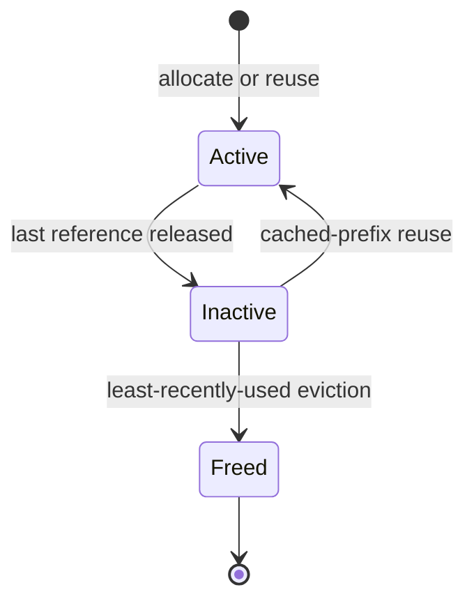

The mocker is organized into several cooperating components that mirror the internal architecture of
production LLM inference engines. The scheduler (vLLM-style and SGLang-style variants) and KV block
manager live inside the engine core. Multi-engine behavior — KV transfer simulation, KV router
simulation, and Planner simulation — is added by the DynoSim run harness on top of multiple engine
cores. See [DynoSim Architecture](../../../concepts/simulation/dynosim-architecture.md) for the
component-level design.

For task-oriented instructions, see [Simulate a Kubernetes Deployment](../../../../../kubernetes/operations/simulation-with-dynosim/mocker-live-simulation.mdx) or [Simulate a Local Deployment](../../../../../cli/operations/simulation-with-dynosim/mocker-live-simulation.mdx); for the command-line flags referenced throughout this page, see the [Mocker CLI Reference](../../../../../reference/components/mocker-cli-reference.mdx).

## Generalized Engine

The `aisimulate_core::engine` module owns the scheduler, native GPU KV accounting, preemption, timing, and
attention data-parallel (DP) barrier. A logical engine contains either one rank or a fixed group of
sibling ranks. Grouped execution starts a pass only when every sibling rank is ready and completes
at the latest rank completion time.

Offline replay and Live Mocker construct this same generalized engine. The AISimulate Replayer
advances it with a virtual clock and deterministic event queue. Live Mocker advances it with Tokio
and wall-clock timers, then publishes the resulting output, lifecycle, KV, and metrics effects
through Dynamo transport.

## Scheduler

The mocker has two scheduler shapes rather than one generic queue model:

- **vLLM mocker** uses an upstream-style `waiting + running` scheduler. Each request tracks
  computed tokens, the scheduler spends one token budget across the running set first, and decode
  pressure triggers inline preemption of running requests.
- **SGLang mocker** uses a cache-aware waiting/running scheduler around a radix-style prefix cache.
  It batches prefill work with decode-state awareness and handles pressure primarily through decode
  retraction while preserving cached prefixes.

Both schedulers simulate continuous batching, prefix reuse, chunked prefill, memory pressure, and
decode token emission while publishing metrics about current resource utilization.

When resources become constrained, the mocker simulates the engine's real recovery path:
- vLLM-style decode preemption and recompute
- SGLang-style decode retraction plus prefix-preserving cache updates

## KV Block Manager

The vLLM and TensorRT-LLM scheduler core owns a native physical block pool. Each slot records its
content identity, request references, cache visibility, and last-use order. A request can reuse a
contiguous cached prefix or allocate free slots. When the pool needs capacity, it evicts unreferenced
cached slots in least-recently-used order.

Blocks conceptually have two states:

- **Active** — one or more requests reference the slot.
- **Inactive** — no request references the slot, but prefix caching retains it for reuse.

Releasing the last request reference makes a cached slot inactive. Eviction removes its hash mapping,
returns the physical slot to the free pool, and emits a router-visible removal event. SGLang uses its
own token-pool and radix-cache model instead of this block pool.

Fresh completed blocks emit `Stored` KV events. Reusing a visible cached block does not emit a second
store event because the router already tracks it.

## Sequence Tracking

Each active request is tracked as a sequence with token-block identities and generation state. Completed
blocks receive content-based hashes and become available for future prefix matches. Partial blocks
remain request-local until they cross a block boundary.

## Performance Model

The mocker supports three timing prediction modes:

**Polynomial Model (Default):** Uses hardcoded polynomial formulas that approximate typical GPU behavior. Prefill time scales quadratically with token count, while decode time depends on the total active KV cache size.

**Interpolated Model:** Loads actual profiling data from an NPZ file containing measured prefill and decode latencies. The mocker interpolates between data points to predict timing for any input size. This enables high-fidelity simulation matching a specific hardware configuration.

**AIC Model (`--aic-perf-model`):** Uses the NVIDIA AI Configurator (AIC) SDK for latency prediction. AIC provides calibrated performance models for specific GPU/model/engine combinations, predicting prefill and decode latency as a function of batch size, sequence length, and prefix cache hits. The model path is automatically derived from `--model-path`, and the engine type from `--engine-type`. This mode is opt-in and requires both the `aiconfigurator` SDK and loadable systems/perf data for the requested tuple.

## Bootstrap Rendezvous (Disaggregated Serving)

For disaggregated prefill/decode deployments, prefill and decode workers coordinate via a simple TCP-based rendezvous protocol. The decode worker connects to the prefill worker's bootstrap port and waits until the prefill phase completes and KV cache is ready. Either side can arrive first—the rendezvous completes when both are ready.

## KV Transfer Latency Simulation

The mocker simulates KV cache transfer time between prefill and decode workers. Before the prefill worker emits its first (and only) token, it sleeps for a duration based on:

- **kv_bytes_per_token** (auto-computed from model config): `num_layers * 2 * num_kv_heads * head_dim * dtype_bytes`. The `dtype_bytes` is determined by `--kv-cache-dtype`: when set to `auto` (default), it uses the model's `dtype` from config; when explicitly set (e.g., `fp8`), it uses the specified dtype instead. It can also be overridden directly with `--kv-bytes-per-token`.
- **kv_transfer_bandwidth** (default: 64.0 GB/s, inter-node InfiniBand)
- **Transfer time**: `num_input_tokens * kv_bytes_per_token / bandwidth`

This delay is injected after the scheduler's prefill compute simulation completes, modeling the sequential flow: prefill computation → KV transfer → decode begins. Set `--kv-transfer-bandwidth 0` to disable.

## Integration with Dynamo

### KV Event Publishing

When prefix caching is enabled, the mocker publishes KV cache events to the distributed runtime. These events notify the system when blocks are stored (new content cached) or removed (evicted). This enables the KV-aware router to make intelligent routing decisions based on which workers have which prefixes cached.

### Metrics Publishing

Each scheduler publishes metrics about its current state, including the number of active decode blocks per DP rank. The router uses these metrics for load-aware routing decisions.

## Comparison with Real Engines

| Feature | Real Engine | Mocker |
|---------|-------------|--------|
| GPU Required | Yes | No |
| Block Manager | Paged KV cache | Simulated blocks |
| Scheduler | Continuous batching | Continuous batching |
| Prefix Caching | Hash-based | Hash-based |
| Chunked Prefill | Supported | Supported |
| Preemption | Recompute/swap | Recompute (simulated) |
| Timing | Real execution | Model-based |
| KV Events | Native | Compatible |
| Data Parallelism | Multi-GPU | Simulated |

## Feature Gaps (WIP)

> For the broader mocker enhancement roadmap, see [#6383](https://github.com/ai-dynamo/dynamo/issues/6383).

The following features are not yet supported by the mocker:

- **Multi-tier memory** - No support for offloading KV cache to CPU or disk, or for loading it back to GPU
- **Multimodal support** - Currently only simulates text token processing; no vision encoder or cross-attention simulation

## See Also

| Document | Description |
|----------|-------------|
| [Simulate a Kubernetes Deployment](../../../../../kubernetes/operations/simulation-with-dynosim/mocker-live-simulation.mdx) | Deploy and run Mocker on Kubernetes |
| [Simulate a Local Deployment](../../../../../cli/operations/simulation-with-dynosim/mocker-live-simulation.mdx) | Run Mocker from the command line |
| [Mocker CLI Reference](../../../../../reference/components/mocker-cli-reference.mdx) | Command-line flags for `python -m dynamo.mocker` |
| [Run a DynoSim Simulation](../../../../../cli/operations/simulation-with-dynosim/dynosim-replay.mdx) | Run one workload through a simulated configuration with `python -m dynamo.replay` |
