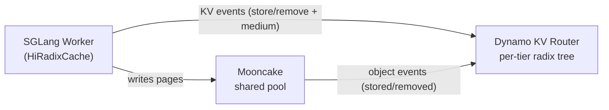

This guide covers running SGLang's Hierarchical Cache (HiCache) with Dynamo, and how the Dynamo KV router integrates with HiCache for tier-aware worker selection when workers share an external pool such as Mooncake.

## Overview

SGLang HiCache extends RadixAttention with a multi-tier KV cache that transparently moves pages between GPU HBM, host memory, and an optional external storage backend (e.g. Mooncake). For a full description of HiCache itself — flag reference, storage backends, memory layouts, prefetch policies — see SGLang's own documentation:

- [SGLang HiCache Design](https://docs.sglang.io/docs/advanced_features/hicache_design)
- [SGLang HiCache Best Practices](https://docs.sglang.io/docs/advanced_features/hicache_best_practices)

What Dynamo adds on top of HiCache:

- **Tier-aware routing.** The KV router tracks which cache tier each block lives on (GPU / Host / External) and uses that when scoring candidate workers — not just device overlap.
- **Shared-pool awareness.** When an external backend such as Mooncake is configured, the router tracks Mooncake object events so it can discount prefill cost for blocks any worker can fetch, not just blocks the candidate holds locally.

If you are running a single worker with HiCache and no shared pool, no Dynamo-side configuration is required — the worker reports KV events to the router as usual.

## Running SGLang with HiCache

Launch a worker with HiCache enabled:

```bash
python -m dynamo.sglang \
  --model-path Qwen/Qwen3-0.6B \
  --page-size 64 \
  --enable-hierarchical-cache \
  --hicache-ratio 2 \
  --hicache-write-policy write_through \
  --hicache-storage-backend nixl \
  --skip-tokenizer-init
```

Then start the frontend:

```bash
python -m dynamo.frontend --http-port 8000
```

> [!NOTE]
> The HiCache flags (`--enable-hierarchical-cache`, `--hicache-ratio`, `--hicache-write-policy`, `--hicache-storage-backend`, `--hicache-mem-layout`, etc.) are SGLang-native — Dynamo passes them through unchanged. See [SGLang's best-practices doc](https://docs.sglang.io/docs/advanced_features/hicache_best_practices) for the complete flag reference and tuning guidance.

## Tier-Aware Shared KV Cache Routing

When you scale out to multiple SGLang workers that share an external pool such as [Mooncake](https://github.com/kvcache-ai/Mooncake), the Dynamo router can be made tier-aware. It tracks per-tier residency from worker events and consults the shared pool directly so that blocks cached anywhere in the cluster — not just on the candidate worker's GPU — contribute to worker scoring.

### Why

By default the router's radix tree only reflects blocks resident in **GPU HBM** on each worker. HiCache silently demotes blocks to host memory and further to Mooncake as the device pool fills, but the router never sees those transitions. A worker that has the full request prefix on host + Mooncake looks identical to a cold worker. The router ends up treating "fetchable from Mooncake in milliseconds" the same as "must be recomputed from scratch."

### Event model

SGLang's `HiRadixCache` emits `BlockStored` / `BlockRemoved` events carrying a `medium` field on every tier transition:

| Transition                                      | Event emitted        |
| ----------------------------------------------- | -------------------- |
| Fresh prefill writes blocks to GPU              | `store(GPU)`         |
| GPU → Host copy (after async DMA completes)     | `store(CPU_PINNED)`  |
| GPU evicted, block still resident on Host       | `remove(GPU)`        |
| Host evicted (block gone from all worker tiers) | `remove(CPU_PINNED)` |
| Host → GPU promotion (`load_back`)              | `store(GPU)`         |
| External → Host prefetch (L2 materialization)   | `store(CPU_PINNED)`  |

`CPU_PINNED` is the value SGLang's `HiRadixCache` actually emits for host-tier blocks (page-locked memory). The rest of this guide uses `CPU_PINNED` to match the on-the-wire string; "Host" is the conceptual tier name.

A few properties the router relies on:

- **Ordering.** `store(new_tier)` is emitted before `remove(old_tier)` so the block is never invisible to the router during a transition.
- **DMA safety.** `store(CPU_PINNED)` for a GPU→Host copy is deferred until `finish_event.synchronize()` confirms the DMA landed — events never fire before bytes are resident.
- **Per-tier tracking.** A block can be on GPU and Host simultaneously. The router records both and picks the highest-priority tier when scoring overlap.

### How it works



The router maintains two indexes:

- Its own radix tree, built from worker KV events (per-tier).
- A set of Mooncake object keys and verified logical groups, built from the Mooncake master's event stream.

Request routing checks both indexes locally. When an event includes SGLang's `group_id`, the first lookup verifies every physical object in the group and caches the result. Later requests use one group lookup per page; any event for that group invalidates the cached result. Events without `group_id` use exact object-key checks.

If the event stream starts after Mooncake already contains objects, the shared-pool index starts empty and learns about subsequent events. A sequence gap clears the shared-pool index to avoid stale hits.

### Scoring

For each candidate worker, the router computes a **logit** (lower wins):

```text
# Without shared cache
adjusted_prefill_blocks = max(
    prefill_blocks
    - overlap_score_credit * device_overlap_blocks
    - host_cache_hit_weight * host_overlap_blocks
    - disk_cache_hit_weight * disk_overlap_blocks,
    0,
)
logit = prefill_load_scale * adjusted_prefill_blocks + decode_blocks

# With shared cache
shared_beyond = shared_cache_hits.hits_beyond(device_overlap_blocks)
adjusted_prefill_blocks = max(
    prefill_blocks
    - overlap_score_credit * device_overlap_blocks
    - host_cache_hit_weight * host_overlap_blocks
    - disk_cache_hit_weight * disk_overlap_blocks
    - shared_cache_multiplier * shared_beyond,
    0,
)
logit = prefill_load_scale * adjusted_prefill_blocks + decode_blocks
```

`hits_beyond(n)` counts shared-cache pages at positions `>= n` — "pages past my device prefix that I can still fetch from Mooncake instead of recomputing."

**Worked example.** Request is 4 blocks, `shared_cache_multiplier = 0.5`, `block_size = 1`, `overlap_score_credit = 1.0` (the maximum device-local overlap credit). Shared pool contains blocks 0–3.

| Worker | Device overlap | `hits_beyond`  | Device credit | Shared credit | Adjusted prefill | Logit          |
| ------ | -------------- | -------------- | ------------- | ------------- | ---------------- | -------------- |
| W0     | 2 (A, B)       | 2 (C, D)       | 2.0           | 1.0           | 1.0              | **1.0 — wins** |
| W1     | 0              | 4 (A, B, C, D) | 0.0           | 2.0           | 2.0              | 2.0            |

W0 wins because it combines device-local reuse with shared-pool hits beyond that device prefix. The multiplier encodes the cost ratio of a Mooncake fetch relative to a fresh GPU compute — `0.5` means "fetching from shared is half as expensive as recomputing."

## Requirements

> [!IMPORTANT]
> Tier-aware shared cache routing requires SGLang 0.5.11 or later. SGLang 0.5.11 includes [sgl-project/sglang#22894](https://github.com/sgl-project/sglang/pull/22894) ("fix(hicache): emit KV events for L2 host cache insertions"), which adds the host-tier KV events used by the router. The Dynamo 1.3.0 SGLang runtime image ships with SGLang 0.5.15 and satisfies this requirement.

Earlier SGLang versions do not emit `medium=CPU_PINNED` for Host-tier residency, so the router can only track GPU events regardless of Mooncake configuration.

You also need:

- Dynamo router started with `--shared-cache-type hicache` (see [Configuration](#configuration)).
- A Mooncake master with KV events enabled. This requires the event publisher introduced by [kvcache-ai/Mooncake#2214](https://github.com/kvcache-ai/Mooncake/pull/2214) until that change is available in a Mooncake release.
- A Mooncake KV event endpoint reachable from the Dynamo frontend host. Worker-side Mooncake config (event endpoint, page size, TP/PP layout, and split-head layout) is published automatically through each worker's registration metadata.

## Setup

> [!WARNING]
> SGLang 0.5.11 through 0.5.12.x bundle Mooncake 0.3.10.post2, which is affected by an upstream `MemcpyWorkerPool` crash when both `--enable-metrics` and `--disable-piecewise-cuda-graph` are set on the worker. Upgrade to SGLang 0.5.13 or later, which bundles Mooncake 0.3.11.post1 with [the upstream fix](https://github.com/kvcache-ai/Mooncake/pull/2001), or omit both flags. The setup below omits them.

**SGLang worker** — HiCache with Mooncake storage:

```bash
python -m dynamo.sglang \
  --model-path Qwen/Qwen3-0.6B \
  --page-size 64 \
  --enable-hierarchical-cache \
  --hicache-ratio 2 \
  --hicache-write-policy write_through \
  --hicache-storage-backend mooncake \
  --hicache-storage-backend-extra-config '{"master_server_address": "mooncake-master.internal:50051", "enable_group_semantics": true}' \
  --skip-tokenizer-init
```

Launch additional workers on other GPUs / hosts with the same Mooncake config so they back to the same cluster.

**Dynamo frontend** — configure the Mooncake event endpoint and enable tier-aware routing:

```bash
DYN_MOONCAKE_KV_EVENTS_ENDPOINT=tcp://mooncake-master.internal:5557 \
python -m dynamo.frontend \
  --http-port 8000 \
  --router-mode kv \
  --shared-cache-type hicache \
  --shared-cache-multiplier 0.5
```

## Configuration

| Flag                        | Env var                       | Default | Description                                                                                                                                                        |
| --------------------------- | ----------------------------- | ------- | ------------------------------------------------------------------------------------------------------------------------------------------------------------------ |
| `--shared-cache-type`       | `DYN_SHARED_CACHE_TYPE`       | `none`  | `none` disables shared-pool tracking; `hicache` enables the Mooncake event-backed index.                                                                           |
| `--shared-cache-multiplier` | `DYN_SHARED_CACHE_MULTIPLIER` | `0.5`   | Discount factor for shared-pool hits. `0.0` ignores them; `0.5` treats a shared hit as half a device hit; `1.0` treats shared and device hits equally.             |
| —                           | `DYN_MOONCAKE_KV_EVENTS_ENDPOINT` | unset | Mooncake PUB endpoint consumed by the frontend. When unset, Dynamo uses one consistently advertised worker endpoint. |

Per-request overrides are available via `RouterConfigOverride.shared_cache_multiplier` for A/B experimentation without restarting the router.

Set `DYN_MOONCAKE_KV_EVENTS_ENDPOINT` on the frontend to the Mooncake PUB endpoint, such as `tcp://mooncake-master.internal:5557`. The endpoint must be reachable from the frontend. Workers can advertise the same variable as a fallback, but a missing worker value does not disable shared-cache routing.

Set `enable_group_semantics` to `true` in `--hicache-storage-backend-extra-config` to include SGLang logical group IDs in Mooncake metadata. Dynamo falls back to exact physical-key checks when group metadata is unavailable.

## Verification

**Events carry a medium.** Run the worker with `--log-level debug` and grep the log:

```bash
python -m dynamo.sglang ... --log-level debug 2>&1 | grep -E 'BlockStored|BlockRemoved'
# BlockStored(block_hashes=[...], medium=CPU_PINNED)
# BlockRemoved(block_hashes=[...], medium=GPU)
```

If `medium` is missing or Host-tier transitions never report `CPU_PINNED`, confirm that the worker runs SGLang 0.5.11 or later (or a custom build that includes PR #22894).

**Router sees the shared pool.** Shared-cache metrics are exposed on the frontend's Prometheus endpoint:

| Metric                                    | Meaning                                                                  |
| ----------------------------------------- | ------------------------------------------------------------------------ |
| `router_shared_cache_hit_rate`            | Fraction of request blocks found in the shared pool (0.0–1.0).           |
| `router_shared_cache_beyond_blocks`       | Blocks in the shared pool _beyond_ the selected worker's device overlap. |
| `dynamo_router_shared_cache_errors_total` | Shared-cache query and Mooncake subscriber failures.                     |

```bash
curl -s localhost:8000/metrics | grep shared_cache
```

## Troubleshooting

| Symptom                                                  | Likely cause                                                                 | Fix                                                                                           |
| -------------------------------------------------------- | ---------------------------------------------------------------------------- | --------------------------------------------------------------------------------------------- |
| `shared_cache_hit_rate` is always 0                     | Event endpoint missing, unreachable, or connected after objects were stored | Set `DYN_MOONCAKE_KV_EVENTS_ENDPOINT` on the frontend and inspect `dynamo_router_shared_cache_errors_total`. |
| Events only ever carry `medium=GPU`                     | SGLang older than 0.5.11 or a custom build missing [PR #22894](https://github.com/sgl-project/sglang/pull/22894) | Upgrade to SGLang 0.5.11 or later. |
| Workers registered but router never tracks shared cache | `--shared-cache-type` left at default `none`                                | Set `--shared-cache-type hicache` on the frontend.                                        |
| Shared hits do not affect worker selection              | `--shared-cache-multiplier 0.0`                                             | Raise the multiplier — typical starting range is `0.3`–`0.7`.                             |
| Page-size mismatch warnings                              | Router `--page-size` doesn't match worker `--page-size`                      | They must agree; the router hashes pages using the worker's page size.                        |
| Mooncake page-size mismatch on a DCP worker              | DCP widens radix-event blocks but Mooncake objects retain the physical page size | DCP with Mooncake shared-cache tracking is unsupported; use `--shared-cache-type none`.     |
| Router logs "no workers have HiCache enabled"            | No worker published `sglang_hicache_mooncake` metadata                       | Confirm workers started with `--hicache-storage-backend mooncake`.                            |

## Further Reading

- [SGLang HiCache Design](https://docs.sglang.io/docs/advanced_features/hicache_design) and [Best Practices](https://docs.sglang.io/docs/advanced_features/hicache_best_practices)
- [Mooncake](https://github.com/kvcache-ai/Mooncake) — the shared KV store used as the external tier
- [SGLang PR #22894](https://github.com/sgl-project/sglang/pull/22894) — the tier-annotated events prerequisite
- [KV Events for Custom Engines](../../../../advanced-customizations/writing-custom-backends/publish-kv-events.md) — the event protocol contract for backends other than SGLang
