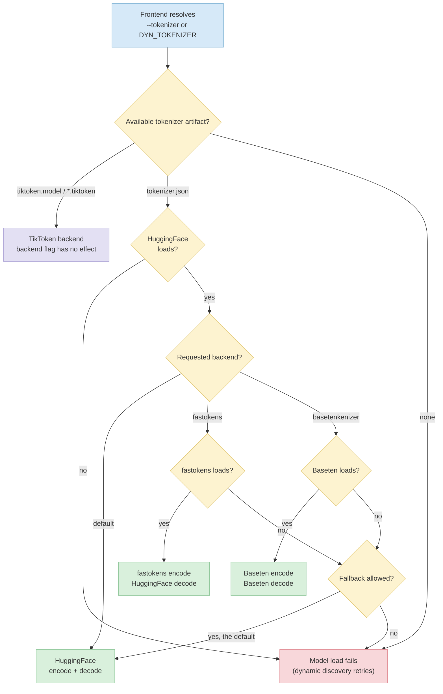

The Dynamo Frontend supports multiple tokenizer backends for BPE-based `tokenizer.json` models. `BPE` is the underlying tokenization algorithm, not a backend-specific feature: the default HuggingFace, `fastokens`, and `basetenkenizer` paths can all serve supported BPE models. The backend choice controls which implementation performs tokenization before requests are sent to the inference engine.

## Tokenizer Backends

#### `default` HuggingFace Tokenizers

The default backend uses the [HuggingFace `tokenizers`](https://github.com/huggingface/tokenizers) library (Rust).
It supports features in `tokenizer.json` files (normalizers, pre-tokenizers, post-processors, decoders, added tokens with special-token flags, and byte-fallback).

#### `fastokens` High-Performance Encoder

The `fastokens` backend uses the [`fastokens`](https://github.com/Atero-ai/fastokens) crate, a purpose-built encoder optimized for throughput on supported BPE `tokenizer.json` models.
It is a _hybrid_ backend: encoding uses `fastokens` while decoding falls back to HuggingFace so that incremental detokenization, byte-fallback, and special-token handling work correctly.
It supports segmented encoding so renderers can distinguish trusted control tokens from ordinary content.

Use this backend when tokenization is a measurable bottleneck, for example on high-concurrency prefill-heavy workloads.

#### `basetenkenizer` Native Encoder and Decoder

The `basetenkenizer` backend uses the Baseten Tokenizer implementation exposed by `dynamo-tokenizers`, a high-performance Rust BPE implementation for inference. It performs both encoding and decoding natively and supports segmented encoding for renderers that must preserve trusted control-token boundaries.

Use this backend for supported `tokenizer.json` models when you need Baseten Tokenizer behavior, including token-compatible Kimi tokenizer artifacts.

The frontend selects the tokenizer backend as follows. When both `tokenizer.json` and a TikToken artifact are present, `tokenizer.json` takes precedence.



#### Compatibility notes:

- Works with standard BPE `tokenizer.json` files (Qwen, LLaMA, GPT-family, Mistral, DeepSeek, etc.).
- If `fastokens` or `basetenkenizer` cannot load a particular tokenizer file, the frontend logs a warning and transparently falls back to HuggingFace by default. Use `--no-tokenizer-fallback` to reject incompatible tokenizers during model initialization.
- Special tokens declared only in a sibling `tokenizer_config.json` are merged into the
  HuggingFace and Baseten paths, and into Dynamo's L1 prefix-cache boundaries. The FastTokenizer
  encoder loads `tokenizer.json` alone and cannot receive that merge, so a model that declares a
  special token only in `tokenizer_config.json` encodes it as ordinary text under `fastokens` and
  produces different token IDs than the other two backends.
- Multimodal KV routing is disabled while `fastokens` is active, because image placeholders such as
  `<|image_pad|>` are frequently declared only in `tokenizer_config.json`. Requests still complete,
  and per-image token metrics remain available when the model is supported by the image-token
  counter; routing falls back to text-prefix overlap. See
  [Multimodal KV Routing](../../../../use-cases/multimodal-serving/multimodal-kv-routing.md).
- Has no effect on TikToken-format tokenizers (`.model` / `.tiktoken` files), which always use the TikToken backend.
- Dedicated vLLM embedding workers let vLLM tokenize raw text by default. When [`--embedding-frontend-tokenization`](../../../../reference/backends/vllm-configuration.mdx) is enabled, raw-text requests use a request-specific Dynamo tokenizer. The request's `add_special_tokens` value overrides `DYN_EMBEDDING_TOKENIZATION_ADD_SPECIAL_TOKENS`; the default is `true`. For `tokenizer.json` models, `true` selects HuggingFace while `false` follows the configured backend selection shown above. TikToken artifacts always use TikToken, and token-ID inputs bypass frontend tokenization.

## Configuration

Set the backend with a CLI flag or environment variable. The CLI flag takes precedence.

> [!WARNING]
> Automatic tokenizer fallback is deprecated and will be disabled by default in a future release.
> Set `--no-tokenizer-fallback` or `DYN_TOKENIZER_FALLBACK=false` to adopt the future behavior now.

| CLI Argument | Env Var | Valid values | Default |
|---|---|---|---|
| `--tokenizer` | `DYN_TOKENIZER` | `default`, `fastokens`, `basetenkenizer` | `default` |
| `--tokenizer-fallback` / `--no-tokenizer-fallback` | `DYN_TOKENIZER_FALLBACK` | `true`/`false`, `1`/`0`, `on`/`off`, `yes`/`no` | `true` |

**Examples:**

```bash
# CLI flag
python -m dynamo.frontend --tokenizer fastokens

# Environment variable
export DYN_TOKENIZER=fastokens
python -m dynamo.frontend

# Baseten Tokenizer
python -m dynamo.frontend --tokenizer basetenkenizer

# Require Baseten Tokenizer instead of falling back to HuggingFace
python -m dynamo.frontend --tokenizer basetenkenizer --no-tokenizer-fallback
```

## Dynamo Frontend Behavior

When a non-default backend is selected:

1. The frontend resolves `--tokenizer` / `DYN_TOKENIZER` and passes the selected backend to the Rust runtime.
2. `ModelDeploymentCard::tokenizer()` loads the HuggingFace tokenizer first for fallback behavior and L1 cache special-token metadata.
3. Dynamo constructs `FastTokenizer` for `fastokens` or `BasetenTokenizer` for `basetenkenizer` from the same `tokenizer.json` file.
4. If construction fails because the tokenizer uses unsupported features, Dynamo logs a warning and falls back to HuggingFace. With `--no-tokenizer-fallback`, model initialization fails and reports the backend loading error instead. In dynamic mode, discovery retries the load while the frontend continues running.
5. When the L1 prefix cache is enabled, Dynamo wraps the selected backend with the same special-token boundary metadata and cache metrics used by the default path.
