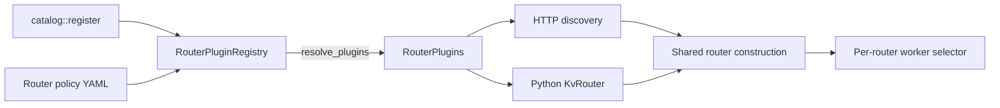
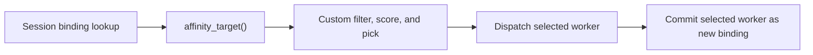

<Warning>
**Experimental.** A custom worker-selection policy controls how Dynamo filters and scores eligible workers, then selects one. Dynamo still owns discovery, eligibility, queueing, reservations, accounting, and metrics.
</Warning>

## How It Works

This feature replaces the worker-ranking part of Dynamo's routing pipeline. A `WorkerFilter` can exclude a host-eligible worker, a `WorkerScorer` assigns a finite cost to each remaining worker, Dynamo adds costs from all configured scorers, and a `WorkerPicker` chooses one row from the scored candidates. Filters run in declaration order. Each scorer receives all surviving workers in one call and writes one cost per worker. Rejecting every worker returns an error. Lower costs rank first by convention, but the picker can implement deterministic selection, sampling, tie-breaking, or policy-local state. Dynamo continues to own discovery, eligibility, score validation, accounting, and reservation.

```mermaid
flowchart LR
    Request["Incoming request"] --> Eligibility["Dynamo eligibility filters"]
    Eligibility --> Filters["WorkerFilter(s)<br/>keep or reject each worker"]
    Filters --> Scorers["WorkerScorer(s)<br/>one cost per worker"]
    Scorers --> Sum["Dynamo sums scorer costs"]
    Sum --> Picker["WorkerPicker<br/>one candidate row"]
    Picker --> Validate["Dynamo validates the row"]
    Validate --> Reserve["Accounting and reservation"]
```



For multiple compile-checked policies, see the [custom policy examples](https://github.com/ai-dynamo/dynamo/tree/main/examples/router/custom-policy-example). Repository contributors who use a coding agent must also provide the [worker-selection API rules](https://github.com/ai-dynamo/dynamo/blob/main/lib/kv-router/src/scheduling/CLAUDE.md).

## Use a Built-In Policy First

The Dynamo frontend ships built-in worker-selection policies, in [`lib/router-plugins`](https://github.com/ai-dynamo/dynamo/tree/main/lib/router-plugins). Selecting one needs router-policy YAML only — no policy crate, no rebuild, no private image. See [Worker-Selection Policies](configuration-and-tuning.md#worker-selection-policies) for the available types and how to select one.

Write your own policy when no shipped policy expresses the rule you need. The rest of this page covers that case; a custom policy is added alongside the shipped ones, so you keep both.

## Choose the Policy Stage

| Stage | Input | Output | Use this stage for |
|---|---|---|---|
| `WorkerFilter` | Request context and one host-eligible worker | Keep or reject | The rule is a hard requirement, not a ranking preference |
| `WorkerScorer` | Request context, all surviving workers, and an aligned output slice | One finite cost per worker | The rule ranks workers or adds a penalty |
| `WorkerPicker` | All eligible workers and their total costs | One row index | The rule samples, breaks ties, tracks policy state, or ignores total cost |
| Policy factory | Router configuration, worker type, and routing partition | One `WorkerSelectionPolicy` | Prefill, decode, models, or routing groups need different components |

An external policy owns its filters, scorers, and picker. Dynamo's default scorer and picker are internal and can change with the built-in routing algorithm.

## Public Plugin API and Compatibility

Use `dynamo_kv_router::plugins` for plugin registration and these modules for plugin contracts:

| Module | Public API |
|---|---|
| `plugins::worker_selection` | `WorkerFilter`, `WorkerScorer`, `WorkerPicker`, `WorkerSelectionPolicy`, request context, worker signal accessors, configuration, and factories |
| `plugins` | `RouterPluginRegistry` and the resolved `RouterPlugins` bundle |

Dynamo owns scheduler queues, eligibility checks, reservations, lifecycle synchronization, and the default selector implementation. Low-level host interfaces such as `WorkerSelector` are used to connect Dynamo components; external plugins use `WorkerSelectionPolicy`.

Existing plugin imports and the `WorkerSelectionPolicyRegistry` name remain available through compatibility re-exports until version 1.7. They refer to the same types and traits, so existing policies can register into `RouterPluginRegistry` without adapters. Migrate imports to `plugins::worker_selection`, rename the registry to `RouterPluginRegistry`, and use `register_worker_selection` for worker policies. The compatibility exports, registry alias, worker-only `register` method, and frontend `worker_selection_policy_factory` setter are scheduled for removal in 1.7.

## Build the Policy

### Create the Policy and Catalog Crates

Set the Dynamo checkout and policy project paths:

```bash
# Set the source and destination paths used by the remaining commands.
export DYNAMO_DIR=/work/dynamo
export POLICY_DIR=/work/acme-routing

# Create one crate for the policy and one crate for policy registration.
mkdir -p "$POLICY_DIR"
cargo init --lib --name acme-routing-policy "$POLICY_DIR/policy"
cargo init --lib --name acme-routing-catalog "$POLICY_DIR/catalog"
```

Add `dynamo-kv-router` from the same checkout that builds the frontend or EPP:

```bash
# Add the worker-selection API to the policy crate.
cargo add \
  --manifest-path "$POLICY_DIR/policy/Cargo.toml" \
  --path "$DYNAMO_DIR/lib/kv-router" \
  dynamo-kv-router

# Add parameter deserialization to the policy crate.
cargo add \
  --manifest-path "$POLICY_DIR/policy/Cargo.toml" \
  --features derive serde

# Add the policy crate to the catalog.
cargo add \
  --manifest-path "$POLICY_DIR/catalog/Cargo.toml" \
  --path "$POLICY_DIR/policy" \
  acme-routing-policy

# Add the registry API to the catalog.
cargo add \
  --manifest-path "$POLICY_DIR/catalog/Cargo.toml" \
  --path "$DYNAMO_DIR/lib/kv-router" \
  dynamo-kv-router
```

### Filter Workers

A filter answers a hard yes-or-no question about one worker that already passed Dynamo's eligibility checks. Return `true` to keep the worker or `false` to remove it. Use a filter only when the worker must not receive the request; use a scorer for preferences.

This filter keeps workers with at least the configured number of device-resident overlap blocks:

```rust
use dynamo_kv_router::plugins::worker_selection::{
    WorkerCandidate, WorkerFilter, WorkerInputs, WorkerSelectionContext,
    WorkerSelectionPolicyError,
};

struct MinimumDeviceOverlapFilter {
    minimum_blocks: f64,
}

impl WorkerFilter for MinimumDeviceOverlapFilter {
    fn required_worker_inputs(&self) -> WorkerInputs {
        WorkerInputs::CACHE
    }

    fn keep(
        &mut self,
        _context: &WorkerSelectionContext<'_>,
        candidate: WorkerCandidate<'_>,
    ) -> Result<bool, WorkerSelectionPolicyError> {
        let cache = candidate
            .cache()
            .ok_or_else(|| WorkerSelectionPolicyError::failed("cache input unavailable"))?;
        Ok(cache.device_overlap_blocks() >= self.minimum_blocks)
    }
}
```

Dynamo runs filters in declaration order before scoring. A worker must pass every configured filter. If no workers remain, selection returns an error.

Pass filters to `WorkerSelectionPolicy::new_with_filters`. If the policy has no hard requirement, omit filters and use `WorkerSelectionPolicy::new`.

### Score Workers

A scorer expresses a preference without excluding a worker. It writes one finite cost for each worker into a host-owned output slice. Lower total cost is better by convention.

This scorer ranks workers by active requests above the batch minimum:

```rust
use dynamo_kv_router::plugins::worker_selection::{
    WorkerCandidates, WorkerInputs, WorkerScorer, WorkerSelectionContext, WorkerSelectionPolicyError,
};

struct ActiveRequestsScorer;

impl WorkerScorer for ActiveRequestsScorer {
    fn required_worker_inputs(&self) -> WorkerInputs {
        WorkerInputs::LOAD
    }

    fn score(
        &mut self,
        _context: &WorkerSelectionContext<'_>,
        candidates: WorkerCandidates<'_>,
        costs: &mut [f64],
    ) -> Result<(), WorkerSelectionPolicyError> {
        let mut minimum = usize::MAX;
        for candidate in candidates.iter() {
            let load = candidate
                .load()
                .ok_or_else(|| WorkerSelectionPolicyError::failed("load input unavailable"))?;
            minimum = minimum.min(load.active_requests());
        }
        for (candidate, cost) in candidates.iter().zip(costs) {
            let load = candidate
                .load()
                .ok_or_else(|| WorkerSelectionPolicyError::failed("load input unavailable"))?;
            *cost = (load.active_requests() - minimum) as f64;
        }
        Ok(())
    }
}
```

Dynamo calls `score` once per scorer after filtering. The output slice matches the candidate order and length. Write every entry with a finite cost; an unwritten or invalid cost stops selection before picking.

A policy can stack multiple scorers. Dynamo calls them in declaration order and adds their costs. Dynamo rejects a non-finite contribution or total.

### Pick a Worker

A picker makes the final choice after filtering and scoring. It sees every remaining worker and its total cost, then returns one row index. Most policies pick the lowest cost, but a picker can instead sample, break ties, or use policy-local state.

This picker selects the lowest-cost row:

```rust
use dynamo_kv_router::plugins::worker_selection::{
    WorkerInputView, WorkerPicker, WorkerSelectionContext, WorkerSelectionPolicyError,
};

struct LowestCostPicker;

impl WorkerPicker for LowestCostPicker {
    fn pick(
        &mut self,
        _context: &WorkerSelectionContext<'_>,
        input: WorkerInputView<'_>,
    ) -> Result<usize, WorkerSelectionPolicyError> {
        input
            .candidates()
            .iter()
            .enumerate()
            .min_by(|(_, left), (_, right)| left.cost().total_cmp(&right.cost()))
            .map(|(row, _)| row)
            .ok_or_else(|| WorkerSelectionPolicyError::failed("no eligible worker"))
    }
}
```

Candidate order is unspecified, so inspect explicit values instead of relying on row order. Dynamo rejects an out-of-range index before accounting or reservation.

### Parse Parameters and Create the Factory

The provider runs once at startup. Parse and validate all parameters there, then capture the validated values in the factory:

```rust
use std::sync::Arc;

use dynamo_kv_router::plugins::worker_selection::{
    WorkerSelectionPolicyFactory, WorkerSelectionPolicyParameters,
    WorkerSelectionPolicyProviderError,
};
use dynamo_kv_router::plugins::worker_selection::{WorkerFilter, WorkerScorer, WorkerSelectionPolicy};

#[derive(serde::Deserialize)]
#[serde(deny_unknown_fields)]
struct Parameters {
    min_device_overlap_blocks: f64,
}

fn provider(
    parameters: &WorkerSelectionPolicyParameters,
) -> Result<WorkerSelectionPolicyFactory, WorkerSelectionPolicyProviderError> {
    let parameters: Parameters = parameters.deserialize()?;
    if !parameters.min_device_overlap_blocks.is_finite()
        || parameters.min_device_overlap_blocks < 0.0
    {
        return Err(WorkerSelectionPolicyProviderError::new(
            "min_device_overlap_blocks must be a finite non-negative number",
        ));
    }
    let minimum_blocks = parameters.min_device_overlap_blocks;

    Ok(Arc::new(move |config, worker_type, _partition| {
        let filters: Vec<Box<dyn WorkerFilter>> = vec![
            Box::new(MinimumDeviceOverlapFilter { minimum_blocks }),
        ];
        let scorers: Vec<Box<dyn WorkerScorer>> = vec![Box::new(ActiveRequestsScorer)];
        WorkerSelectionPolicy::new_with_filters(
            config.clone(),
            worker_type.as_str(),
            filters,
            scorers,
            Box::new(LowestCostPicker),
        )
    }))
}
```

Dynamo calls the returned factory once per routing partition. Branch on the typed `WorkerType::Aggregated`, `WorkerType::Prefill`, `WorkerType::Decode`, or `WorkerType::Encode` role when worker pools need different components. Use the partition identity for distinct model or routing-group state.

### Register the Policy

Expose a registration function from the policy crate:

```rust
use dynamo_kv_router::plugins::{RouterPluginRegistry, WorkerSelectionPolicyRegistryError};

pub fn register(
    registry: &mut RouterPluginRegistry,
) -> Result<(), WorkerSelectionPolicyRegistryError> {
    registry.register_worker_selection("least-busy", Arc::new(provider))
}
```

Call this function from the catalog:

```rust
pub fn register(
    registry: &mut RouterPluginRegistry,
) -> Result<(), WorkerSelectionPolicyRegistryError> {
    acme_routing_policy::register(registry)
}
```

Choose a stable, unique type name. Unknown types, duplicate registrations, and invalid parameters stop startup.

### Configure an Instance

Create `$POLICY_DIR/worker-selection.yaml`:

```yaml
worker_selection:
  aggregated: least-busy
  prefill: prefill-least-busy
  decode: least-busy
  encode: least-busy
  instances:
    - name: least-busy
      type: least-busy
      parameters:
        min_device_overlap_blocks: 0
    - name: prefill-least-busy
      type: least-busy
      parameters:
        min_device_overlap_blocks: 1
```

The `type` selects a registered provider. The `name` identifies one configured instance. `worker_selection.aggregated`, `worker_selection.prefill`, `worker_selection.decode`, and `worker_selection.encode` select the matching worker pools. An omitted role uses Dynamo's built-in policy; one role does not fall back to another role's selection.

`worker_selection.encode` applies only to a surface-carrying encode worker set that constructs the standard KV chooser. It does not configure the surface-less multimodal encoder hop: `EncoderRouter` selects those workers independently with round-robin routing.

For prefill and decode, the selection order is the role-specific CLI or environment override, `DYN_ROUTER_WORKER_SELECTION_POLICY`, the matching YAML selection, and then Dynamo's built-in policy. For aggregated and encode, the order is `DYN_ROUTER_WORKER_SELECTION_POLICY`, the matching YAML selection, and then the built-in policy. Set any selection to `default` to use the built-in policy for that scope.

<Note>
  Role selections are startup settings. Configure them in the worker-selection YAML, with the CLI flags or environment variables above, or through the Python `KvRouterConfig` constructor. They are not part of serialized `KvRouterConfig` JSON, and `KvRouterConfig.from_json` rejects those keys.
</Note>

### Check the Policy and Catalog

```bash
cargo check --manifest-path "$POLICY_DIR/catalog/Cargo.toml"
```

Add one focused test for each policy decision and one registration test for every type name.

## Shared Plugin Construction

The catalog registers plugin providers once. `RouterPluginRegistry::resolve_plugins` validates the selected configuration and returns a `RouterPlugins` bundle containing the configured factories. Both the HTTP frontend and Python router pass this bundle to the shared router construction path. Each router receives fresh plugin instances; factories run during construction, not for each request.

Rust embedders start with the host registry, which includes the default policy, then register their catalog:

```rust
use dynamo_llm::entrypoint::input::http::HttpFrontend;
use dynamo_llm::kv_router::plugins::router_plugin_registry;

let mut registry = router_plugin_registry();
acme_routing_catalog::register(&mut registry)?;
let plugins = registry.resolve_plugins(&kv_router_config)?;
HttpFrontend::default()
    .plugins(plugins)
    .run(distributed_runtime, engine_config)
    .await?;
```



Each worker policy is constructed once per routing partition. An empty bundle retains the default selector.

## Available Signals

Worker identity and ordinary request metadata are always available. Dynamo calculates optional per-worker signals only for groups that a filter, scorer, or picker requests.

Routing cache resources start only if a component requests `CACHE`. `serve_indexer` and `enable_session_prefix_index` also require `CACHE`.

### Request Context

| Accessor | Meaning |
|---|---|
| `prompt_tokens()` | Exact incoming prompt token count |
| `request_blocks()` | Incoming prompt size in KV blocks, rounded up |
| `block_size()` | Tokens in one KV block |
| `tracks_prefill_tokens()` | Whether the request contributes to prefill-load tracking |
| `session_context()` | Optional session metadata described below |
| `affinity_target()` | Optional advisory worker and data-parallel rank from soft session affinity |
| `expected_output_tokens()` | Optional expected output length |
| `priority_jump()` | Scheduler priority boost. Queue policies treat negative values as zero |
| `strict_priority()` | Strict integer priority. The queue orders larger values first |
| `router_temperature_override()` | Optional per-request router temperature override |

### Session Context

`session_context()` returns `None` when the request has no session metadata. This policy-facing view contains selected session metadata; it is not Dynamo's internal request envelope. When present, it provides:

| Accessor | Meaning |
|---|---|
| `session_id()` | Stable reasoning or tool-session identifier |
| `parent_session_id()` | Optional parent session for subagents |
| `session_final()` | Optional terminal marker for lifecycle-aware policies |
| `input_trigger()` | Optional `UserMessage`, `ToolResult`, or `Other` request trigger |

The [custom policy examples](https://github.com/ai-dynamo/dynamo/blob/main/examples/router/custom-policy-example/README.md) use `input_trigger()` to give tool-result turns a cache-local picker path.

### Soft Session Affinity

Set `--router-session-affinity-mode soft` with a session-affinity TTL to let a custom policy influence an existing session binding. The current binding enters the normal selection pipeline as `affinity_target()`. The policy still receives the full host-eligible candidate set, subject to its own filters, and may select another worker. Dynamo rebinds the session after dispatch returns a response stream.



Match both fields when a policy wants to recognize the target. A target with `dp_rank: None` matches every rank on its worker; a populated rank matches only that worker-rank pair. The target can be absent from the candidate table when the worker is unavailable or a custom filter rejects it.

Hard affinity remains the default. A hard binding and every explicit request target take the exact-target path instead of advisory custom selection. A selection, setup, or dispatch failure before a response stream leaves the previous soft binding intact. An error or cancellation after the stream is returned does not roll back a completed rebind.

The [custom policy examples](https://github.com/ai-dynamo/dynamo/blob/main/examples/router/custom-policy-example/README.md) include an overload-aware soft pinning policy that retains the advisory target until its active-request count exceeds a configured threshold, then selects the least-loaded alternative. Its two-Mocker walkthrough holds the first request open and verifies an `A -> B -> B` worker sequence: overload moves the second request to B, and the third request retains B after load drains, proving that the plugin-selected dispatch updated the binding.

### Worker Identity and Cost

| Accessor | Meaning |
|---|---|
| `WorkerCandidate::worker()` | Candidate worker ID and data-parallel rank |
| `ScoredWorkerCandidate::worker()` | Picker row worker ID and data-parallel rank |
| `ScoredWorkerCandidate::cost()` | Sum of all scorer contributions for the picker row |

### Optional Worker Inputs

If a component needs no optional worker data, return `WorkerInputs::NONE`. Combine exact groups with `|`, such as `WorkerInputs::CACHE | WorkerInputs::LOAD`.

| Group | Accessor | Meaning |
|---|---|---|
| `CACHE` | `device_overlap_blocks()` | Device-resident prefix overlap in blocks |
| `CACHE` | `host_overlap_blocks()` | Host-pinned prefix overlap in blocks |
| `CACHE` | `disk_overlap_blocks()` | Disk prefix overlap in blocks |
| `CACHE` | `accounting_cache_estimate()` | Accounting estimate as weighted KV blocks and rounded tokens; zero if missing, not clamped to prompt length |
| `CACHE` | `has_tier_matches()` | Whether the lookup contains any GPU, CPU, or disk matches before filtering; `false` means only accounting estimates or no cache data were supplied |
| `CACHE` | `shared_hits()` | `None` if no shared result was supplied; otherwise unweighted ranges with `total_hits` and `hits_beyond(prefix)` |
| `LOAD` | `is_available()` | Whether the host supplied a load observation; distinguishes missing data from an observed idle worker |
| `LOAD` | `active_prefill_tokens()` | Tokens currently active in the worker's prefill stage |
| `LOAD` | `decode_cost_blocks()` | Projected active decode footprint, including this request's additional active blocks |
| `LOAD` | `active_requests()` | Requests currently active on the worker |
| `PREFERRED_TAINT` | `preferred_taint_multiplier()` | Optional cost multiplier from matching preferred routing taints |

The GPU, CPU, and disk overlap accessors return raw tier counts. A missing tier or worker entry is zero; Dynamo does not substitute its weighted effective-overlap estimate. Each custom scorer chooses how to combine the raw counts.

A filter or scorer reads groups through `WorkerCandidate::cache()` or `load()`. A picker reads index-aligned views through `WorkerInputView`; its cache view supports `get(row)` and `iter()`. Each component must declare every group it reads; another component requesting a group does not grant access.

`WorkerCandidate::preferred_taint_multiplier()` and `ScoredWorkerCandidate::preferred_taint_multiplier()` return the optional cost multiplier from preferred routing constraints. A filter, scorer, or picker must request `WorkerInputs::PREFERRED_TAINT` before reading the multiplier. Without that declaration, the component receives `None`, even when another component requested the multiplier. Exact hard-pinned requests also do not materialize it. Required routing constraints remain host-enforced eligibility rules.

## Link the Policy Into Dynamo

Both paths use the same policy crate, catalog, and YAML file. Choose the process that owns worker selection.

<Tabs>
<Tab title="Python Frontend">

Add the catalog to the Python binding manifest. Keep the dependency alias `dynamo-worker-selection-policy-catalog`:

<Note>
Your catalog is registered alongside the [policies Dynamo ships](#use-a-built-in-policy-first), not instead of them, so both remain selectable. Your catalog cannot reuse a shipped policy's type name; the registry rejects the duplicate at startup rather than overriding it.
</Note>

```bash
# Link the policy catalog into the Python extension.
cargo add \
  --manifest-path "$DYNAMO_DIR/lib/bindings/python/Cargo.toml" \
  --optional \
  --rename dynamo-worker-selection-policy-catalog \
  --path "$POLICY_DIR/catalog" \
  acme-routing-catalog
```

Build the extension with the linked catalog:

```bash
# Build the extension with the custom-policy feature.
cd "$DYNAMO_DIR/lib/bindings/python"
CARGO_TARGET_DIR="$DYNAMO_DIR/target" maturin develop --uv --features custom-policy

# Install the Python package from this checkout.
cd "$DYNAMO_DIR"
uv pip install -e .

# Start the frontend with the policy configuration.
python3 -m dynamo.frontend \
  --router-mode kv \
  --router-policy-config "$POLICY_DIR/worker-selection.yaml" \
  --router-prefill-policy prefill-least-busy \
  --router-decode-policy least-busy
```

The role-specific CLI flags override the matching YAML fields for this process. In this command, `prefill-least-busy` replaces `worker_selection.prefill`, and `least-busy` replaces `worker_selection.decode`.

The linked extension also applies custom policies in `python3 -m dynamo.router`. That process waits for a worker model card so it can choose built-in or custom policy behavior from the card's typed role. `DYN_ROUTER_MODEL_CARD_WAIT_SECS` bounds the startup wait and defaults to 600 seconds.

</Tab>
<Tab title="EPP">

Create an EPP crate and add the catalog and runner dependencies:

```bash
# Create the custom EPP binary crate.
cargo init --bin --name acme-epp "$POLICY_DIR/epp"

# Add error handling and the asynchronous runtime.
cargo add --manifest-path "$POLICY_DIR/epp/Cargo.toml" anyhow
cargo add --manifest-path "$POLICY_DIR/epp/Cargo.toml" tokio@=1.48.0 --features macros,rt-multi-thread

# Add the policy catalog and worker-selection API.
cargo add --manifest-path "$POLICY_DIR/epp/Cargo.toml" --path "$POLICY_DIR/catalog" acme-routing-catalog
cargo add --manifest-path "$POLICY_DIR/epp/Cargo.toml" --path "$DYNAMO_DIR/lib/kv-router" --features standalone-selection dynamo-kv-router

# Add the standard EPP runner.
cargo add --manifest-path "$POLICY_DIR/epp/Cargo.toml" --path "$DYNAMO_DIR/deploy/inference-gateway/ext-proc" dynamo-ext-proc
```

Register the catalog before the standard runner starts:

```rust
use dynamo_ext_proc::run;
use dynamo_kv_router::plugins::RouterPluginRegistry;

#[tokio::main]
async fn main() -> anyhow::Result<()> {
    let mut registry = RouterPluginRegistry::default();
    acme_routing_catalog::register(&mut registry)?;
    run(Some(registry)).await
}
```

Run the custom binary in standalone mode:

```bash
# Run the linked EPP from its crate directory.
cd "$POLICY_DIR/epp"
DYN_EPP_MODE=standalone DYN_ROUTER_POLICY_CONFIG="$POLICY_DIR/worker-selection.yaml" cargo run --release
```

Standalone EPP supplies `WorkerType::Aggregated` because it selects from one full-request worker pool. It resolves only `worker_selection.aggregated` and logs a startup warning when it ignores a prefill, decode, or encode selection. Its catalog does not need policy types referenced only by those ignored selections.

</Tab>
</Tabs>

## Policy Contract

- Return `true` from a filter to keep a worker and `false` to reject it.
- Expect filters to run in declaration order before scoring. Rejecting every worker returns an error.
- Return finite scorer costs.
- Return a valid picker row.
- Treat candidate order as unspecified.
- Request only the signal groups that the component reads.
- Keep blocking I/O and panics out of `keep`, `score`, and `pick`.
- Keep policy state local to the factory-created policy unless cross-partition sharing is a deliberate requirement.
- Build the policy against the same Dynamo revision as the frontend or EPP.
- If a signal adds work, storage, allocation, or another scan, run the worker-selection benchmark.

The [example README](https://github.com/ai-dynamo/dynamo/blob/main/examples/router/custom-policy-example/README.md) contains the in-tree package names and build-check commands. For the built-in cost model, see [Routing Concepts](routing-concepts.md). For the standalone selection lifecycle, see [Standalone Selection Service](standalone-selection.md).

## Default Policy Plugin

To give a worker role its own default-policy settings, select `dynamo-default-cost-fn`:

```yaml
worker_selection:
  aggregated: tuned-default
  instances:
    - name: tuned-default
      type: dynamo-default-cost-fn
      parameters:
        overlap_score_credit: 1.0
        prefill_load_scale: 1.0
        router_temperature: 0.0
```

The provider also accepts `overlap_score_credit_decay`, `decode_active_request_weight`, `host_cache_hit_weight`, `disk_cache_hit_weight`, and `shared_cache_multiplier`. Omitted parameters inherit router configuration. Values must be finite and non-negative. Per-request score and temperature overrides do not apply to this policy. The builtin skips cache inputs at zero overlap credit and for plain disaggregated decode.
